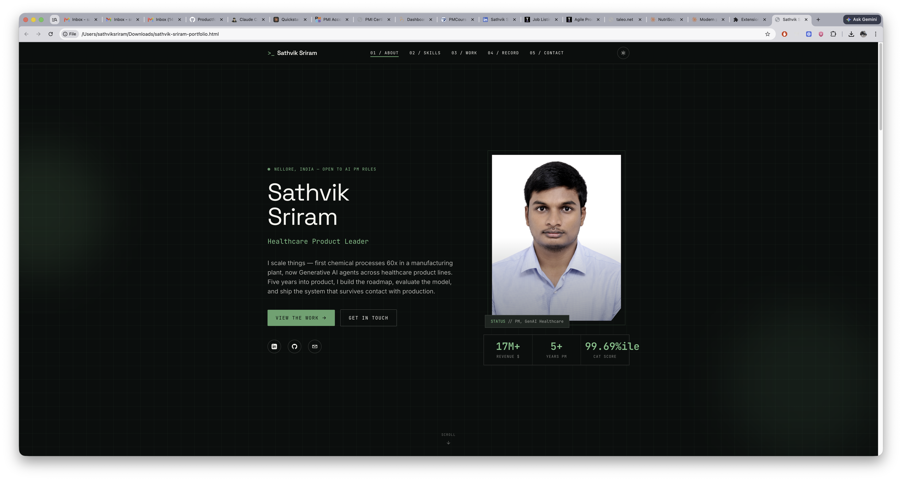
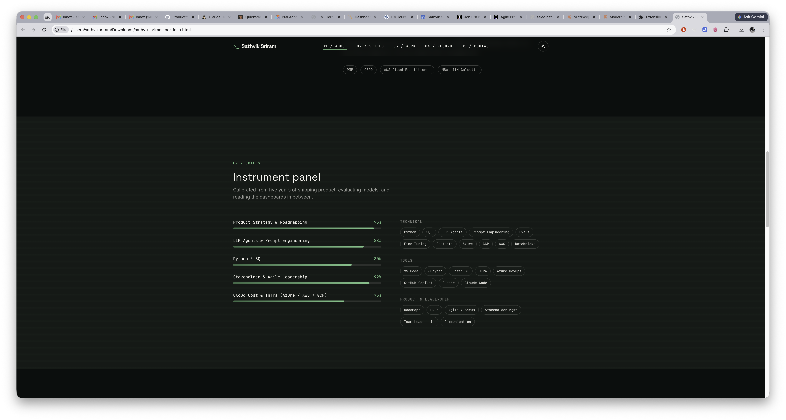
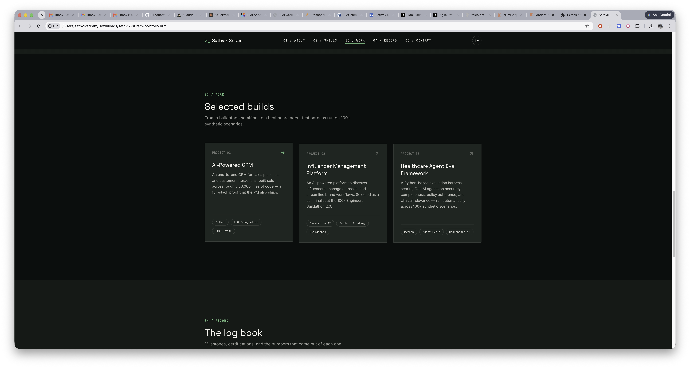
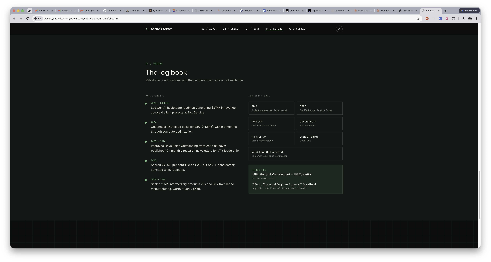
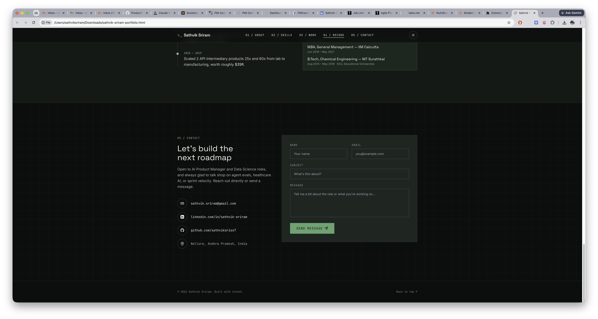

# Day 10

## Prompt

You are an expert full-stack web developer and personal branding designer.

Build a complete, modern, single-file personal portfolio website using HTML, Tailwind CSS (CDN), and vanilla JavaScript for this person:

=== PERSONAL INFO ===
Name: Sathvik Sriram
Title: AI Program Manager
Location: Nellore, India
Email: sathvik.sriram@gmail.com
LinkedIn: https://www.linkedin.com/in/sathvik-sriram/
GitHub: https://github.com/sathviksriss7
About: [2-3 sentences about yourself]

=== SKILLS ===
Technical: Python, SQL,
Tools: VS Code, Jupyter, Power BI
Soft Skills: Leadership, Communication

=== PROJECTS ===

1. [Project Name] — [1 line description] — Tech: [stack]
2. [Project Name] — [1 line description] — Tech: [stack]
3. [Project Name] — [1 line description] — Tech: [stack]

=== EXPERIENCE & ACHIEVEMENTS ===

- [Internship / Hackathon / Certification]
- [Award / Rank / Notable achievement]

=== DESIGN PREFERENCES ===
Mode: Dark/Light toggle
Style: Modern, minimal, premium
Colors: Green + White
Font: Clean sans-serif display font

=== REQUIREMENTS ===
Include these sections:

- Hero (name, title, typing animation, social links)
- About Me
- Skills (animated bars + tech tags)
- Projects (cards with tech tags)
- Achievements & Certifications
- Contact (form + direct links)
- Dark/Light mode toggle
- Mobile responsive
- Smooth scroll animations
- Active nav highlighting
- Single HTML file, no build step
- Tailwind via CDN
- SEO meta tags included

Optional:

- If a resume is uploaded, extract details automatically.
- If a profile photo is uploaded, use it in the portfolio.
- Generate recruiter-friendly content and project descriptions from resume data.

Return only the complete HTML code.

## Response

<iframe src="sathvik-sriram-portfolio.html" width="100%" height="700px"></iframe>

[View full Dashboard](sathvik-sriram-portfolio.html)

## Screenshots

