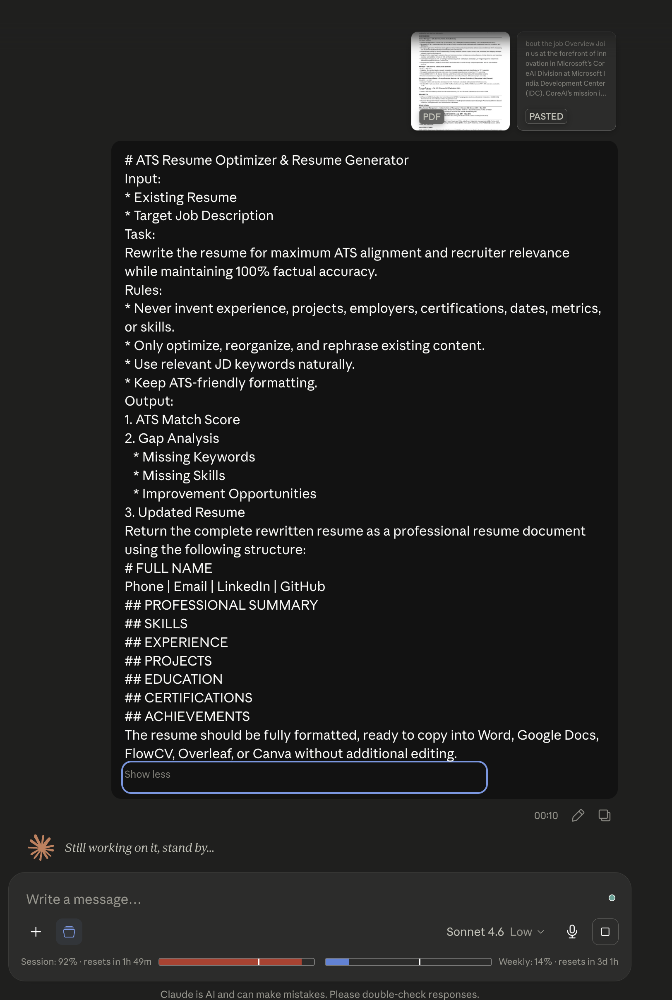

# Day 11

## Prompt

### ATS Resume Optimizer & Resume Generator

Input:

* Existing Resume
* Target Job Description

Task:
Rewrite the resume for maximum ATS alignment and recruiter relevance while maintaining 100% factual accuracy.

Rules:

* Never invent experience, projects, employers, certifications, dates, metrics, or skills.
* Only optimize, reorganize, and rephrase existing content.
* Use relevant JD keywords naturally.
* Keep ATS-friendly formatting.

Output:

1. ATS Match Score

2. Gap Analysis

   * Missing Keywords
   * Missing Skills
   * Improvement Opportunities

3. Updated Resume

Return the complete rewritten resume as a professional resume document using the following structure:

### FULL NAME

Phone | Email | LinkedIn | GitHub

### PROFESSIONAL SUMMARY

### SKILLS

### EXPERIENCE

### PROJECTS

### EDUCATION

### CERTIFICATIONS

### ACHIEVEMENTS

**The resume should be fully formatted, ready to copy into Word, Google Docs, FlowCV, Overleaf, or Canva without additional editing.**

## Screenshot - Prompt

## Response

ATS Match Score: 58/100
This JD is for a Business Program Manager / Chief of Staff role at Microsoft — a meaningfully different archetype than your Senior PM background. It's heavy on business operations, executive enablement, organizational health, and people strategy, with comparatively light emphasis on product/technical execution. Your resume is strong on Gen AI product delivery but currently under-indexes on the BizOps/Chief-of-Staff signals this JD wants.
Gap Analysis
Missing Keywords (JD language not in your resume)

"Rhythm of Business (RoB)" / operational cadence
"Chief of Staff" / "Business Program Manager"
"Executive briefings" / "executive communications"
"Headcount planning" / "fiscal planning" / "budget ownership"
"Cross-org initiatives" / "special projects"
"Employee engagement" / "organizational health" / "Thriving/Signals scores"
"Stakeholder alignment across virtual, cross-functional teams"
"Hiring, campus programs" (GTA/URT equivalents)

Missing Skills (present in JD, not evidenced in resume)

Direct headcount/budget ownership language (you have cost optimization, but not headcount/fiscal planning framed as such)
Org-wide change management / culture-building at scale (600+ people equivalent)
Conference/event leadership is present (6 Healthcare conferences) but not framed as "leadership enablement" or "executive engagement"

Improvement Opportunities

Reframe your DSO improvement, cost-code cleanup, and R&D cost reduction bullets as financial management / operational rigor — core JD requirements.
Reframe your newsletter + conference work as executive communications / leadership enablement — directly mirrors the JD's "prepare executive briefings" and "design content for leadership forums."
Surface your cross-functional team leadership (architecture guild, 2 agile teams) as evidence of "collaboration across virtual, cross-functional teams."
Your MBA + CAT 99.69 percentile is a strong differentiator for a Microsoft IDC role — keep prominent.
Note: this JD wants 4+ (required) to 8+ (preferred) years in Program Management/Corporate Strategy/Business Excellence, not specifically Product Management — your title and summary should be careful not to over-index on "Product Manager" framing at the expense of the BizOps angle.

## Response - Optimised Resume

[Optimised Resume](./Sathvik_Sriram_Resume_Microsoft_BPM.pdf)
