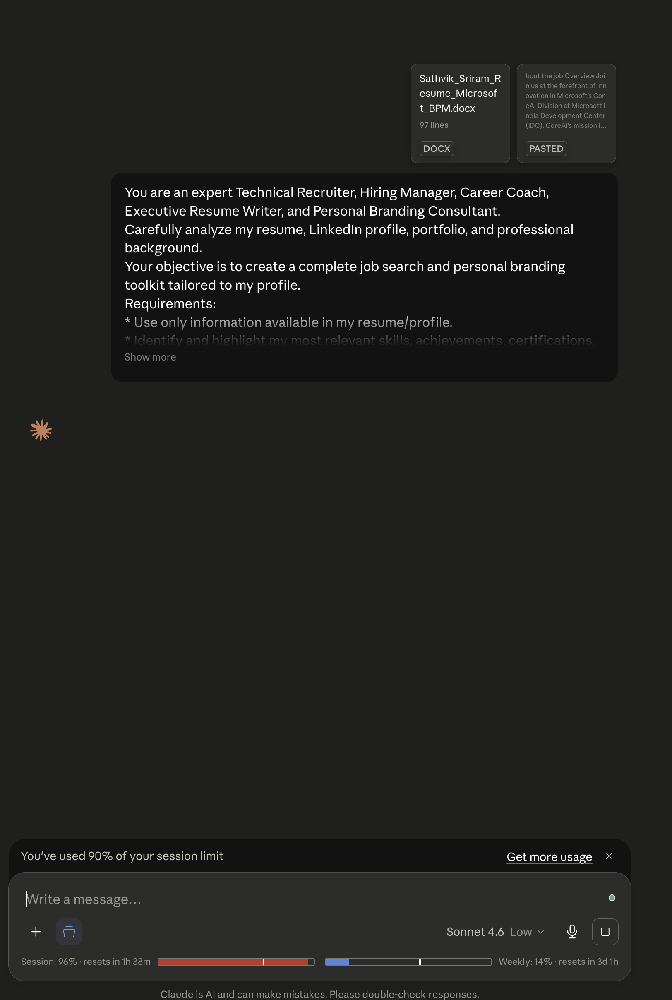

# Day 12

## Prompt

You are an expert Technical Recruiter, Hiring Manager, Career Coach, Executive Resume Writer, and Personal Branding Consultant.

Carefully analyze my resume, LinkedIn profile, portfolio, and professional background.

Your objective is to create a complete job search and personal branding toolkit tailored to my profile.

Requirements:

* Use only information available in my resume/profile.
* Identify and highlight my most relevant skills, achievements, certifications, projects, leadership experience, and measurable business impact.
* Emphasize strengths that are most valuable for recruiters and hiring managers in my target industry.
* Adapt the messaging to my experience level (student, fresher, experienced professional, manager, or executive).
* Use a professional, modern, recruiter-focused, and results-oriented writing style.
* Avoid generic AI-generated language.
* Quantify achievements whenever possible.
* Ensure all content is ATS-friendly and ready to use immediately.

Generate the following:

SECTION 1:
ATS-Friendly Cover Letter
(350–450 words)

SECTION 2:
Recruiter Outreach Email

SECTION 3:
Hiring Manager Email

SECTION 4:
LinkedIn Connection Request
(Maximum 300 characters)

SECTION 5:
Referral Request Message

SECTION 6:
Follow-Up Email
(Send after 5 days if no response)

SECTION 7:
30-Second Professional Introduction
(Self-introduction for interviews, networking, and career events)

SECTION 8:
Top 10 Job Titles Best Suited for My Profile

SECTION 9:
Key Strengths Recruiters Will Notice

SECTION 10:
Skill Gap Analysis

* Current strengths
* Missing skills
* Recommended learning roadmap

SECTION 11:
Personal Brand Summary

* Unique value proposition
* Professional positioning statement
* Recruiter headline

SECTION 12:
Interview Talking Points

* Most impressive achievements
* Key stories to discuss
* Areas recruiters are likely to ask about

Make every section highly personalized based on my profile and generate content that is ready to send or use immediately without requiring edits.

## Screenshot - Prompt

## Response

Looking at this — you've got a Microsoft-tailored resume (Business Program Manager / Chief-of-Staff role in CoreAI) and the actual JD for that exact role. This is great, because I can build the entire toolkit around a real, specific target rather than generic positioning. Let me build this out as one cohesive package.

A quick note before I dive in: your memory shows you've also been pursuing an AI PM / Data Science transition track. This resume and JD are a different lane — Business Program Manager / Chief of Staff, leaning heavily on RoB, fiscal governance, and executive enablement rather than AI product strategy. I'm going to build this toolkit specifically for the Microsoft BPM role since that's what you've uploaded, and keep messaging tight to that. If you want, I can build a parallel AI PM version later.

Let me pull the specifics from both documents and get to work.I have everything I need from the resume and JD. Let me build out all 12 sections now.Good, I have what I need. Now let me write out the full toolkit as a markdown deliverable first, then convert the most "send-ready" pieces into a clean Word doc for easy copy-paste use.Now let me draft all the content carefully, grounded strictly in the resume facts and the Microsoft JD.Now let me build this into a polished, ready-to-use Word document.A numbering reference issue — I used a string `"talking"` as a level reference that wasn't declared in numbering config. Let me fix that.Validated. Let me do a quick visual check on a couple of pages to confirm formatting renders cleanly.One small issue — the closing line "Sincerely, Sathvik Sriram..." merged onto one line since I used `\n` inside a single TextRun (which doesn't break in docx-js). Let me fix that throughout the doc.I'll add a `Sig()` helper that creates proper multi-line paragraphs using `break` runs, and replace these 5 call sites.All replaced correctly (the "Best," signature appears twice — Section 3 and Section 6 — both now fixed). Let's rebuild and re-validate.That's fixed. Let me spot-check a couple more pages — the skill gap section and the close.This is rendering clean and professional. The document looks solid throughout. Let me present the final file.All 12 sections are built around your actual resume and the Microsoft CoreAI Business Program Manager JD — every number ($17M, 28%/$64K, 9-day DSO, 13+ people, 12+ briefings, 6 conferences) is pulled directly from your resume, nothing invented.

A few things worth flagging:

* **Section 10 (Skill Gap Analysis)** is the most strategically useful part — it maps specific JD callouts (employee listening tools, GTM/MCAPS, campus recruiting, multi-city ops in Hyderabad/Bengaluru/Noida) against what's *not* explicitly in your resume, with a focused 4–6 week prep plan rather than a generic "learn X" list.
* **Section 7's intro** runs ~30-35 seconds at natural speaking pace — test it out loud once before an actual interview to calibrate to your own delivery speed.
* All bracketed placeholders (`[Recruiter Name]`, `[Hiring Manager Name]`, `[Contact Name]`) need to be filled before sending — everything else is ready to copy and use.

One thing to think about: this whole toolkit is built for the **BPM/Chief-of-Staff lane**. Your memory shows you're also actively building toward an **AI PM** track with a separate resume, 30-day DS roadmap, and 3-month sprint plan. If you end up applying to both lanes in parallel, it's worth keeping the narratives distinct in interviews — the BPM story leads with RoB/fiscal rigor and treats AI fluency as a differentiator, while an AI PM story would need to lead with product strategy and treat the ops background as supporting evidence. Want me to build the parallel AI PM version of this same toolkit next?

## Response - Job Search Toolkit

[Job Search Toolkit](./Sathvik_Sriram_Job_Search_Toolkit_Microsoft_BPM.pdf)
