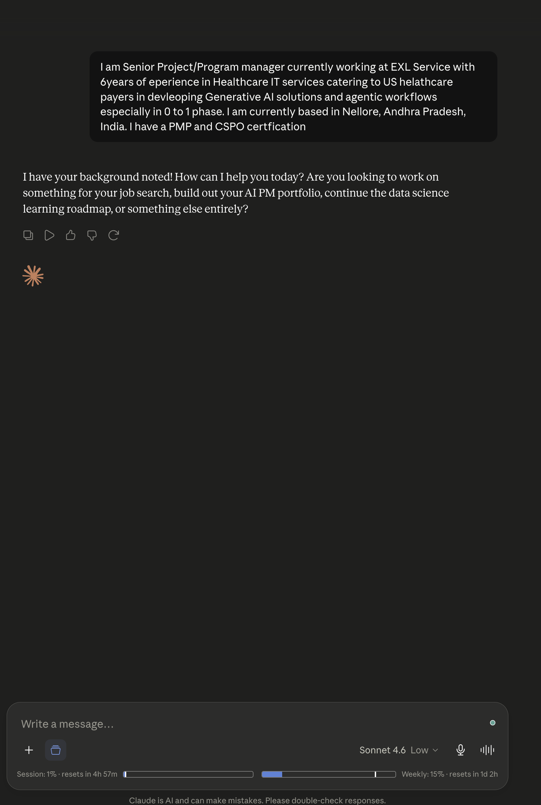
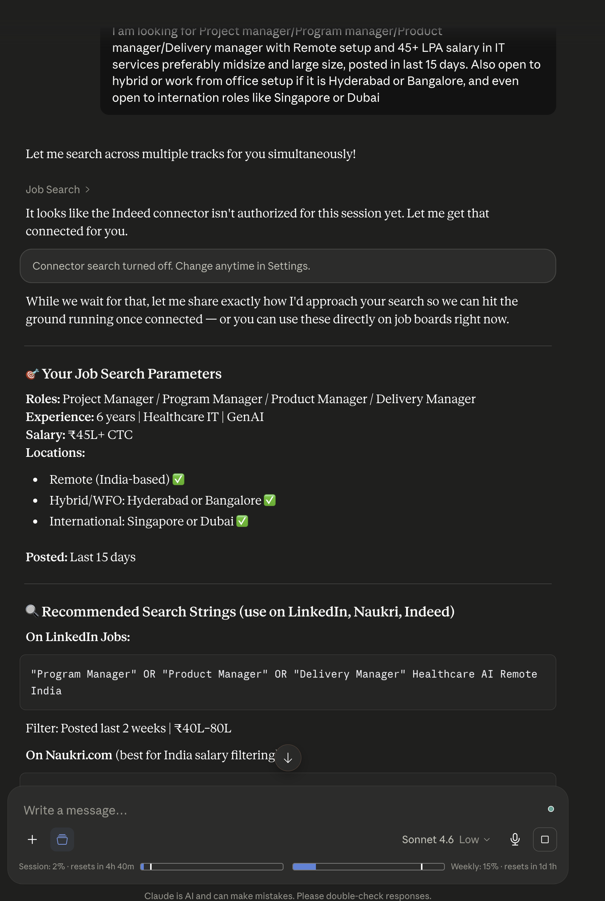
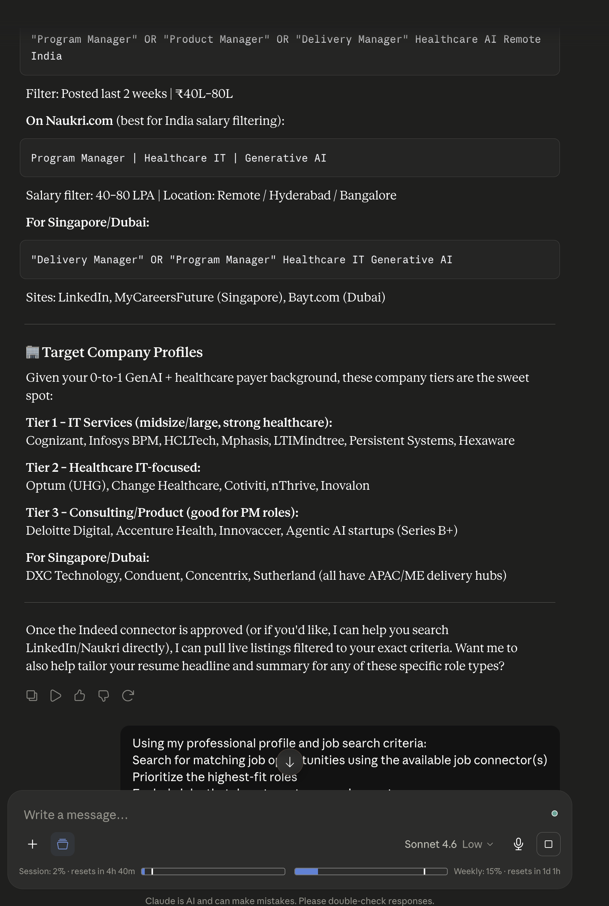
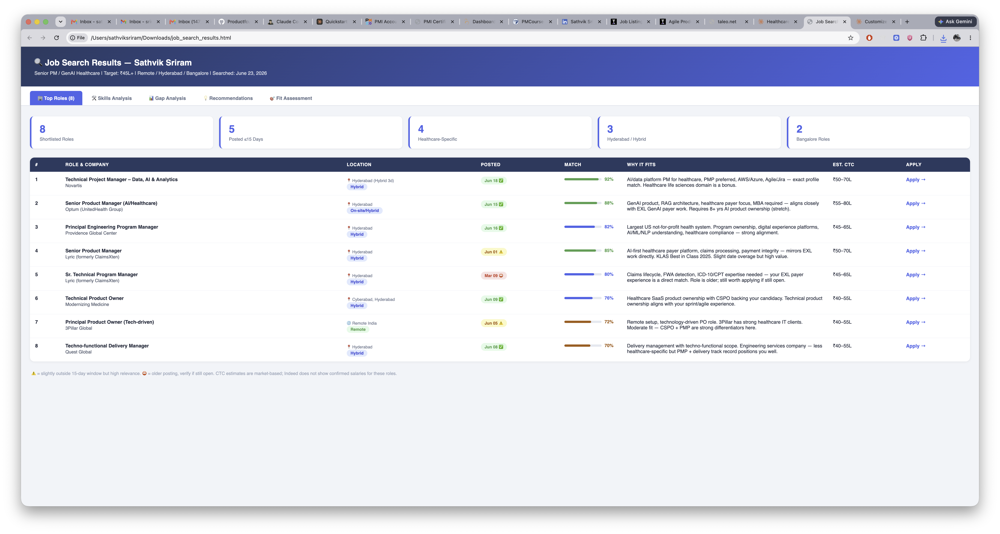
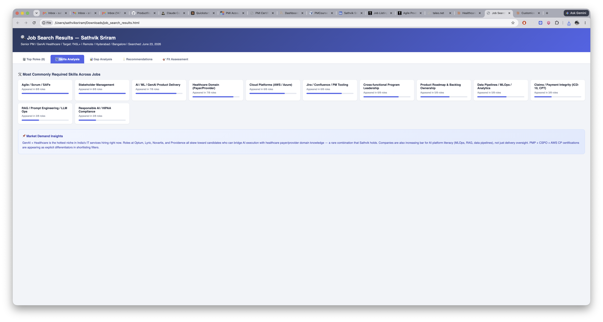
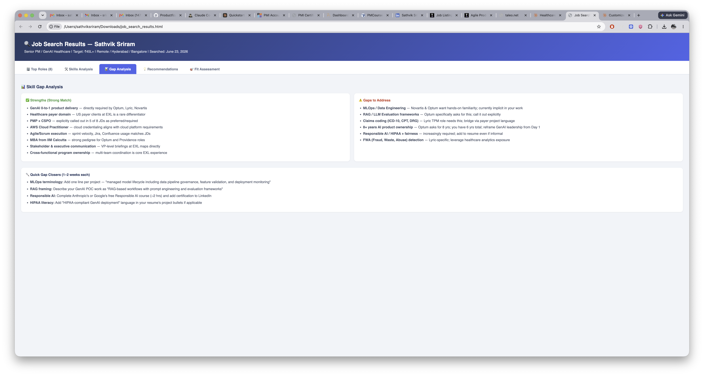
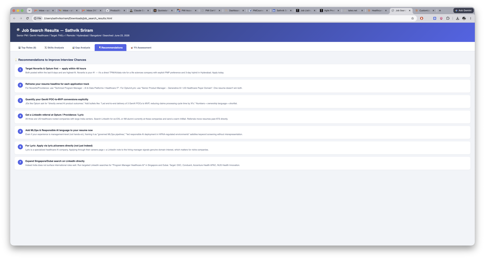
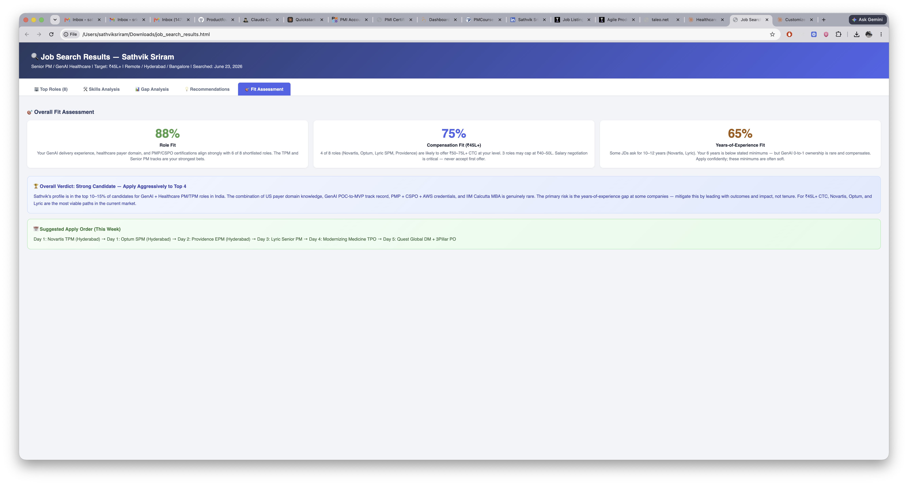

# Day 13

## Prompt

PROMPT 1: Professional Profile

I am Senior Project/Program manager currently working at EXL Service with 6years of eperience in Healthcare IT services catering to US helathcare payers in devleoping Generative AI solutions and agentic workflows especially in 0 to 1 phase. I am currently based in Nellore, Andhra Pradesh, India. I have a PMP and CSPO certfication

PROMPT 2: Job Search Criteria

I am looking for Project manager/Program manager/Product manager/Delivery manager with Remote setup and 45+ LPA salary in IT services preferably midsize and large size, posted in last 15 days. Also open to hybrid or work from office setup if it is Hyderabad or Bangalore, and even open to internation roles like Singapore or Dubai

PROMPT 3: Job Discovery & Analysis

Using my professional profile and job search criteria:

Search for matching job opportunities using the available job connector(s)
Prioritize the highest-fit roles
Exclude jobs that do not meet my requirements
Return the top opportunities in a table containing:

Company
Role
Location
Posted Date
Direct Application Link
Match Score
Why It Fits My Profile
CTC

Also provide:

Most commonly required skills across the jobs
Skill gap analysis
Market demand insights
Recommendations to improve my chances of getting interviews
Overall fit assessment for my target roles and compensation goals.

## Response

RESPONSE 1:

I have your background noted! How can I help you today? Are you looking to work on something for your job search, build out your AI PM portfolio, continue the data science learning roadmap, or something else entirely?

---
RESPONSE 2:

Let me search across multiple tracks for you simultaneously!It looks like the Indeed connector isn't authorized for this session yet. Let me get that connected for you.While we wait for that, let me share exactly how I'd approach your search so we can hit the ground running once connected — or you can use these directly on job boards right now.

### 🎯 Your Job Search Parameters

**Roles:** Project Manager / Program Manager / Product Manager / Delivery Manager
**Experience:** 6 years | Healthcare IT | GenAI
**Salary:** ₹45L+ CTC
**Locations:**

- Remote (India-based) ✅
- Hybrid/WFO: Hyderabad or Bangalore ✅
- International: Singapore or Dubai ✅

**Posted:** Last 15 days

### 🔍 Recommended Search Strings (use on LinkedIn, Naukri, Indeed)

**On LinkedIn Jobs:**

```markdown
"Program Manager" OR "Product Manager" OR "Delivery Manager" Healthcare AI Remote India
```

Filter: Posted last 2 weeks | ₹40L–80L

**On Naukri.com** (best for India salary filtering):

```markdown
Program Manager | Healthcare IT | Generative AI
```

Salary filter: 40–80 LPA | Location: Remote / Hyderabad / Bangalore

**For Singapore/Dubai:**

```markdown
"Delivery Manager" OR "Program Manager" Healthcare IT Generative AI
```

Sites: LinkedIn, MyCareersFuture (Singapore), Bayt.com (Dubai)

### 🏢 Target Company Profiles

Given your 0-to-1 GenAI + healthcare payer background, these company tiers are the sweet spot:

**Tier 1 – IT Services (midsize/large, strong healthcare):**
Cognizant, Infosys BPM, HCLTech, Mphasis, LTIMindtree, Persistent Systems, Hexaware

**Tier 2 – Healthcare IT-focused:**
Optum (UHG), Change Healthcare, Cotiviti, nThrive, Inovalon

**Tier 3 – Consulting/Product (good for PM roles):**
Deloitte Digital, Accenture Health, Innovaccer, Agentic AI startups (Series B+)

**For Singapore/Dubai:**
DXC Technology, Conduent, Concentrix, Sutherland (all have APAC/ME delivery hubs)

Once the Indeed connector is approved (or if you'd like, I can help you search LinkedIn/Naukri directly), I can pull live listings filtered to your exact criteria. Want me to also help tailor your resume headline and summary for any of these specific role types?

RESPONSE 3:

<iframe src="job_search_results.html" width="80%" height="200px"></iframe>

[View full roadmap with no context](job_search_results.html)

Let me run all searches in parallel across your target roles and locations!Now let me fetch details on the most promising shortlisted roles to score them properly.Now I have everything I need. Let me build the full analysis widget.Here's your complete job search dashboard! Here's a quick summary of what's inside across the 5 tabs:

**🏢 Top 8 Roles shortlisted** (filtered from 36 raw results):

| Priority | Role | Company | Match |
| --- | --- | --- | --- |
| 🥇 | Technical PM – AI & Analytics | Novartis, Hyderabad | 92% |
| 🥈 | Senior Product Manager – AI | Optum (UHG), Hyderabad | 88% |
| 🥉 | Principal Engineering PM | Providence Global, Hyd | 82% |
| 4 | Senior Product Manager | Lyric (ClaimsXten), Hyd | 85% |

**Key takeaways:**

- **Apply to Novartis and Optum today** — both posted within 8 days and are your highest-fit roles. Novartis explicitly prefers PMP and healthcare background; Optum wants GenAI + payer domain which is literally your EXL profile.
- **Lyric** (AI-first healthcare payer platform, formerly ClaimsXten) has two open roles — Senior PM and Sr. TPM — that mirror your EXL work almost exactly.
- **CTC range:** Novartis/Optum/Lyric are realistically in the ₹50–75L band for your profile. Providence and Quest may be closer to ₹45–55L.
- **Main gap to close:** The JDs ask for 10–12 years; you have 6. Counter this by leading every application with outcomes (GenAI POCs taken to MVP, cost savings, DSO improvement) rather than years.
- **Singapore/Dubai:** Indeed India doesn't surface international listings — use LinkedIn directly for those markets.

## Screenshot
















