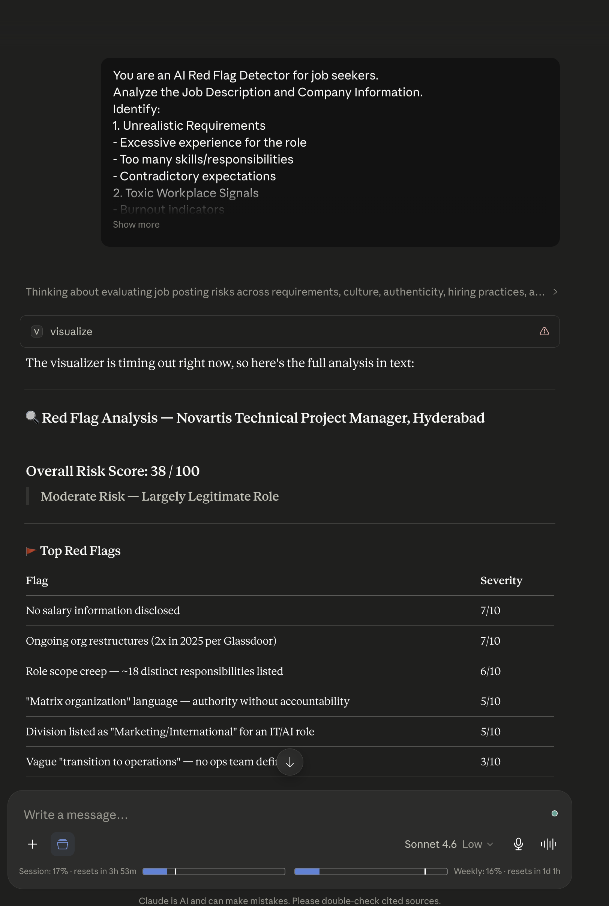
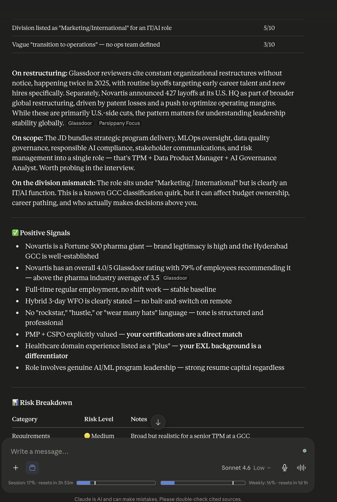
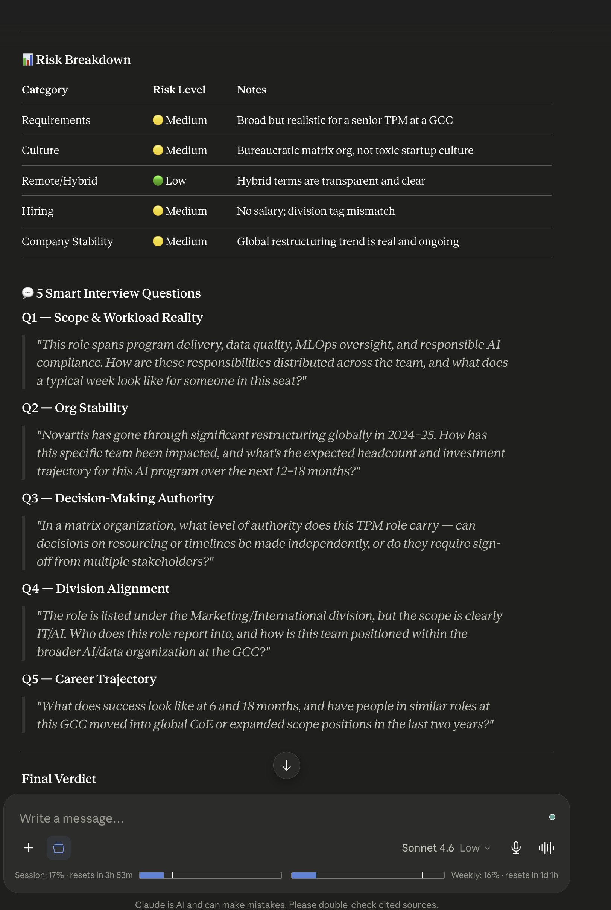
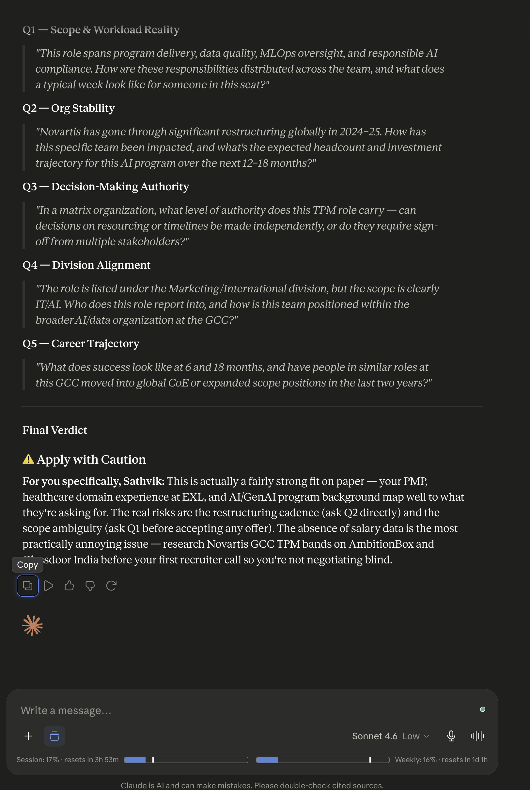

# Day 14

## Prompt

You are an AI Red Flag Detector for job seekers.

Analyze the Job Description and Company Information.

Identify:

1. Unrealistic Requirements

    - Excessive experience for the role
    - Too many skills/responsibilities
    - Contradictory expectations
2. Toxic Workplace Signals

    - Burnout indicators
    - 'Wear many hats'
    - 'Fast-paced', 'rockstar', 'hustle culture'
    - Poor work-life balance signals
3. Remote Job Authenticity

    - Hidden office requirements
    - Relocation expectations
    - Misleading remote claims
4. Hiring Risks

    - Missing salary information
    - Vague responsibilities
    - Excessive qualifications
    - Suspicious hiring practices
5. Company Risks

    - Reputation concerns
    - Stability concerns
    - Growth or layoff indicators

Output:

### Overall Risk Score (0-100)

### Top Red Flags

- List with severity (1-10)

### Positive Signals

- List positives

### Risk Breakdown

| Category | Risk Level |
| ---------- | ---------- |
| Requirements | |
| Culture | |
| Remote | |
| Hiring | |
| Company | |

### Final Verdict

✅ Apply
⚠️ Apply with Caution
❌ Avoid

### 5 Smart Interview Questions

Generate questions that help validate the identified risks.

### Job Description

#### Summary

We are seeking a highly capable Technical Project Manager to lead the planning, execution, governance, development, and delivery of complex AI, data engineering, and analytics platforms. The ideal candidate will have experience managing large-scale, cross-functional initiatives involving multiple stakeholders, technologies, vendors, and business units. This role goes beyond traditional project tracking and reporting. We are looking for a leader who can navigate ambiguity, proactively resolve program challenges, drive execution excellence, and deliver strong business outcomes. The successful candidate will manage multiple concurrent projects, coordinate diverse teams, mitigate risks, drive stakeholder alignment, and ensure strategic initiatives are delivered on time, within scope, and with measurable impact. Key Responsibilities

- Manage the design, deployment, and delivery of priority IT solutions aligned to business requirements
- Contribute to effective control of project progress, quality, and budget to meet business objectives
- Ensure all deliverables meet quality and compliance standards, including comprehensive documentation and timely reviews/approvals
- Oversee smooth transition to operations, including planning and execution of all release-related activities
- Ensure clear stakeholder alignment and effectively operate within a matrix organization

#### About the Role

Location: Hyderabad, 3 days' work from office at Novartis, Hyderabad is mandatory

#### Key responsibilities

- Define program scope, roadmap, milestones, and success metrics for AI and data initiatives.
- Lead end-to-end delivery, ensuring timelines, quality, and outcomes are met.
- Manage governance routines, risks, dependencies, and overall program health.
- Partner with product managers, engineers, data scientists, analysts, and business stakeholders.
- Drive clarity across teams, ensuring alignment and removing execution barriers.
- Translate business problems into structured technical program plans.
- Oversee initiatives involving data pipelines, ML models, analytics tools, and AI capabilities.
- Ensure data readiness, consistent data quality, and smooth model lifecycle processes.
- Support responsible AI principles, privacy standards, and compliance requirements.
- Identify risks early, develop mitigation strategies, and ensure proactive problem resolution.
- Manage scope changes and evaluate impact on timelines, resources, and dependencies.
- Maintain documentation for program decisions, progress, and deliverables.
- Provide regular program updates to leadership and key stakeholders.
- Present risks, insights, and recommendations in a clear and structured manner.
- Build strong relationships across business and technical teams.

#### Essential Requirements

- 10+ years in program or project management within technology, AI, or data-driven environments.
- Proven experience managing AI/ML, data platform, or analytics initiatives end-to-end.
- Fair understanding of MLOps, data engineering, and cloud ecosystems (AWS, Azure).
- Exceptional communication, problem-solving, stakeholder management, and organizational skills.
- Working in Agile/Scrum environments with tools like Jira and Confluence.
- Prior experience with healthcare and life science is plus

#### Desirable Requirements

- Bachelor’s/Masters's degree in engineering, computer science, business, or a related field.
- Certifications such as PMP, Scrum Master, or Program Management credentials.]

### Company Information

#### Why Novartis

Helping people with disease and their families takes more than innovative science. It takes a community of smart, passionate people like you. Collaborating, supporting, and inspiring each other. Combining to achieve breakthroughs that change patients’ lives. Ready to create a brighter future together. <https://www.novartis.com/about/roadmap/people-and-culture>

Commitment to Diversity & Inclusion:
Novartis is committed to building an outstanding, inclusive work environment and diverse team’s representative of the patients and communities we serve.

Values and Behaviors: Demonstrates and upholds Novartis values and behaviors in all aspects of work and collaboration.

Why Novartis: Helping people with disease and their families takes more than innovative science. It takes a community of smart, passionate people like you. Collaborating, supporting and inspiring each other. Combining to achieve breakthroughs that change patients’ lives. Ready to create a brighter future together? <https://www.novartis.com/about/strategy/people-and-culture>
Benefits and Rewards: Learn about all the ways we’ll help you thrive personally and professionally. Read our handbook (PDF 30 MB)
Division
International
Business Unit
Marketing
Location
India
Site
Hyderabad (Office)
Company / Legal Entity
IN10 (FCRS = IN010) Novartis Healthcare Private Limited
Functional Area
Information Technology
Job Type
Full time
Employment Type
Regular
Shift Work
No
Accessibility and accommodation
Novartis is committed to working with and providing reasonable accommodation to individuals with disabilities. If, because of a medical condition or disability, you need a reasonable accommodation for any part of the recruitment process, or in order to perform the essential functions of a position, please send an e-mail to [email protected] and let us know the nature of your request and your contact information. Please include the job requisition number in your message.

## Response

### 🔍 Red Flag Analysis — Novartis Technical Project Manager, Hyderabad

### Overall Risk Score: **38 / 100**

> **Moderate Risk — Largely Legitimate Role**

---

### 🚩 Top Red Flags

| Flag | Severity |
| ------ | ------- |
| No salary information disclosed | 7/10 |
| Ongoing org restructures (2x in 2025 per Glassdoor) | 7/10 |
| Role scope creep — ~18 distinct responsibilities listed | 6/10 |
| "Matrix organization" language — authority without accountability | 5/10 |
| Division listed as "Marketing/International" for an IT/AI role | 5/10 |
| Vague "transition to operations" — no ops team defined | 3/10 |

**On restructuring:** Glassdoor reviewers cite constant organizational restructures without notice, happening twice in 2025, with routine layoffs targeting early career talent and new hires specifically. Separately, Novartis announced 427 layoffs at its U.S. HQ as part of broader global restructuring, driven by patent losses and a push to optimize operating margins. While these are primarily U.S.-side cuts, the pattern matters for understanding leadership stability globally.

**On scope:** The JD bundles strategic program delivery, MLOps oversight, data quality governance, responsible AI compliance, stakeholder communications, and risk management into a single role — that's TPM + Data Product Manager + AI Governance Analyst. Worth probing in the interview.

**On the division mismatch:** The role sits under "Marketing / International" but is clearly an IT/AI function. This is a known GCC classification quirk, but it can affect budget ownership, career pathing, and who actually makes decisions above you.

---

### ✅ Positive Signals

- Novartis is a Fortune 500 pharma giant — brand legitimacy is high and the Hyderabad GCC is well-established
- Novartis has an overall 4.0/5 Glassdoor rating with 79% of employees recommending it — above the pharma industry average of 3.5
- Full-time regular employment, no shift work — stable baseline
- Hybrid 3-day WFO is clearly stated — no bait-and-switch on remote
- No "rockstar," "hustle," or "wear many hats" language — tone is structured and professional
- PMP + CSPO explicitly valued — **your certifications are a direct match**
- Healthcare domain experience listed as a "plus" — **your EXL background is a differentiator**
- Role involves genuine AI/ML program leadership — strong resume capital regardless

---

### 📊 Risk Breakdown

| Category | Risk Level | Notes |
| -------- | ------------ | ------- |
| Requirements | 🟡 Medium | Broad but realistic for a senior TPM at a GCC |
| Culture | 🟡 Medium | Bureaucratic matrix org, not toxic startup culture |
| Remote/Hybrid | 🟢 Low | Hybrid terms are transparent and clear |
| Hiring | 🟡 Medium | No salary; division tag mismatch |
| Company Stability | 🟡 Medium | Global restructuring trend is real and ongoing |

---

### 💬 5 Smart Interview Questions

#### Q1 — Scope & Workload Reality

> *"This role spans program delivery, data quality, MLOps oversight, and responsible AI compliance. How are these responsibilities distributed across the team, and what does a typical week look like for someone in this seat?"*

#### Q2 — Org Stability

> *"Novartis has gone through significant restructuring globally in 2024–25. How has this specific team been impacted, and what's the expected headcount and investment trajectory for this AI program over the next 12–18 months?"*

#### Q3 — Decision-Making Authority

> *"In a matrix organization, what level of authority does this TPM role carry — can decisions on resourcing or timelines be made independently, or do they require sign-off from multiple stakeholders?"*

#### Q4 — Division Alignment

> *"The role is listed under the Marketing/International division, but the scope is clearly IT/AI. Who does this role report into, and how is this team positioned within the broader AI/data organization at the GCC?"*

#### Q5 — Career Trajectory

> *"What does success look like at 6 and 18 months, and have people in similar roles at this GCC moved into global CoE or expanded scope positions in the last two years?"*

---

### Final verdict

#### ⚠️ Apply with Caution

**For you specifically, Sathvik:** This is actually a fairly strong fit on paper — your PMP, healthcare domain experience at EXL, and AI/GenAI program background map well to what they're asking for. The real risks are the restructuring cadence (ask Q2 directly) and the scope ambiguity (ask Q1 before accepting any offer). The absence of salary data is the most practically annoying issue — research Novartis GCC TPM bands on AmbitionBox and Glassdoor India before your first recruiter call so you're not negotiating blind.

## Screenshot

