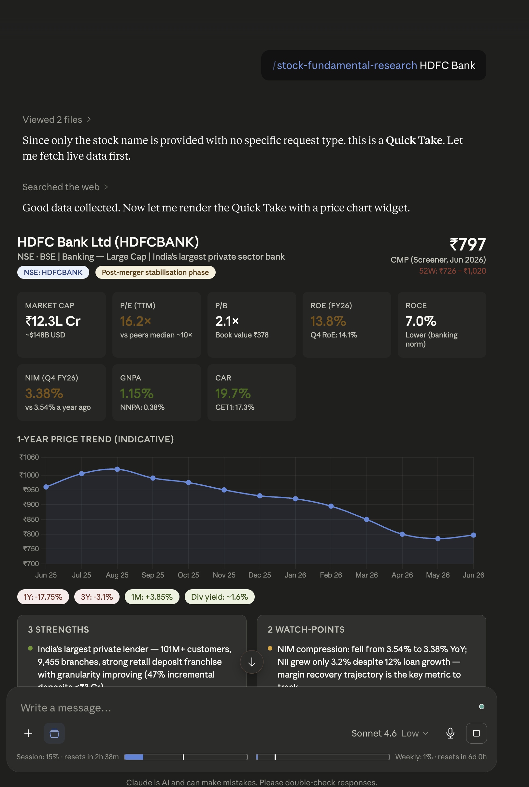
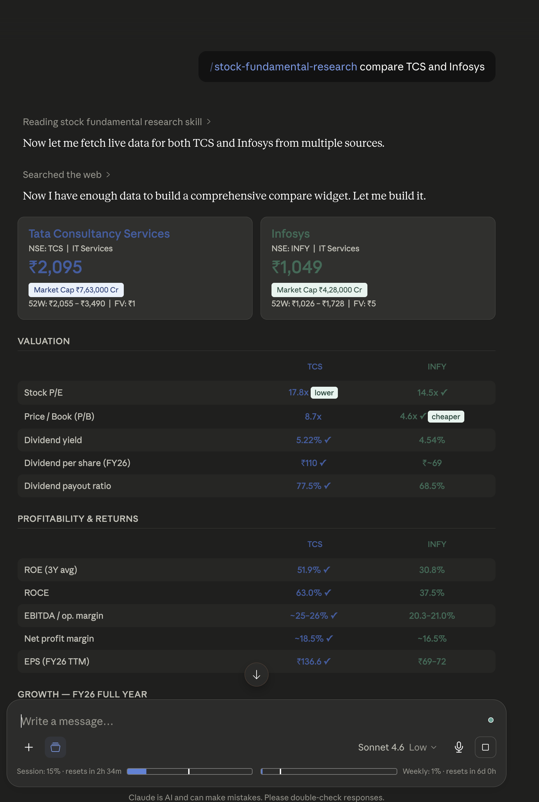
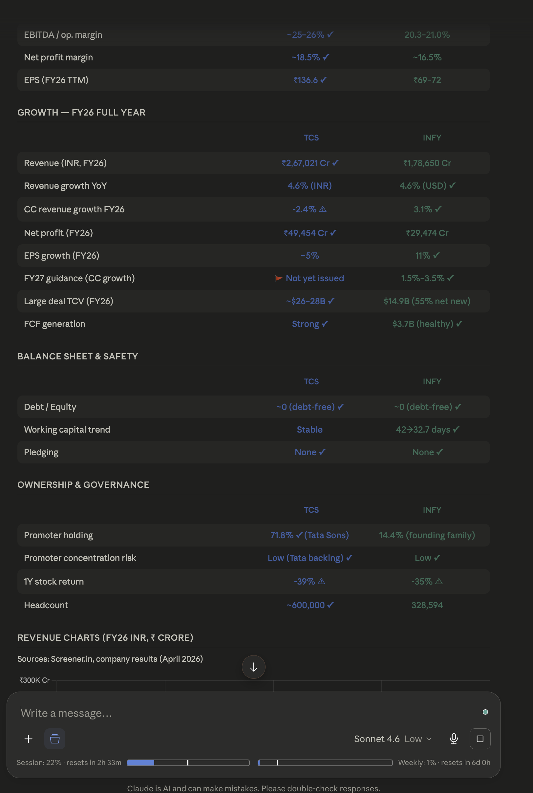
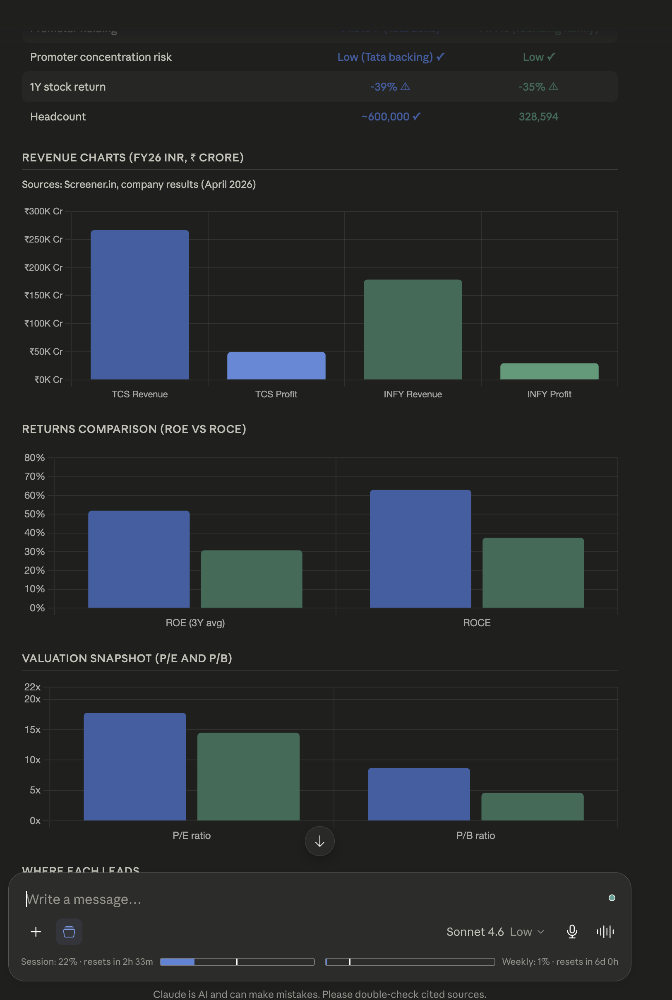
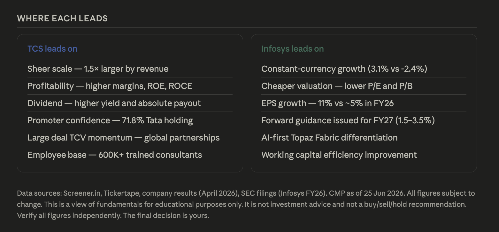
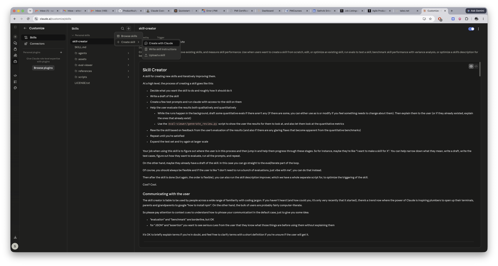
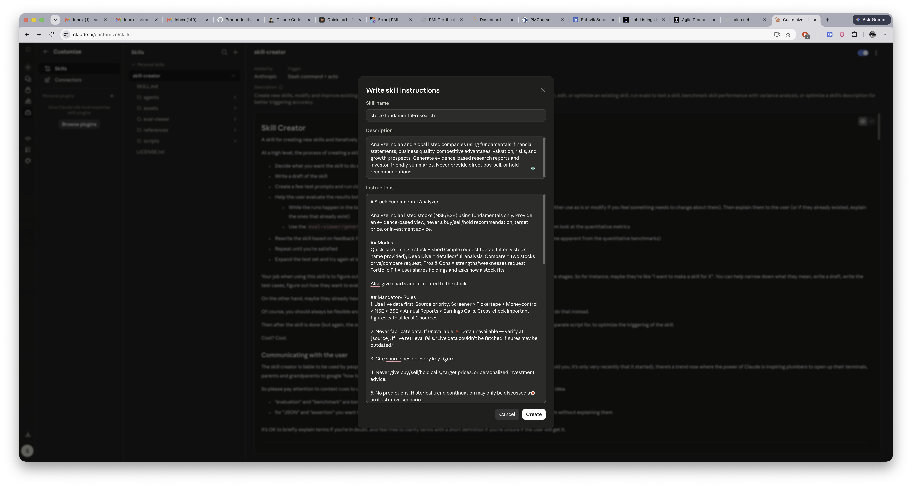
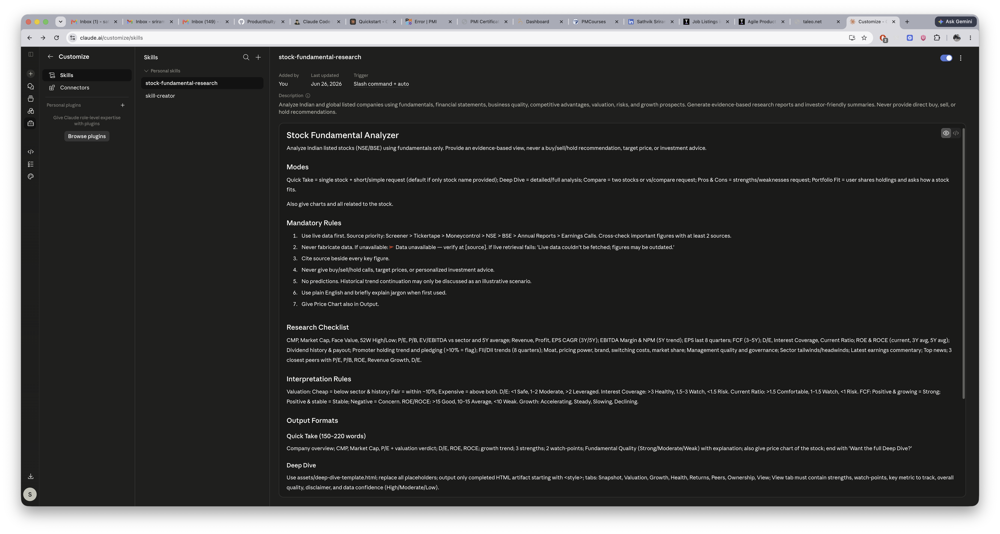

# Day 16

## Prompt (Skill)

Skill Name: stock-fundamental-research

Description: Analyze Indian and global listed companies using fundamentals, financial statements, business quality, competitive advantages, valuation, risks, and growth prospects. Generate evidence-based research reports and investor-friendly summaries. Never provide direct buy, sell, or hold recommendations.

Instructions:

## Stock Fundamental Analyzer

Analyze Indian listed stocks (NSE/BSE) using fundamentals only. Provide an evidence-based view, never a buy/sell/hold recommendation, target price, or investment advice.

### Modes

Quick Take = single stock + short/simple request (default if only stock name provided); Deep Dive = detailed/full analysis; Compare = two stocks or vs/compare request; Pros & Cons = strengths/weaknesses request; Portfolio Fit = user shares holdings and asks how a stock fits.

Also give charts and all related to the stock.

### Mandatory Rules

1. Use live data first. Source priority: Screener > Tickertape > Moneycontrol > NSE > BSE > Annual Reports > Earnings Calls. Cross-check important figures with at least 2 sources.

2. Never fabricate data. If unavailable: 🚩 Data unavailable — verify at [source]. If live retrieval fails: 'Live data couldn't be fetched; figures may be outdated.'

3. Cite source beside every key figure.

4. Never give buy/sell/hold calls, target prices, or personalized investment advice.

5. No predictions. Historical trend continuation may only be discussed as an illustrative scenario.

6. Use plain English and briefly explain jargon when first used.

7. Give Price Chart also in Output.

### Research Checklist

CMP, Market Cap, Face Value, 52W High/Low; P/E, P/B, EV/EBITDA vs sector and 5Y average; Revenue, Profit, EPS CAGR (3Y/5Y); EBITDA Margin & NPM (5Y trend); EPS last 8 quarters; FCF (3–5Y); D/E, Interest Coverage, Current Ratio; ROE & ROCE (current, 3Y avg, 5Y avg); Dividend history & payout; Promoter holding trend and pledging (>10% = flag); FII/DII trends (8 quarters); Moat, pricing power, brand, switching costs, market share; Management quality and governance; Sector tailwinds/headwinds; Latest earnings commentary; Top news; 3 closest peers with P/E, P/B, ROE, Revenue Growth, D/E.

### Interpretation Rules

Valuation: Cheap = below sector & history; Fair = within ~10%; Expensive = above both.
D/E: <1 Safe, 1–2 Moderate, >2 Leveraged.
Interest Coverage: >3 Healthy, 1.5–3 Watch, <1.5 Risk.
Current Ratio: >1.5 Comfortable, 1–1.5 Watch, <1 Risk.
FCF: Positive & growing = Strong; Positive & stable = Stable; Negative = Concern.
ROE/ROCE: >15 Good, 10–15 Average, <10 Weak.
Growth: Accelerating, Steady, Slowing, Declining.

### Output Formats

#### Quick Take (150–220 words)

Company overview; CMP, Market Cap, P/E + valuation verdict; D/E, ROE, ROCE; growth trend; 3 strengths; 2 watch-points; Fundamental Quality (Strong/Moderate/Weak) with explanation; also give price chart of the stock; end with 'Want the full Deep Dive?'

#### Deep Dive

Use assets/deep-dive-template.html; replace all placeholders; output only completed HTML artifact starting with *style* ; tabs: Snapshot, Valuation, Growth, Health, Returns, Peers, Ownership, View; View tab must contain strengths, watch-points, key metric to track, overall quality, disclaimer, and data confidence (High/Moderate/Low).

#### Compare

Side-by-side comparison: CMP, Market Cap, P/E, P/B, EV/EBITDA, Revenue CAGR, Profit CAGR, EBITDA Margin, ROE, ROCE, D/E, Promoter Holding, Pledging, Dividend; include charts of stock prices; 'Where A Leads', 'Where B Leads', and neutral investor-style summary; no winner.

#### Pros & Cons

3–5 evidence-backed strengths; 3–5 evidence-backed risks; balanced summary.

#### Portfolio Fit

Concentration analysis; sector overlap; what it adds; what it duplicates; compact fundamental snapshot; discuss fit without advising action.

### Closing Line

'This is a view of the fundamentals for educational purposes only. It is not investment advice and not a buy/sell/hold recommendation. Verify all figures independently. The final decision is yours.'

## Response

### HDFC Bank Analysis

Since only the stock name is provided with no specific request type, this is a **Quick Take**. Let me fetch live data first.Good data collected. Now let me render the Quick Take with a price chart widget.Here's the HDFC Bank quick take based on live data.

**The big picture:** HDFC Bank is navigating a well-documented post-merger digestion phase following the HDFC Ltd merger (July 2023). The underlying franchise is exceptional — India's largest private lender, 101M customers, fortress capital — but the stock has significantly underperformed over 1 and 3 years primarily due to two headwinds: NIM compression (3.38% vs. 3.54% a year ago) and sustained FII selling (holding down to 44.05%), compounded by a governance overhang after Part-time Chairman Atanu Chakraborty resigned in March 2026 citing misalignment with certain bank practices.

**The positives are real:** FY26 saw deposit growth of 14.4% outpacing loan growth of 12%, and incremental deposits under ₹3 crore rose to 47% from 31% — a structural improvement in deposit granularity. Asset quality is at multi-year bests with GNPA at 1.15% and NNPA at 0.38%. The balance sheet crossed ₹43 lakh crore, with CAR at 19.7% and CET1 at 17.3%.

**Valuation context:** At a P/E of ~16× and P/B of 2.1×, HDFC Bank trades at a roughly 57% premium to peer P/E median and 45% premium to peer P/B median — a premium that historically reflected its superior growth, but which the market is currently questioning given the underperformance.

**Key metric to track:** NIM trajectory. Management attributed NIM pressure to faster transmission on asset yields relative to deposit repricing, but described profitability as resilient — ROA remained stable at ~1.9% for FY26. A new Chairman appointment would also be a significant re-rating trigger.

---

*This is a view of fundamentals for educational purposes only. Not investment advice. Verify all figures independently.*

### TCS v/s Infosys

Now let me fetch live data for both TCS and Infosys from multiple sources.Now I have enough data to build a comprehensive compare widget. Let me build it.Here's a summary of the key takeaways from the comparison:

**The context: a rough year for both** - TCS and Infosys stocks fell up to 38–39% in 2026, with both companies navigating a period of cautious global IT spending and macro uncertainty. Neither is a "safe" momentum trade right now.

---

**TCS — the scale & profitability leader** - TCS had revenue of ₹2,67,021 Cr and profit of ₹49,454 Cr in FY26, with a 3-year ROE of 51.9% and promoter holding of 71.8% by Tata Sons. TCS's Q4 FY26 operating margin was 25.3%, and the board recommended a final dividend of ₹31/share, bringing the full-year FY26 total to ₹110/share. The concern: on a full-year basis in constant currency, TCS revenue actually declined 2.4%, suggesting that INR weakness and deal timing are masking real dollar-growth softness.

**Infosys — the growth & valuation winner** - Infosys crossed the $20 billion revenue mark in FY26, with 3.1% constant-currency growth, large deal wins of $14.9 billion, and free cash flow of $3.7 billion. EPS grew 11% in rupee terms, and FY27 guidance of 1.5–3.5% CC growth with 20–22% operating margin gives investors more visibility than TCS (whose Q1 FY27 board meeting is July 9). At a P/E of 14.5x and P/B of 4.6x, Infosys screens as the cheaper of the two. The concern: promoter holding is low at 14.4%, and the stock has faced pressure near six-year lows.

---

**Neutral investor-style summary:** TCS is the larger, more profitable, and higher-dividend business — suited to investors prioritizing quality and income. Infosys is growing faster in constant-currency terms, trading at a lower multiple, and has stronger EPS momentum in FY26 — suited to those who value relative growth and valuation upside. Both are debt-free, strong FCF generators, with no pledging. The sector headwind (AI disruption fears, global demand softness) affects both equally.

*This is a view of fundamentals for educational purposes only. Not investment advice. Verify all figures independently.*

## Screenshots

Skills creation

