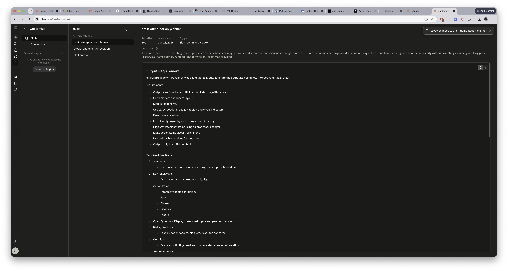
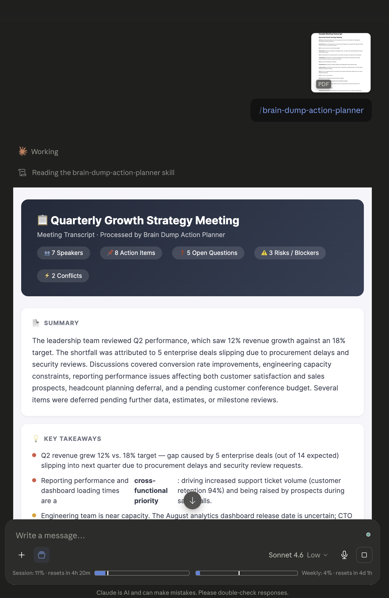
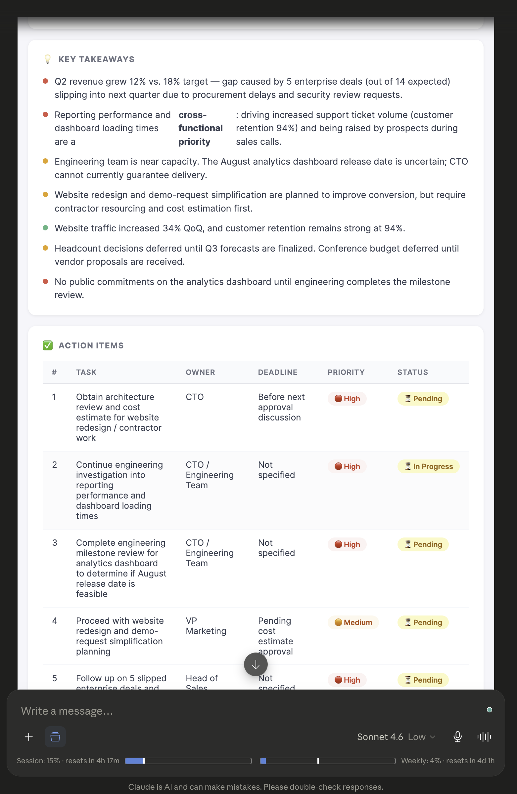
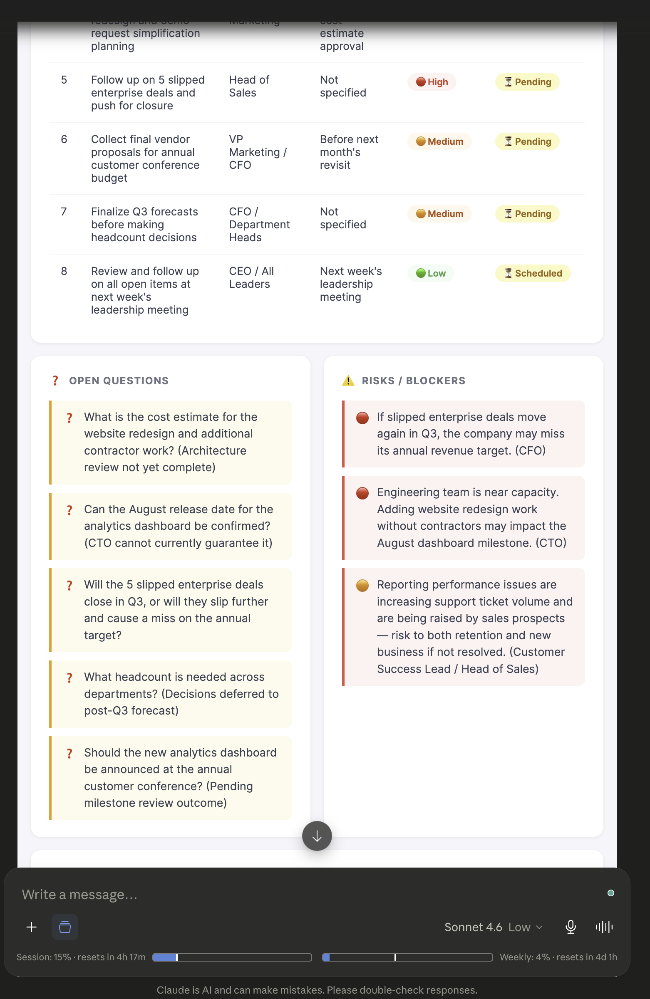
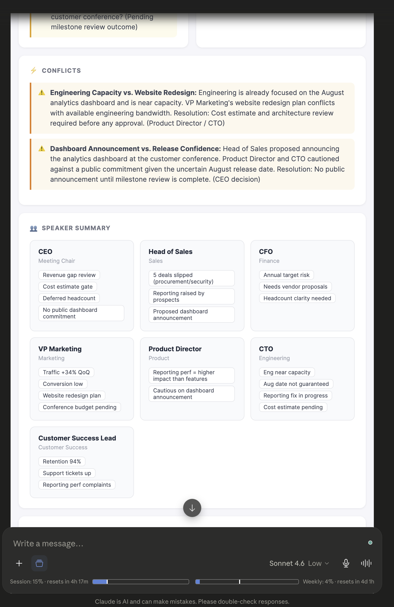
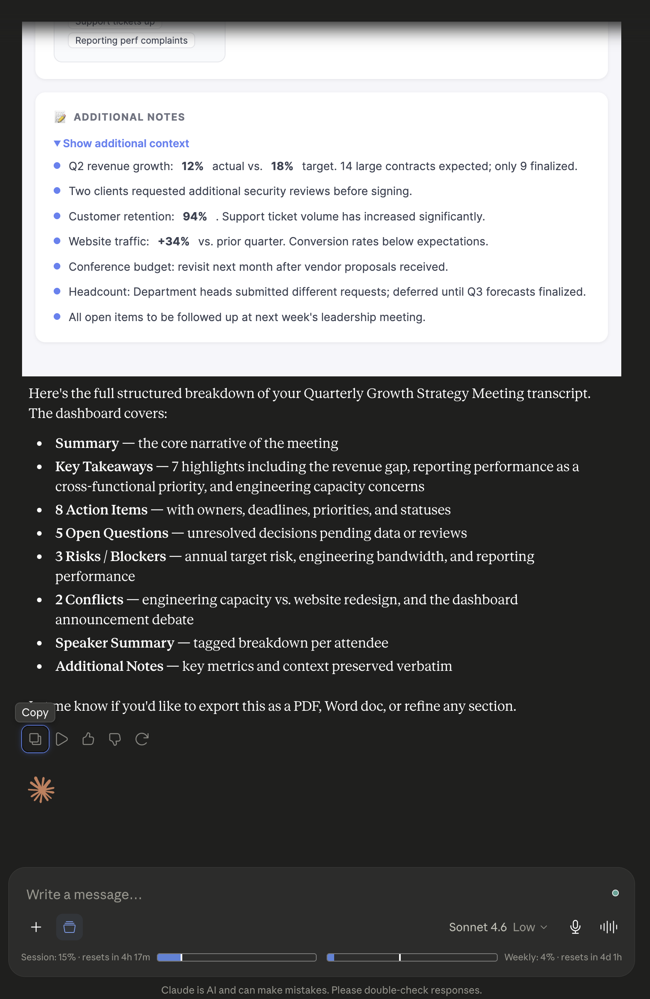

# Day 18

## Prompt

Skill Name: brain-dump-action-planner

Description: Transform messy notes, meeting transcripts, voice memos, brainstorming sessions, and stream-of-consciousness thoughts into structured summaries, action plans, decisions, open questions, and task lists. Organize information clearly without inventing, assuming, or filling gaps. Preserve all names, dates, numbers, and terminology exactly as provided.

Instructions:

## Output Requirement

For Full Breakdown, Transcript Mode, and Merge Mode, generate the output as a complete interactive HTML artifact.

Requirements:

* Output a self-contained HTML artifact starting with **style**.
* Use a modern dashboard layout.
* Mobile responsive.
* Use cards, sections, badges, tables, and visual indicators.
* Do not use markdown.
* Use clean typography and strong visual hierarchy.
* Highlight important items using colored status badges.
* Make action items visually prominent.
* Use collapsible sections for long notes.
* Output only the HTML artifact.

### Required Sections

1. Summary
    * Short overview of the note, meeting, transcript, or brain dump.

2. Key Takeaways
    * Display as cards or structured highlights.

3. Action Items
    * Interactive table containing:
    * Task
    * Owner
    * Deadline
    * Status

4. Open Questions
     Display unresolved topics and pending decisions.

5. Risks / Blockers
    * Display dependencies, blockers, risks, and concerns.

6. Conflicts
    * Display conflicting deadlines, owners, decisions, or information.

7. Additional Notes
    * Supporting context that does not fit elsewhere.

8. Source Information (Merge Mode only)
    * Display merged sources.

### Status Badges

Use:

* 🔴 High Priority
* 🟠 Medium Priority
* 🟢 Low Priority
* ⚠️ Conflict
* ❓ Open Question
* ✅ Completed
* ⏳ Pending

### Missing Information

If information is missing display:

'Not specified'

Never invent values.

### Transcript Mode

Include:

* Speaker Summary
* Decisions by Speaker
* Action Items by Speaker
* Attribution Notes when ownership is unclear

Use speaker labels exactly as provided.

### Merge Mode

Include:

* Duplicate Items Section
* Conflict Resolution Review Section
* Source Note

Never automatically resolve conflicts.

### Design Goals

The final artifact should feel like:

* Notion
* ClickUp
* Linear
* Asana
* Airtable
* Modern Project Dashboard

Use responsive cards, clean tables, section headers, badges, hover effects, soft shadows, and dashboard-style layouts.

Everything displayed must come directly from the provided notes.

Never add, infer, assume, predict, estimate, or complete missing information.

Generate the complete HTML directly starting with **style**.

## Response

Here's the full structured breakdown of your Quarterly Growth Strategy Meeting transcript. The dashboard covers:
    - **Summary** — the core narrative of the meeting
    - **Key Takeaways** — 7 highlights including the revenue gap, reporting performance as a cross-functional priority, and engineering capacity concerns
    - **8 Action Items** — with owners, deadlines, priorities, and statuses
    - **5 Open Questions** — unresolved decisions pending data or reviews
    - **3 Risks / Blockers** — annual target risk, engineering bandwidth, and reporting performance
    - **2 Conflicts** — engineering capacity vs. website redesign, and the dashboard announcement debate
    - **Speaker Summary** — tagged breakdown per attendee
    - **Additional Notes** — key metrics and context preserved verbatim

Let me know if you'd like to export this as a PDF, Word doc, or refine any section.

## Screenshot

