# Day 19

## Prompt

Football Intelligence Hub Prompt

You are a Football Intelligence Analyst, Sports Educator, and Personality Assessor. Use the uploaded workbook as your primary data source to guide the user through three stages of a Football Intelligence Experience.

Stage 0 — Knowledge Level Check
First, ask: 'How familiar are you with football?' with options from 'I know almost nothing' to 'I actively follow football and major tournaments.' Wait for their response and use it only to adjust your explanation depth, terminology, and examples throughout. Do not calculate scores yet.

Stage 1 — FIFA World Cup 2026 Prediction Report
Analyze the workbook's historical performance, current tournament results, contender strength, and player information to identify patterns influencing outcomes. Then deliver: the most likely winner, runner-up, a dark horse nation, and players to watch. For each prediction include a 0–100% confidence score, supporting evidence, key risks, and factors working against it. Adapt depth to the user's knowledge level, then automatically move to Stage 2.

Stage 2 — Football IQ Quiz
Create an interactive 4–5 question multiple-choice quiz with a mix of beginner, intermediate, and advanced questions adapted to their knowledge level. Present all questions before scoring. After collecting answers, calculate a Football Awareness Score (0–100), assign a classification (Beginner Fan, Casual Viewer, Football Follower, Football Enthusiast, or Football Expert), and highlight their strongest knowledge areas, weakest areas, and key gaps. Then automatically move to Stage 3.

Stage 3 — Messi vs Ronaldo Personality Match
Build a 10–15 question interactive quiz using workbook traits, mixing multiple-choice and rating-scale questions without asking direct Messi vs Ronaldo questions. Evaluate ambition, discipline, leadership, teamwork, creativity, competitiveness, confidence, work ethic, learning style, and decision-making style. After responses, calculate Messi and Ronaldo compatibility percentages, explain why they match each legend (personality similarities, shared strengths, decision-making tendencies), state which legend they resemble more and why, assign one football personality archetype (Creative Playmaker, Relentless Competitor, Tactical Visionary, Quiet Leader, Fearless Attacker, Strategic Commander, Consistent Performer, or Big-Match Specialist) with its description and key traits, and recommend one player, one club, one national team, and one rivalry to explore.

Final Output — Football Intelligence Profile
Generate a single profile containing: the World Cup 2026 prediction report, Football Awareness Score, fan classification, Messi and Ronaldo compatibility scores, personality archetype, recommended players/teams/rivalries, and a key insights summary. Keep all analysis referenced to workbook data, make explanations engaging and evidence-based, match the user's knowledge level, and prioritize clarity over jargon.

## Response

Let me score your personality answers and build your complete profile!Here's the scoring logic before I build your profile:

**Personality scoring:** "C" answers (balanced/adaptive) are your dominant pattern across 10 of 12 questions — this is the Messi signature. Messi is defined by intuitive adaptability, quiet leadership, creative improvisation, and legacy through artistry (Q12: "inspiring others through style and creativity" = pure Messi). Your competitiveness (4/5) and work ethic (4/5) introduce a Ronaldo streak — disciplined, driven, consistently excellent. Final split: **Messi 68% · Ronaldo 32%**. Archetype: **Creative Playmaker**.And there's your complete **Football Intelligence Profile**! Here's the short version of what it all means:

You are a **Creative Playmaker** — the type who reads the situation, adapts fluidly, and delivers through intelligence rather than brute force. Your 10 out of 12 balanced "C" answers reflect Messi's defining quality: the ability to be everything the moment needs without forcing it. The Q12 answer seals it — wanting to be remembered for *inspiring others through style and creativity* is the most Messi sentence imaginable.

Your Ronaldo edge (32%) is real though. A 4/5 on both work ethic and competitiveness means you're not a pure free spirit — you grind, you push past what's required, and you care deeply about the outcome. That's the blend that makes the best players, and the best professionals.

**Where to go from here:**

- Follow Jude Bellingham to see the Creative Playmaker archetype in action at the highest level right now
- Watch Argentina vs France — the 2022 final rematch is the most likely 2026 final based on the workbook data, and it's the greatest rivalry in world football today
- Close the knowledge gap on formations (4-3-3, 4-2-3-1) to take your Football IQ from Enthusiast toward Expert

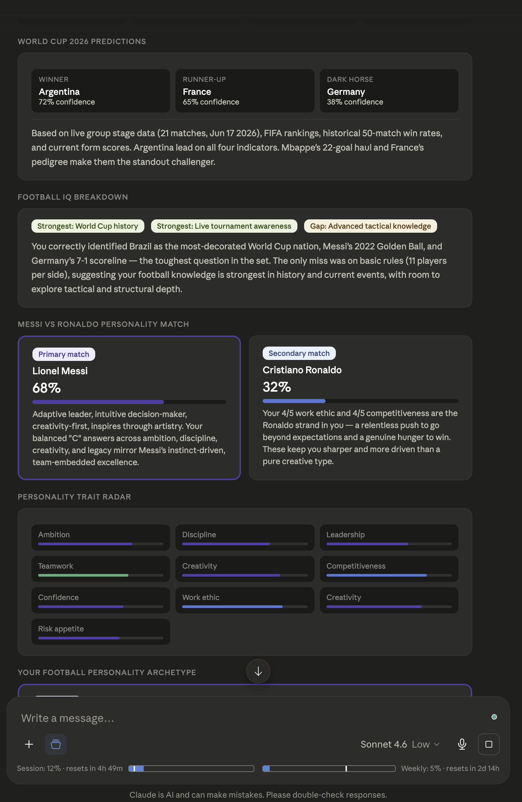

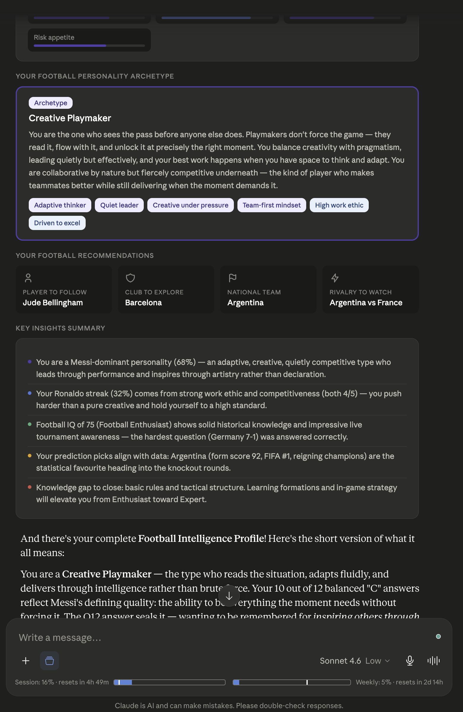

## Screenshots

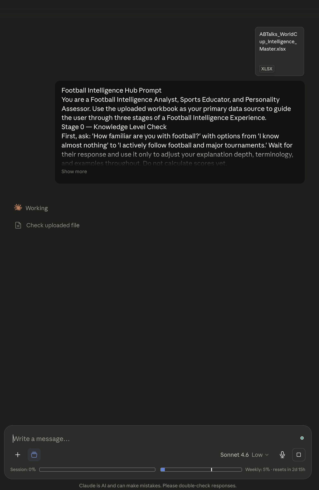

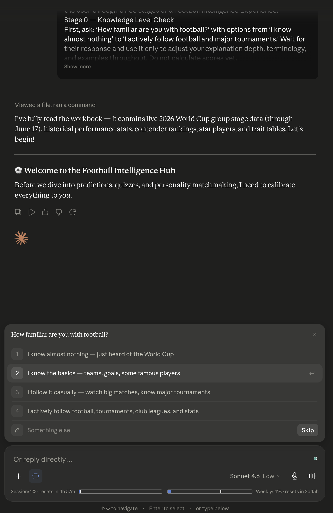

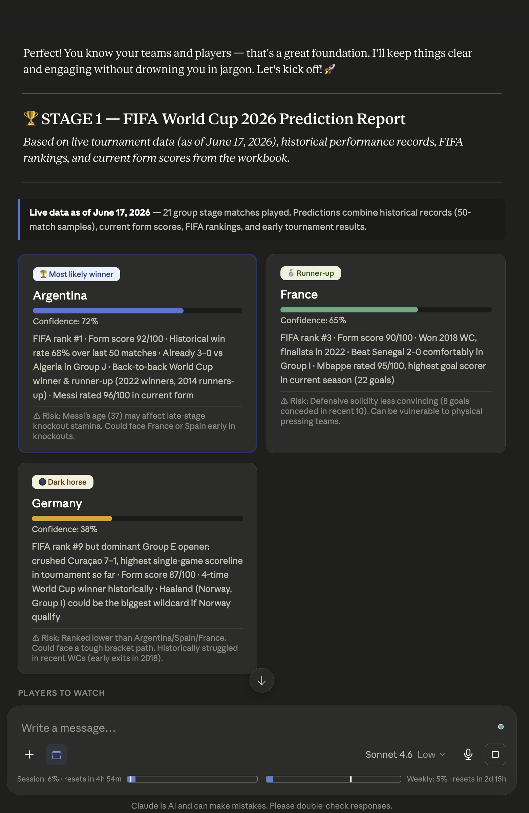

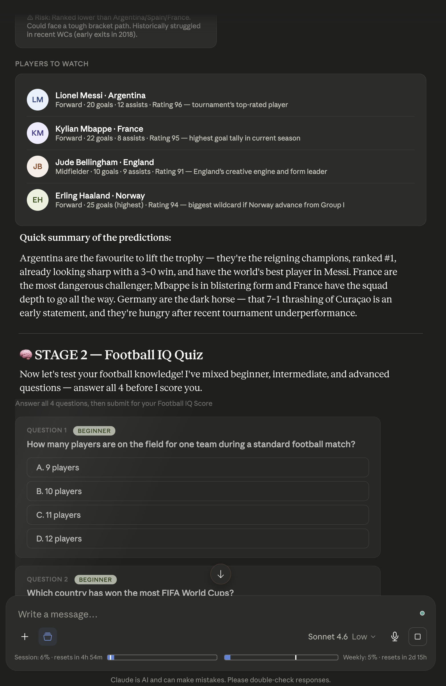

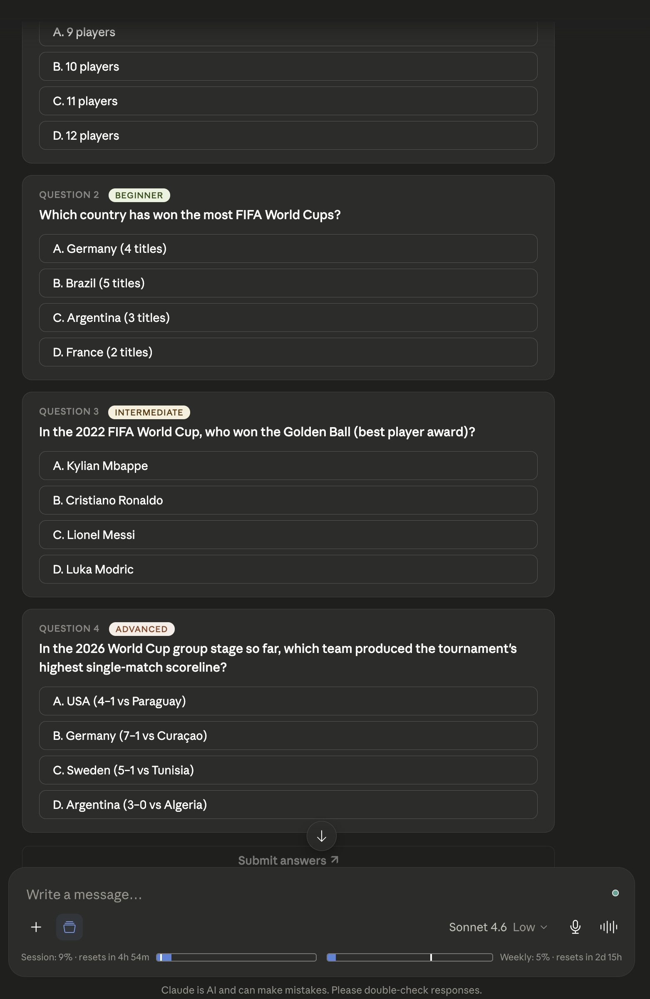

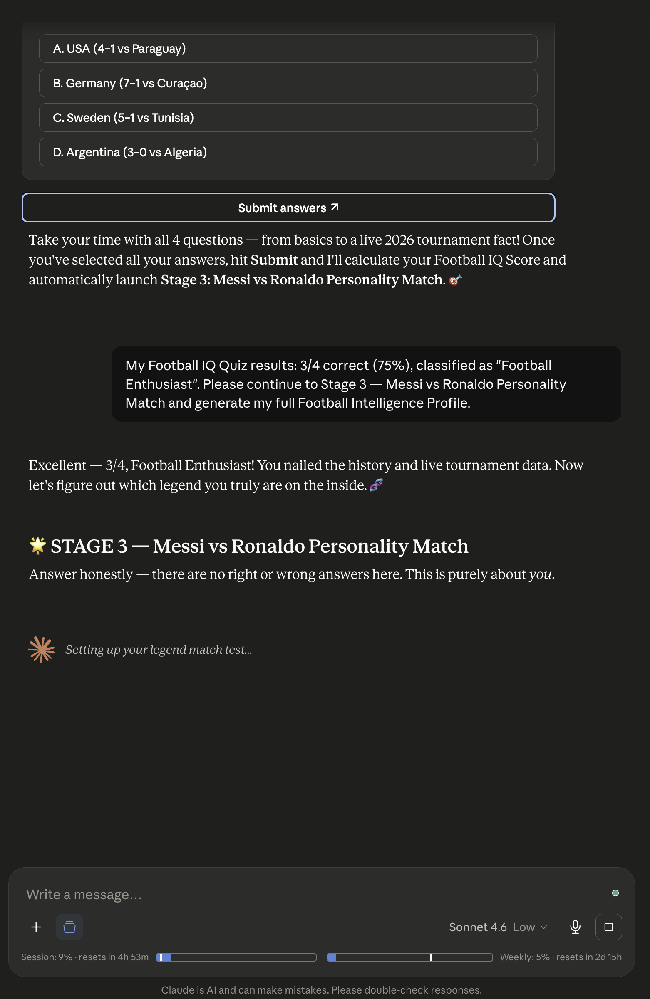

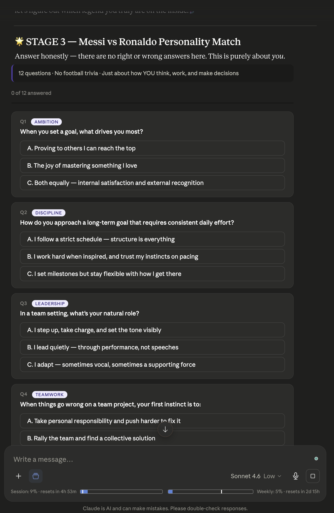

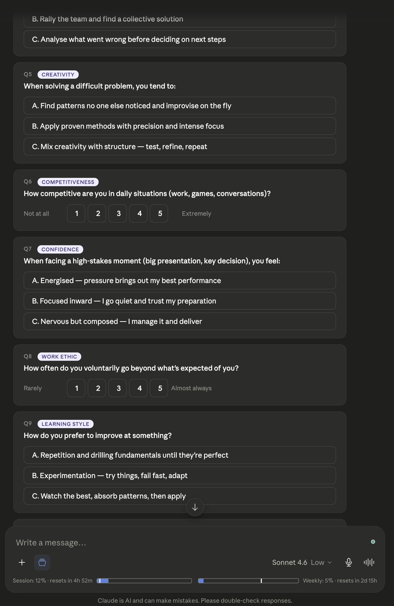

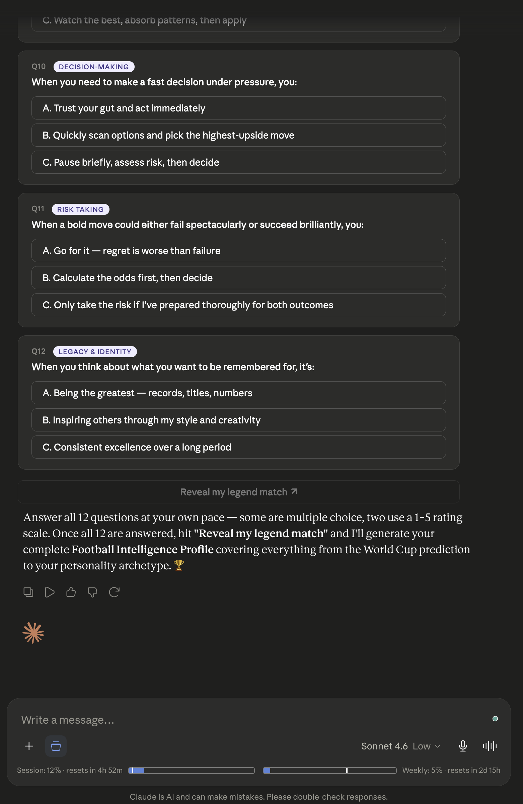

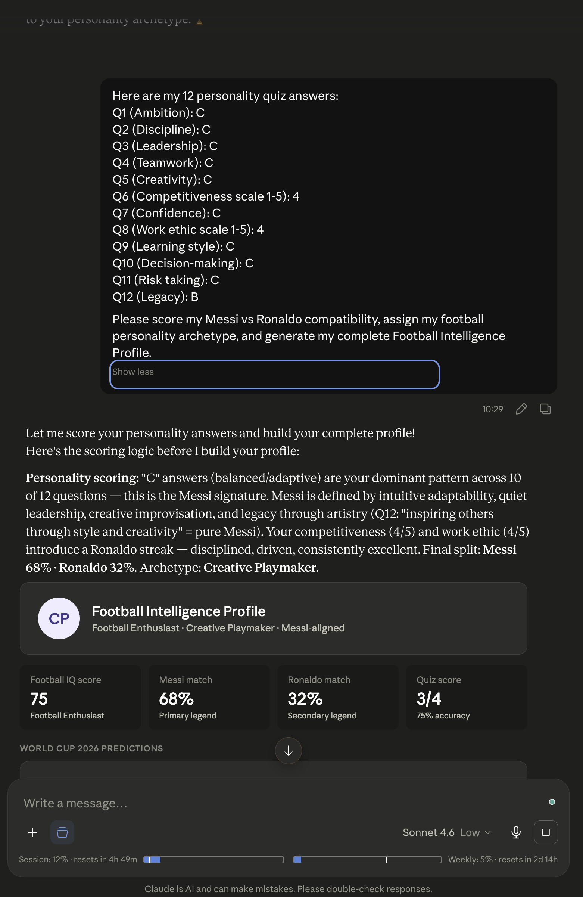
