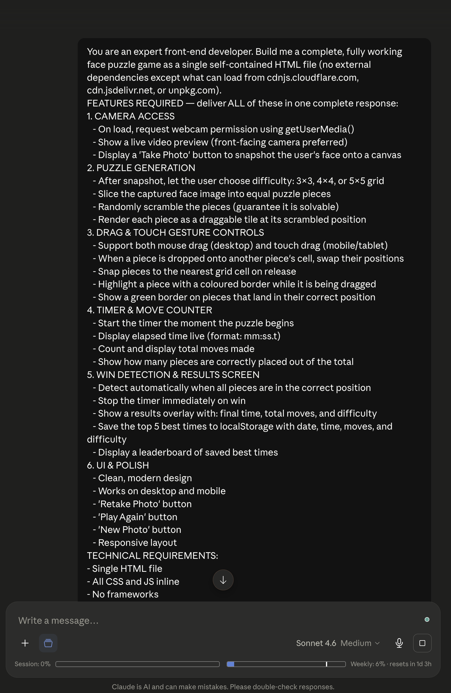
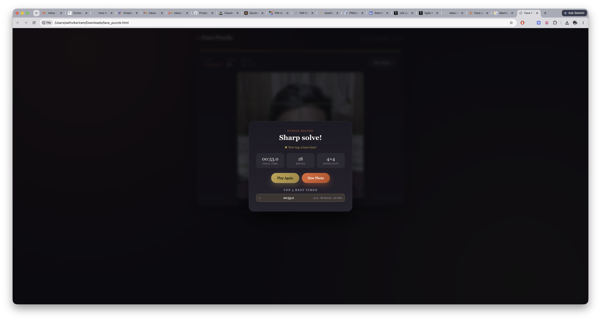
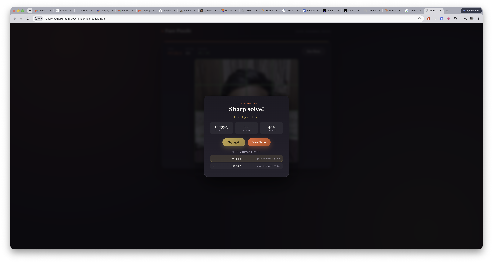

# Day 20

## Prompt

You are an expert front-end developer. Build me a complete, fully working face puzzle game as a single self-contained HTML file (no external dependencies except what can load from cdnjs.cloudflare.com, cdn.jsdelivr.net, or unpkg.com).

FEATURES REQUIRED — deliver ALL of these in one complete response:

1. CAMERA ACCESS
   - On load, request webcam permission using getUserMedia()
   - Show a live video preview (front-facing camera preferred)
   - Display a 'Take Photo' button to snapshot the user's face onto a canvas

2. PUZZLE GENERATION
   - After snapshot, let the user choose difficulty: 3×3, 4×4, or 5×5 grid
   - Slice the captured face image into equal puzzle pieces
   - Randomly scramble the pieces (guarantee it is solvable)
   - Render each piece as a draggable tile at its scrambled position

3. DRAG & TOUCH GESTURE CONTROLS
   - Support both mouse drag (desktop) and touch drag (mobile/tablet)
   - When a piece is dropped onto another piece's cell, swap their positions
   - Snap pieces to the nearest grid cell on release
   - Highlight a piece with a coloured border while it is being dragged
   - Show a green border on pieces that land in their correct position

4. TIMER & MOVE COUNTER
   - Start the timer the moment the puzzle begins
   - Display elapsed time live (format: mm:ss.t)
   - Count and display total moves made
   - Show how many pieces are correctly placed out of the total

5. WIN DETECTION & RESULTS SCREEN
   - Detect automatically when all pieces are in the correct position
   - Stop the timer immediately on win
   - Show a results overlay with: final time, total moves, and difficulty
   - Save the top 5 best times to localStorage with date, time, moves, and difficulty
   - Display a leaderboard of saved best times

6. UI & POLISH
   - Clean, modern design
   - Works on desktop and mobile
   - 'Retake Photo' button
   - 'Play Again' button
   - 'New Photo' button
   - Responsive layout

TECHNICAL REQUIREMENTS:
    - Single HTML file
    - All CSS and JS inline
    - No frameworks
    - Must work in Chrome, Firefox, and Safari
    - Camera must work over HTTPS or localhost
    - Handle camera permission denied gracefully
    - Do NOT leave placeholder comments

Output the complete HTML file in one code block. Do not truncate or summarise any section.

## Response

I'll build this as a complete single HTML file. Let me check the relevant skill first, then create it.Now let me build the file. Given complexity, I'll write it directly in the sandbox and iterate.Let me quickly sanity-check the file for syntax issues (balanced tags, no leftover errors) before delivering.Balanced. Now let's check JS syntax with node, and HTML validity roughly via a headless check.JS syntax is valid. The file is self-contained (no external CDN dependencies needed at all — pure vanilla JS/CSS), works fully offline aside from the camera permission, and is ready to deliver.A few implementation notes worth knowing:

- **Camera**: requests `facingMode: 'user'`, mirrors the preview and the captured photo so it feels like a mirror, and crops to a square before slicing — this keeps pieces uniform regardless of the camera's native aspect ratio.
- **Puzzle generation**: pieces are rendered as absolutely-positioned divs sharing one large `background-image`, each offset to show its correct slice — no canvas-per-tile needed, which keeps drag performance smooth even at 5×5.
- **Solvability**: since this is a free-swap puzzle (any two tiles can swap directly, unlike a 15-puzzle with one blank), every permutation is solvable — I just reshuffle if the Fisher-Yates happens to land on the already-solved order.
- **Drag/touch**: unified pointer-down/move/up logic backs both `mousedown/mousemove/mouseup` and `touchstart/touchmove/touchend`, snapping to the nearest grid cell by rounding the drop center, then swapping whichever piece currently occupies that slot.
- **Win detection** runs after every drop; on win the timer stops immediately and results save into a top-5 `localStorage` leaderboard sorted by time.
- **Resilience**: permission-denied, no-camera, camera-in-use, and non-HTTPS contexts each get a distinct, actionable error message instead of a silent failure.

Open it directly in a browser served over HTTPS or `localhost` (camera APIs won't work via `file://`).

## Screenshot

