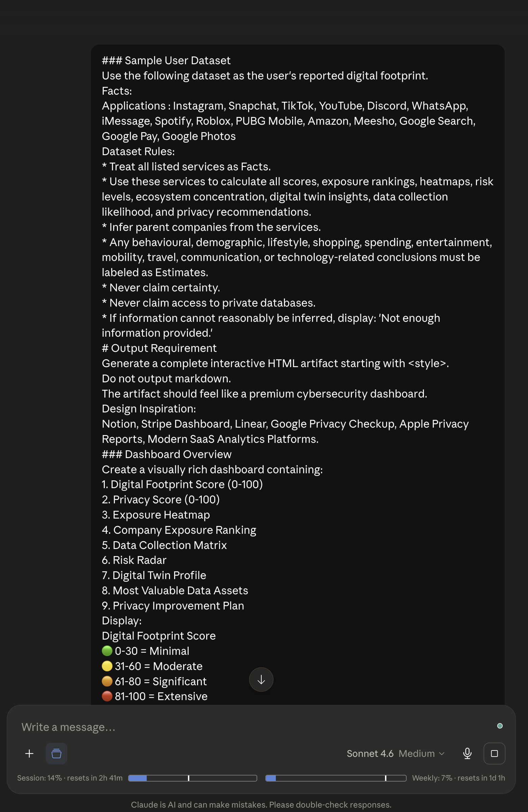
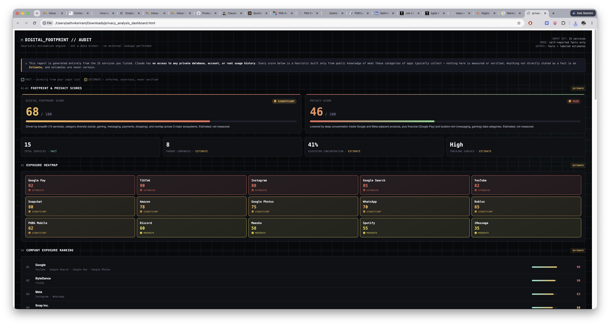
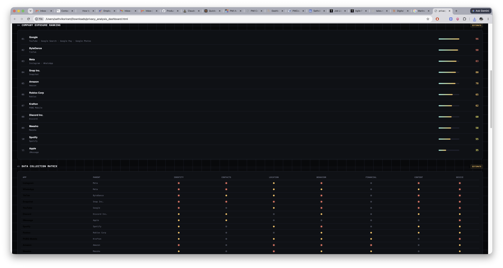
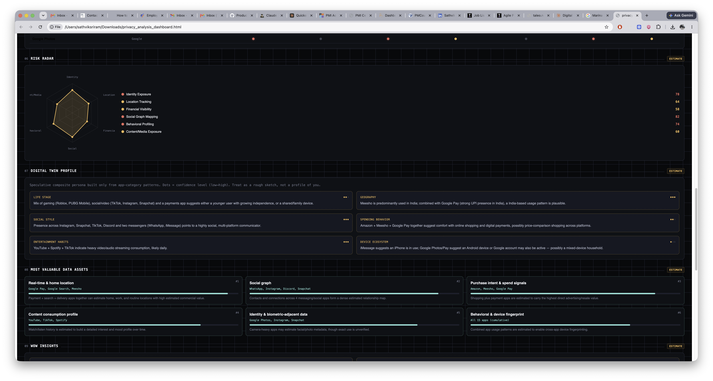
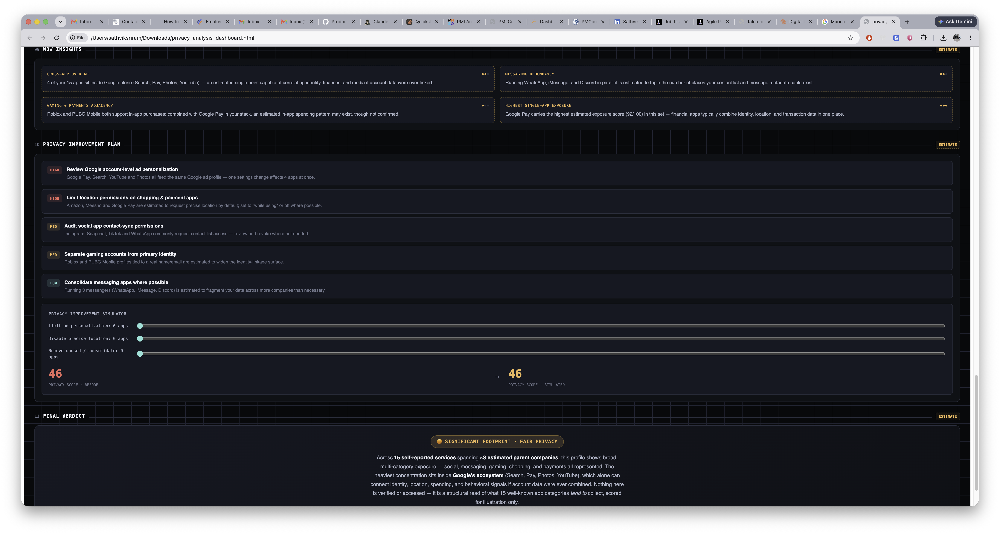

# Day 21

## Prompt

### Sample User Dataset

Use the following dataset as the user's reported digital footprint.

Facts:

Applications : Instagram, Snapchat, TikTok, YouTube, Discord, WhatsApp, iMessage, Spotify, Roblox, PUBG Mobile, Amazon, Meesho, Google Search, Google Pay, Google Photos

Dataset Rules:

* Treat all listed services as Facts.
* Use these services to calculate all scores, exposure rankings, heatmaps, risk levels, ecosystem concentration, digital twin insights, data collection likelihood, and privacy recommendations.
* Infer parent companies from the services.
* Any behavioural, demographic, lifestyle, shopping, spending, entertainment, mobility, travel, communication, or technology-related conclusions must be labeled as Estimates.
* Never claim certainty.
* Never claim access to private databases.
* If information cannot reasonably be inferred, display: 'Not enough information provided.'

### Output Requirement

Generate a complete interactive HTML artifact starting with style.

Do not output markdown.

The artifact should feel like a premium cybersecurity dashboard.

Design Inspiration:

Notion, Stripe Dashboard, Linear, Google Privacy Checkup, Apple Privacy Reports, Modern SaaS Analytics Platforms.

### Dashboard Overview

Create a visually rich dashboard containing:

1. Digital Footprint Score (0-100)
2. Privacy Score (0-100)
3. Exposure Heatmap
4. Company Exposure Ranking
5. Data Collection Matrix
6. Risk Radar
7. Digital Twin Profile
8. Most Valuable Data Assets
9. Privacy Improvement Plan

Display:

Digital Footprint Score
🟢 0-30 = Minimal
🟡 31-60 = Moderate
🟠 61-80 = Significant
🔴 81-100 = Extensive

Privacy Score
🔴 0-30 = Weak
🟠 31-60 = Fair
🟡 61-80 = Good
🟢 81-100 = Strong

Include:

* Total Services Used
* Number of Parent Companies
* Ecosystem Concentration Score
* Estimated Tracking Surface

Create all sections exactly as specified including Digital Twin Profile, Exposure Heatmap, Company Exposure Ranking, Data Collection Matrix, Risk Radar, WOW Insights, Most Valuable Data Assets, Privacy Improvement Simulator, and Final Verdict.

Critical Rules:

* Never claim access to private databases.
* Never claim certainty about inferred traits.
* Separate Facts from Estimates.

## Response

Given the apps listed (notably PUBG Mobile, Roblox, Meesho, Google Pay alongside the usual social/comms set), this profile reads as a household account, likely a younger user in India with shared family usage — that's worth flagging as an estimate inside the dashboard itself, not just something I infer silently. Let me build this out.Now let me build this. Quick design plan: subject is a security/forensics-style audit tool, so I'll lean into a "threat intelligence terminal" aesthetic — dark, monospace-accented, amber/cyan signal colors against near-black, like SIEM dashboards (Splunk/Datadog) rather than generic Stripe-clean. Signature element: a literal "Fact vs Estimate" visual distinction system (solid borders for facts, dashed/hatched for estimates) carried through every single component, since that's the actual ethical core of this deliverable.That visual tool isn't responding, so I'll deliver this as the HTML artifact directly instead.Built it as a "threat-intel terminal" style dashboard rather than the usual clean-SaaS look — dark grid background, amber/cyan signal colors, monospace data labels — since the subject matter (exposure, risk, surveillance surface) called for something with more edge than Stripe-clean.

A few things worth flagging about how it's built:

Every section is explicitly tagged Fact or Estimate, and the legend at the top explains what that distinction means before any numbers appear. The only hard facts in here are the 15 service names and their inferred parent companies — everything else (scores, the digital twin, collection-likelihood dots, risk radar values) is synthetic and clearly labeled as a heuristic, with repeated language making clear no real account or database was ever queried.

The Digital Twin section in particular carries low confidence dots on most traits (e.g. life stage, device ecosystem) since that's genuinely the weakest inference in the set — a household with Roblox/PUBG Mobile next to Google Pay could mean several different things, and I didn't want the dashboard to assert a single confident narrative there.

The simulator at the bottom is just a toy mapping (slider position → estimated privacy score), not a real prediction — worth keeping in mind if you ever reuse this pattern for something with real user data behind it.

## Screenshot

