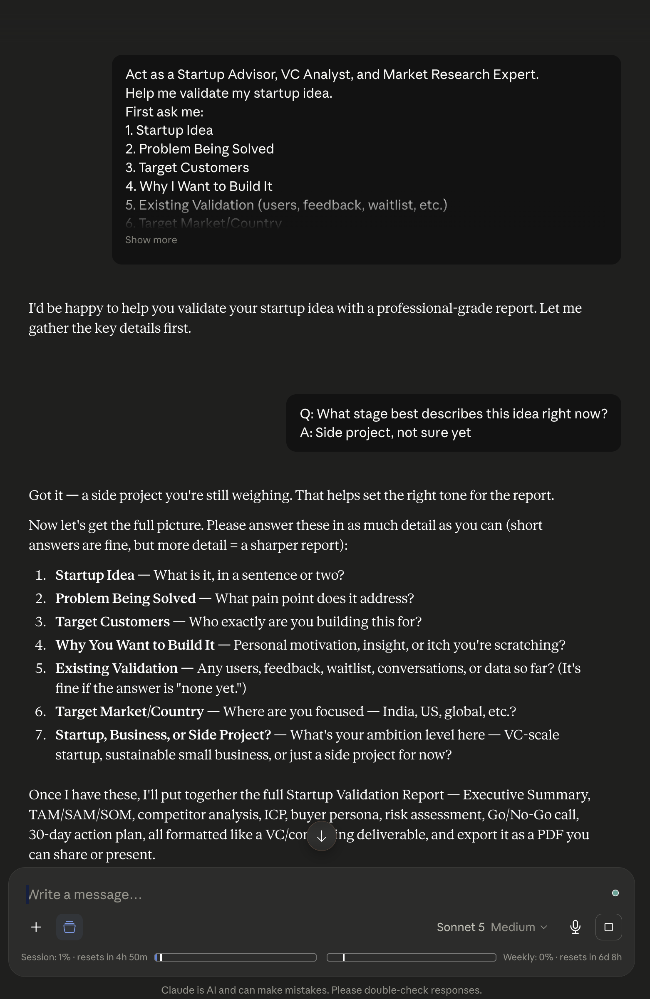
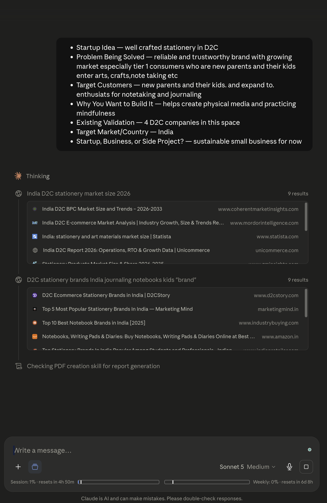

# Day 22

## Prompt

Act as a Startup Advisor, VC Analyst, and Market Research Expert.

Help me validate my startup idea.

First ask me:

1. Startup Idea
2. Problem Being Solved
3. Target Customers
4. Why I Want to Build It
5. Existing Validation (users, feedback, waitlist, etc.)
6. Target Market/Country
7. Startup, Business, or Side Project?

    Startup Idea — well crafted stationery in D2C
    Problem Being Solved — reliable and trustworthy brand with growing market especially tier 1 consumers who are new parents and their kids enter arts, crafts,note taking etc
    Target Customers — new parents and their kids. and expand to. enthusiats for notetaking and journaling
    Why You Want to Build It — helps create physical media and practicing mindfulness
    Existing Validation —  4 D2C companies in this space
    Target Market/Country — India
    Startup, Business, or Side Project? —  sustainable small business for now

After collecting my answers, generate a professional PDF-ready Startup Validation Report containing:

* Executive Summary
* Problem Validation
* Founder-Market Fit Score
* TAM, SAM, SOM Analysis
* Competitor Analysis
* Market Gap Analysis
* Ideal Customer Profile (ICP)
* Buyer Persona
* Customer Pain Points
* Buying Triggers & Objections
* Customer Journey
* Risk Assessment
* Pivot Opportunities
* Go / No-Go Recommendation
* 30-Day Action Plan

Use tables, scores, charts, and professional consulting-style formatting.

Output should look like a report prepared by McKinsey, Y Combinator, or a VC firm and be ready for direct PDF export.

## Response

Thanks — this gives me enough to work with. Let me pull a bit more market data, then build the full report as a polished PDF.Score bars render fine. Let me check a table-heavy page and the gap analysis page (which had a column-width count mismatch).Good — tables render cleanly with proper widths. Let me check a couple more pages (competitor tables and the action plan) then finalize.Everything renders cleanly — professional formatting, tables, and score bars all look correct. Let me finalize and share both the PDF and the editable Word version.Here's your 16-page Startup Validation Report — PDF ready to share, plus an editable Word version if you want to tweak anything.

**Headline call: Conditional GO** — legitimate as a small business/side project, but not yet proven. The report walks through why:

- **Founder-market fit: 5.2/10** — your PM/MBA operating skills transfer well, but you have no disclosed manufacturing, retail, or parenting-ecosystem experience, which is the real gap to close.
- **Market gap is real but narrow** — every visible D2C competitor (Doodle Collection, Origin One, Scooboo, Factor Notes, Nappa Dori) targets adult journaling/gifting; none own the "new parent + toddler's first creative supplies" moment you're describing.
- **TAM/SAM/SOM**: ~₹20,000 Cr total India stationery market → ~₹2,800 Cr addressable premium/design-led slice → a realistic ₹1–3 Cr SOM in 24–36 months for a lean entrant.
- **Biggest structural risk isn't competition, it's D2C operations** — India's COD/RTO rates (25–39%) will eat margins on a low-ticket category like stationery if you don't design for prepaid-first checkout from day one.
- **30-day plan** is built to force a real Go/No-Go decision — 15–20 parent interviews, a landing page pricing test, manufacturer feasibility check, and a small paid demand pilot — before you commit to inventory.

Worth flagging: since this is a side project, the report deliberately didn't size it as venture-scale — if you want, I can also build the parallel "adult journaling/mindfulness" version of this report, since that segment is larger and better proven by existing competitors, and could be a faster path to revenue while you validate the parent/kids angle.

[Startup_Validation_Report](Startup_Validation_Report.pdf)

## Screenshot

