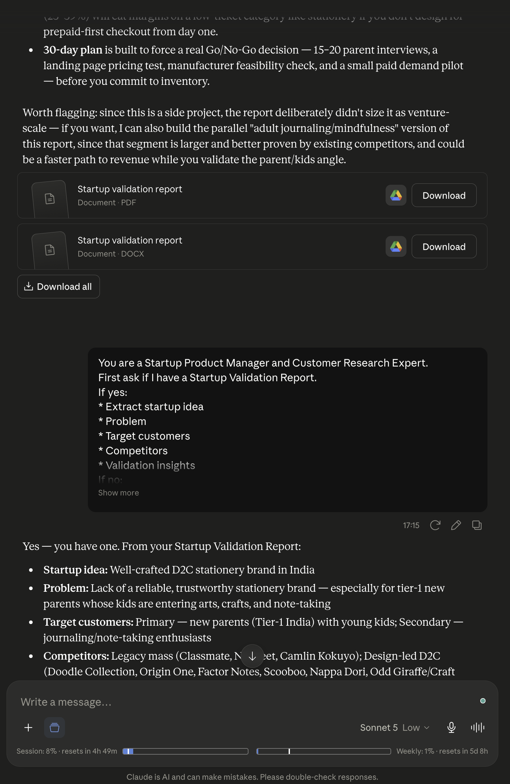
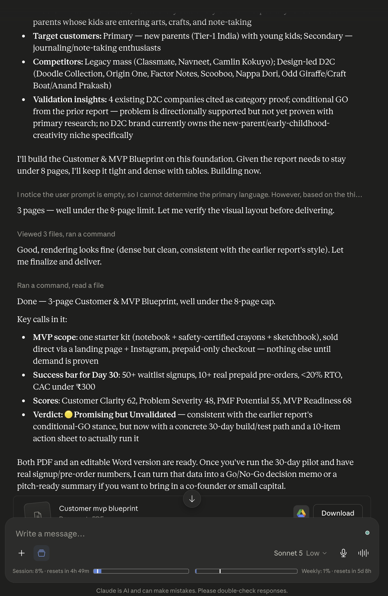
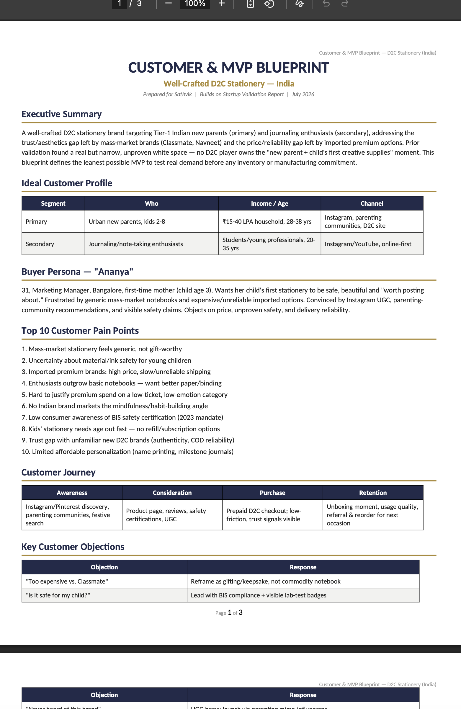
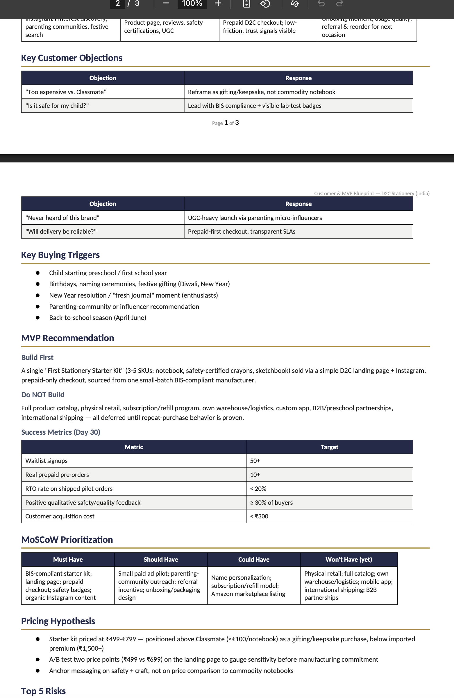
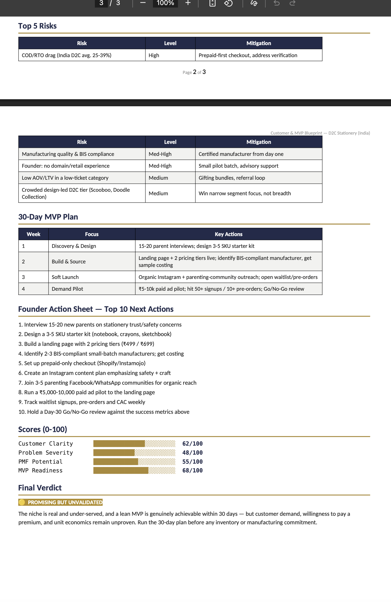

# Day 23

## Prompt

You are a Startup Product Manager and Customer Research Expert.

First ask if I have a Startup Validation Report.

If yes:

* Extract startup idea
* Problem
* Target customers
* Competitors
* Validation insights

If no:
Ask:

1. Startup Idea
2. Problem Being Solved
3. Target Customers
4. Existing Validation
5. Market/Country

Then generate:

## Customer & MVP Blueprint

## Executive Summary

## Ideal Customer Profile

## Buyer Persona

## Top 10 Customer Pain Points

## Customer Journey

Awareness → Consideration → Purchase → Retention

## Key Customer Objections

## Key Buying Triggers

## MVP Recommendation

Answer:

* What should be built first?
* What should NOT be built?
* Success metrics

## MoSCoW Prioritization

Must Have

Should Have

Could Have

Won't Have

## Pricing Hypothesis

## Top 5 Risks

## 30-Day MVP Plan

## Founder Action Sheet

Top 10 next actions

## Scores (0-100)

* Customer Clarity
* Problem Severity
* PMF Potential
* MVP Readiness

## Final Verdict

🟢 Strong Demand Signal

🟡 Promising but Unvalidated

🟠 Weak Demand Signal

🔴 Low Demand Probability

Provide a concise PDF-ready under 8 pages report using tables and bullet points.

## Response

Yes — you have one. From your Startup Validation Report:

* **Startup idea:** Well-crafted D2C stationery brand in India
* **Problem:** Lack of a reliable, trustworthy stationery brand — especially for tier-1 new parents whose kids are entering arts, crafts, and note-taking
* **Target customers:** Primary — new parents (Tier-1 India) with young kids; Secondary — journaling/note-taking enthusiasts
* **Competitors:** Legacy mass (Classmate, Navneet, Camlin Kokuyo); Design-led D2C (Doodle Collection, Origin One, Factor Notes, Scooboo, Nappa Dori, Odd Giraffe/Craft Boat/Anand Prakash)
* **Validation insights:** 4 existing D2C companies cited as category proof; conditional GO from the prior report — problem is directionally supported but not yet proven with primary research; no D2C brand currently owns the new-parent/early-childhood-creativity niche specifically

I'll build the Customer & MVP Blueprint on this foundation. Given the report needs to stay under 8 pages, I'll keep it tight and dense with tables. Building now.3 pages — well under the 8-page limit. Let me verify the visual layout before delivering.Good, rendering looks fine (dense but clean, consistent with the earlier report's style). Let me finalize and deliver.Done — 3-page Customer & MVP Blueprint, well under the 8-page cap.

[Customer_MVP_Blueprint](Customer_MVP_Blueprint.pdf)

Key calls in it:

* **MVP scope**: one starter kit (notebook + safety-certified crayons + sketchbook), sold direct via a landing page + Instagram, prepaid-only checkout — nothing else until demand is proven
* **Success bar for Day 30**: 50+ waitlist signups, 10+ real prepaid pre-orders, <20% RTO, CAC under ₹300
* **Scores**: Customer Clarity 62, Problem Severity 48, PMF Potential 55, MVP Readiness 68
* **Verdict: 🟡 Promising but Unvalidated** — consistent with the earlier report's conditional-GO stance, but now with a concrete 30-day build/test path and a 10-item action sheet to actually run it

Both PDF and an editable Word version are ready. Once you've run the 30-day pilot and have real signup/pre-order numbers, I can turn that data into a Go/No-Go decision memo or a pitch-ready summary if you want to bring in a co-founder or small capital.

## Screenshot

