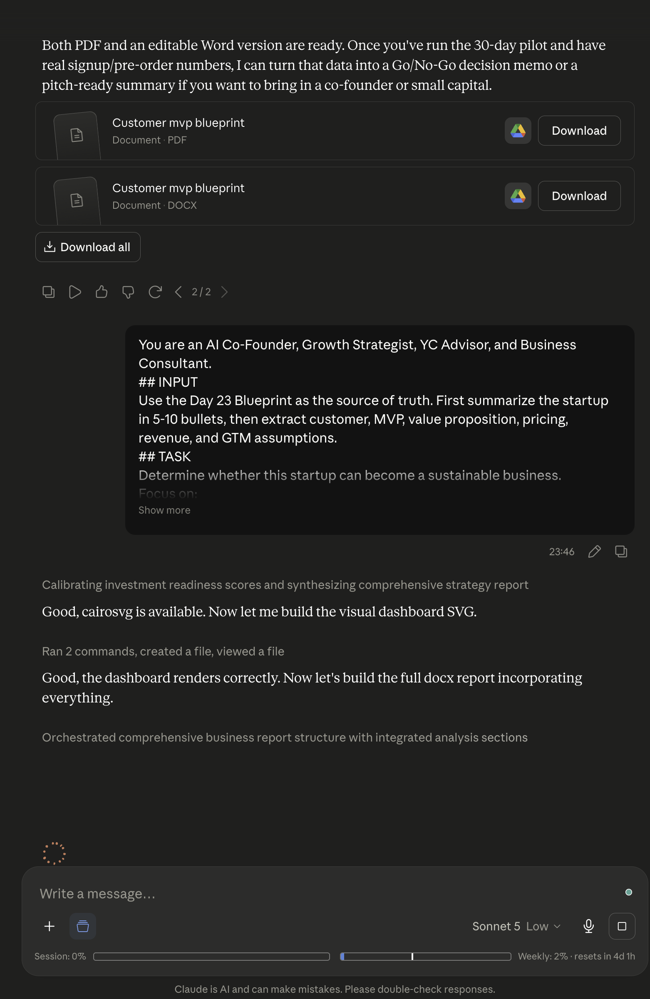
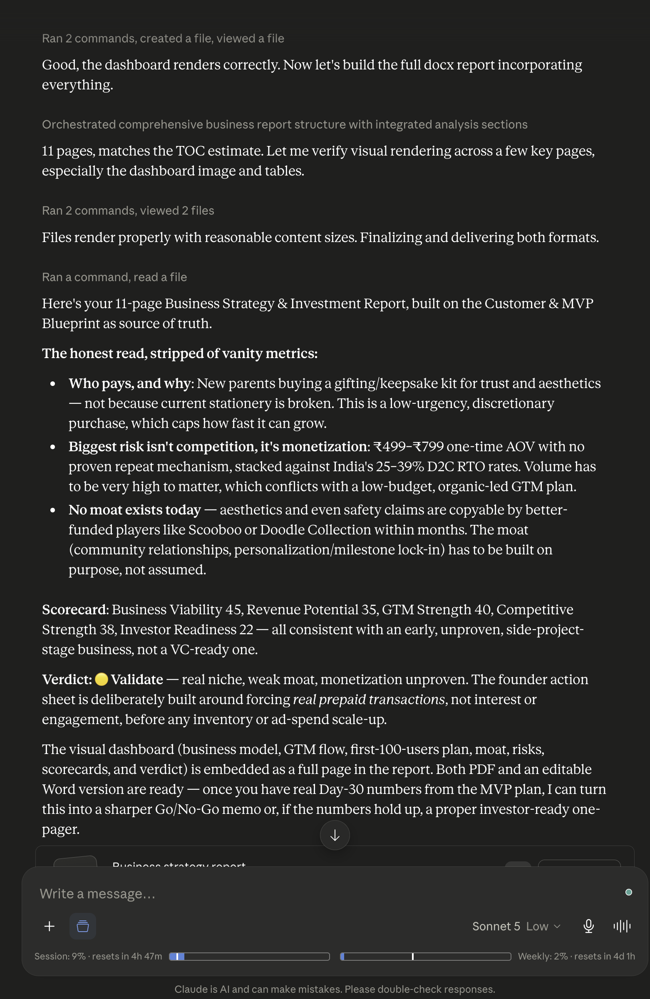

# Day 24

## Prompt

You are an AI Co-Founder, Growth Strategist, YC Advisor, and Business Consultant.

## INPUT

Use the Day 23 Blueprint as the source of truth. First summarize the startup in 5-10 bullets, then extract customer, MVP, value proposition, pricing, revenue, and GTM assumptions.

## TASK

Determine whether this startup can become a sustainable business.

Focus on:

* Revenue over vanity metrics
* Distribution over features
* Evidence over assumptions
* Practical execution over theory

## ANALYSIS

### 1. Business Reality Check

* Who pays?
* Why do they pay?
* How will they discover the product?
* Biggest growth risks?
* Biggest monetization risks?
* Weak assumptions to validate?

### 2. Business Strategy Report

Provide:

* Executive Summary
* Business Model Canvas
* Revenue & Pricing Strategy
* Go-To-Market Strategy
* Customer Acquisition Strategy
* First 100 Users Plan
* Competitive Position & Moat
* Reverse SWOT Analysis
* Investor One-Liner
* 30-Second Founder Pitch
* Founder Action Sheet (Top 10 Actions)

### 3. Investment Scorecard (0-100)

Score:

* Business Viability
* Revenue Potential
* GTM Strength
* Competitive Strength
* Investor Readiness

Include brief reasoning.

### 4. Visual Dashboard

Create a single HTML/SVG infographic showing:

* Business Model
* Revenue Streams
* GTM Flow
* First 100 Users Plan
* Competitive Moat
* Key Risks
* Score Cards
* Final Verdict

Verdict:

🟢 Investable
🟡 Validate
🟠 Pivot
🔴 Reject

## OUTPUT

Generate a professional PDF-ready report with:

* Title Page
* Table of Contents
* Executive Summary
* Business Strategy Report
* Visual Dashboard
* Founder Action Sheet

Use tables where useful and insert --- PAGE BREAK --- between major sections.

PDF FORMATTING RULES

* Ensure all tables fit within page width; wrap text instead of overflowing columns.
* Limit table columns to a readable width and use bullet lists inside cells when necessary.
* Maintain consistent margins, spacing, and section hierarchy for clean PDF export.
* If a table becomes too wide, split it into multiple tables rather than shrinking readability.

End with a 2-3 sentence Sustainability Verdict.

## Response

Good, cairosvg is available. Now let me build the visual dashboard SVG.Good, the dashboard renders correctly. Now let's build the full docx report incorporating everything.11 pages, matches the TOC estimate. Let me verify visual rendering across a few key pages, especially the dashboard image and tables.Files render properly with reasonable content sizes. Finalizing and delivering both formats.Here's your 11-page Business Strategy & Investment Report, built on the Customer & MVP Blueprint as source of truth.

[Business_Strategy_Report](Business_Strategy_Report.pdf)

**The honest read, stripped of vanity metrics:**

* **Who pays, and why**: New parents buying a gifting/keepsake kit for trust and aesthetics — not because current stationery is broken. This is a low*urgency, discretionary purchase, which caps how fast it can grow.
* **Biggest risk isn't competition, it's monetization**: ₹499–₹799 one-time AOV with no proven repeat mechanism, stacked against India's 25–39% D2C RTO rates. Volume has to be very high to matter, which conflicts with a low-budget, organic-led GTM plan.
* **No moat exists today** — aesthetics and even safety claims are copyable by better-funded players like Scooboo or Doodle Collection within months. The moat (community relationships, personalization/milestone lock-in) has to be built on purpose, not assumed.

**Scorecard**: Business Viability 45, Revenue Potential 35, GTM Strength 40, Competitive Strength 38, Investor Readiness 22 — all consistent with an early, unproven, side-project-stage business, not a VC-ready one.

**Verdict: 🟡 Validate** — real niche, weak moat, monetization unproven. The founder action sheet is deliberately built around forcing *real prepaid transactions*, not interest or engagement, before any inventory or ad-spend scale-up.

The visual dashboard (business model, GTM flow, first-100-users plan, moat, risks, scorecards, and verdict) is embedded as a full page in the report. Both PDF and an editable Word version are ready — once you have real Day-30 numbers from the MVP plan, I can turn this into a sharper Go/No-Go memo or, if the numbers hold up, a proper investor-ready one-pager.

## Screenshot

