# Day 25

## Prompt

You are an expert full-stack developer and product designer.

Build a complete, production-quality AI Shark Tank Simulator as a single self-contained HTML file.

Requirements:

1. USER IDEA INPUT
    - Startup Name
    - Problem Statement
    - Solution
    - Revenue Model
    - Target Audience
    - Funding Ask

2. AI JUDGES
Create 4 distinct AI judges:

    🦈 Venture Capitalist
    - Focus on market size and scalability

    🦈 Founder
    - Focus on execution

    🦈 Customer
    - Focus on usefulness

    🦈 Angel Investor
    - Focus on profitability

3. PITCH ROUND
    - Display startup pitch
    - Each judge asks 2 questions
    - User can answer
    - Judges react dynamically

4. SCORING SYSTEM
    Score out of 100:

    - Market Potential
    - Innovation
    - Business Model
    - Execution
    - Investment Worthiness

5. INVESTMENT DECISION
    Generate:
    - Invest
    - Reject
    - Acquire
    - Come Back Later

    Show:
    - Suggested Valuation
    - Funding Amount
    - Reasoning

6. UI
    - Modern dark theme
    - Shark Tank style
    - Animated cards
    - Responsive design

7. BONUS
    - Confetti on funding success
    - Download Pitch Report PDF
    - Leaderboard
    - Share Result button

Deliver as a single HTML file with no backend required.

## Response

Syntax checks out. Copying to outputs now.A few notes on how it works, since it's fully client-side (no backend, no real LLM calls):

[shark-tank-simulator](shark-tank-simulator.html)

- **Judges feel dynamic** via a question-template engine (each shark has 4 possible questions, 2 picked at random and interpolated with your actual startup name/audience/ask) plus a lightweight answer-analysis heuristic (keyword + number detection) that drives sentiment, seat-glow reactions, and score deltas — so answers with real traction/numbers score noticeably better than vague ones.
- **Scoring** blends signals from your original pitch text (revenue-model keywords, scale language, clarity) with the Q&A deltas, weighted per judge focus, into the 5 metrics.
- **Decision engine** computes a valuation from your funding ask ÷ equity offered, then adjusts funding/valuation/equity based on the overall score, with a special "Acquire" branch when innovation is high but the business model is weak.
- **Bonus features**: custom confetti (no external lib), a PDF report via jsPDF loaded from CDN on click, Web Share API with clipboard fallback, and a localStorage leaderboard.

Try the "Fill demo idea" button on the form screen to test the whole flow quickly. Let me know if you'd like the scoring/decision thresholds tuned, or a version themed differently for your actual stationery brand or job-search projects.

[Pitch report for an idea](CareLoop_AI_Pitch_Report.pdf)

## Screenshot

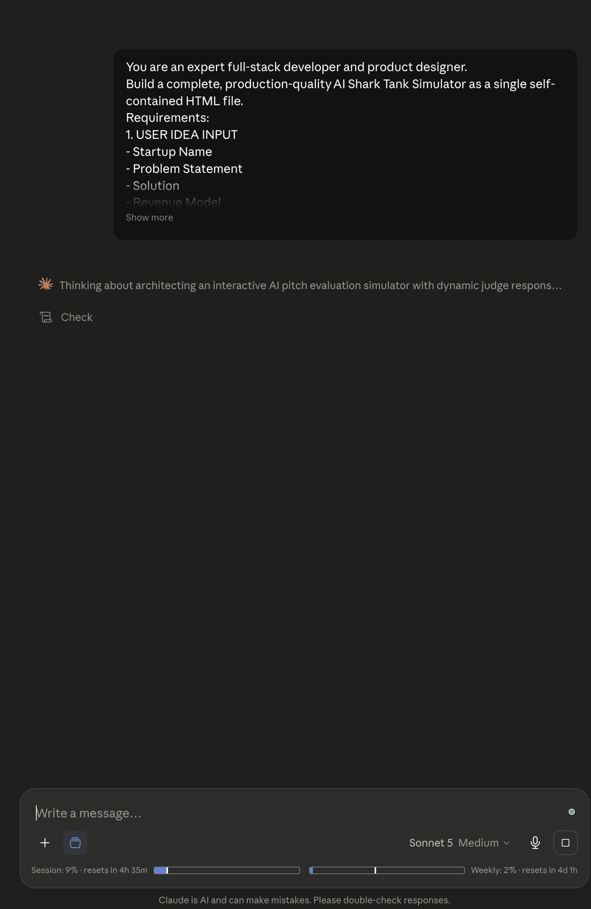

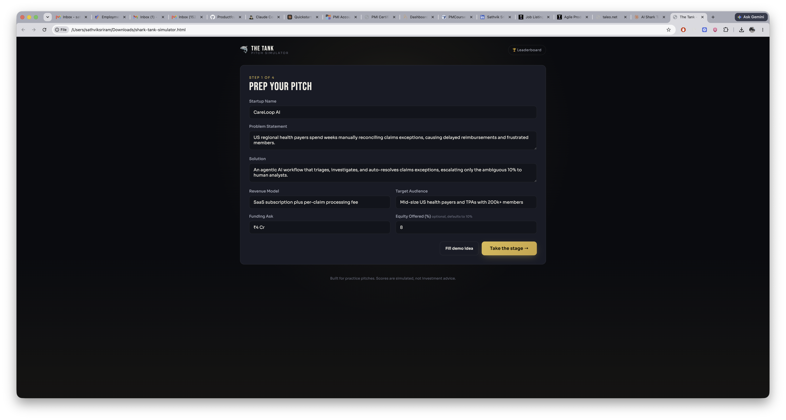

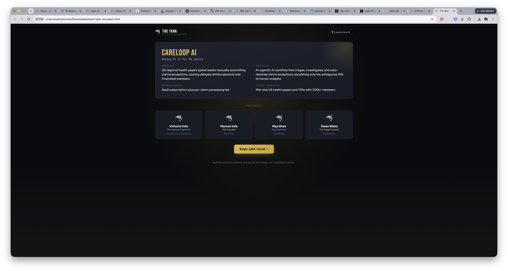

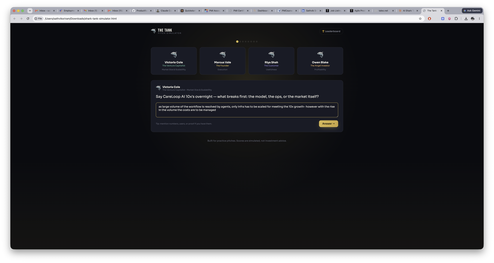

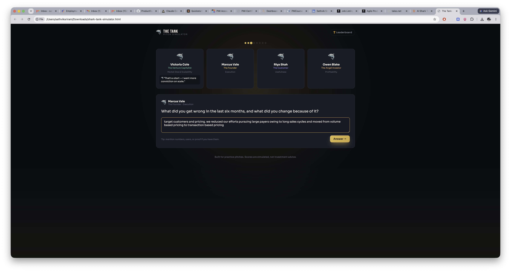

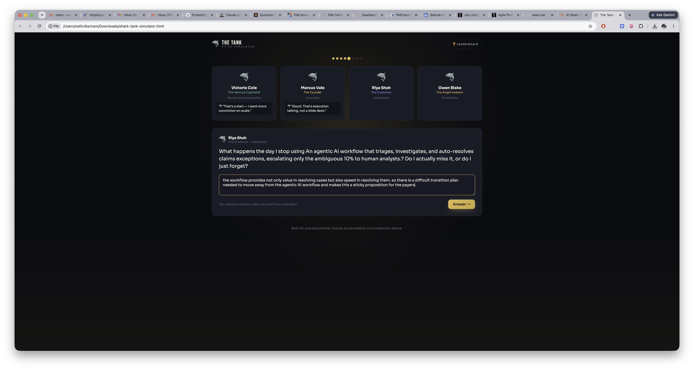

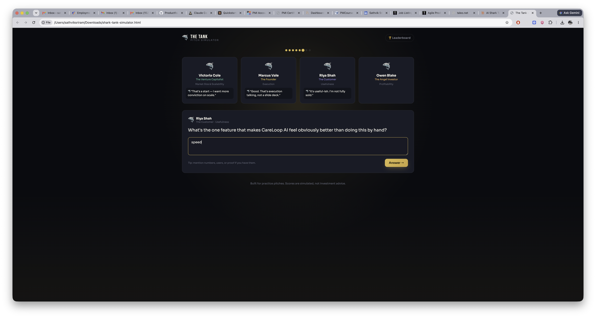

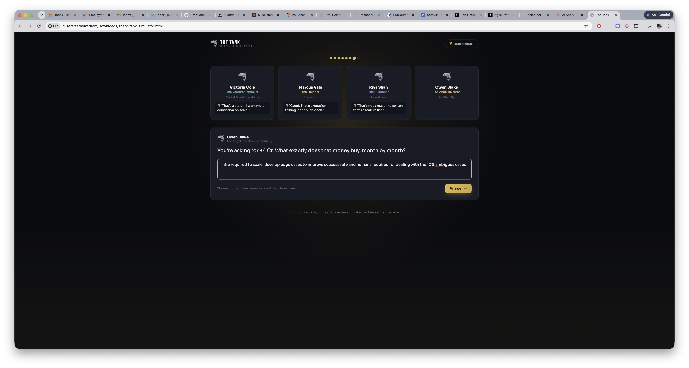

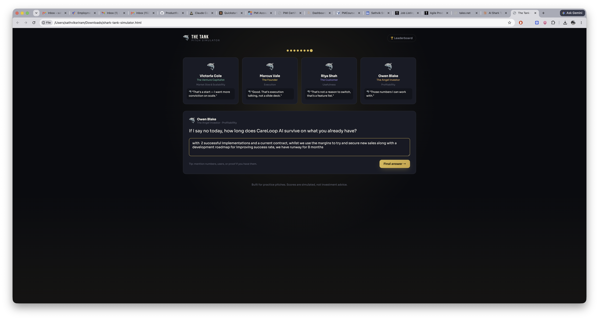

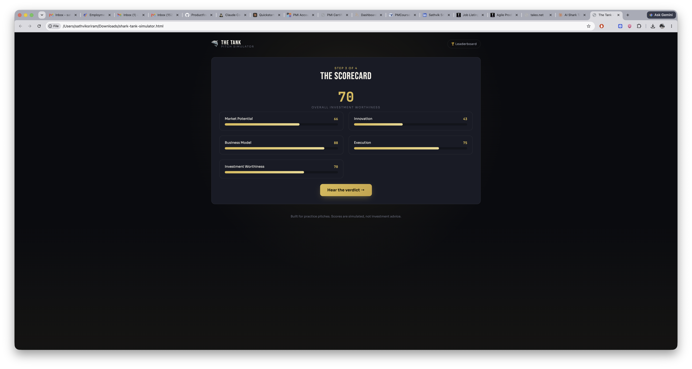

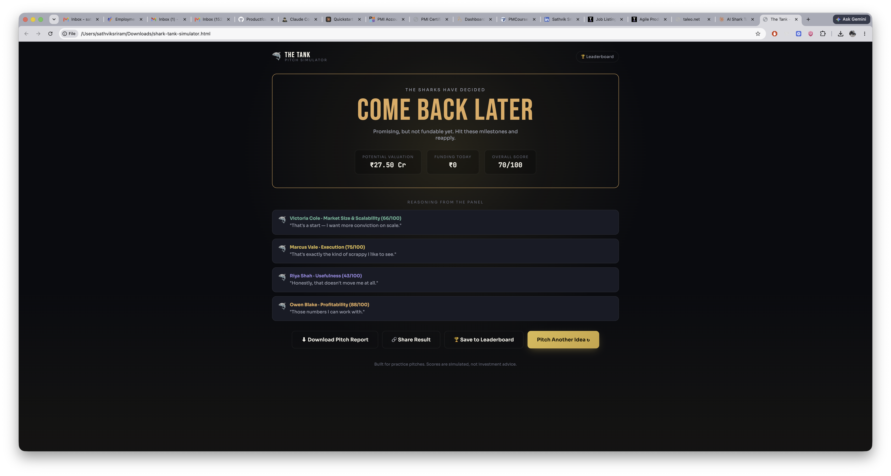

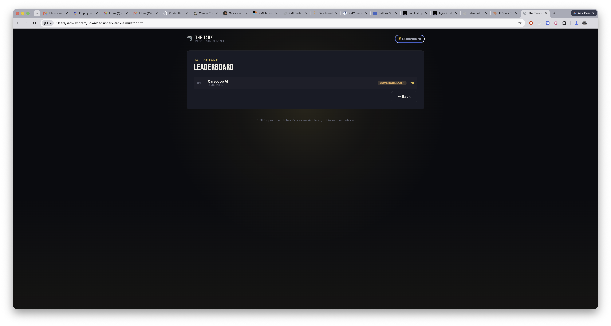
