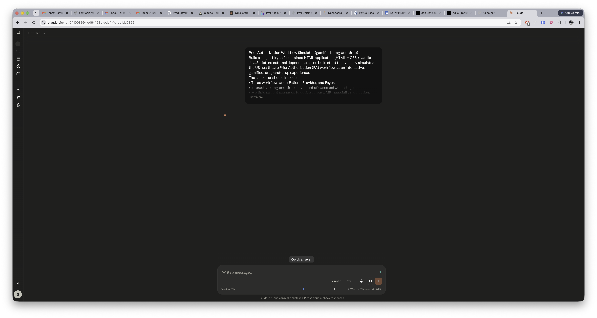
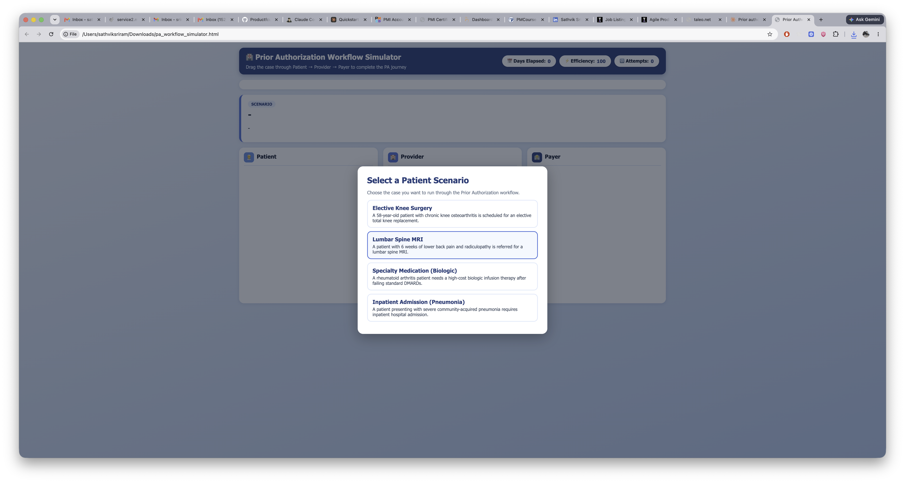
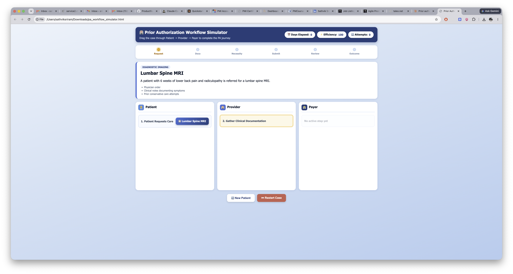
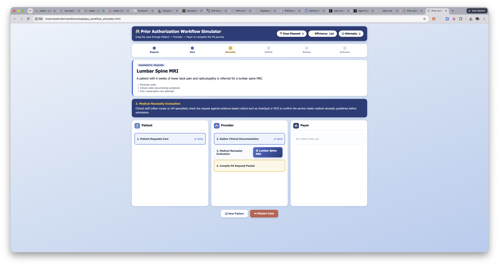
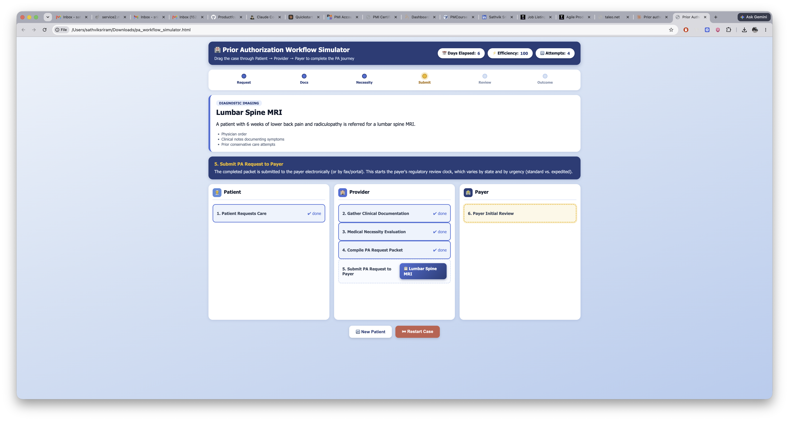
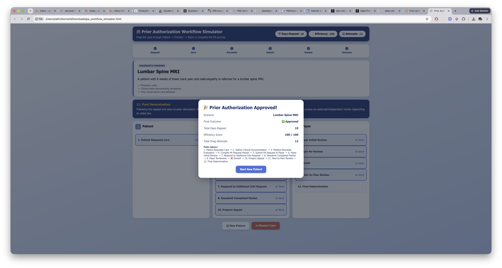

# Day 26

## Prompt

Prior Authorization Workflow Simulator (gamified, drag-and-drop)

Build a single-file, self-contained HTML application (HTML + CSS + vanilla JavaScript, no external dependencies, no build step) that visually simulates the US healthcare Prior Authorization (PA) workflow as an interactive, gamified, drag-and-drop experience.

The simulator should include:

• Three workflow lanes: Patient, Provider, and Payer.
• Interactive drag-and-drop movement of cases between stages.
• Multiple patient scenarios (elective surgery, MRI, specialty medication, inpatient admission).
• Medical necessity evaluation.
• Prior Authorization document collection.
• Submission to payer.
• Review outcomes including Approval, Pend, Denial, Appeal, and Peer-to-Peer Review.
• Educational explanations after every step.
• Progress tracker across the top.
• Days elapsed counter.
• Efficiency score.
• Celebration animation on approval.
• Workflow summary on completion.
• Responsive modern UI using shades of blue with black text.
• Working Restart / New Patient button.
• Fully functional buttons and interactions.

Technical Requirements:

* Single HTML file.
* HTML, CSS and Vanilla JavaScript only.
* No frameworks.
* No CDNs.
* No localStorage.
* All workflow state managed in JavaScript memory.
* Well-commented code.
* Scenario data stored in an editable array near the top.
* Output only the complete HTML file without truncation.

## Response

Built it as a single self-contained HTML file — open it in any browser, no setup needed.

[pa_workflow_simulator](pa_workflow_simulator.html)

How it works:

* Pick one of 4 scenarios (elective surgery, MRI, specialty med, inpatient admission), each with its own docs and approval/pend/denial odds
* Drag the case card through the only lit-up (glowing) valid next step across Patient → Provider → Payer lanes
* Wrong drops shake and dock 5 efficiency points, with an explanation of the correct next step
* Correct drops trigger a real workflow branch: payer review can resolve to Approval, Pend (→ resubmit → re-review), or Denial (→ appeal → peer-to-peer → final decision) — outcomes are randomized per scenario's weighting
* Top bar tracks Days Elapsed, Efficiency Score, and Attempts; progress tracker shows milestone completion
* Approval triggers confetti; either outcome ends in a full summary modal with path taken, days, score, and attempts
* "New Patient" resets to scenario picker; "Restart Case" replays the same scenario from scratch

All in vanilla HTML/CSS/JS, no dependencies, state lives in memory only (no localStorage).

## Screenshot

