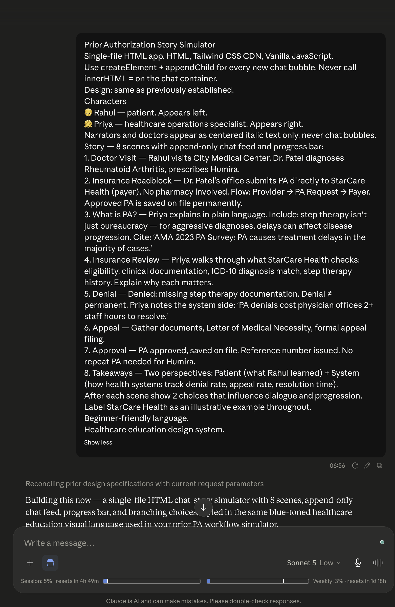
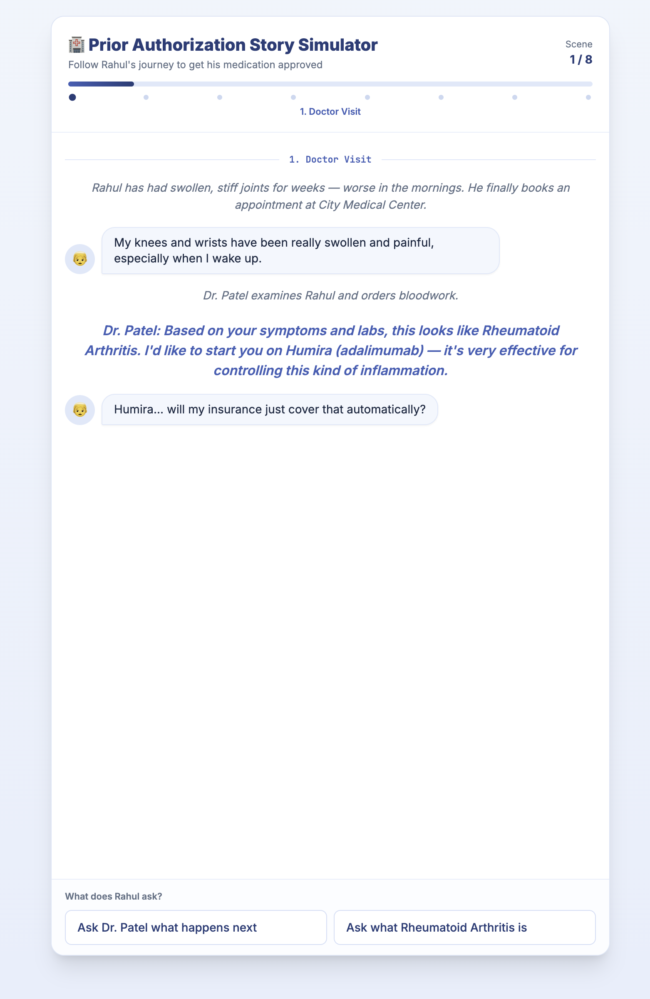
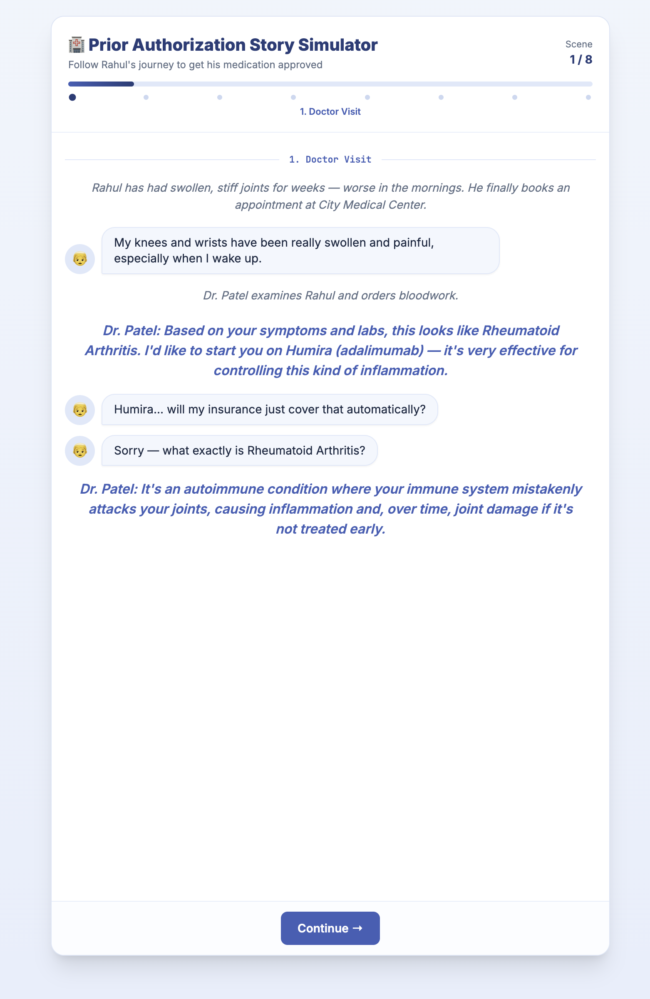
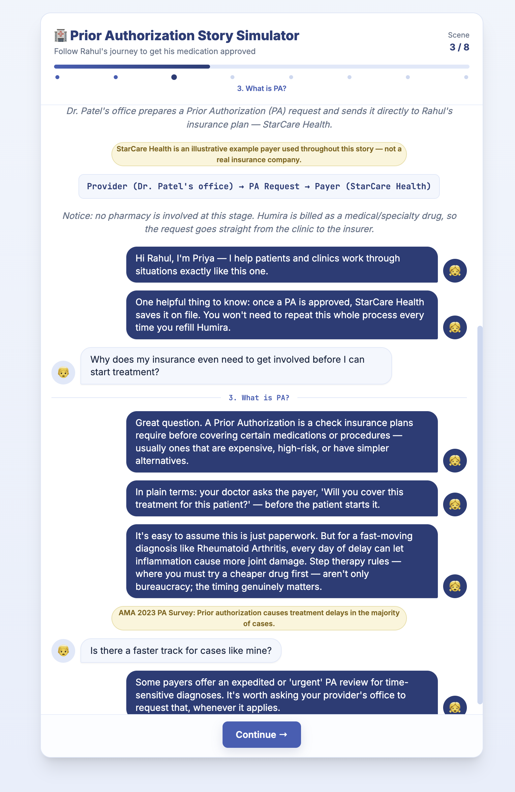
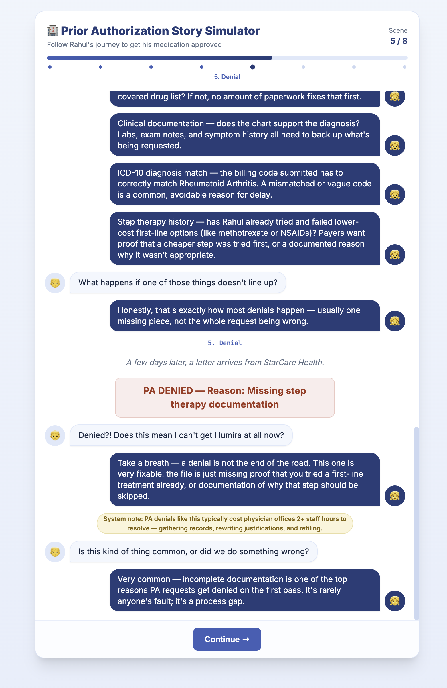
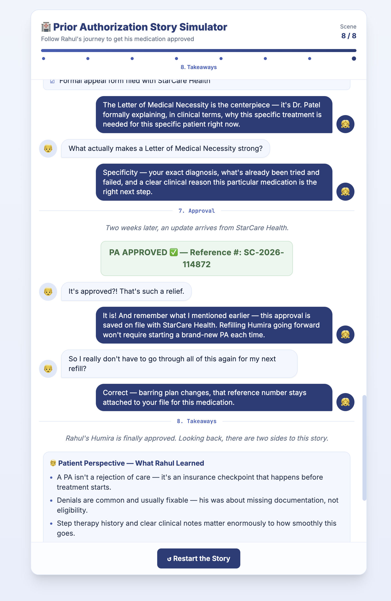
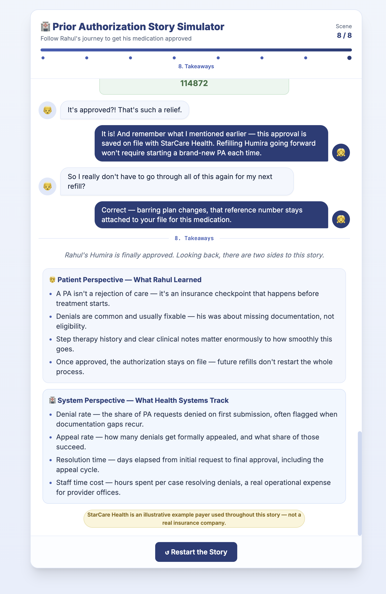

# Day 27

## Prompt

Prior Authorization Story Simulator

Single-file HTML app. HTML, Tailwind CSS CDN, Vanilla JavaScript.
Use createElement + appendChild for every new chat bubble. Never call innerHTML = on the chat container.
Design: same as previously established.

Characters
👦 Rahul — patient. Appears left.
👧 Priya — healthcare operations specialist. Appears right.
Narrators and doctors appear as centered italic text only, never chat bubbles.

Story — 8 scenes with append-only chat feed and progress bar:

1. Doctor Visit — Rahul visits City Medical Center. Dr. Patel diagnoses Rheumatoid Arthritis, prescribes Humira.

2. Insurance Roadblock — Dr. Patel's office submits PA directly to StarCare Health (payer). No pharmacy involved. Flow: Provider → PA Request → Payer. Approved PA is saved on file permanently.

3. What is PA? — Priya explains in plain language. Include: step therapy isn't just bureaucracy — for aggressive diagnoses, delays can affect disease progression. Cite: 'AMA 2023 PA Survey: PA causes treatment delays in the majority of cases.'

4. Insurance Review — Priya walks through what StarCare Health checks: eligibility, clinical documentation, ICD-10 diagnosis match, step therapy history. Explain why each matters.

5. Denial — Denied: missing step therapy documentation. Denial ≠ permanent. Priya notes the system side: 'PA denials cost physician offices 2+ staff hours to resolve.'

6. Appeal — Gather documents, Letter of Medical Necessity, formal appeal filing.

7. Approval — PA approved, saved on file. Reference number issued. No repeat PA needed for Humira.

8. Takeaways — Two perspectives: Patient (what Rahul learned) + System (how health systems track denial rate, appeal rate, resolution time).

After each scene show 2 choices that influence dialogue and progression.
Label StarCare Health as an illustrative example throughout.
Beginner-friendly language.
Healthcare education design system.

## Response

Building this now — a single-file HTML chat-story simulator with 8 scenes, append-only chat feed, progress bar, and branching choices, styled in the same blue-toned healthcare education visual language used in your prior PA workflow simulator.JS syntax checks out. Copying to outputs.All 8 scenes are built with an append-only chat feed (createElement/appendChild only — no innerHTML on the chat container), a progress bar with per-scene dots, and two branching choices after each scene that add a short reaction before advancing. Narrator and Dr. Patel lines are centered italic text; Rahul (left, 👦) and Priya (right, 👧) use chat bubbles. StarCare Health is flagged as an illustrative example on its first mentions, the AMA 2023 stat and the "2+ staff hours" system note are both included, and Scene 8 closes with side-by-side Patient vs. System takeaway cards plus a restart button.

[prior-authorization-story-simulator](prior-authorization-story-simulator.html)

## Screnshot

