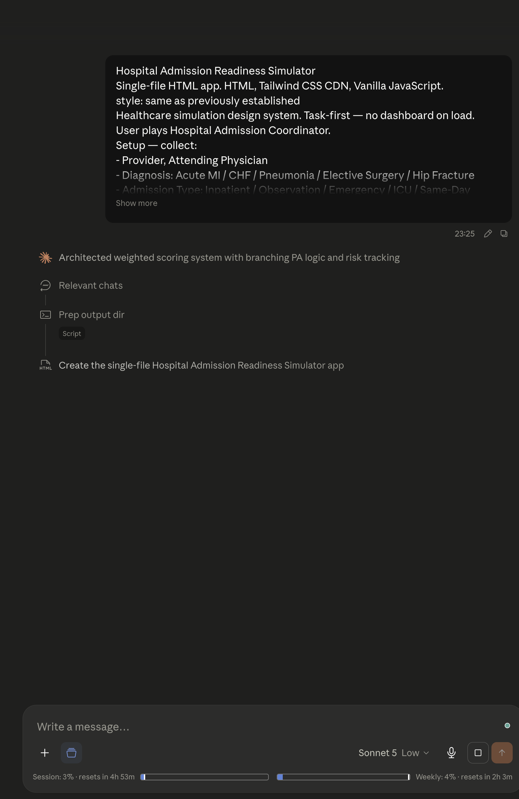
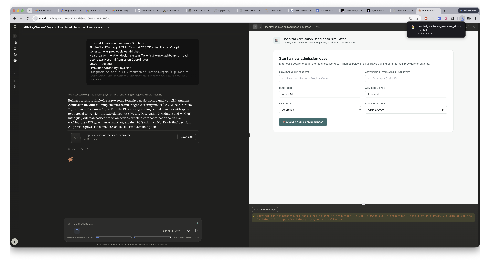
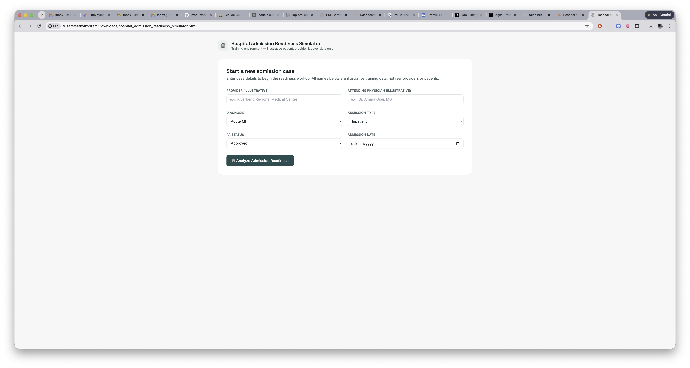
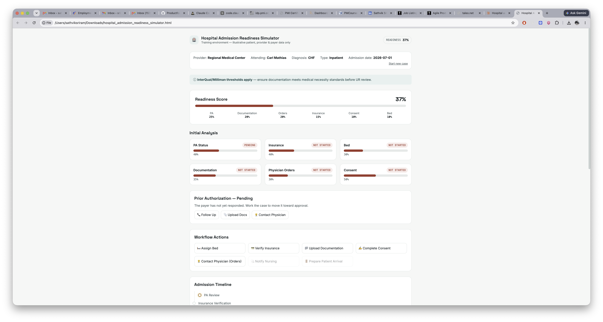
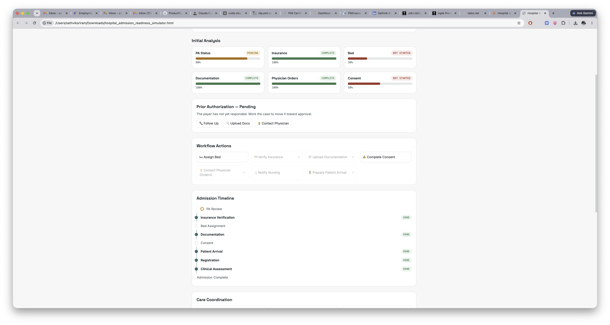
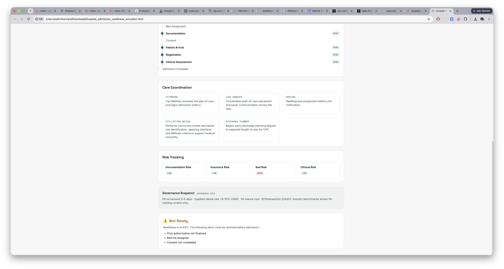

# Day 28

## Prompt

Hospital Admission Readiness Simulator

Single-file HTML app. HTML, Tailwind CSS CDN, Vanilla JavaScript.
style: same as previously established
Healthcare simulation design system. Task-first — no dashboard on load.
User plays Hospital Admission Coordinator.

Setup — collect:

- Provider, Attending Physician
- Diagnosis: Acute MI / CHF / Pneumonia / Elective Surgery / Hip Fracture
- Admission Type: Inpatient / Observation / Emergency / ICU / Same-Day Surgery
- PA Status, Admission Date

Observation Status must always show: 'CMS 2-Midnight Rule applies — different cost-sharing, SNF eligibility, and billing than inpatient. Medicare patients require written MOON notification.'
Label all provider/payer names as illustrative training data.

Button: 🏥 Analyze Admission Readiness

Initial Analysis
Generate status for: PA, Insurance, Bed, Documentation, Physician Orders, Consent.
Readiness Score 30–60%. Do not reveal final decision yet.

Score Weighting:
PA Status 25% · Clinical Documentation 20% · Physician Orders 20% · Insurance 15% · Consent 10% · Bed 10%
Denied PA + ICU admission cannot reach 70% from admin tasks alone.

PA Branches:
Approved → continue.
Pending → Follow Up, Upload Docs, Contact Physician.
Denied → Review Reason, Contact Insurance, Submit Appeal.
Successful appeal converts to Approved.

Workflow Actions:
Assign Bed / Verify Insurance / Upload Documentation / Complete Consent / Contact Physician / Notify Nursing / Prepare Patient Arrival

Acute MI and CHF trigger a criteria note:
'InterQual/Milliman thresholds apply — ensure documentation meets medical necessity standards before UR review.'

Timeline milestones:
PA Review → Insurance Verification → Bed Assignment → Documentation → Consent → Patient Arrival → Registration → Clinical Assessment → Admission Complete

Care Coordination Cards:
Attending / Case Manager / Nursing / Utilization Review / Discharge Planner
UR card must name: concurrent review, denial risk identification, InterQual, Milliman.

Risk Tracking:
Documentation Risk / Insurance Risk / Bed Risk / Clinical Risk
Clinical Risk weighted higher for Acute MI, CHF, ICU.

At Readiness ≥ 75% show Governance Snapshot:
'Industry benchmarks (estimates only): PA turnaround 3–5 days · Inpatient denial rate ~8–10% (CMS) · PA rework cost ~$11/transaction (CAQH)'

Final Decision:
≥ 90% → ✅ Admit — full summary.
< 90% → ⚠ Not Ready — missing items, required actions, remaining risks.

## Response

Built as a task-first single-file app — setup form first, no dashboard until you click **Analyze Admission Readiness**. It implements the full weighted scoring model (PA 25/Doc 20/Orders 20/Insurance 15/Consent 10/Bed 10), the PA approve/pending/denied branches with appeal-to-approval conversion, the ICU+denied-PA 69% cap, Observation 2-Midnight and MI/CHF InterQual/Milliman notices, workflow actions, timeline, care coordination cards, risk tracking, the ≥75% governance snapshot, and the ≥90% Admit vs. Not Ready final decision. All provider/physician names are labeled illustrative training data.

[hospital_admission_readiness_simulator](hospital_admission_readiness_simulator.html)

## Screenshot

