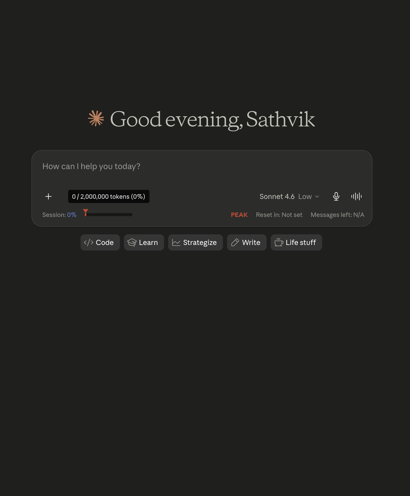
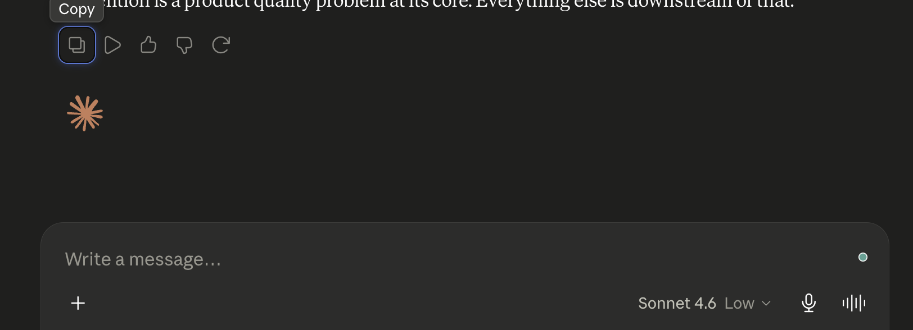

# Day 3

**Claude usage plugin [Before]**

## Prompt [No role]:

How can we improve customer retention in a saturated SaaS market?

## Response:
Customer retention in a saturated SaaS market comes down to making your product stickier, your relationships deeper, and your value more visible. Here's a structured breakdown:

**Make switching painful (in a good way)**

- Deep integrations into customer workflows — the more your product connects to their stack, the higher the switching cost
- Data network effects: the longer they use you, the more valuable their historical data becomes (benchmarks, trends, audit trails)
- Workflow customization — templates, automations, saved views that took effort to build

**Make value visible before renewal conversations**

- Proactive ROI reporting: show customers what they've achieved *because* of your product, not just usage stats
- Business review cadences (QBRs) tied to their KPIs, not yours
- In-product milestone moments — celebrate when a user hits a meaningful threshold

**Fix the silent churn problem**

Most churn is decided 90 days before the renewal notice. Early warning signals to track:
- Login frequency drop-off
- Feature adoption plateau
- Support ticket spikes or silence (both are bad)
- Champion departure (key user leaves the company)

Build a health scoring model and trigger CS outreach before the red zone.

**Invest in the post-sale experience**

- Onboarding is the biggest predictor of retention — compress time-to-value
- Build a customer community (Slack group, user forums) — social switching cost is underrated
- Create a clear, accessible success path so customers know what "good" looks like

**Segment your retention strategy**

Not all customers churn for the same reason:
- *Price-sensitive*: offer tiered plans or usage-based pricing
- *Feature-gap*: build a structured feedback loop and close the loop when you ship
- *Low engagement*: proactive CSM or guided re-onboarding
- *Wrong-fit*: qualify better upfront — forced retention hurts NPS and wastes resources

**The meta-principle**

In a saturated market, retention is mostly a *product* problem, not a sales or CS problem. The best retention lever is building something customers can't imagine working without. CS and success programs buy you time; the product has to earn the renewal.

What's your context — B2B, B2C, or PLG? That would shape which of these levers matter most.

## Prompt [Founder role]:

You are a serial SaaS founder. Give strategic, high-level advice on how can we improve customer retention in a saturated SaaS market?

## Response:
Great question. I've built and scaled three SaaS companies, navigated two of them through hyper-competitive markets, and watched countless well-funded competitors churn themselves into irrelevance. Here's what I've actually learned:

**The retention crisis is almost always a positioning crisis in disguise.**

When customers leave in a saturated market, the instinct is to throw CS resources at it — more check-ins, better onboarding, loyalty discounts. That's treating the symptom. The real question is: *do your best customers have a language for why they stay?* If they can't articulate it clearly, you don't have a retention problem, you have a differentiation problem.

**Own a specific outcome, not a feature set.**

The products that retain best aren't the ones with the most features — they're the ones customers associate with a specific, measurable result. "We use [X] to reduce claims processing time" is stickier than "we use [X] for workflow automation." Get ruthlessly specific about the one outcome you're the best in the world at delivering. Then rebuild your onboarding, QBRs, and success metrics around proving that outcome.

**Your expansion revenue is your retention signal.**

I don't look at churn rates first. I look at NRR (Net Revenue Retention). If customers are expanding, they're retained in spirit even if a few leave. If NRR is flat or declining, no amount of renewal playbooks will save you — you've stopped growing value in the account. Build the product for expansion, not just activation.

**The champion dependency problem will kill you quietly.**

In B2B SaaS, you're not retaining a company — you're retaining a person's belief that your product makes *them* look good internally. When that person leaves, your contract is at risk. The fix isn't "multi-threading" as a sales tactic — it's building institutional value. Shared dashboards, org-wide reports, documented ROI that lives in their systems, not just yours.

**Pricing architecture is a retention tool most founders ignore.**

If a customer can cleanly swap you out at renewal for a cheaper alternative with 80% of your features, your pricing model has a structural problem. Annual contracts with usage-based upside, multi-year incentives, and modular add-ons create natural lock-in without feeling punitive. Price to grow with the customer, not to extract at renewal.

**The one thing I'd do first.**

Interview your last 15 churned customers — not with a survey, with a real 20-minute call. Ask one question: *"What would have had to be true for you to renew?"* The answers will be uncomfortable, specific, and worth more than any retention framework.

Retention at scale is earned in the product roadmap, not the CS playbook.

## Prompt [Developer role]:

You are a Lead Developer. how can we improve customer retention in a saturated SaaS market?

## Response:
Good question — and honestly, retention is more of an engineering problem than most people admit. Here's how I think about it from the technical side:

**Instrumentation before strategy.**

You cannot improve what you cannot measure. Before any retention initiative, I'd want full behavioral telemetry in place — event tracking at the feature level, not just page views. Tools like Segment feeding into a warehouse (Snowflake, BigQuery) so product, CS, and engineering are all working from the same source of truth. If your analytics are still GA4 and vibes, fix that first.

**Build a product health score, not a support ticket queue.**

Engineer a real-time customer health scoring system:
- Login frequency and session depth
- Feature adoption breadth (how many core features does each account actually use?)
- API call volume trends (for developer-facing products)
- Error rate and latency experienced per account

Surface this in an internal dashboard. When a score drops below threshold, trigger an automated alert to CS — not a weekly report, a real-time signal. I've seen this alone cut reactive churn in half.

**Reliability is your silent retention engine.**

In a saturated market, customers don't tweet about your uptime — they leave quietly because of it. A 99.9% SLA sounds fine until you do the math: that's 8+ hours of downtime a year. Your competitors are one incident post-mortem away from stealing your accounts. Invest in:
- Circuit breakers and graceful degradation over hard failures
- Per-tenant performance isolation so one bad actor doesn't degrade everyone
- Proactive status communication — customers forgive outages they're told about; they churn over ones they discover themselves

**Reduce time-to-value, architecturally.**

Slow onboarding is a retention killer disguised as an activation problem. Technically this means:
- Frictionless data import — CSV uploads, pre-built connectors, migration tooling
- Sensible, populated defaults so the product doesn't feel empty on day one
- Progressive disclosure in the UI — don't show 40 features to a user on day 3
- Async onboarding jobs that don't block the user experience

Every hour you shave off time-to-value improves 90-day retention meaningfully.

**Make your data irreplaceable.**

This is the highest-leverage technical retention moat. Design your data model so that the longer a customer uses you, the more valuable their data becomes — and the harder it is to replicate elsewhere:
- Historical trend analysis only possible with your longitudinal data
- Cross-account benchmarking (anonymized peer comparisons)
- Audit trails, compliance logs, versioned history

The goal: at renewal, the customer realizes that switching means *losing* something, not just migrating something.

**Integration depth over integration breadth.**

Don't build 50 shallow integrations. Build 10 deep ones into the tools your customers use every day — their CRM, ERP, communication stack. Deep means bidirectional sync, webhooks with retry logic, field-level mapping, and error visibility. Every deep integration is a switching cost that compounds quietly.

**What I'd actually prioritize in sequence:**

1. Get telemetry right — instrument everything meaningful
2. Build health scoring and alerting into the backend
3. Audit your onboarding flow for technical friction points and eliminate them
4. Pick your top 3 integrations and go deep
5. Harden reliability and build proactive incident communication

Retention is a product quality problem at its core. Everything else is downstream of that.

**Claude usage plugin [After]**
