# Day 31

## Prompt

Act as an expert Product Designer, Operations Consultant, UX Designer, and Frontend Developer.

Build a complete interactive web application called:

## AI Supply Chain Control Tower

The goal is to simulate the experience of being the Head of Operations in a global supply chain company.

The entire project must be contained inside ONE self-contained HTML file using HTML, CSS, and vanilla JavaScript only.

Do NOT use React, Vue, Angular, Tailwind, Bootstrap, external libraries, APIs, or backend services.

Everything should work offline after opening the HTML file.

--------------------------------------------------

THEME

--------------------------------------------------

Create a premium dark Operations Control Center inspired by modern logistics dashboards.

Use:

• Dark background
• Blue and cyan highlights
• Red warning alerts
• Green success indicators
• Orange medium priority alerts

Animated glowing cards

Modern dashboard layout

Professional typography

Smooth transitions

--------------------------------------------------

GAMEPLAY

--------------------------------------------------

The player becomes:

Head of Operations

A stream of operational alerts appears.

The player must decide which issue to solve first.

Every decision changes business KPIs.

The goal is to maximize operational performance before time runs out.

--------------------------------------------------

KPIs

--------------------------------------------------

Display these live metrics at the top:

Service Level %

Customer Satisfaction

Inventory Health

Transportation Efficiency

Operating Cost

Revenue Protected

Score

Remaining Time

--------------------------------------------------

ALERT TYPES

--------------------------------------------------

Randomly generate alerts like:

🚨 Port Congestion

🚨 Supplier Delay

🚨 Truck Breakdown

🚨 Warehouse Running Out of Stock

🚨 Customs Inspection

🚨 Demand Spike

🚨 Factory Machine Failure

🚨 Weather Disruption

🚨 Wrong Inventory Count

🚨 Damaged Shipment

Each alert should include:

Title

Short description

Priority

Time remaining

Business impact

--------------------------------------------------

PLAYER ACTIONS

--------------------------------------------------

Each alert should provide action buttons such as:

Expedite Shipment

Use Backup Supplier

Reroute Trucks

Increase Production

Transfer Inventory

Approve Air Freight

Ignore

Delay Decision

Each action should have different consequences.

--------------------------------------------------

GAME LOGIC

--------------------------------------------------

Choosing the best action:

Increase score

Improve KPIs

Reduce future risk

Wrong decisions should:

Reduce KPIs

Increase operating cost

Lower customer satisfaction

Some decisions should have delayed consequences after several seconds.

--------------------------------------------------

DIFFICULTY

--------------------------------------------------

Game lasts 3 minutes.

As time progresses:

More alerts appear.

Alert frequency increases.

Multiple alerts stay active simultaneously.

--------------------------------------------------

VISUALS

--------------------------------------------------

Include:

Animated KPI cards

Live scrolling event log

Countdown timer

Priority color coding

Small pulse animation for critical alerts

Hover effects

Professional dashboard layout

--------------------------------------------------

END OF GAME

--------------------------------------------------

When time ends show:

Final Score

Performance Grade

(A+, A, B, C, D)

Final KPI values

Total Alerts Resolved

Correct Decisions

Wrong Decisions

A short operational summary based on performance.

Include a Play Again button.

--------------------------------------------------

EXTRA FEATURES

--------------------------------------------------

Add:

Sound toggle (visual only, no audio required)

Pause button

Help / Instructions modal

Responsive layout for desktop and mobile

--------------------------------------------------

CODE QUALITY

--------------------------------------------------

Write clean, well-commented code.

Keep CSS organized.

Keep JavaScript modular using functions.

Everything must remain inside ONE HTML file.

Return only the complete HTML document.

## Response

I'm planning out the design tokens for this single-file HTML game — going with a dark navy background, darker panels, bright cyan accents, and red/orange for alerts, then building the whole thing in one go with careful structure.
Since external resources aren't allowed and everything needs to work offline, I'll stick with system fonts instead of Google Fonts — using a technical-feeling system stack with letter-spacing for headers and monospace for data. The layout will have a top bar with title and timer, a strip of seven KPI cards, then split the main area between an alert feed on the left and an event log sidebar on the right, with animated radar sweep glows and scanline effects on critical alerts for that signature technical look.
I'm planning out the game mechanics now — tracking eight KPIs (service level, CSAT, inventory health, transport efficiency, operating cost, revenue protected, score, and countdown timer), then defining the ten alert types that will trigger throughout the simulation.
Each alert will have a title, icon, description, priority level, and a countdown timer, along with text describing the business impact and which KPIs it affects. For actions, I'm building a data-driven system where each alert type has multiple response options — some are optimal, others mediocre or poor — plus generic Ignore and Delay actions that are always available but carry negative consequences. Each action will have specific effects on the KPIs, cost, and score to make the decision-making meaningful.
I'm also implementing delayed consequences, so if a player chooses to delay, the alert will re-evaluate after a few seconds with further KPI degradation or auto-resolution. The difficulty ramps up over time as the spawn interval decreases from about 6 seconds down to 2 seconds, and multiple alerts will be active simultaneously on screen. When an alert's countdown expires without action, it auto-resolves as unresolved — the worst outcome for its KPIs. The scoring system rewards the best action with 100–150 points.
Now I'm defining the scoring tiers: good decisions earn around 50 points, poor ones get 10, bad or ignored alerts lose 30 points with KPI drops, and unresolved timeouts incur a -50 penalty with steeper KPI degradation. The final grade will be based on score thresholds and average KPI performance.
Defining the alert data structure...
Adding more actions... down 🚚 — Reroute Trucks(best), Expedite Shipment(good), Transfer Inventory(poor)
4. Warehouse Stockout 📦 — Transfer Inventory(best), Increase Production(good), Use Backup Supplier(poor)
5. Customs Inspection 🛃 — Expedite Shipment(best), Approve Air Freight(good), Reroute Trucks(poor)
6. Demand Spike 📈 — Increase Production(best), Transfer Inventory(good), Approve Air Freight(poor)
7. Factory Machine Failure ⚙️ — Use Backup Supplier(best), Expedite Shipment(good), Transfer Inventory(poor)
8. Weather Disruption 🌧️ — Approve Air Freight(best), Reroute Trucks(good), Expedite Shipment(poor)
9. Quality Control Issue 🔍 — Increase Production(best - shift to backup line), Use Backup Supplier(good), Transfer Inventory(poor)
10. Inventory Mismatch 📊 — Transfer Inventory(best), Increase Production(good), Use Backup Supplier(poor)
Now I'm setting up the action scoring system. Each action gets a base score depending on its tier (best +15, good +8, poor -5), then I'll apply outcome modifiers based on what happens after the user picks it. I need to track both immediate effects and delayed consequences to make the scoring feel realistic.
Continuing to flesh out the alert types and their corresponding actions, making sure each one has thematically appropriate responses that reflect real supply chain trade-offs. Writing component styles...
I'm defining the typography system with display headings using a heavy system font stack and uppercase letter-spacing to evoke control-tower aesthetics, while data uses monospace fonts. The header will feature a rotating conic-gradient radar sweep effect in the background, and critical alert cards get a pulsing red scan-line border animation. For the layout, I'm structuring the header with the title and subtitle on the left, and controls on the right including a large countdown timer, pause button, sound toggle, help button, and play/restart option.
Below that comes a KPI strip with seven cards showing labels, large numbers, and trend indicators. The main content area splits into a wider left column for the active alerts feed and a narrower right column for a live scrolling event log. Each alert card displays an icon, title, priority badge, description, impact information, a countdown progress bar, and action buttons. I'm also planning modal overlays for the start screen with an intro and start button, an end screen showing final score with a letter grade, KPI values, resolution stats, and a play-again button, plus a reusable help modal.
Setting up the JavaScript state object... Writing game logic... I'm setting up the timer display to change color based on health status—green for normal, orange for warning, red for critical—and adding a pulsing animation when time drops below 20 seconds. For pause/resume, I'm using a simple flag that stops the countdown without losing progress, then implementing the end game sequence to calculate a final grade from the score and average KPI values, displaying results in a modal with performance-based summary text.
Now I'm defining the grading scale where scores of 1800+ earn an A+, down to a D for anything below 600, but also factoring in the average KPI so that anything under 50 downgrades the grade by one level. The difficulty ramps up over time—spawn intervals shrink from 6 seconds down to 1.5 seconds across the game, and the maximum concurrent alerts increase from 3 to 6 as time progresses. I'm also tracking an event log that records each action with timestamps and color-codes them by outcome, keeping it capped at 50 entries, and making sure the interface adapts to mobile screens with stacked layouts.
Writing the full implementation... Writing component markup...
I'm styling the interface with a radar sweep animation using conic gradients and a grid pattern backdrop, then defining the action types and alert categories with their associated effects on key metrics like service level, customer satisfaction, inventory health, and transport efficiency.
Now I'm setting up the financial model where operating costs start at a $100,000 baseline and can fluctuate between $80k and $160k depending on decisions, while protected revenue grows from zero up to $150k as good outcomes accumulate, with cost deltas working inversely—negative values reduce costs (good) and positive values increase them (bad).
Defining effects per alert type...
each gets three tailored actions plus universal options like ignoring (which costs $3,000 and loses 30 points across all KPIs) or delaying (adds $1,000 cost, loses 10 points, reduces each involved KPI by 1, and extends the timer by 8 seconds).
I'm also layering in priority levels that vary randomly per spawn rather than being fixed to alert types—critical alerts get 12-18 seconds with a 1.5x score multiplier, high priority gets 18-25 seconds with 1.2x, and medium gets 25-35 seconds at standard multiplier—and each alert type needs its own business impact description and flavor text to make the scenarios feel distinct.
For spawning, I'm capping concurrent alerts at 3 initially, ramping up to 6 by the end, with a recursive scheduler that calculates spawn intervals based on elapsed time and checks whether we're under the concurrent limit before adding a new alert.
For the countdown mechanics, I'll use a single master interval ticking every 250ms that drives both the game timer and all active alert timers — each tick decrements remaining time, updates progress bars and countdown text, and resolves alerts when they hit zero. This consolidates everything into one ticker instead of spinning up separate intervals per alert.
I'm implementing resolveAlert to handle different outcomes (best, good, poor, ignore, delay-tick, timeout), apply effects scaled by priority, log colored entries, remove the card from the DOM and activeAlerts array, and track correct/wrong counts. For delay decisions specifically, I won't remove the alert immediately — instead I'll just reduce its remaining time to cap it at a lower threshold.
Now I'm writing the full code for the game mechanics. I'm also adding a sound toggle that's visual only (a speaker icon that toggles state.soundOn), a pause button that overlays the screen and disables action buttons via CSS, and a help modal with static instructions.
For grading at the end, I'm calculating the average of the four KPIs and then determining the final grade based on that average.
Writing the final HTML file...I'm planning out the design tokens for this single-file HTML game — going with a dark navy background, darker panels, bright cyan accents, and red/orange for alerts, then building the whole thing in one go with careful structure.
Since external resources aren't allowed and everything needs to work offline, I'll stick with system fonts instead of Google Fonts — using a technical-feeling system stack with letter-spacing for headers and monospace for data. The layout will have a top bar with title and timer, a strip of seven KPI cards, then split the main area between an alert feed on the left and an event log sidebar on the right, with animated radar sweep glows and scanline effects on critical alerts for that signature technical look.
I'm planning out the game mechanics now — tracking eight KPIs (service level, CSAT, inventory health, transport efficiency, operating cost, revenue protected, score, and countdown timer), then defining the ten alert types that will trigger throughout the simulation.
Each alert will have a title, icon, description, priority level, and a countdown timer, along with text describing the business impact and which KPIs it affects. For actions, I'm building a data-driven system where each alert type has multiple response options — some are optimal, others mediocre or poor — plus generic Ignore and Delay actions that are always available but carry negative consequences. Each action will have specific effects on the KPIs, cost, and score to make the decision-making meaningful.
I'm also implementing delayed consequences, so if a player chooses to delay, the alert will re-evaluate after a few seconds with further KPI degradation or auto-resolution. The difficulty ramps up over time as the spawn interval decreases from about 6 seconds down to 2 seconds, and multiple alerts will be active simultaneously on screen. When an alert's countdown expires without action, it auto-resolves as unresolved — the worst outcome for its KPIs. The scoring system rewards the best action with 100–150 points.
Now I'm defining the scoring tiers: good decisions earn around 50 points, poor ones get 10, bad or ignored alerts lose 30 points with KPI drops, and unresolved timeouts incur a -50 penalty with steeper KPI degradation. The final grade will be based on score thresholds and average KPI performance.
Defining the alert data structure...
Adding more actions... down 🚚 — Reroute Trucks(best), Expedite Shipment(good), Transfer Inventory(poor)
4. Warehouse Stockout 📦 — Transfer Inventory(best), Increase Production(good), Use Backup Supplier(poor)
5. Customs Inspection 🛃 — Expedite Shipment(best), Approve Air Freight(good), Reroute Trucks(poor)
6. Demand Spike 📈 — Increase Production(best), Transfer Inventory(good), Approve Air Freight(poor)
7. Factory Machine Failure ⚙️ — Use Backup Supplier(best), Expedite Shipment(good), Transfer Inventory(poor)
8. Weather Disruption 🌧️ — Approve Air Freight(best), Reroute Trucks(good), Expedite Shipment(poor)
9. Quality Control Issue 🔍 — Increase Production(best - shift to backup line), Use Backup Supplier(good), Transfer Inventory(poor)
10. Inventory Mismatch 📊 — Transfer Inventory(best), Increase Production(good), Use Backup Supplier(poor)
Now I'm setting up the action scoring system. Each action gets a base score depending on its tier (best +15, good +8, poor -5), then I'll apply outcome modifiers based on what happens after the user picks it. I need to track both immediate effects and delayed consequences to make the scoring feel realistic.
Continuing to flesh out the alert types and their corresponding actions, making sure each one has thematically appropriate responses that reflect real supply chain trade-offs. Writing component styles...
I'm defining the typography system with display headings using a heavy system font stack and uppercase letter-spacing to evoke control-tower aesthetics, while data uses monospace fonts. The header will feature a rotating conic-gradient radar sweep effect in the background, and critical alert cards get a pulsing red scan-line border animation. For the layout, I'm structuring the header with the title and subtitle on the left, and controls on the right including a large countdown timer, pause button, sound toggle, help button, and play/restart option.
Below that comes a KPI strip with seven cards showing labels, large numbers, and trend indicators. The main content area splits into a wider left column for the active alerts feed and a narrower right column for a live scrolling event log. Each alert card displays an icon, title, priority badge, description, impact information, a countdown progress bar, and action buttons. I'm also planning modal overlays for the start screen with an intro and start button, an end screen showing final score with a letter grade, KPI values, resolution stats, and a play-again button, plus a reusable help modal.
Setting up the JavaScript state object... Writing game logic... I'm setting up the timer display to change color based on health status—green for normal, orange for warning, red for critical—and adding a pulsing animation when time drops below 20 seconds. For pause/resume, I'm using a simple flag that stops the countdown without losing progress, then implementing the end game sequence to calculate a final grade from the score and average KPI values, displaying results in a modal with performance-based summary text.
Now I'm defining the grading scale where scores of 1800+ earn an A+, down to a D for anything below 600, but also factoring in the average KPI so that anything under 50 downgrades the grade by one level. The difficulty ramps up over time—spawn intervals shrink from 6 seconds down to 1.5 seconds across the game, and the maximum concurrent alerts increase from 3 to 6 as time progresses. I'm also tracking an event log that records each action with timestamps and color-codes them by outcome, keeping it capped at 50 entries, and making sure the interface adapts to mobile screens with stacked layouts.
Writing the full implementation... Writing component markup...
I'm styling the interface with a radar sweep animation using conic gradients and a grid pattern backdrop, then defining the action types and alert categories with their associated effects on key metrics like service level, customer satisfaction, inventory health, and transport efficiency.
Now I'm setting up the financial model where operating costs start at a $100,000 baseline and can fluctuate between $80k and $160k depending on decisions, while protected revenue grows from zero up to $150k as good outcomes accumulate, with cost deltas working inversely—negative values reduce costs (good) and positive values increase them (bad).
Defining effects per alert type...
each gets three tailored actions plus universal options like ignoring (which costs $3,000 and loses 30 points across all KPIs) or delaying (adds $1,000 cost, loses 10 points, reduces each involved KPI by 1, and extends the timer by 8 seconds).
I'm also layering in priority levels that vary randomly per spawn rather than being fixed to alert types—critical alerts get 12-18 seconds with a 1.5x score multiplier, high priority gets 18-25 seconds with 1.2x, and medium gets 25-35 seconds at standard multiplier—and each alert type needs its own business impact description and flavor text to make the scenarios feel distinct.
For spawning, I'm capping concurrent alerts at 3 initially, ramping up to 6 by the end, with a recursive scheduler that calculates spawn intervals based on elapsed time and checks whether we're under the concurrent limit before adding a new alert.
For the countdown mechanics, I'll use a single master interval ticking every 250ms that drives both the game timer and all active alert timers — each tick decrements remaining time, updates progress bars and countdown text, and resolves alerts when they hit zero. This consolidates everything into one ticker instead of spinning up separate intervals per alert.
I'm implementing resolveAlert to handle different outcomes (best, good, poor, ignore, delay-tick, timeout), apply effects scaled by priority, log colored entries, remove the card from the DOM and activeAlerts array, and track correct/wrong counts. For delay decisions specifically, I won't remove the alert immediately — instead I'll just reduce its remaining time to cap it at a lower threshold.
Now I'm writing the full code for the game mechanics. I'm also adding a sound toggle that's visual only (a speaker icon that toggles state.soundOn), a pause button that overlays the screen and disables action buttons via CSS, and a help modal with static instructions.
For grading at the end, I'm calculating the average of the four KPIs and then determining the final grade based on that average.
Writing the final HTML file...

Good, syntax checks out. Now let me copy it to outputs.A single self-contained HTML file — open it in any browser, no server or internet needed.

What's in it:

- **7 live KPIs** (Service Level, CSAT, Inventory Health, Transport Efficiency, Operating Cost, Revenue Protected, Score) with color-coded health states and flash deltas on every decision
- **10 alert types**, each with 3 tailored actions (best/good/poor) plus universal Ignore and Delay Decision options — Delay shortens the fuse and mutes future gains, Ignore is an instant penalty, and unresolved alerts auto-escalate
- **Ramping difficulty** over the 3-minute shift — spawn rate speeds up and up to 6 alerts can be active at once
- Radar-sweep header animation, pulsing critical-alert cards, scrolling event log, pause/resume, help modal, sound toggle (visual), and a full end-of-shift grade screen (A+ to D) with stats and a performance summary
- Responsive down to mobile, keyboard-focus visible, respects reduced-motion

Just open the file — no setup needed.

[ai-supply-chain-control-tower](ai-supply-chain-control-tower.html)

## Screenshot

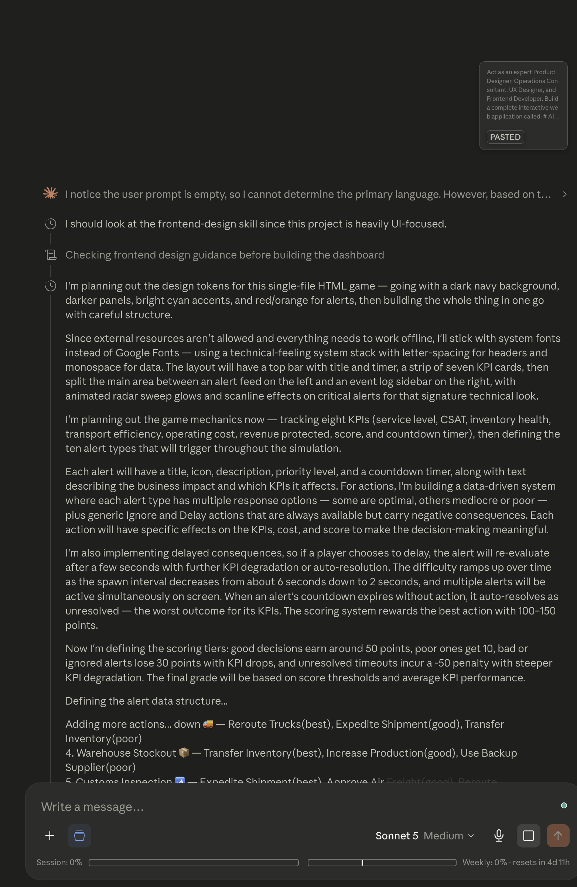

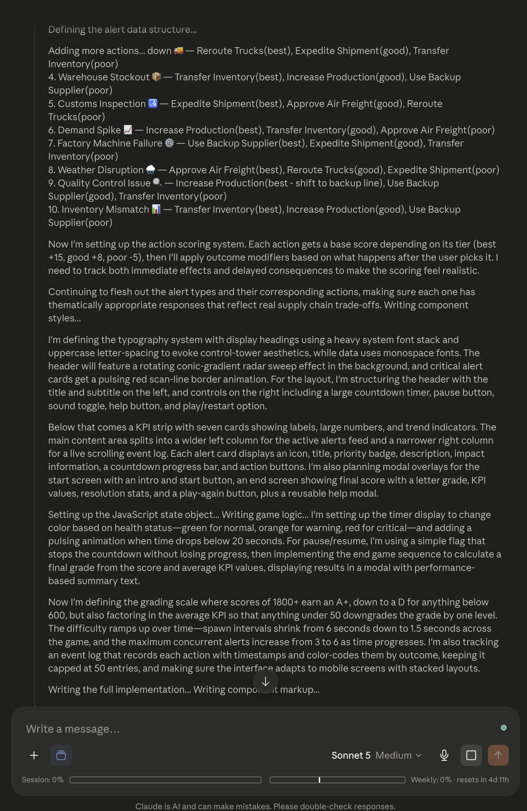

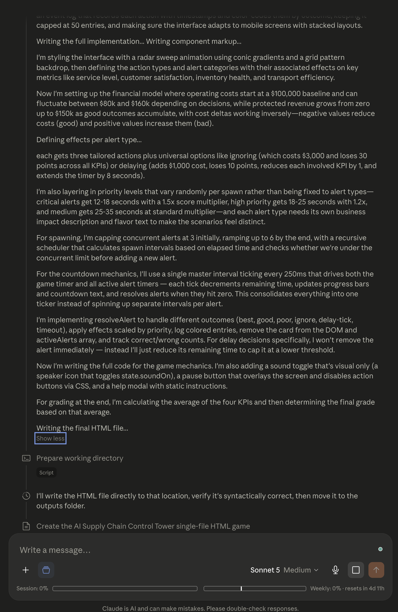

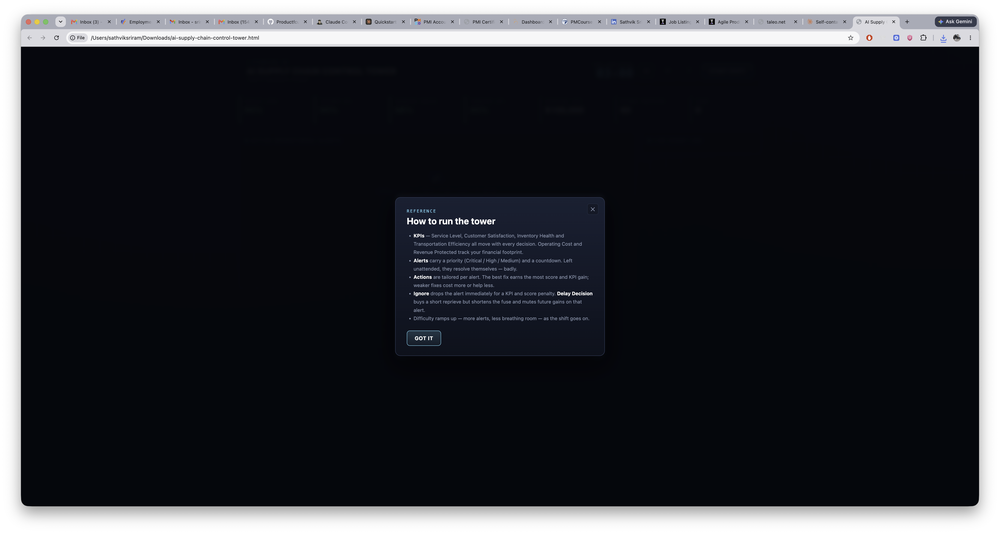.

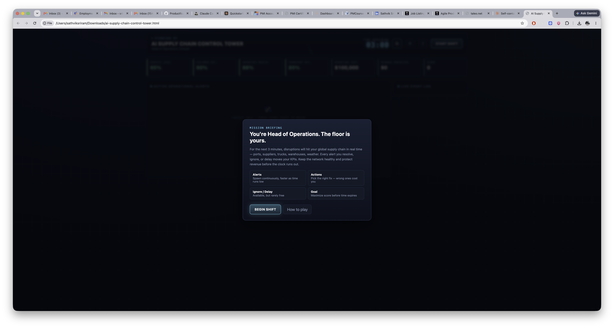

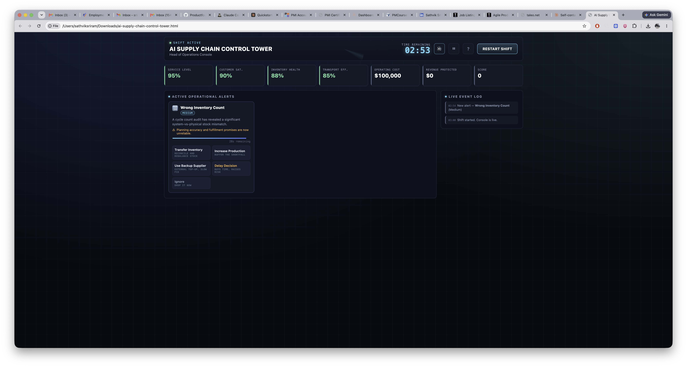

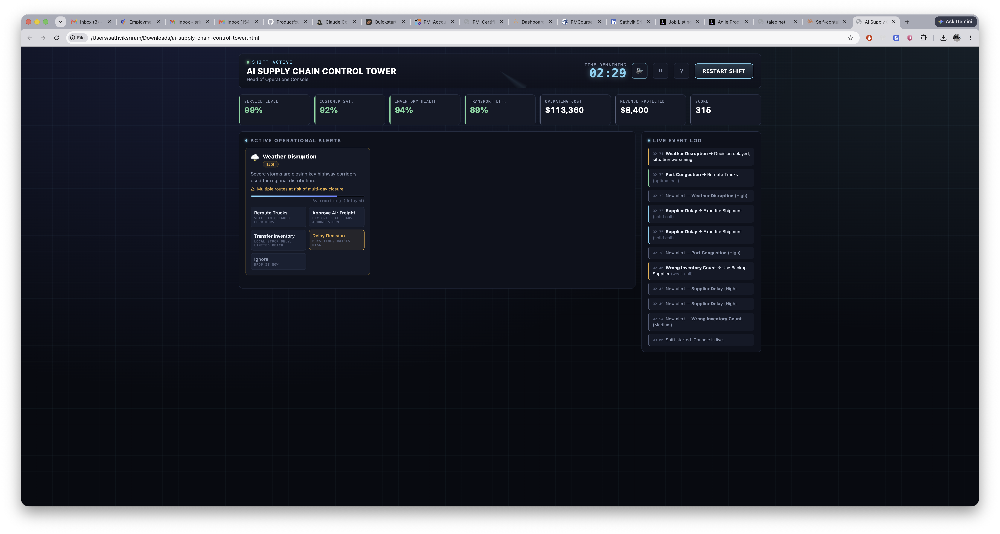

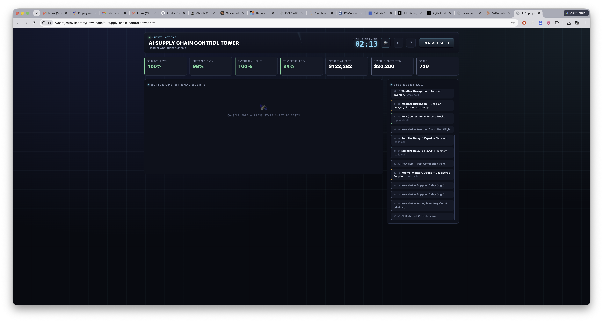

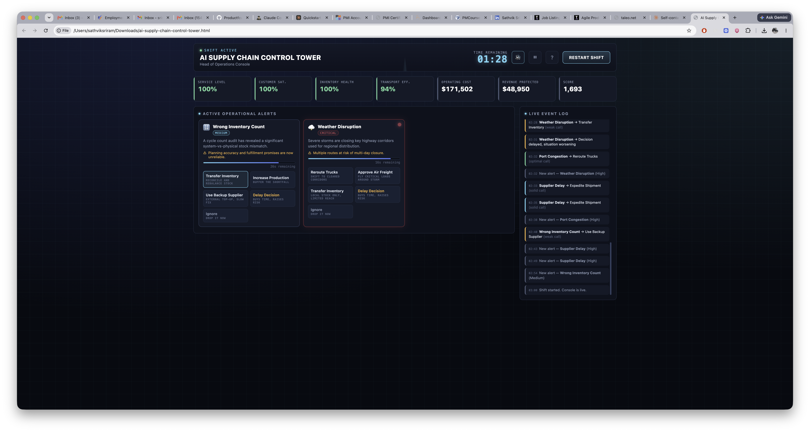

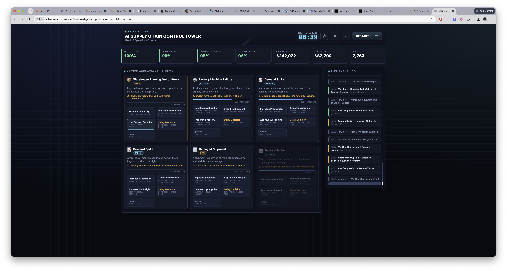

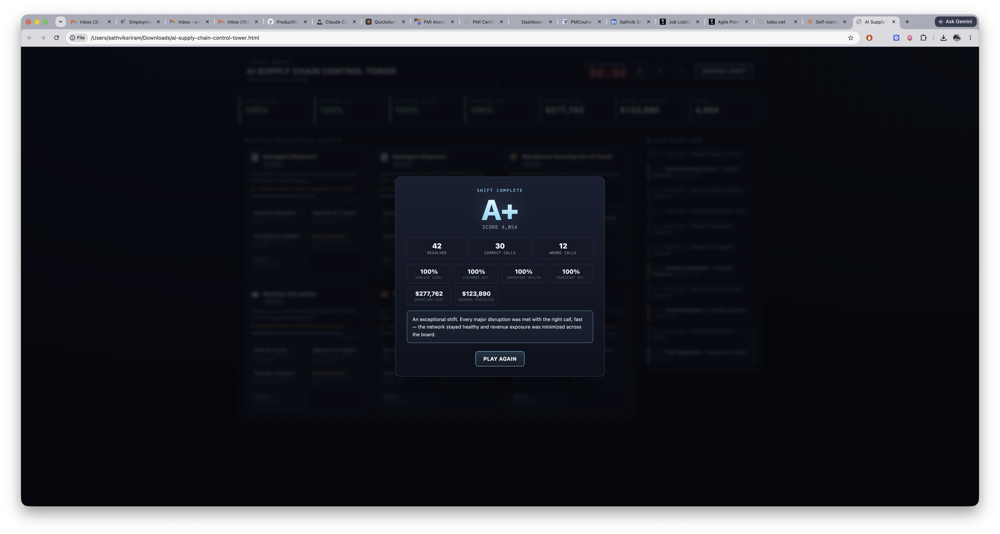
