# Day32

## Prompt

Think Like a Marketing Strategist: Grow This Brand:

You are an expert frontend developer, UX designer, marketing strategist, and instructional designer.

Build a complete single-file HTML app called: "Think Like a Marketing Strategist: Grow This Brand"

The goal is to teach beginners how marketers think, not just generate marketing content. Every section should explain "What is this?" and "Why does it matter?" in simple language.

Requirements

Output ONLY one HTML file

React via CDN + Babel JSX

HTML, CSS and JavaScript only

No Tailwind, npm, backend or APIs

Runs offline

Responsive

Dark modern UI

Replayable with randomized businesses

Flow

Welcome screen introducing marketing strategy.

Let the user choose:

🏢 Use My Own Business

🙋 Build My Personal Brand ← if someone doesn't have a business, this lets them use their own name, expertise, and story as the brand

🎲 A New Client Has Arrived (randomly generate a business with industry, audience, budget, competitors and marketing challenge)

Teach the user to understand the business/brand and its audience. For personal brands, the "product" is the person's expertise and story. Replace "competitors" with "people in your space you admire."

Ask the user to choose the best social media platforms. Explain why each platform is or isn't suitable. For personal brands, weight LinkedIn, X/Twitter, YouTube, and newsletters more heavily.

Generate multiple content pillars. The user must choose only three. For personal brands, include pillars like Thought Leadership, Personal Story, Behind the Scenes, and Audience Education. Explain how each supports different goals.

Build a simple 30-day content roadmap showing weekly goals and strategy (not individual posts). For personal brands, Week 1 should focus on defining POV and optimizing bio/profile.

Generate one unexpected marketing event. For personal brands this could be: a viral post, a podcast invite, a public disagreement, someone copying your content, or a sudden follower spike. Let the user respond and explain consequences.

End with a Growth Report containing:

Audience Understanding

Platform Strategy

Content Strategy

Growth Potential

Best Decision

Biggest Mistake

Three Marketing Lessons

For personal brands, lessons should reference personal branding principles like authenticity, consistency, and niche clarity.

After every major section, include a "How to ask Claude" card with a reusable prompt so users learn prompt engineering while learning marketing. For personal brand mode, the prompts should reference the person's name and niche instead of a company.

Use reusable React components with useState. Add smooth transitions, cards, progress indicators and ensure every button works.

## Response

Syntax validated. Now let's quickly sanity-check the file structure and share it.Built it as a single-file React app themed around a "strategy desk" — you're a strategist reviewing client briefs, not a content generator.

How it plays out:

- **Welcome → mode select** — Own Business, Personal Brand, or a randomized client (10 preset dossiers, rerollable)
- **Audience stage** — reads the brief, then a quick "what drives this audience" choice with a strategist's-read explanation
- **Platforms** — all 8 platforms shown with honest fit/no-fit reasoning (weighted differently for personal brands, leaning LinkedIn/X/YouTube/newsletter), pick exactly 3, get alignment feedback
- **Content pillars** — 6 options (different sets for business vs. personal), pick exactly 3, each tagged with the goal it serves
- **30-day roadmap** — 4 weekly goals/strategy blocks, not individual posts; personal-brand Week 1 is always POV + bio
- **Curveball event** — a random twist (viral post, podcast invite, price war, public disagreement, etc.), 3 response choices with real consequences
- **Growth Report** — computed score, best decision/biggest mistake derived from your actual choices, 3 lessons (personal-brand lessons lean on authenticity/consistency/niche clarity)

Every stage has a "What is this / Why it matters" pair and a copyable "How to ask Claude" prompt built from your actual entered data, so the prompt-engineering lesson compounds alongside the marketing one. It's fully replayable — "New Business, Same Mode" resets everything with a fresh randomized or blank brief.

[Marketing Strategist Simulator](think-like-a-marketing-strategist.html)

## Screenshot

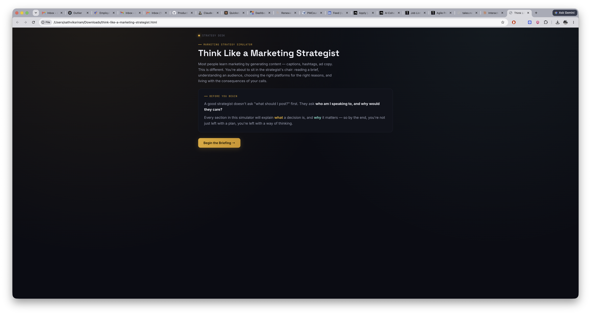

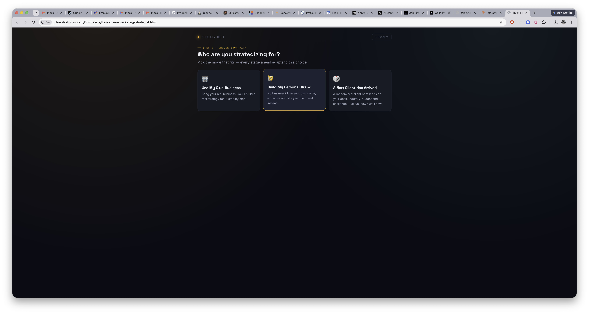

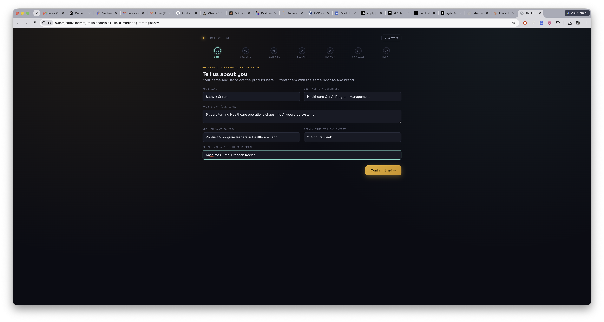

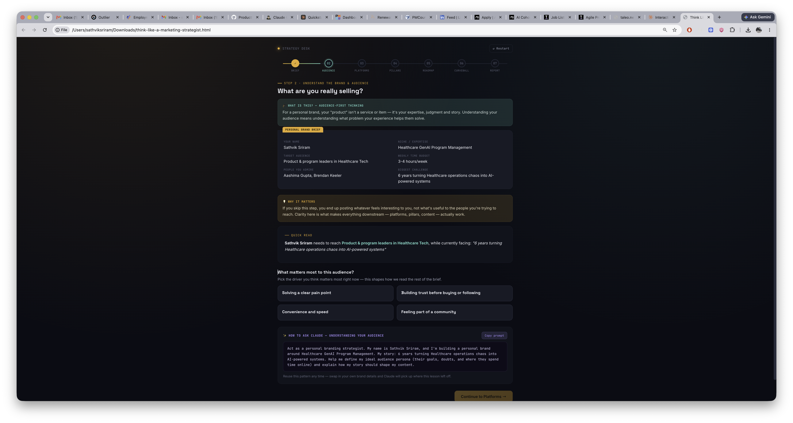

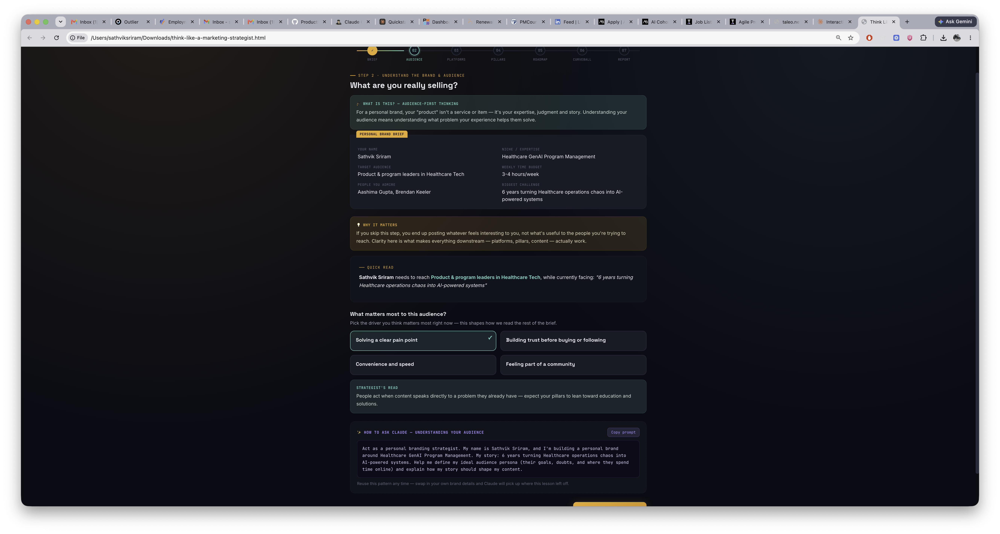

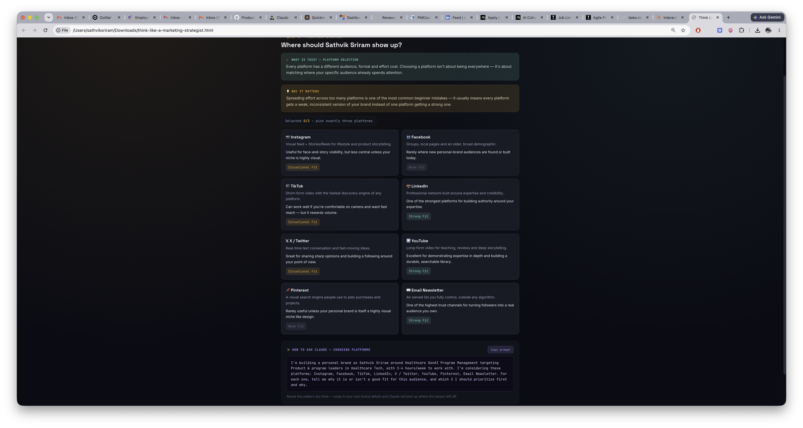

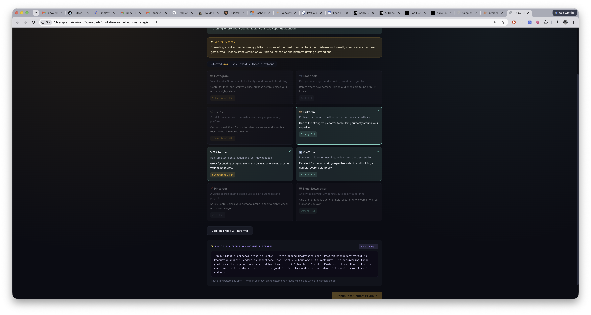

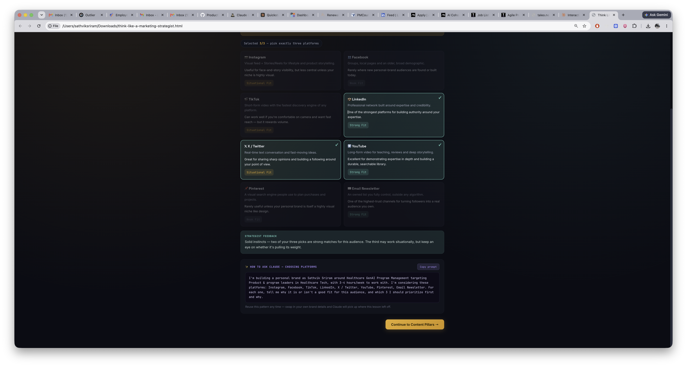

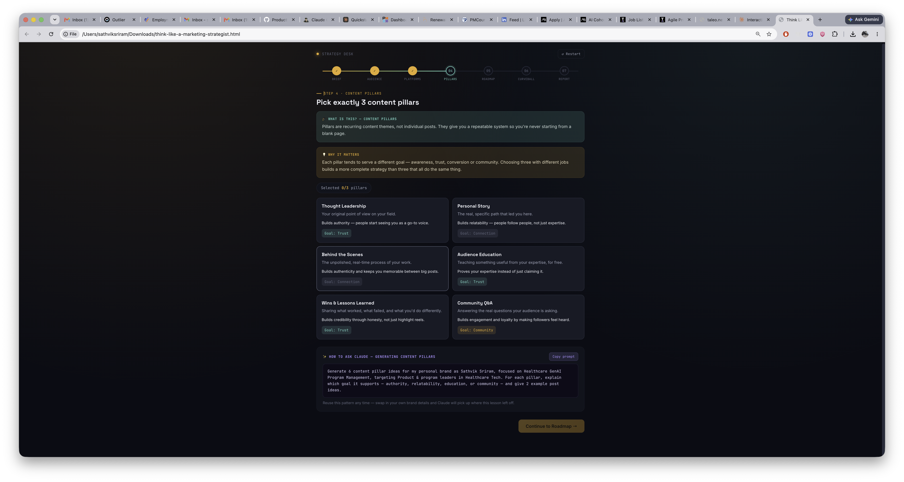

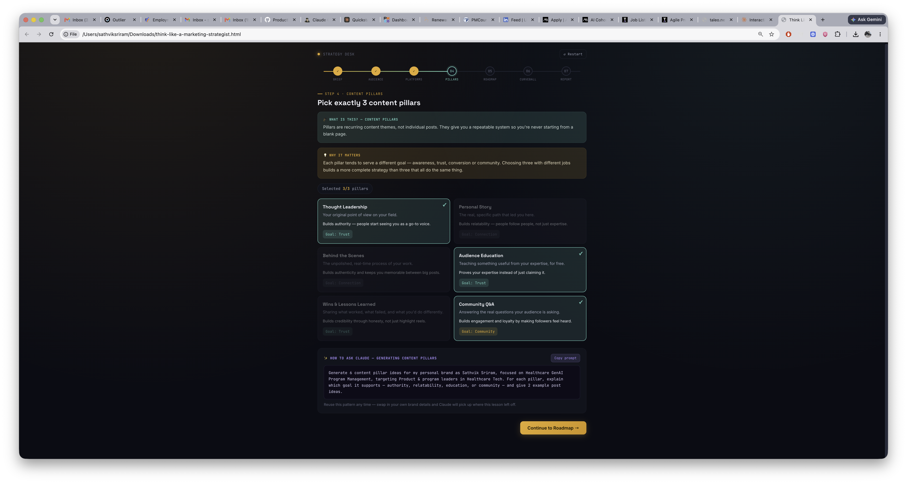

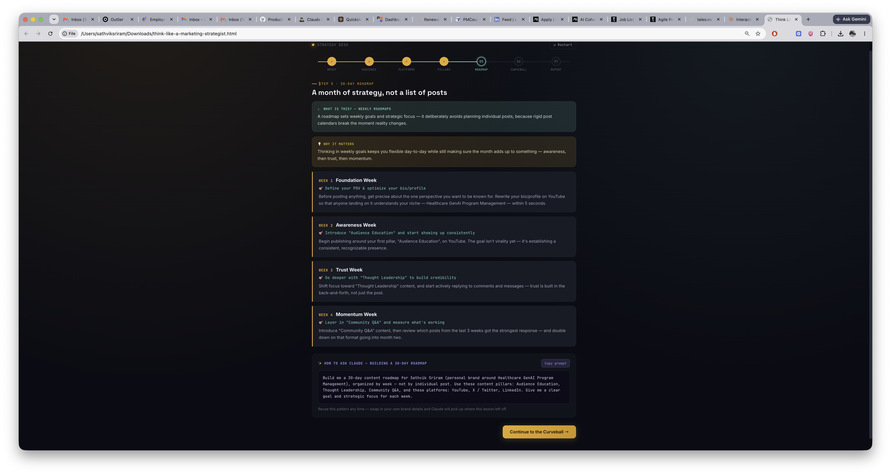

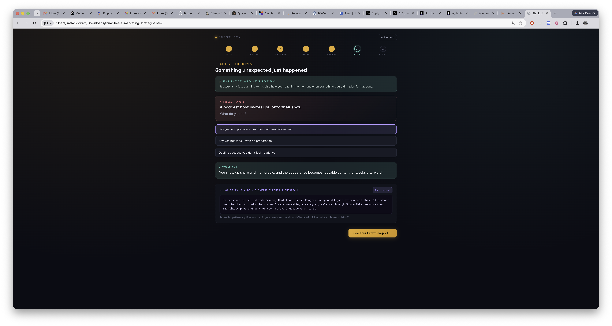

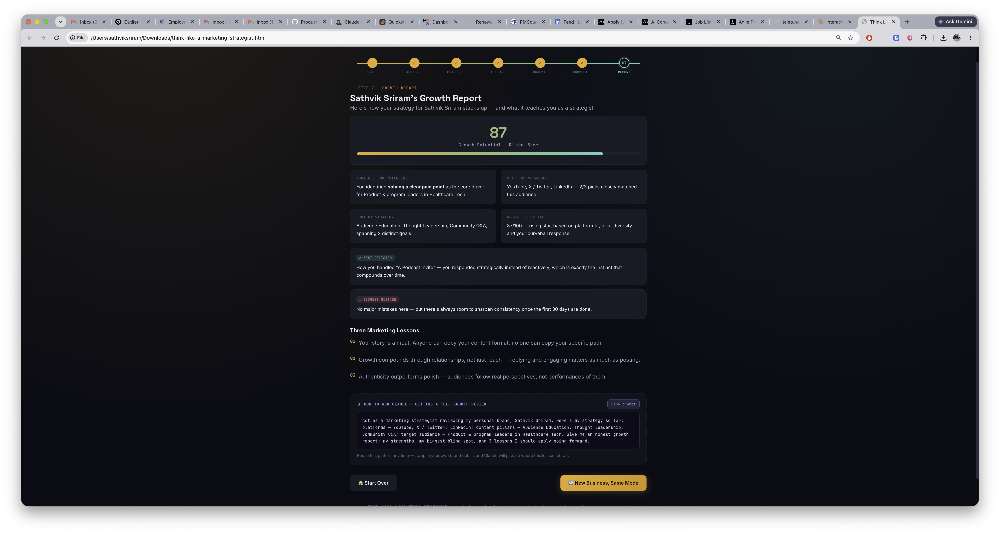
