# Day 33

## Prompt

You are an expert frontend developer, UX designer, instructional designer, and media literacy analyst.

Ask the user to choose a color theme from a few options (including Claude Orange).

Create a beautiful single-file HTML application called 'Media Integrity Analyzer'.

Use pure vanilla CSS and JS. No Tailwind, npm, backend, APIs, images, or external assets. Everything must work offline in one HTML file.

The goal is to teach media literacy through interactive discovery, not test prior knowledge. The experience should feel like a guided lesson where users learn by observing, thinking, and then revealing the answer.

Make it interactive.

Before each challenge, briefly explain the concept in simple language, why it matters, and how it applies to everyday life.

Challenge 1: Headline Detective
    - Generate a fictional news headline and matching article.
    - Ask: Would you click this? (Yes / Maybe / No)
    - Ask the user to identify exaggerated or misleading parts.
    - Reveal the Headline Accuracy Score, highlighted mismatches, explanation, fair rewritten headline, and key takeaway.

Challenge 2: Emotion Detector
    - Generate a fictional social media post, reel caption, or article excerpt.
    - Ask how it made the user feel and which words influenced that feeling.
    - Reveal the target audience, intended emotional response, manipulation technique, highlighted emotional phrases, neutral rewrite, and key takeaway.

Display live Media Integrity metrics:
    - Headline Accuracy
    - Source Reliability
    - Emotional Manipulation
    - Audience Targeting

Finish with a Media Integrity Dashboard containing:
    - Overall Media Integrity Score
    - What the user learned
    - Biggest red flag
    - Three practical media literacy habits
    - Replay with completely new scenarios

Design a premium editorial-style dark interface with smooth animations, progress indicators, hover effects, modern cards, and responsive layout.

Ensure there are zero syntax errors.

Return ONLY the complete HTML inside one code block.

## Response

I'm building a single-file HTML app with a dark editorial aesthetic, using Claude's brand orange as the accent color through CSS variables. The app will include an intro screen, a live metrics dashboard tracking headline accuracy, source reliability, emotional manipulation, and audience targeting, plus the first challenge where users play headline detective.
For the Headline Detective challenge, I'll generate fictional articles and ask users to identify which parts are misleading by clicking on flagged words and phrases embedded in the text, then reveal their score, mismatches, and a fair rewrite. The second challenge, Emotion Detector, presents social media posts and asks users to identify the target audience and manipulation techniques used. The final dashboard shows their overall score, key learnings, and biggest red flags, with a replay button that cycles through multiple scenario sets so each playthrough feels fresh.
I'm structuring this with vanilla JavaScript using arrays of scenario objects and functions to render each stage while tracking user progress. For the interactive elements, I'll embed clickable spans within the article text that users can select to flag misleading content.
I'm thinking through the data structure now—instead of relying on word indices which can be fragile with tokenization, I'll mark misleading phrases directly in the article using delimiters during authoring, then parse them into segments with a boolean flag indicating whether each chunk is misleading. This way I can render clickable phrase-level segments and reliably compare user selections against the correct set to compute their score.
For the metrics, I'll have the Headline Accuracy update based on how well the user's selections match the actual misleading words in challenge one, and I'm considering how the other metrics like Source Reliability should evolve as the user progresses through both challenges.
Defining challenge two's structure now with the post text broken into segments, multiple choice options for the target audience, and tracking which emotion the post is designed to trigger. I'm thinking through how to score the emotional manipulation aspect—whether it's a metric showing how manipulative the content itself is versus how well the user identifies it. I'm leaning toward tracking this as part of a running media literacy skill score that measures how effectively they're spotting misleading and manipulative techniques across the challenges. Each metric will populate as the user completes challenges—Headline Accuracy and Source Reliability from the first challenge, Emotional Manipulation and Audience Targeting from the second—with preset scenario values that vary slightly based on what the user reveals. I'll also track their own accuracy separately and calculate an overall Media Integrity Score as the average of all four metrics for the final dashboard. I'm realizing the overall score should actually reflect what the user learned rather than the content's integrity itself—since the whole point is teaching media literacy through discovery. So I'll track their detection performance across both challenges as the main score, which better captures their learning progress.
For the live metrics bar, I need to progressively reveal the content analysis scores as users work through each step: headline accuracy, source reliability, emotional manipulation detection, and audience targeting awareness.
The final overall score will be calculated as the average of these four metrics, with emotional manipulation inverted so that lower manipulation scores contribute positively to integrity. This gives a comprehensive integrity assessment of the analyzed content, followed by insights like what they learned, the biggest red flag, and three habits to develop. I could also use the minimum of those four values as the red flag indicator and map it to a severity label. Now I'm setting up scenario pools with three items each for both the headline and emotion challenges, randomly selecting unused ones each playthrough to avoid immediate repeats. I'll also add a "would you click" question that captures engagement without affecting the score calculation, then display it in the results as a reflection metric.
Writing the article rendering logic... I'll track two separate scores: the headline's inherent accuracy (a fixed property of the content) and the user's own detection performance based on how many misleading phrases they correctly identify versus how many they miss or incorrectly flag. The user score uses a simple formula that rewards correct selections and penalizes wrong ones, clamped between 0-100. These individual challenge scores then roll up into an overall trend metric.
For the final dashboard, I'm planning to display both the "Media Integrity Score" (the content's average accuracy) and "Your Detective Accuracy" (the user's average performance across challenges) as complementary stats. This adds depth without straying from the core requirements—the dashboard still covers all the specified elements, but now includes this extra insight about user performance.
Writing the full HTML/CSS/JS implementation... Writing the interactive logic... Writing scenario data... Generating the data structure... Building the reveal screen with accuracy scores, source reliability indicators, and visual feedback for each segment showing whether the user correctly identified misleading content, missed flags, or selected non-misleading text by mistake. Writing scenario structure... I'm pulling together the key takeaways from both scenarios into a combined list, then adding three evergreen media literacy habits that users should practice—like reading beyond headlines, identifying who benefits from the message, and recognizing emotional reactions as a cue to pause rather than react. The replay button will reset everything and load new random scenarios. I'm also adding progress indicator dots at the top to show which of the three steps users are on, plus a metrics bar with four cards displaying the analysis scores, starting in an unanalyzed state. I'll layer in smooth fade and slide transitions between screens to make the experience feel polished.
Now I'm settling on a warm, dark theme with Claude's orange as the primary accent, paired with a dark charcoal background, muted off-white text, and supporting colors for success, warning, and danger states.
Writing the full component code... I'll add a headline variant class for larger, bold segments. For scoring, I'm calculating how many flagged segments the user correctly identified versus incorrectly selected, then converting that to a percentage with a penalty for wrong selections. Next I'm setting up the "Would you click" question prompt.
Writing the HTML structure... Writing the full component... The tech headline exaggerates a single blogger's speculation into expert consensus when economists actually project gradual change over decades. For the emotion scenarios, I'm sketching out three manipulative examples: a parenting app using fear and social proof to pressure new parents, a financial scheme leveraging retirement anxiety with scarcity tactics, and a community post stoking homeowner anxiety about neighborhood decline.
Now I'm adding a fourth scenario around a fictional local zoning dispute—something like "They're Bulldozing Your Park While You Sleep"—that uses environmental anger and vague enemy framing to trigger tribal outrage, keeping it entirely fictional and non-partisan.
Building the HTML file now with all these pieces integrated, structuring the JavaScript to handle scenario arrays, state management, and render functions.
Writing the complete code...

Here's the complete Media Integrity Analyzer, styled in a Claude Orange editorial dark theme:

[Media Integrity Analyzer](Media_Integrity_Analyzer.html)

## Screenshot

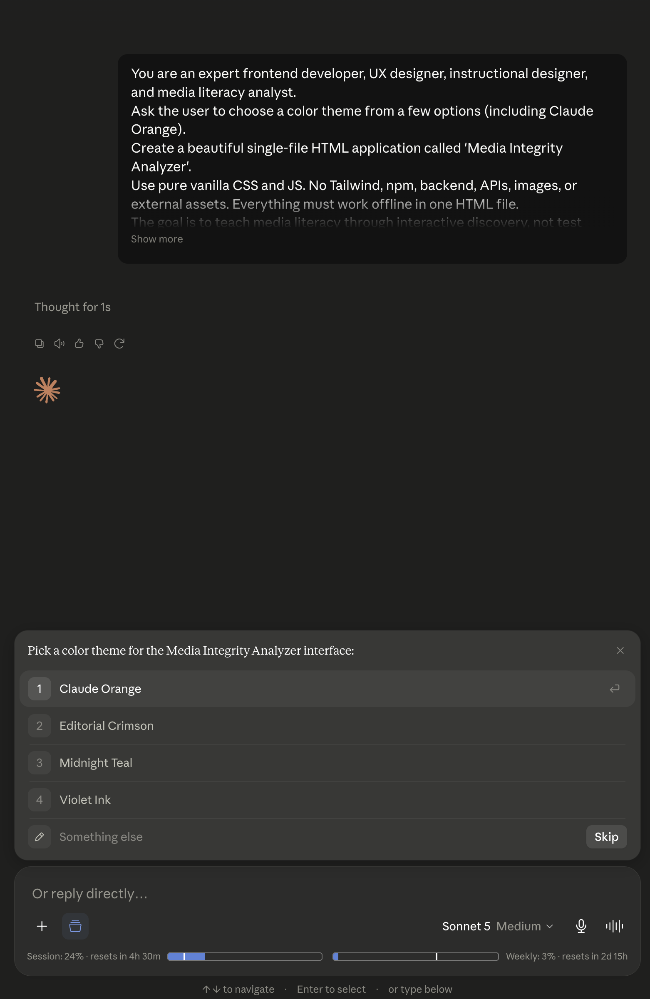

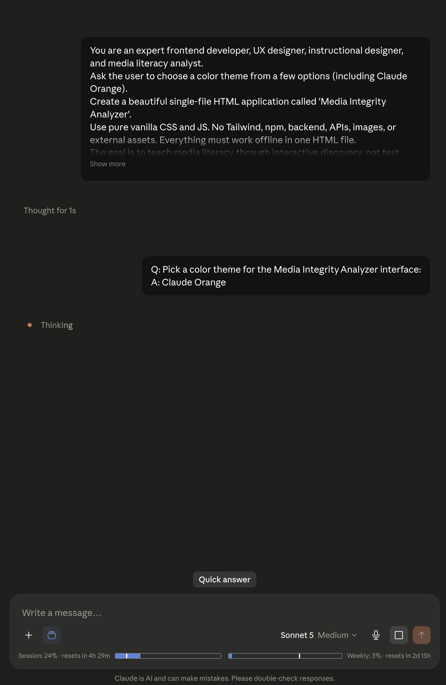

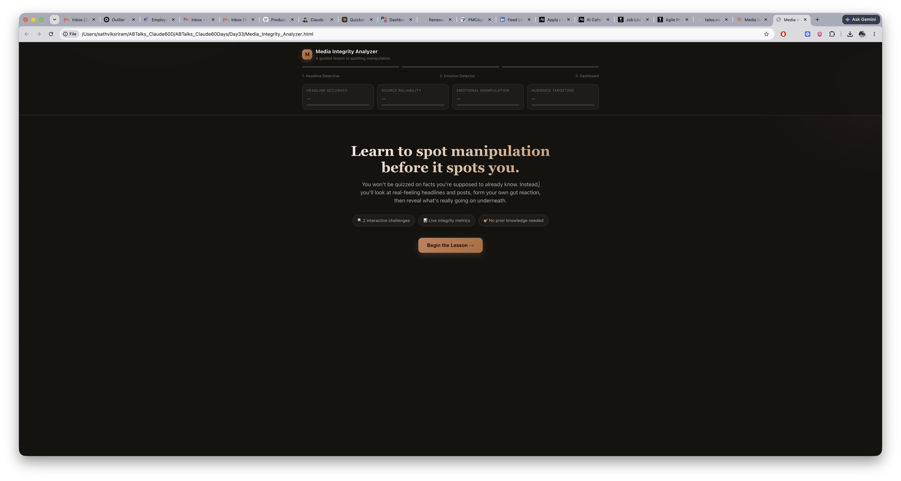

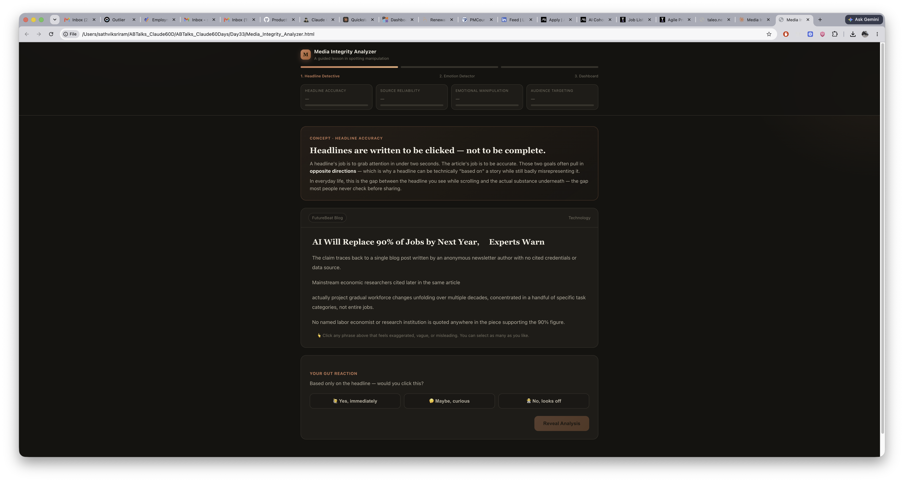

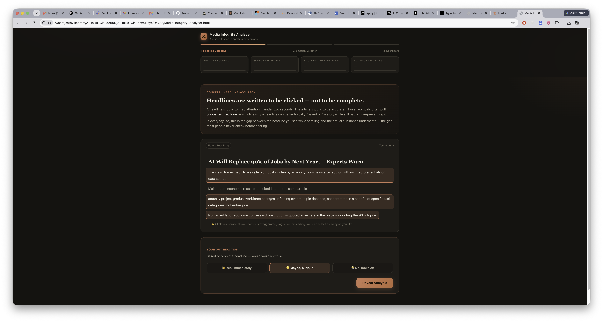

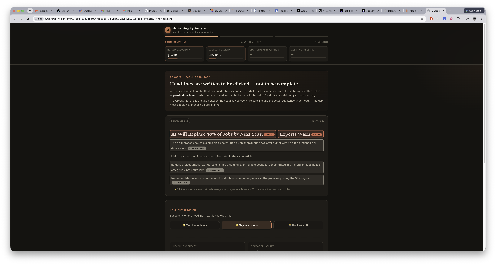

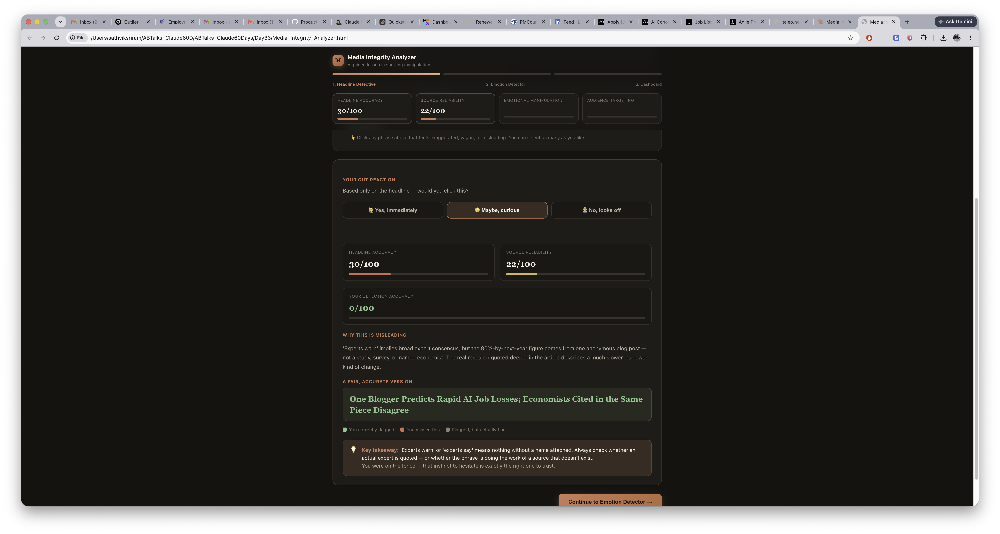

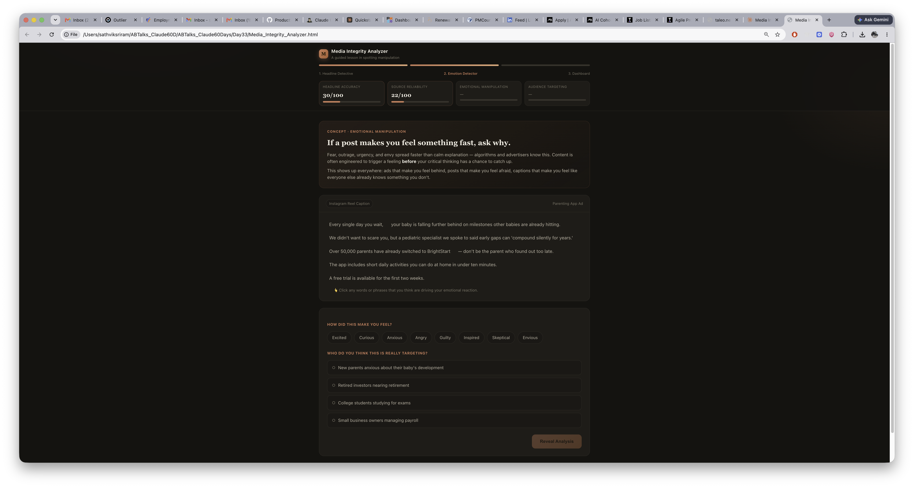

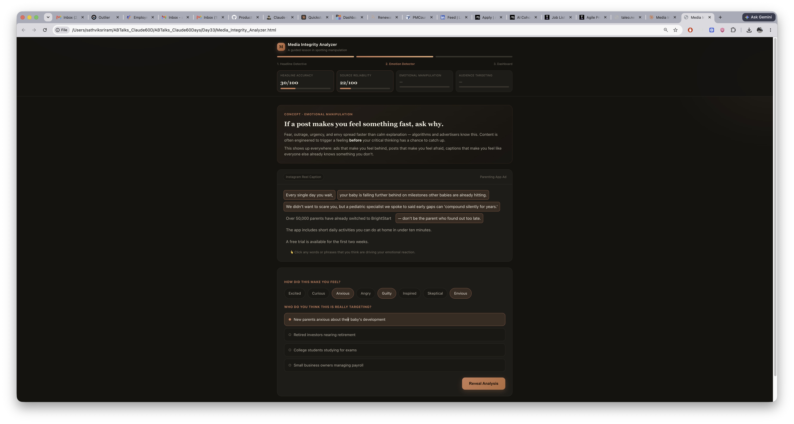

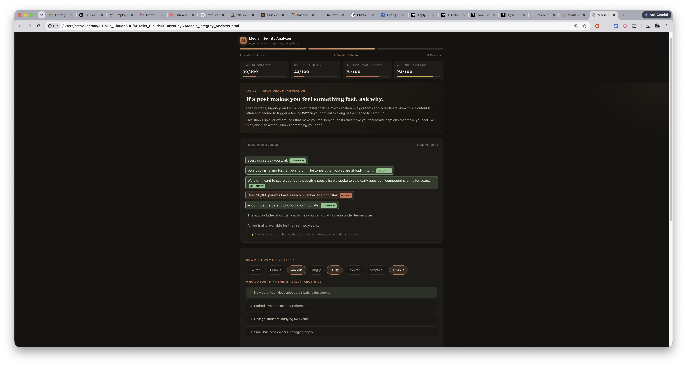

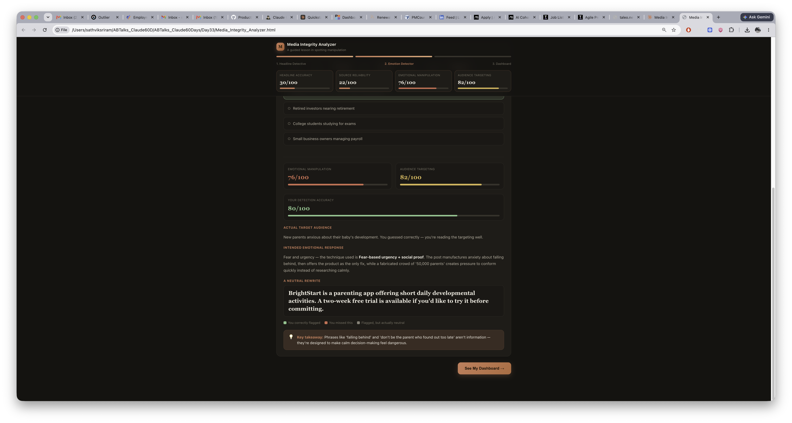

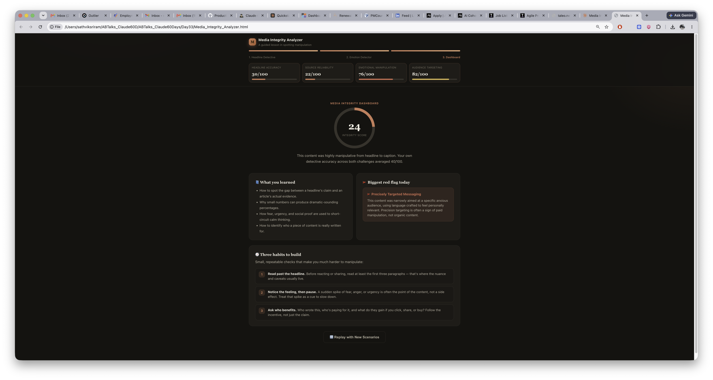
