# Day 34

## Prompt

You are an expert frontend developer, UX designer, instructional designer, and marketing strategist.

Ask the user to choose a color theme from a few presets (including Claude Orange).

Create a beautiful single-file HTML application called 'Marketing Detective'.

Use React via CDN + Babel. However, if React/Babel would prevent the app from running reliably as a standalone local HTML file, automatically switch to an equivalent implementation using pure HTML, CSS and vanilla JavaScript. Do not use Tailwind, npm, backend, APIs, databases, images or external assets.

The application should feel like a polished detective game, not a business dashboard. Every interaction should create curiosity before revealing the next clue.

Generate 10 detailed fictional marketing cases. If output quota allows, expand to 15–20 cases. Store them inside a JavaScript array and randomly load a new case each replay.

Each case must contain:
• Company Name
• Industry
• Campaign Objective
• Target Audience
• Marketing Channels
• Budget Allocation
• Campaign Metrics (Reach, CTR, Engagement, Conversions, Sales)
• Customer Comments
• Social Media Performance
• One Primary Marketing Mistake
• Three Supporting Clues
• Correct Explanation
• Suggested Improvements

User Flow:

1. Case Assignment
2. Investigation Board
3. Interactive Investigation with draggable evidence
4. Solve the Case
5. Case Closed animation
6. Learning Report

Design a premium dark detective aesthetic using corkboards, folders, sticky notes, push pins, paper textures, glowing accents, smooth transitions, hover effects, progress indicators, animated charts, and responsive layout.

Reuse React components wherever possible.

Before returning the final HTML, internally verify there are no syntax or runtime errors and that the application runs correctly as a standalone HTML file.

Return ONLY the complete HTML file.

## Response

I'm planning to build a single-file HTML detective game called Emerald Files with a dark green and gold aesthetic, using vanilla JavaScript to avoid CDN dependencies. The design will feature a corkboard texture created with CSS gradients, and I'm mapping out multiple screens starting with an intro.
The gameplay flows through an investigation board where players interact with draggable evidence folders—company snapshots, objectives, channels, metrics, and customer feedback—then solve the case by selecting the primary marketing mistake from multiple choice options and supporting clues before seeing the case closed animation and learning report. I'm planning to include 10 detailed cases with all necessary data fields to keep the scope manageable while maintaining depth. On the investigation board, I'll make the evidence folders draggable sticky notes with pin visuals that users can move around freely for that tactile feel, and clicking them opens a modal with the detailed content. I'm tracking which folders have been opened to gate the "Solve Case" button, and I'll build this with vanilla JavaScript using a data model and state machine to manage the different screens, manipulating the DOM directly for a complete, reliable implementation.
Now I'm setting up the case data structure with ten cases, each containing the company details, campaign metrics, customer feedback, social media stats, and the core mistake they made along with supporting clues and decoys. For the multiple choice answers, I'll pull mistake statements from across all cases and randomly select three wrong answers per case at runtime to ensure they're distinct and don't accidentally match the current case.
Writing case data structure... the real issue was that all that marketing spend created awareness but the actual purchase experience fell apart—the checkout kept crashing and delivery was limited to just a few cities. The budget allocation made it worse, with 70% going to top-of-funnel ads while only 10% supported conversion and retention. To fix this, they need to stabilize the checkout system and expand delivery coverage before pouring more money into scaling the ads.
Now I'm thinking through how to structure the remaining nine cases efficiently—I'll use a consistent format with solid detail but keep each one concise so I can cover all ten without losing quality.
Case 2 is PixelFit, a fitness app targeting working professionals during New Year's resolution season across multiple channels with a ₹40L budget. The challenge here is a massive gap between app installs (80,000) and paid subscription conversions (only 900), suggesting the funnel is leaking badly after download—likely due to weak onboarding, unclear premium value proposition, or friction in the subscription flow.
The user feedback reveals the core issues: aggressive card collection during trial signup feels predatory, technical bugs during onboarding, and excessive permission requests create friction. The app store rating collapsed to 2.8 stars right after the campaign launched, which directly correlates with the bug complaints and negative user experience. The fundamental mistake was scaling acquisition spend before stabilizing the product experience—they drove massive top-of-funnel volume into a broken onboarding and monetization funnel, causing churn and reputation damage before any meaningful revenue could materialize. The data points align perfectly: the 0.1% subscription conversion rate, the timing of the rating drop matching the ad scale-up, and the complaints all point to the same root cause.
To fix this, they need to pause scaling spend until the onboarding flow is solid, run a small test cohort first to validate the experience, move the card request to after users experience value (free trial without CC upfront), and shift their success metrics from install volume to cohort retention and actual monetization rates.
Now looking at a different case with Verve Skincare, a beauty brand trying to grow direct-to-consumer sales for an anti-aging serum through influencer partnerships targeting women 35-55 in urban areas with higher income, allocating 60% of budget to mega and macro influencers across Instagram.
The campaign reached 8 million people but the results fell flat — click-through rate was only 0.3%, engagement looked good on the surface with lots of likes but comments were generic and bot-like, and they only converted 400 customers for ₹6L in sales, which is a poor return on their ₹60L budget. The real issue emerged in the comments: people questioned why they should trust anti-aging advice from an influencer who doesn't look 35, complained the posts felt like ads rather than genuine recommendations, and many had never heard of these influencers before. The mega-influencer posts got huge view counts but almost no saves or shares, with engagement dominated by emoji spam rather than authentic interaction. The fundamental problem was choosing influencers purely for follower count and reach rather than actual relevance and alignment with the target audience. ermatologist endorsements, real customer testimonials, and UGC to build trust—measuring influencer effectiveness by engagement quality rather than follower size. For QuickCart Grocery's flash discount campaign, the problem is clear: the SMS/push notification strategy successfully drove urgency and initial conversions with 25,000 orders, but the 70% discount attracted deal-seekers rather than loyal customers, causing repeat purchase rates to plummet once the promotion ended. The revenue underperformance despite high conversion volume suggests the discount was too aggressive and unsustainable, training customers to wait for discounts instead of building genuine demand. The core issue is that discounting trained customers to be purely price-sensitive rather than building actual loyalty, so the fix is shifting to a tiered loyalty program with targeted discounts only for win-back and new customer acquisition, while measuring cohort lifetime value instead of just order volume and pairing promotions with habit-forming incentives like subscribe-and-save. Now looking at a B2B SaaS case for Nimbus Cloud Storage, where they're running a LinkedIn campaign targeting IT decision makers at mid-to-large enterprises across LinkedIn Ads, Google Search, and webinars.
The campaign generated massive lead volume—3,000 leads from 900K reach with a 1.8% CTR—but only 45 were sales-qualified and just 2 deals closed, with the sales team reporting that most leads were students and freelancers rather than actual IT decision makers. The targeting was set too broadly to "technology interest" instead of filtering by job title, seniority level, and company size, so they're drowning in unqualified leads that waste the sales team's time.
The core issue is that marketing optimized for lead volume and cost-per-lead rather than lead quality, and the 1.5% qualification rate is far below industry benchmarks. To fix this, I'd recommend switching to firmographic and job-title targeting on LinkedIn, adding qualifying questions to forms, shifting KPIs from raw lead count to SQLs, and focusing retargeting efforts only on engaged webinar attendees.
Now looking at Roots & Leaf, a D2C plant-based food brand trying to drive awareness and trial for their new protein bars through podcast and YouTube sponsorships. The campaign reached 3M people with a 0.5% CTR and generated 600 conversions worth ₹9L in sales, but the feedback reveals the real problem: the podcast host reads felt inauthentic, the call-to-action didn't include where to buy, and the promo code was announced too quickly for people to capture it. Most orders came from organic search rather than the sponsored channels, suggesting the ads aren't actually driving conversions effectively.
The core issue is that despite reaching a huge audience through trusted hosts, the campaign completely fumbled the conversion moment. The promo codes were barely redeemed even though reach was strong, and looking at the scripts, there was no requirement for hosts to genuinely use or endorse the product themselves. The call-to-action wasn't reinforced anywhere—not in show notes, not on-screen, nowhere—so even though people heard about it, they couldn't act on it.
To fix this, I'd require hosts to actually try the product and share a real personal story about it, put the promo code in the show notes and description while repeating it twice verbally, create unique trackable links for each host so we can see who's actually driving conversions, and test the CTA clarity before the campaign even launches.
Now looking at a different case—Solstice Bank, a fintech startup trying to drive sign-ups for a new zero-fee savings account through a nationwide TV and digital push. They're targeting the mass market between 22 and 45, splitting their ₹1.2 crore budget across TV at 45%, Google and YouTube at 30%, and Facebook at 25%. They hit their reach target of 20 million people and got a 0.4% click-through rate, but engagement was weak and while they got 150,000 app downloads and sign-ups, the account activation rate was disastrous—only 12,000 people actually funded their accounts, which is just 8%. The real problem emerges in the feedback: people signed up but found the KYC process so confusing they abandoned it, others realized they'd need to visit a branch anyway which defeated the whole digital-first purpose, and many didn't have the required documents on hand. The social metrics showed a huge brand awareness lift, but when you dig into the activation funnel data buried in the appendix, there's a massive cliff right at the KYC verification step. The core issue is that they built a campaign to drive massive top-of-funnel volume, but the onboarding process was so friction-heavy that most people never made it through to actually activate their accounts, essentially wasting the majority of the media spend's potential value.
The fix is straightforward: streamline KYC with e-KYC or video verification options, be honest in the ads about what documents people actually need, test the onboarding flow with A/B tests before rolling out nationally, and track activation rate as the primary success metric instead of just counting signups.
Now I'm moving to the next case—Trailhead Outdoors, an outdoor gear retailer looking to drive holiday season sales through a retargeting campaign. The core issue is that the campaign optimized for last-click metrics on an already-warm audience, creating the illusion of efficiency while actually cannibalizing organic sales rather than driving new growth — the high CTR and conversion numbers masked the fact that most "conversions" were people who would've bought anyway. The fix is to shift budget allocation toward prospecting and top-of-funnel awareness to actually expand the customer base instead of just recycling existing intent.
Now looking at a different case with Luna & Co., a D2C jewelry brand launching a limited-edition festive collection across Instagram, Pinterest, and Google Shopping with an 18 lakh rupee budget, targeting women aged 22-38 with strong visual content focused on aspirational gifting moments.
The campaign hit impressive top-line numbers—1.8M reach, 950 conversions, and 22 lakh rupees in sales—but the real problem emerged in the returns data: a devastating 38% return rate that's eroding profitability and customer trust. Customer feedback reveals the core issue—heavily edited product photos created unrealistic expectations about colors, sizing, and packaging quality that the actual product couldn't match. The UGC unboxing videos exposed this gap between the polished advertising visuals and the real product, which is why despite strong initial conversions, the high return rate is destroying margins and long-term brand reputation.
The fix is straightforward: shift to accurate, minimally-edited product photography with natural lighting, add detailed size guides and comparison visuals, incorporate authentic user-generated content, and most importantly, start tracking net revenue after returns instead of just gross conversions—that's the metric that actually reflects campaign success. Now looking at the next case with Byte Bites, a food delivery app...
The gamified loyalty campaign relied too heavily on push notifications, sending five per day to existing users aged 20-35 across push (60%), in-app banners (25%), and email (15%) with an ₹8L budget. While initial CTR hit 4%, engagement tanked as the campaign progressed, and the real damage showed up in metrics that matter: app uninstalls spiked and notification opt-outs surged. User feedback was clear—the frequency felt like spam, not engagement. The core problem was notification fatigue; the campaign prioritized reach and frequency without considering the user experience cost of constant pinging.
The data tells the story: CTR declined sharply week-over-week, opt-outs and uninstalls rose in lockstep with notification volume, and comments specifically blamed the frequency, not the offer itself. The campaign confused short-term opens with long-term value, burning out the permission-based channel and damaging the user relationship. To fix this, I'd cap notification frequency with smart send-time optimization, personalize based on actual user behavior rather than a blanket schedule, A/B test different frequency thresholds, and track opt-out rate as a core success metric.
Now I'm organizing the case study data into the required fields: company name, industry, campaign objective, target audience, channels, budget, metrics like reach and CTR, customer feedback, social performance, the core mistake, supporting evidence, explanation, and improvements. Building the JSON structure to hold all ten cases, then setting up the app with state management for tracking which case is active, which evidence pieces have been examined, and navigation between the intro, investigation board, and solution screens.
The corkboard displays five draggable evidence folders—Case File with company details, Channel Ledger showing marketing channels and spending, Metrics Report displaying campaign performance as an animated bar chart, Witness Statements with customer feedback, and Social Surveillance with social media data. Each folder opens as a flipping card when clicked, gets marked as reviewed with a checkmark, and a progress bar fills as all five are examined before the player can attempt to solve the case.
For the solution phase, I'm setting up two steps: first, the player identifies the primary marketing mistake from four shuffled options (the correct answer plus three distractors), then selects exactly three supporting clues from a pool of six chips—three genuine clues and three decoys. The scoring logic awards points based on whether the mistake is correct.
Now I'm building out the full interface with CSS textures for the corkboard using gradients to simulate cork and paper, plus a case-closed animation with a red stamp and confetti effect.
Setting up the color theme for Emerald Files with a dark background, emerald green accents, gold pins, and cream sticky notes, then defining CSS variables for the palette and textures.
Writing the complete HTML and CSS... Writing the state machine... Writing component code... I'm finalizing the case data schema with fields for clues, explanation, and improvements, then adding mystery-style titles and taglines to each of the ten cases to enhance the detective narrative feel.
Writing the implementation code...

[Marketing Detective Simulator](marketing-detective.html)

## Screenshot

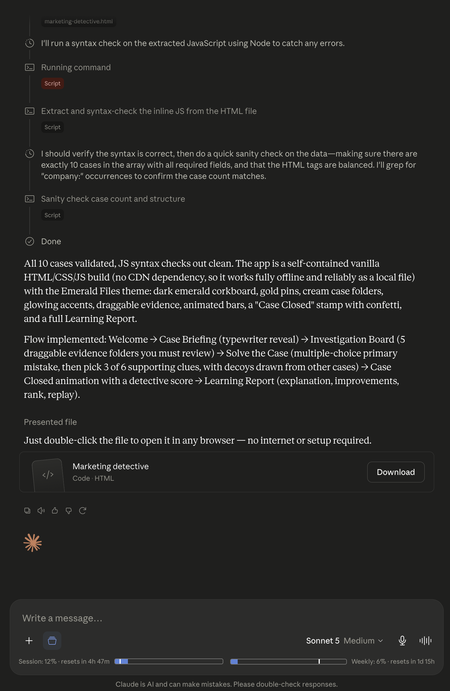

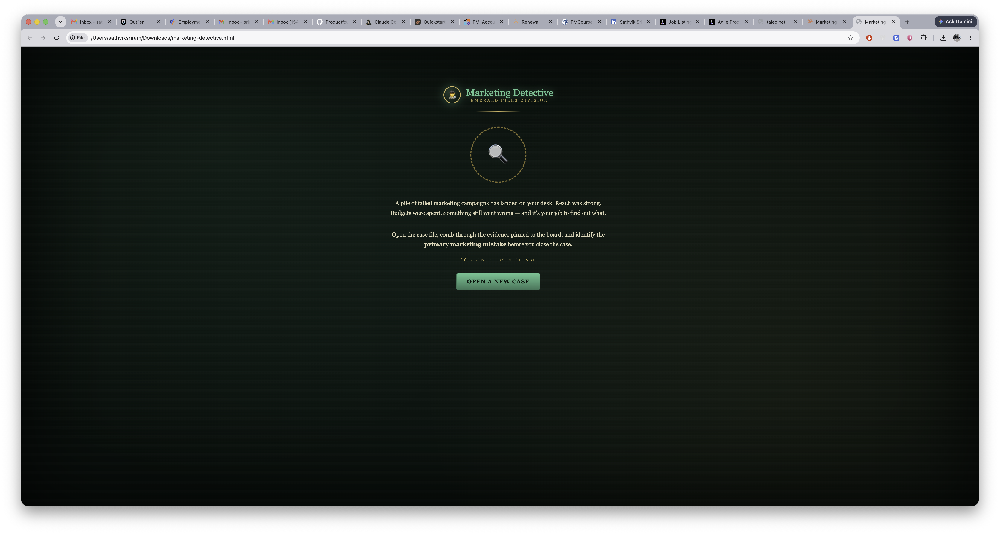

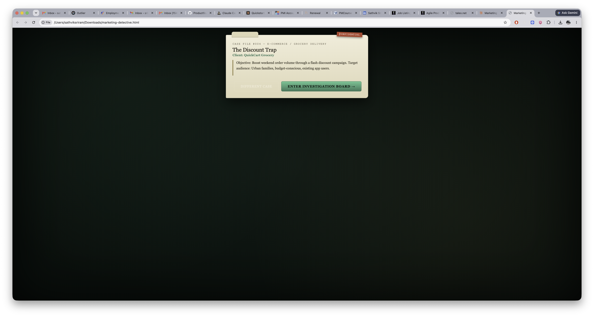

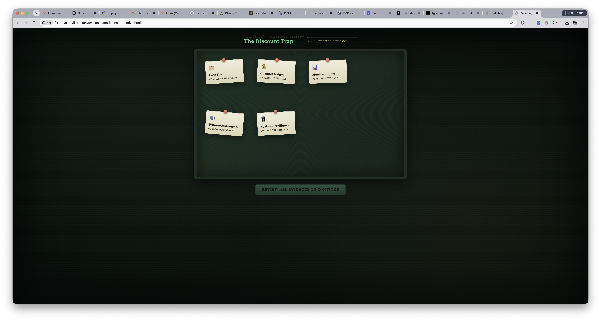

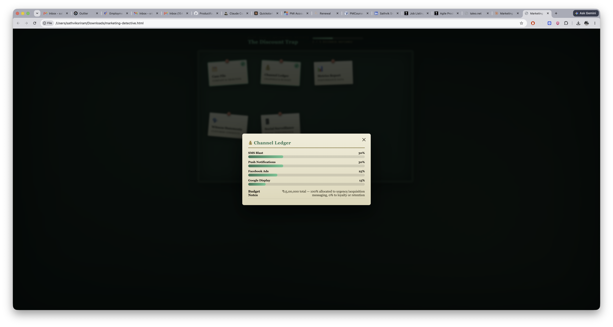

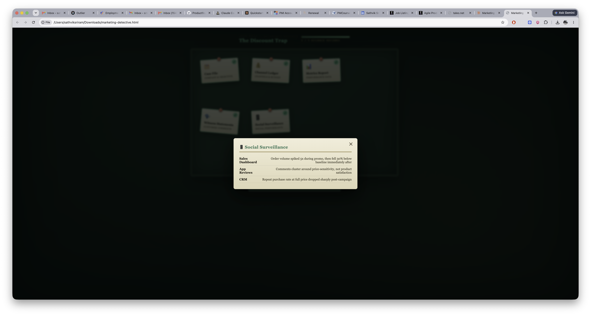

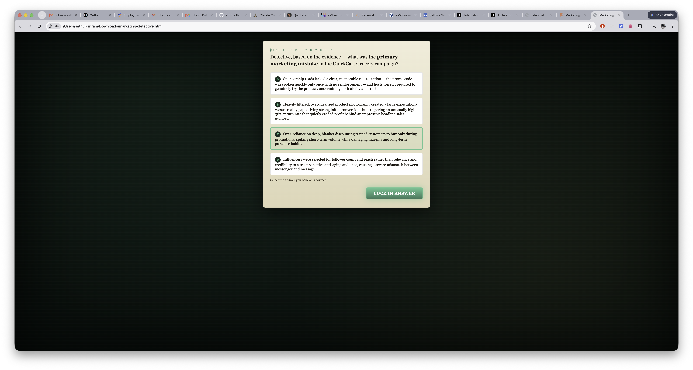

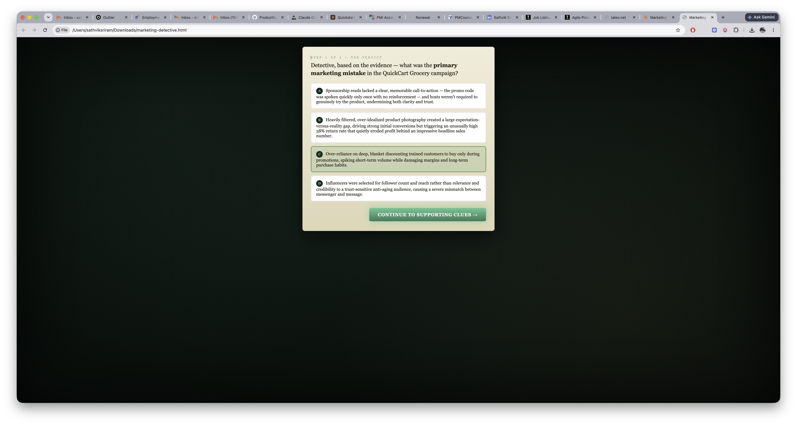

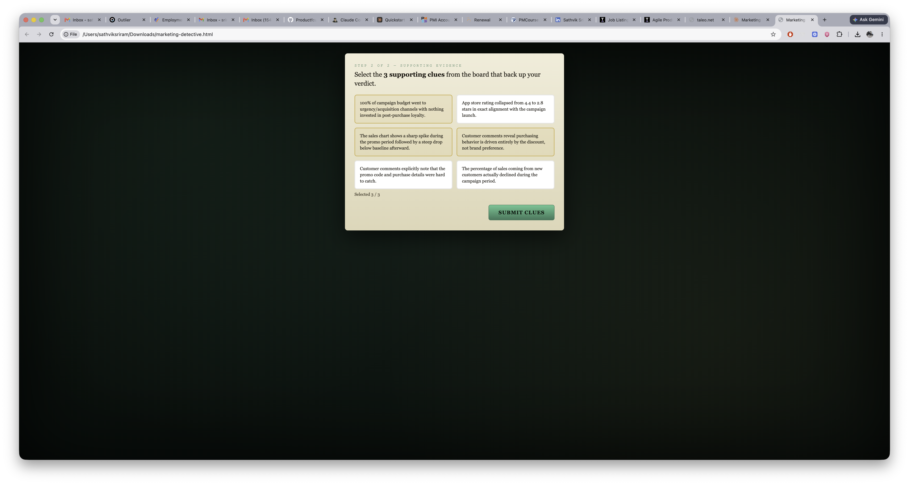

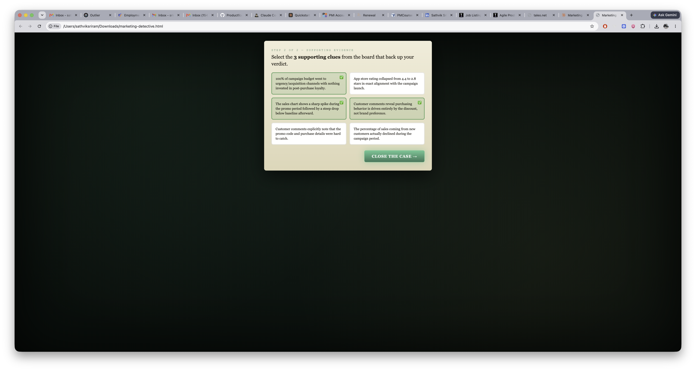

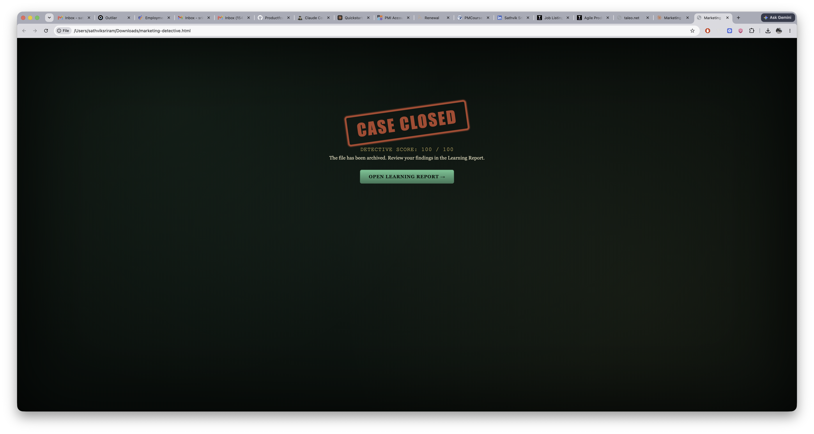

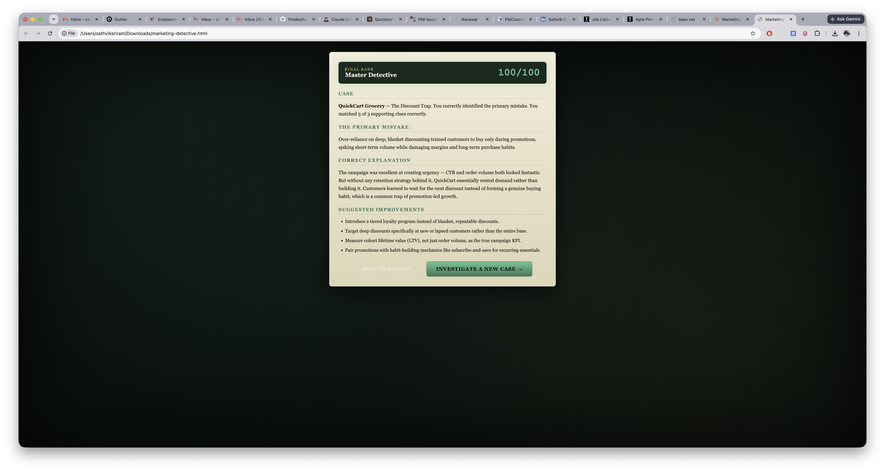
