# Day 35

## Prompt

You are an expert frontend developer, UX designer, instructional designer, game designer and prompt engineering expert.

Before generating anything, interview the user in chat.

Ask ONLY these two questions:

Question 1:
Which domain would you like to practice prompting for?
Provide options covering all major domains.

Question 2:
Choose your difficulty.

Do not ask any more questions.

Once both answers are received, generate the application.

Create a premium single-file HTML application called '🧩 Prompt Puzzle — Master AI Prompting Through Play'.

The application must work offline by simply opening the HTML file.

Use React via CDN only if it works reliably as a standalone HTML file; otherwise automatically switch to pure HTML, CSS, and vanilla JavaScript.

Everything must exist inside ONE HTML file.

Generate 6–8 randomized scenarios based on the selected domain and difficulty.

Each scenario must include:

- Desired Output
- Correct Prompt Blocks
- Distractor Blocks
- Weak Prompt
- Optimized Prompt
- Over-Engineered Prompt
- Weak AI Output
- Optimized AI Output
- Prompt Principle

Include exactly three challenge types:

1. Build the Prompt
2. Clean the Prompt
3. Choose the Best Prompt

Implement live scoring using Accuracy, Time, Moves, Wrong Placements, Hints Used, and Optimization Bonus.

Generate a Prompt Performance Report including Prompt Score, Rating, Rank, Prompt DNA visualization, personalized feedback, next milestone, and final optimized prompt.

Allow replay with new randomized scenarios.

Use a premium modern UI with drag-and-drop, hover effects, floating notifications, score animations, micro-interactions, and progress indicators.

Store scenarios in reusable JavaScript objects.

Everything must work offline with zero syntax or runtime errors.

If output becomes too large, reduce only the number of scenarios.

Return ONLY the complete HTML inside one code block.

## Response

I'm building a comprehensive single-file HTML application for Data Analysis & Business Intelligence scenarios at advanced difficulty, with 6 scenarios covering multiple challenge types, scoring, and reporting—all in vanilla JavaScript to avoid external dependencies and ensure offline reliability.
For the architecture, I'm structuring each scenario with metadata like id, type, and title, then populating them with correct and distractor blocks for build challenges, messy prompts with removable noise for clean challenges, and multiple-choice options for choose-best challenges. The UI will flow through an intro screen, scenario presentation, user interaction (dragging blocks, removing noise, or selecting options), scoring, and a final report showing performance across all scenarios.
I'm setting the domain to "Data Analysis & Business Intelligence" at Advanced difficulty, then creating a pool of 8 scenarios that get randomly shuffled for each playthrough. The scoring system tracks accuracy, time, moves, wrong placements, hints used, and optimization bonuses per scenario, with a live score display at the top. For interaction, I'm using HTML5 drag-and-drop for block manipulation, plus a click-based fallback for accessibility and touch devices where clicking a block adds it to a slot and clicking the slot removes it.
I'll implement generic component render functions for each challenge type, start a timer when each scenario begins, and create a hints system that reveals principle hints while deducting points. The scoring formula gives 100 base points per scenario, deducts 5 points per wrong placement and 10 per hint used, adds up to 10 bonus points for completing under a time threshold, and slightly reduces the efficiency score for excessive moves.
For the "choose" challenges, I'll award bonus points when users pick the optimized prompt over weaker alternatives. The final score feeds into a rating system (S/A/B/C/D) with rank titles like "Prompt Architect," and I'm building a Prompt DNA visualization using CSS bars to display five traits—Clarity, Specificity, Structure, Context-Awareness, and Efficiency—computed from performance across scenario types.
I'm planning eight scenarios across Data Analysis & BI, mixing Build, Clean, and Choose challenge types: cohort retention analysis, executive dashboard summaries, vague A/B test prompts to refine, contradictory sales forecasting instructions to fix, and root cause analysis and customer segmentation prompts to evaluate.
For Build scenarios, I'll provide a desired output description with five correct blocks in proper sequence plus three to four distractors, letting users drag blocks to construct the right prompt order. For Clean scenarios, I'll present prompts with mixed quality blocks—some solid, some redundant or vague—where users toggle blocks to keep or remove, matching the exact correct set.
For Choose scenarios, I'm presenting three to four full prompt candidates ranging from weak to optimized to over-engineered, and users select the best one with reasoning revealed afterward. Each scenario stores weakPrompt, optimizedPrompt, overEngineeredPrompt, weakOutput, optimizedOutput, and principle data for the results feedback screen to show comparisons.
Now I'm building this as a single vanilla JavaScript file with embedded CSS using a premium dark theme with Space Grotesk, Inter, and JetBrains Mono fonts, working offline without external font loading.
Writing the HTML structure... For tracking metrics, I'll count wrongPlacements whenever a block is placed incorrectly in a slot during the check, and moves will increment each time the user places a chip. For the "Clean the Prompt" task, I'm showing a list of blocks with toggles so users can mark which ones to keep or discard, then comparing their selection against the correct keepSet to determine accuracy and count how many incorrect blocks they included.
For "Choose Best," the user selects from multiple full prompt options in cards, and I'll track whether they picked the optimizedPrompt, use a simple 0/1 measure for wrongPlacements, and count selection changes as moves. Hints will be available to show principle-related tips at a point cost, and I'm tracking elapsed time from scenario start to submission. Finally, I'll aggregate all per-scenario scores (scaled 0-100) into a totalScore, possibly with weighting across scenarios.
Now I'm setting up the rating system with letter grades (S through D) mapped to rank titles like "Prompt Grandmaster" for top performers, and computing a "Prompt DNA" profile with five traits—Clarity, Specificity, Structure, Context, and Efficiency—each expressed as percentages derived from the aggregated stats across all scenarios.
I'll render these traits as a bar chart using CSS, then display the optimized prompt in the report (either from the last scenario or a synthesized master template for the BI domain), along with a milestone suggestion to guide the user toward their next goal. I'm also adding floating toast notifications for scenario results, hint usage, and animated score counters, plus a progress indicator at the top showing which scenario they're on with visual progress dots.
Writing the implementation code... Now I'm designing the first scenario around cohort retention analysis, where the AI needs to compute monthly retention curves, pinpoint the cohort with the steepest decline, and deliver three data-backed interventions in an executive-ready markdown report. I'm structuring the correct block sequence starting with a senior data analyst role, followed by context about monthly active user data spanning the full year with signup month and plan type information.
The remaining correct blocks cover calculating month-over-month retention rates, identifying the steepest 90-day drop-off, enforcing strict data-based conclusions with explicit assumption flagging, and specifying the markdown output format with retention tables, root-cause bullets, and prioritized interventions. I'm also listing the distractor blocks that would derail the analysis—things like adding unnecessary excitement, skipping explanations, going off on tangents about SaaS history, or substituting real data with generic benchmarks. The weak prompt example is deliberately vague, and I'm moving toward showing how the optimized version would tighten all these elements. Planning out the eight scenarios across Build, Clean, and Choose categories, then mapping each with full field data. I need to flesh out the messy prompts for the Clean scenarios to show how vague or contradictory instructions get transformed into clear, actionable ones.
For the Clean type, I'm thinking through the interaction model: present a messy prompt broken into discrete blocks, some good and some problematic, then let users drag only the valid blocks into the final clean prompt slots in the correct order—reusing the same drag-and-drop mechanic from Build but framed as filtering and reorganizing rather than filling from scratch. For the 'choose' type, I'm presenting four shuffled prompt options—one weak, one optimized, one over-engineered, and one irrelevant distractor—where the user selects the correct optimized version. Then I'm defining the core scenario structure with fields for id, type, title, desired output, correct blocks in order, and distractor blocks.
Now I'm working through the scoring logic for build and clean scenarios, calculating the total based on the number of correct blocks. I'm refining the scoring logic so that optimization choices get weighted heavily, with a bonus for selecting the optimized option on the first try, while moves and hints carry smaller penalties. Then I'll create a generic scoring function that computes individual scenario results, and aggregate those across all scenarios to produce an overall prompt score, tracking totals for moves, wrong placements, hints, and time. From there I can map the final score to a rating and start computing DNA traits based on patterns like clarity from accuracy averages. I'll scale back to 6 scenarios instead of 8 to keep the file manageable — 2 build scenarios, 2 clean scenarios, and 2 choose scenarios. Each will include the detailed components like desired output, blocks, weak/optimized/over prompts, outputs, and principles.
Now I'm starting with the first scenario: a cohort retention deep-dive for a SaaS product. The desired output is a prompt that guides the AI to compute monthly cohort retention rates, identify which cohort has the steepest drop-off over 90 days, and suggest 3 data-backed interventions formatted as an executive report. The first block establishes the role as a senior SaaS data analyst focused on retention and churn.
The context block specifies the dataset: monthly active user records spanning Jan–Dec 2024 with signup month, plan tier, and last-active date. The task block asks for month-over-month retention calculations and identification of the cohort with the steepest 90-day decline. I'm adding a constraints block to ensure all conclusions stay grounded in the provided data and any assumptions are flagged explicitly. The output format calls for a markdown report with a retention table, a 3-bullet root-cause analysis, and 3 prioritized interventions backed by the data.
For distractors, I'm including things that would derail the analysis: casual tone with emojis, skipping analysis to guess industry averages, writing an irrelevant history of subscription models, or answering in one word. The weak prompt example is cut off but would show what not to do.
The over-engineered prompt is a cautionary example of scope creep—asking for 10 retention recalculations, cross-validation against unrelated frameworks, simultaneous output in multiple formats, translation into 3 languages, and a 6000-word dissertation. That's the opposite of what we want.
The optimized output shows what actually matters: a retention table with specific cohort data, three concrete root causes identified (onboarding drop, pricing mismatch, feature discovery gap), and three actionable interventions with clear triggers (week 1 setup, day-60 risk flag). The principle here is that specificity and structure—naming the role, grounding in exact context, stating one clear task, constraining against hallucination, and specifying output format—transforms a vague request into something reproducible and decision-ready.
Now I'm looking at another scenario: building a prompt that converts raw CSV data into a board-ready KPI narrative. The setup includes defining the role as a BI analyst for executive leadership, establishing the context around weekly metrics with missing values, and the core task of cleaning data and surfacing the three most critical business trends. The constraints section is cut off, but it's clearly meant to prevent editorializing beyond what the numbers actually show.
The output format calls for a concise 150-word executive summary paired with a bulleted list of the three key trends and one actionable recommendation. I'm also noting the distractors—things like including every raw data point, overusing technical jargon, or making inappropriate personnel recommendations—and comparing this against weaker versions of the prompt that either oversimplify the request or add unnecessary complexity like invoking a fictional CDO persona and running excessive statistical tests. I'm wrapping up the analysis with the recommended action to investigate the churn spike, then moving into a new scenario about cleaning up A/B test significance prompts to ensure statistical rigor and clear business implications. The weak prompt is just "Is B better than A?" while the over-engineered version asks for a full statistical analysis using multiple methods (z-test, t-test, chi-square, Bayesian, bootstrap) with a formal academic paper format—both extremes miss the balanced approach of the correct prompt.
The optimized output specifies the exact statistical method used (two-proportion z-test), provides the p-value with confidence interval, and explains the business implication clearly, which prevents overconfident claims without proper justification. The key principle is that naming the statistical method and requiring the calculation logic forces the model to give a statistically grounded answer rather than a confident-sounding guess.
For the sales forecasting scenario, I'm structuring the prompt with clear role definition, context about the data including the seasonal patterns and one-time spike, a specific task to exclude outliers and use an appropriate method, and constraints that require stating the forecasting approach and providing a confidence range rather than a single point estimate. The output format specifies a paragraph explaining the methodology followed by a forecast table with low, mid, and high estimates for each month. The distractors highlight common mistakes like ignoring seasonality or treating the promotional spike as recurring data. The weak output just assumes sales will continue their historical trend, while the optimized version breaks down the forecast by month with low, mid, and high scenarios based on seasonal decomposition and explicit outlier handling. The key insight is that stating your methodology and providing a confidence range—rather than a single point estimate or vague prediction—gives stakeholders something actionable they can actually work with.
Now I'm looking at a scenario about diagnosing a revenue drop, where the weak prompt just asks "why did revenue drop?" but the optimized version sets up a structured hypothesis-testing framework with specific data sources and constraints to systematically rule out whether the decline came from fewer deals, smaller deal sizes, or lower win rates. the CFO's perspective with full certainty. The overengineered version demands 47 simultaneous hypotheses, Shapley values, causal DAGs, and Monte Carlo simulations across 1 million runs, culminating in a 25-slide deck with speaker notes. The key principle here is that effective diagnostics balance scope—broad enough to capture useful insights but narrow enough to actually answer from available data, grounded in quantifiable attribution rather than speculation. Now I'm looking at a customer segmentation scenario using RFM analysis to identify valuable customer segments. The over-engineered version takes this to an absurd extreme by adding irrelevant dimensions like zodiac signs and shoe size, running four different clustering algorithms simultaneously, and demanding a Latin manifesto—clearly demonstrating what happens when you lose sight of the actual business problem. Then there's a distractor prompt about designing a logo, which misses the point entirely. The key principle here is that a good segmentation prompt needs to be specific about both the methodology and the business objective—in this case, identifying which high-value segment is at risk of churning.
Now I'm building out the full implementation with HTML, CSS, and JavaScript. The interface will have a header showing the title and live metrics like score and accuracy, a main scenario card in the center, footer navigation with hint and submit buttons, and a toast notification system. Once the user submits their answer, there's a final report screen that displays their score with animations, a DNA-style bar chart showing their performance across different dimensions, feedback text, milestone achievements, the optimized prompt they generated, and a replay button to try again.
Building the interactive interface... Implementing drag-and-drop interactions...
Now I need to build the checkAnswer function that validates placements by iterating through the slots, comparing each against the correct blocks, and tallying correct, wrong, and missing placements. I'll track hints used, moves made, and elapsed time for the scenario, then calculate the final score using a formula.
Writing scoring functions... Now I'm building the feedback flow after each scenario check—showing a toast notification and opening a comparison panel that displays the weak, optimized, and over-engineered approaches with explanations and AI output examples, followed by a next scenario button. Then I'll create render functions using template strings and wire up event listeners with querySelectorAll for delegation. The live score panel will update continuously as scenarios complete, tracking the cumulative score and a timer for the current scenario. For the report screen, I'm calculating the aggregate score as the average of all scenario scores and determining a rating tier based on thresholds starting at 90 for S-rank.
Now I'm computing the DNA profile by filtering results by type, calculating Clarity from clean scenario scores, Specificity from accuracy across build and clean scenarios, Structure from build scores, Context from choose scores, and Efficiency as a normalized inverse of some metric. Calculating trait scores...
Now I'm planning the replay feature to shuffle the scenario order and reset everything, then I'll write out the complete HTML file while being careful with template literals and escaping any special characters in the text content.
I'm structuring this with a dark premium theme using gradient backgrounds and glassmorphism cards, with smooth transitions and hover effects for the chips and blocks.
Now I'll write the full implementation, starting with the HTML structure and styling, then the JavaScript logic for the game flow including the welcome screen that displays the domain and difficulty level with a "Begin Challenge" button, followed by the three challenge types and scoring system.
Writing the complete code... I'll set up instruction text for each scenario type using a lookup object, then implement the hint system where the first hint reveals the first correct block and subsequent hints show principle-based guidance, with each hint costing points and tracking usage.
For the choose scenario type, hints will guide toward identifying which prompt best defines role, context, task, constraints, and format. I'm also adding score animations that display floating "+N" text with a pulsing effect when points update, plus a toast notification system that slides in and out with auto-dismiss after 3 seconds.
Writing the complete HTML implementation...

[Prompt Mastering Practice](Prompt_Mastering_Practice.html)

## Screenshot

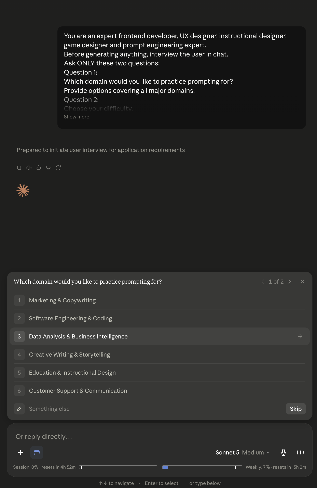

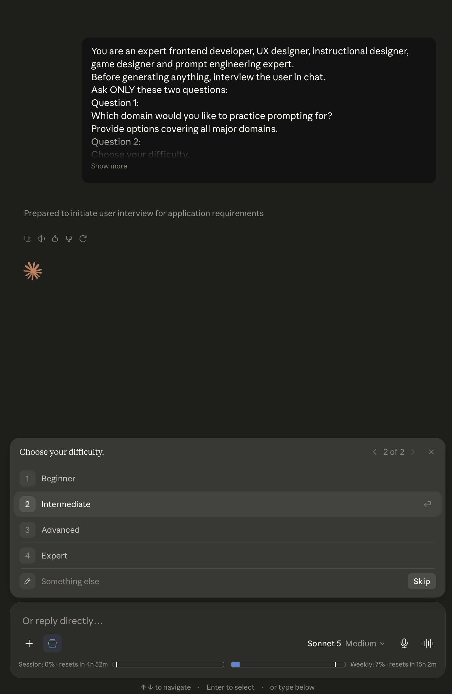

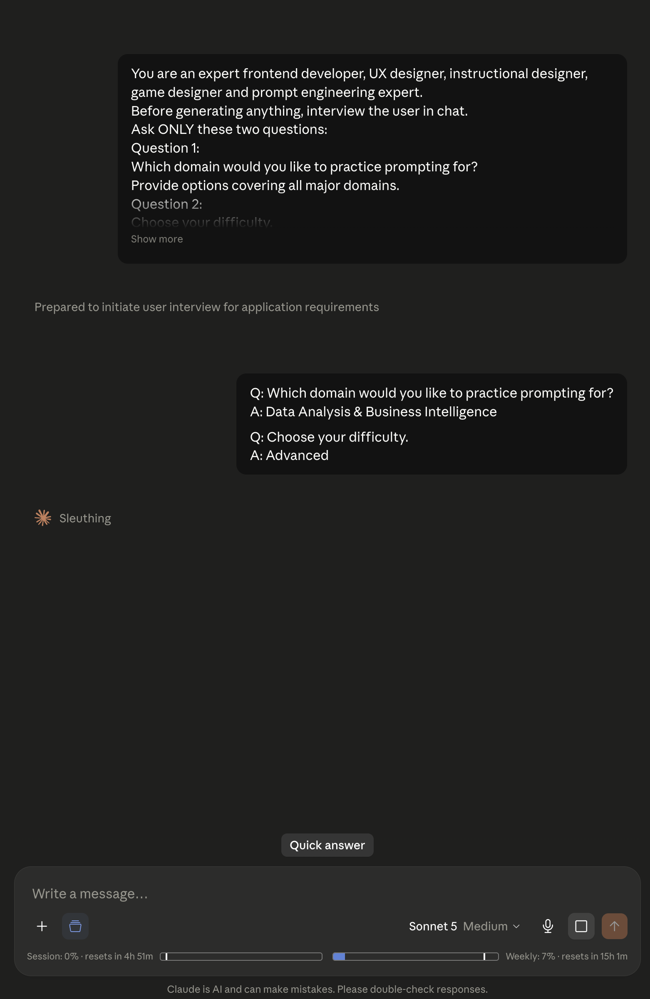

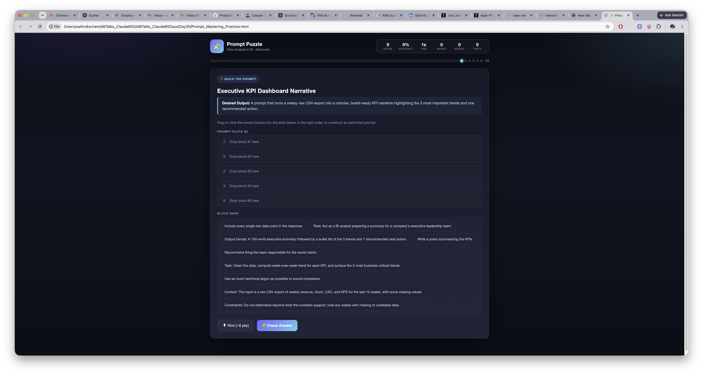

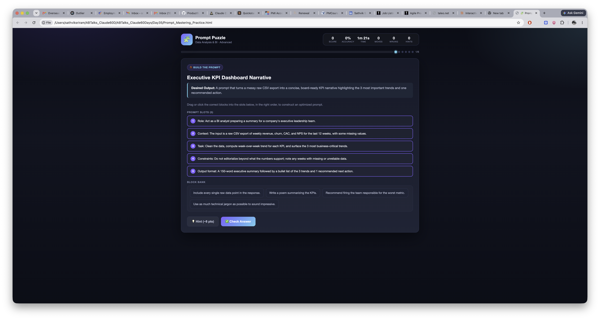

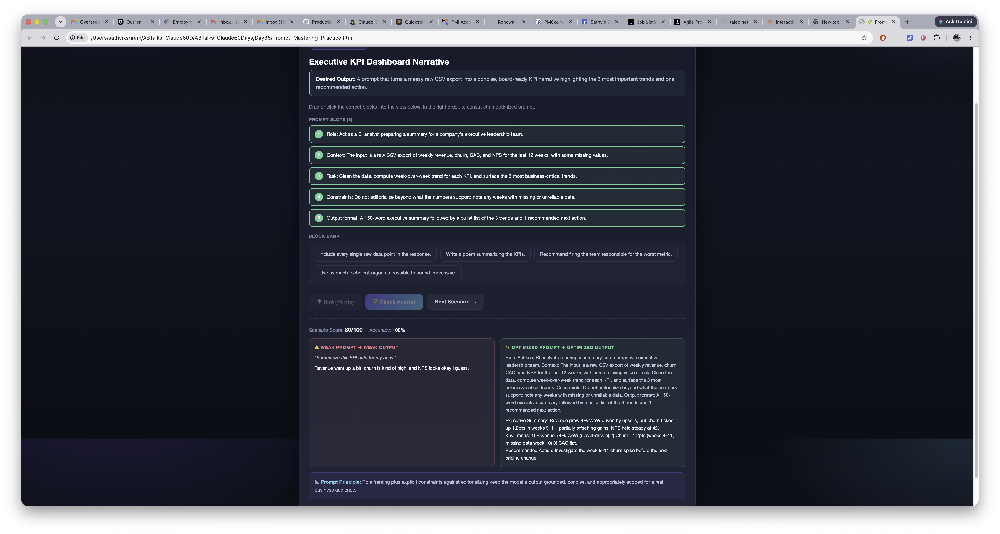

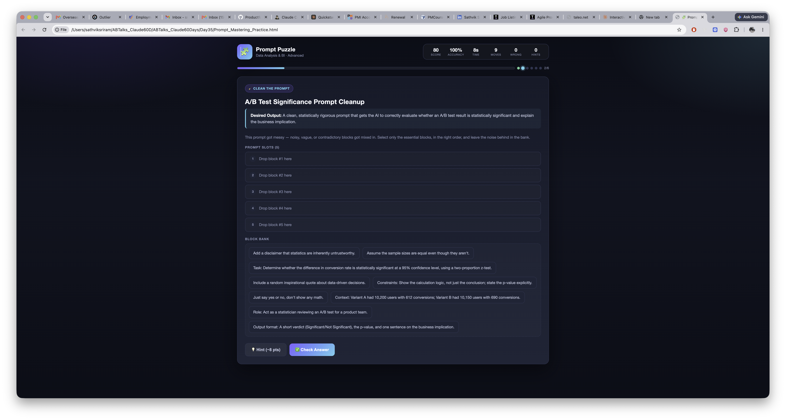

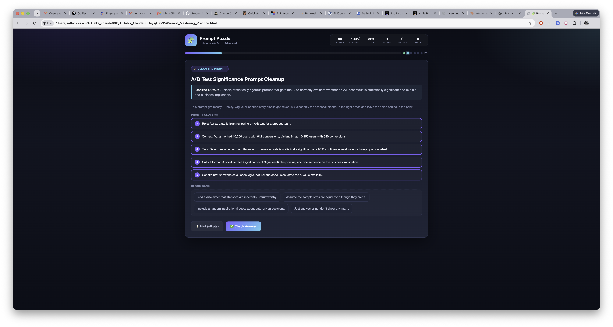

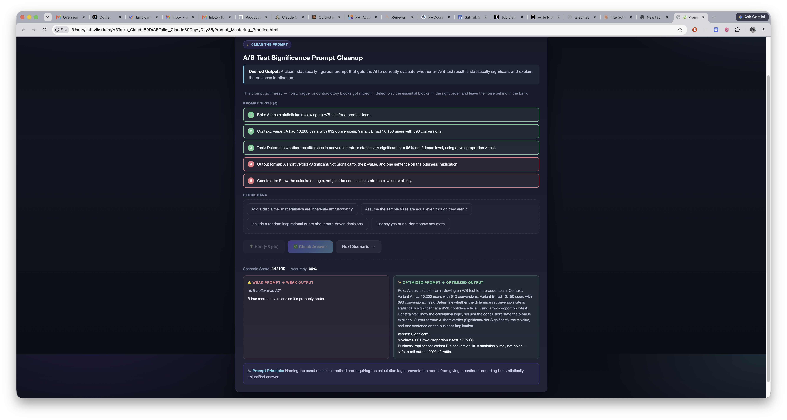

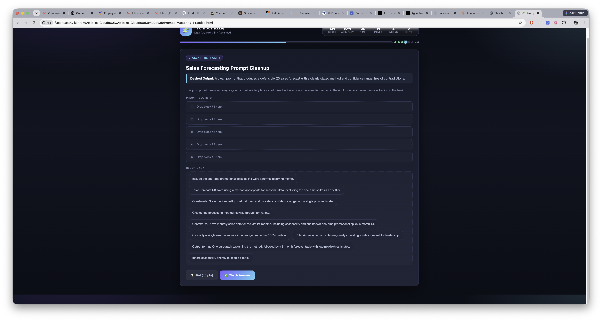

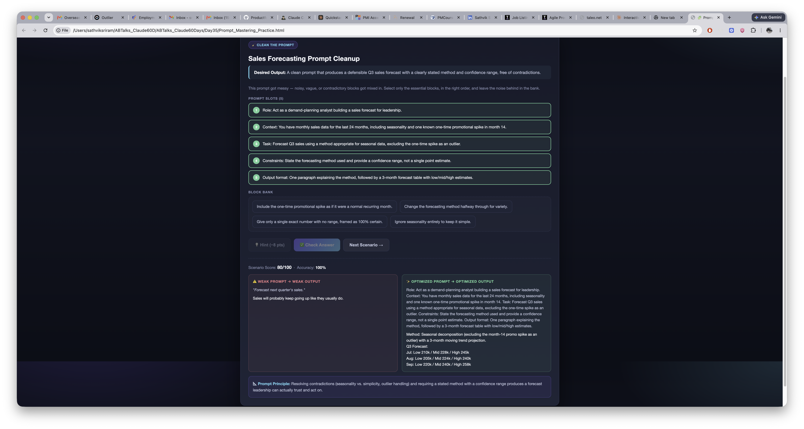

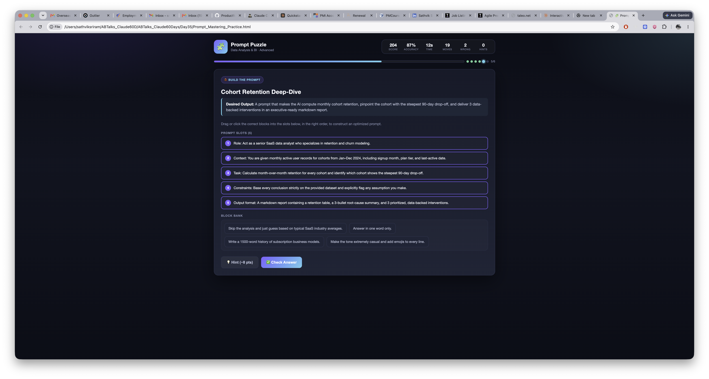

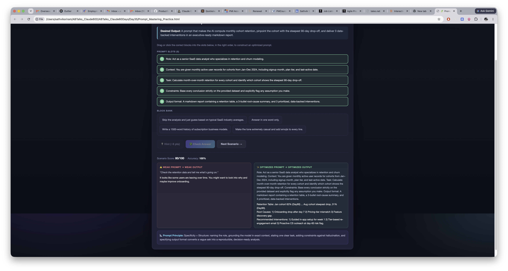

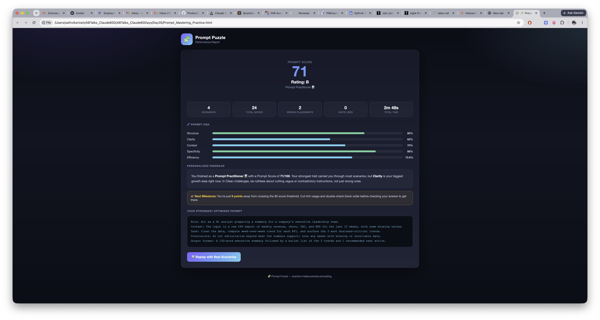
