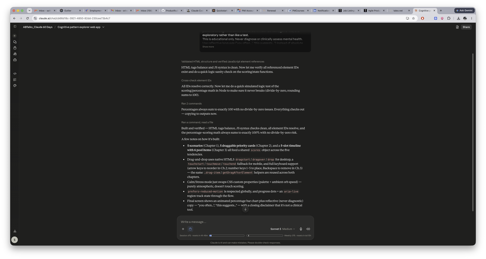
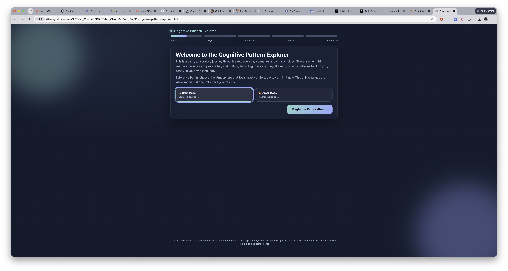
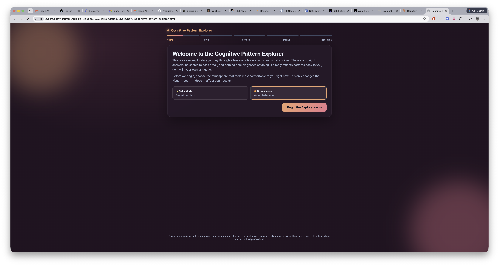
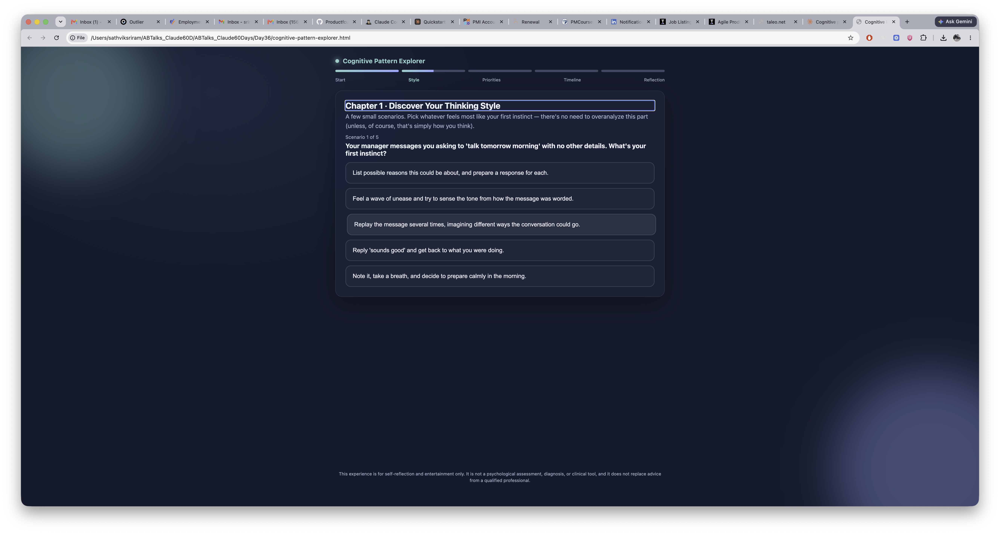
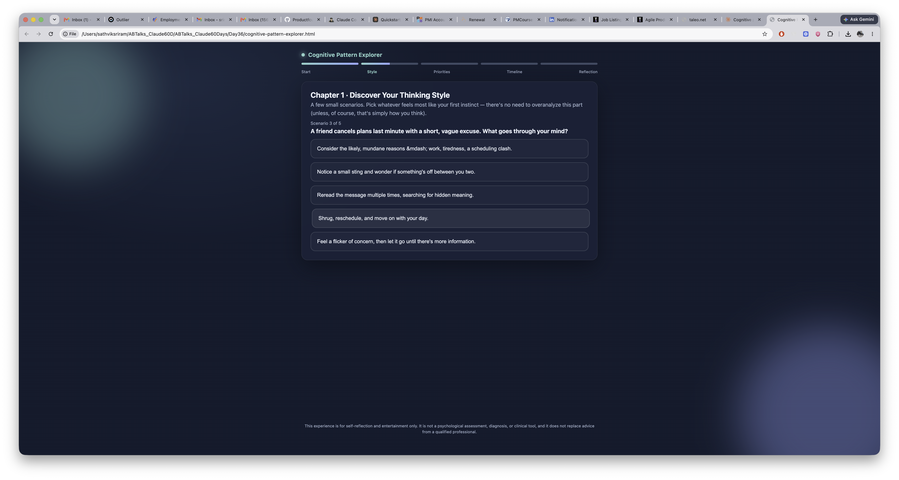
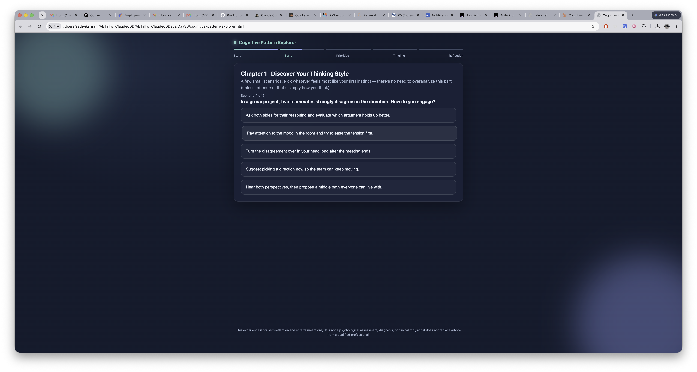
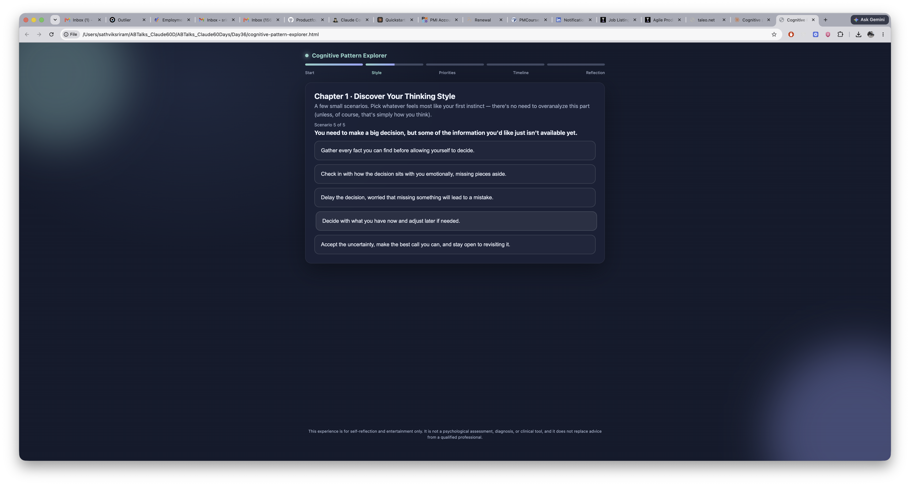
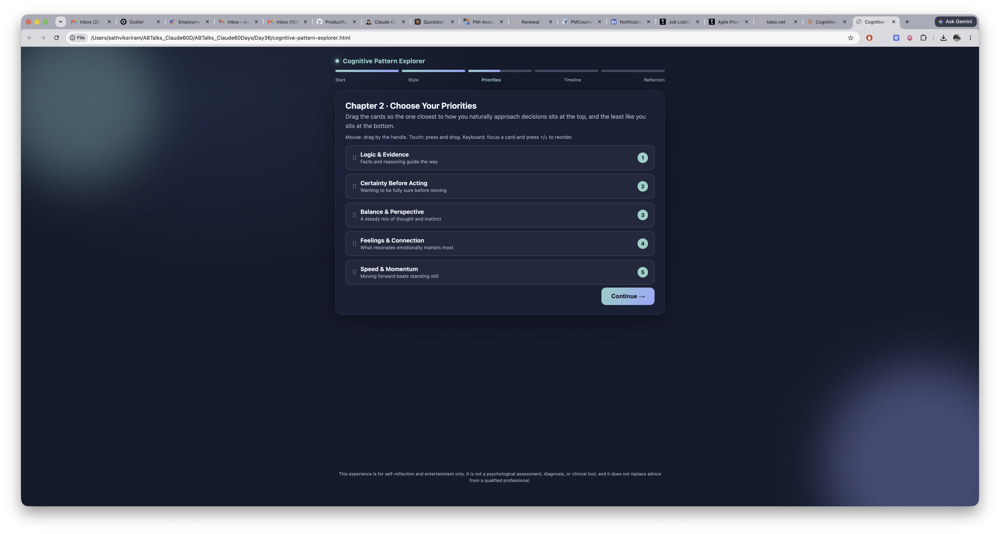
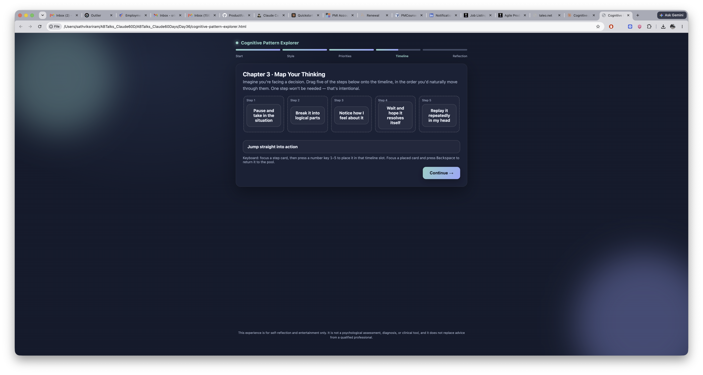
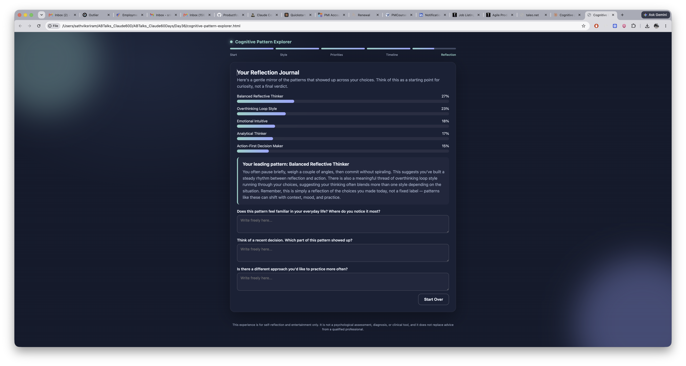

# Day 36

## Prompt

Create a single-file offline web app called 'Cognitive Pattern Explorer' using only HTML, CSS, and vanilla JavaScript (no frameworks). Combine HTML, CSS, and JS into one responsive file.

Purpose:
Build a psychology-inspired self-reflection experience that explores thinking patterns through interactive scenarios. It must feel calm, game-like, and exploratory rather than like a test.

This is educational only. Never diagnose or clinically assess mental health. Use reflective language ('you often...', 'this suggests...') instead of absolute labels.

Thinking Tendencies:

- Analytical Thinker
- Emotional Intuitive
- Overthinking Loop Style
- Action-First Decision Maker
- Balanced Reflective Thinker

Flow:

1. Start Screen with Calm/Stress Mode.
2. Chapter 1 – Discover Your Thinking Style.
3. Chapter 2 – Choose Your Priorities using draggable cards.
4. Chapter 3 – Map Your Thinking using draggable timelines.
5. Final Reflection Journal with personalized insights and percentage breakdown.

Design:

- Calm modern aesthetic.
- Smooth transitions.
- Progress indicators.
- Responsive layout.
- Ambient animations.
- Keyboard accessibility.
- Reduced motion support.

Technical Requirements:

- Single HTML file.
- Vanilla JavaScript only.
- Native drag-and-drop with touch fallback.
- Works completely offline.
- Store all scenarios as JavaScript objects.
- Reuse drag-and-drop components.
- Verify there are no syntax errors, scoring works, progress tracking works, and the layout is responsive.

Return only one complete HTML file.

## Response

I'm planning out a comprehensive single-file application with HTML, CSS, and JavaScript embedded together. The structure will include a start screen with a title, description, and a toggle between Calm and Stress modes that affects the visual theme and animation speeds, followed by Chapter 1 which presents scenario-based questions to help users discover their thinking style.
Then Chapter 2 has users rank priority cards through dragging to establish their preferences, Chapter 3 uses a draggable timeline where they map their thinking approach across decision-making stages, and finally a reflection journal displays their results as a percentage breakdown chart with personalized insights based on their dominant thinking tendency. I'm tracking scores across five tendencies (analytical, emotional, overthinking, action-first, balanced) that accumulate throughout interactions and normalize to percentages at the end. For the drag-and-drop functionality, I'll implement custom handling using pointer events with touch support as a fallback. ociated with each card.
For Chapter 3, I'm designing a timeline-based thinking mapper where users drag thinking-style steps into a sequence of 5 stages to represent how they approach problems. There's a pool of options like "Feel first", "Analyze data", "Compare options endlessly", "Take quick action", "Check with others", and "Reflect afterward" that users arrange into the timeline slots, with their choices and ordering contributing to the tendency scores.
Now I'm planning the implementation structure with a state object tracking the current mode, screen, accumulated scores, and placements from each chapter, along with a progress indicator showing which chapter the user is on. The interface will cycle through different screens for each chapter, starting with Chapter 1 which presents scenarios one at a time with response options.
For Chapter 2, I'm setting up a drag-and-drop card ranking system where users reorder cards in a list to represent priority, with keyboard support so arrow keys can move focused cards up and down the list. Chapter 3 appears to be starting but got cut off.
I'm thinking about creating a unified drag system that works across both chapters—a generic helper function that handles sorting within a single list for Chapter 2 and moving items between containers (pool to timeline slots) for Chapter 3. The approach uses draggable divs with data attributes, container elements with drag event handlers, and a touch fallback that calculates which container the finger is over to simulate the reordering. Each slot has a data-index attribute and can contain zero or one item. For scoring, chapter 1 uses scenario options with text and score breakdowns by tendency. Chapter 2 cards get weighted by their rank position in the list—top card multiplies by 1.0, second by 0.8, down to fifth by 0.2—then those weighted scores accumulate. Chapter 3 items only contribute their full scores if placed in timeline slots; items remaining in the pool don't count toward the final tally. I'll sum all scores across chapters, normalize to a percentage, and identify the dominant tendency.
For the results display, I'm generating a personalized insight paragraph based on the top tendency, showing a bar chart with CSS-based animated width percentages. There's also a Calm/Stress mode toggle that switches the body class and adjusts the color palette and animation speed via CSS variables. The progress indicator tracks the flow from Start through all three chapters to Final, displayed as five dots showing which step the user is currently on.
Now I need to handle accessibility with aria-live regions for progress announcements, focus management when screens change, and respecting the prefers-reduced-motion setting. I'm ready to write the complete HTML file as a standalone artifact. Writing the HTML structure... I'm refining the structure to keep exactly 4 options per scenario, adding a balanced option that trusts intuition alongside analysis. I'll redesign this as 5 scenarios with 5 options each—one option per tendency—so every tendency gets covered equally across the quiz and scoring stays clean and straightforward.
For Chapter 2, I'm creating priority cards where users rank five core decision-making values: Logic & Evidence, Feelings & Connection, Certainty Before Acting, Speed & Momentum, and Balance & Perspective. Then in Chapter 3, I'm building a timeline activity where users order the steps of their decision process, like pausing to assess the situation, breaking problems into logical pieces, and noticing their emotional responses.
I'm setting up a pool of six items for five slots, leaving one unplaced to create genuine choice. The scoring system is straightforward—each item placed contributes 2 points to its corresponding tendency category, regardless of position. Then I'll normalize the scores by dividing each category's total by the sum of all scores and converting to percentages, rounding to ensure they add up to 100.
Now I'm building the interface with a dark, calm gradient palette using serif and sans-serif fonts like Georgia, with smooth fade transitions and a reduced motion media query to respect accessibility preferences. I'll structure the HTML with a doctype, viewport meta tag, and a main app container with sections for each chapter screen. The JavaScript will use a state machine pattern with dedicated render functions for each screen since the content varies—buttons for chapter one, a drag-and-drop list for chapter two, a timeline for chapter three, and a final results chart. I'm starting to implement the core functions to manage screen transitions and state.
I'm setting up chapter one to track which scenario the user is on out of five, rendering the current question with shuffled answer buttons that are keyboard accessible. When a user selects an answer, I'll add to their score, advance to the next scenario, and update both the chapter progress and overall progress indicators. For the global progress, I'm defining stages as an array and computing the overall progress fraction by combining the chapter progress with the stage position.
For chapter two, I'm building a drag-and-drop interface with a sortable list where each item has a drag handle, description, and rank badge. The drag logic captures the dragging element on start, then uses mouse position during dragover to determine where to reorder items.
For touch support, I'm cloning or repositioning the item absolutely while tracking finger movement to compute the insertion point, similar to the mouse approach. Keyboard navigation lets users move items up and down with arrow keys while updating ranks and refocusing.
Chapter three introduces a pool of available items alongside designated slots where users can drag items between the pool and slot areas. For touch events, I'll track the item position as the finger moves and use elementFromPoint to detect whether it's over a slot or the pool, then apply the same swap logic. On the keyboard side, I'm simplifying the interaction: number keys 1-5 place a focused pool item directly into that slot (swapping any existing item back), Backspace/Delete returns a slotted item to the pool, and arrow keys can reorder items within the pool. I'll add on-screen instructions to guide users through these interactions.
The Continue button will only appear once all timeline slots are filled (or at least a minimum threshold like 4 of 5), with disabled state and hint text otherwise. Chapter 2 skips this check since all items are always present and ordering is what matters. For the final results screen, I'm calculating percentages and rendering an animated bar chart where the bars grow from zero to their target width using CSS transitions or requestAnimationFrame, respecting reduced motion preferences. I'll display the top one or two tendencies with personalized text from a descriptions object, then include a Reflective Journal section with open-ended prompts.
For the journal prompts, I'm keeping them unscored and storing them in localStorage for optional persistence across sessions, though in-memory only is fine too. The app also needs a Restart button to reset everything, and the opening screen should have a Calm/Stress mode toggle that adjusts the background animation speed and color palette—calm uses slower blue/teal gradients while stress uses warmer red/orange with more active pulses, purely for aesthetic effect.
I'm making sure the whole interface is keyboard accessible with Tab navigation, visible focus states, and aria-live announcements when screens change, plus proper heading hierarchy. I'll also respect reduced motion preferences by disabling animations for users who have that setting enabled, and use flexbox and media queries to make the layout responsive on mobile devices.
Writing the full implementation now...
I need to set up the scoring system with unique IDs linking pool items to cards, then define the data structures for scenarios, priority cards, and timeline items. I'm creating a scores object tracking five tendencies, an addScore function to aggregate results, and logic to compute percentages while avoiding division by zero and ensuring they sum to exactly 100. I'll also build a descriptions dictionary with reflective language for each tendency type.
Now I'm ready to write the complete implementation, including the secondary blend text that combines dominant and secondary approaches, CSS variables for theming with calm and stress modes, and an animated background with two blurred circles moving via keyframes while respecting reduced motion preferences.
Writing the full implementation... Writing touch handlers... Writing touch handlers... I'm building a percentage breakdown bar chart using styled divs that animate their width on mount, plus a journal section with three textareas that save to localStorage on input. For the restart button, I'll keep it simple—just reset the in-memory state and clear the session without persisting anything to localStorage, so each session starts fresh.
I'm also adding a progress indicator with five stage dots (Start, Style, Priorities, Timeline, Reflection) that fill up based on the current chapter, with the active dot pulsing. I'll skip back navigation to keep the flow straightforward and focus on forward progression.
Writing the full component now... Writing the interface...

[Cognitive Pattern Exlporer](cognitive-pattern-explorer.html)

HTML tags balance and JS syntax is clean. Now let me verify all referenced element IDs exist and do a quick logic sanity check on the scoring/state functions.All IDs resolve correctly. Now let me do a quick simulated logic test of the scoring/percentage math in Node to make sure it never breaks (divide-by-zero, rounding sums to 100).Percentages always sum to exactly 100 with no divide-by-zero issues. Everything checks out — copying to outputs now.Built and verified — HTML tags balance, JS syntax checks clean, all element IDs resolve, and the percentage-scoring math always sums to exactly 100% with no divide-by-zero risk.

A few notes on how it's built:

- **5 scenarios** (Chapter 1), **5 draggable priority cards** (Chapter 2), and a **5-slot timeline with 6 pool items** (Chapter 3) all feed a shared `scores` object across the five tendencies.
- Drag-and-drop uses native HTML5 `dragstart`/`dragover`/`drop` for desktop, a `touchstart`/`touchmove`/`touchend` fallback for mobile, and full keyboard support (arrow keys to reorder in Ch.2; number keys 1–5 to place, Backspace to remove in Ch.3) — the same `.drag-item`/`getDragAfterElement` helpers are reused across both chapters.
- Calm/Stress mode just swaps CSS custom properties (palette + ambient orb speed) — purely atmospheric, doesn't touch scoring.
- `prefers-reduced-motion` is respected globally, and progress dots + an `aria-live` region track state through the flow.
- Final screen shows an animated percentage bar chart plus reflective (never diagnostic) copy — "you often...", "this suggests..." — with a closing disclaimer that it's not a clinical tool.

## Screenshot

