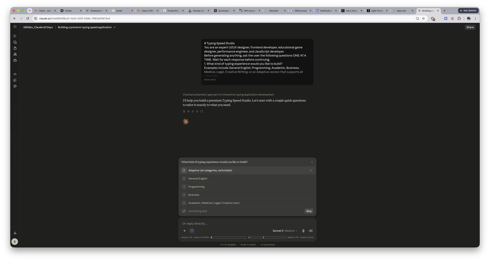
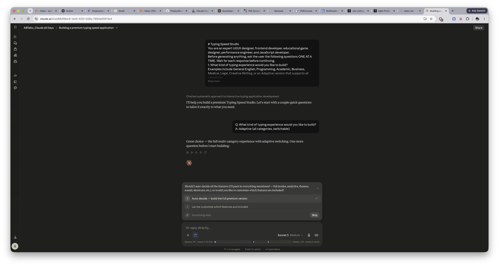
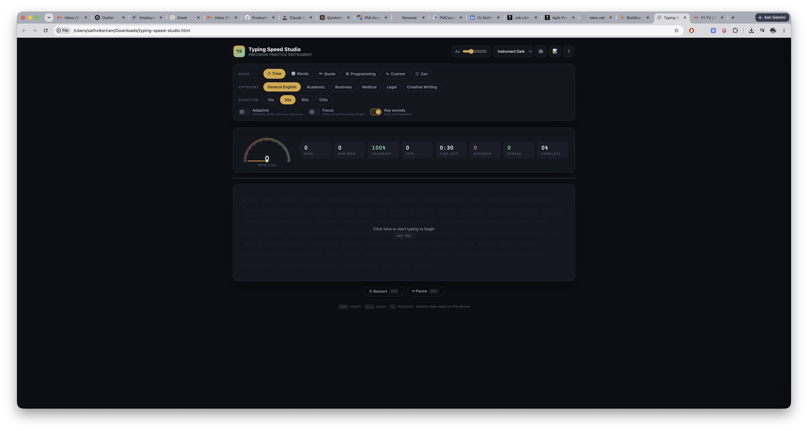
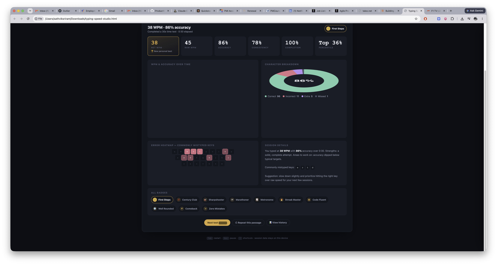
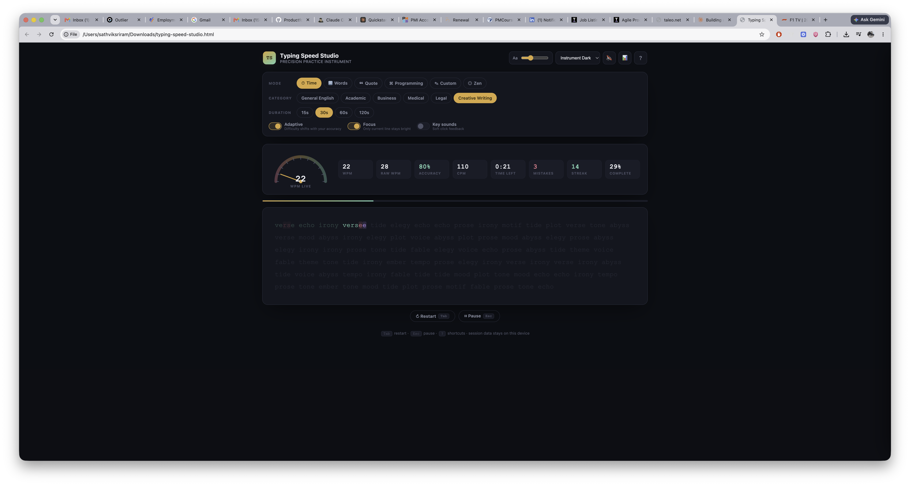

# Day 38

## Prompt

### Typing Speed Studio

You are an expert UI/UX designer, frontend developer, educational game designer, performance engineer, and JavaScript developer.

Before generating anything, ask the user the following questions ONE AT A TIME. Wait for each response before continuing.

1. What kind of typing experience would you like to build?

    Examples include General English, Programming, Academic, Business, Medical, Legal, Creative Writing, or an Adaptive version that supports all categories.

    If the user chooses the Adaptive version, the generated application should allow users to switch between categories.

2. Would you like Claude to automatically decide the features, or would you like to customize them?

    If the user chooses customization, ask which features they would like included.

    After collecting the responses, generate a premium single-page interactive HTML application called 'Typing Speed Studio'.

The application should feel like a polished commercial typing platform rather than a basic typing test.

Include multiple typing modes such as Time Mode (15, 30, 60 and 120 seconds), Word Count Mode (25, 50, 100 and 250 words), Quote Mode, Programming Mode (HTML, CSS, JavaScript, Python, Java, C++, SQL and other languages where appropriate), Custom Text Mode, Adaptive Mode that adjusts difficulty based on performance, Focus Mode where only the current line is visible, and Zen Mode for distraction-free untimed practice.

Generate practice passages dynamically according to the selected category. Programming mode should use realistic code snippets, business mode should use professional communication, medical mode should use medical terminology, legal mode should use legal text, creative writing mode should use literature-style passages, and so on. Do not hardcode the same practice paragraph for every mode.

Display live typing statistics including WPM, Raw WPM, CPM, Accuracy, Elapsed Time, Mistake Count, Current Streak, Completion Percentage, Remaining Time or Words, and a real-time progress indicator. Highlight correct characters, incorrect characters, the active cursor position, and completed text with smooth visual feedback.

After every completed session, generate a beautiful analytics dashboard inspired by modern typing platforms such as Monkeytype. Include WPM, Raw WPM, Accuracy, Consistency, Completion Percentage, Characters Typed (Correct, Incorrect, Extra and Missed), Mistake Count, Typing Rhythm, Error Heatmap, WPM Progress Graph, Accuracy Graph, Session Duration, Personal Bests, Percentile Estimate, Achievement Badges, and a detailed performance summary highlighting strengths, weaknesses, commonly mistyped keys, and personalized suggestions for improvement.

Ensure the calculations are accurate and never generate unrealistic values such as 20,000 WPM.

Store session history locally so users can review previous attempts, compare scores, monitor improvement over time, maintain streaks, and track personal records without requiring an account.

Include optional sound effects, keyboard shortcuts, pause and resume functionality, restart options, theme customization, font size controls, dark mode, responsive design, smooth animations, and accessibility features.

Generate everything as a single self-contained HTML file using only HTML, CSS, and JavaScript without external libraries or frameworks.

Design the interface as a premium commercial application with exceptional UI/UX, beautiful typography, modern layouts, polished micro-interactions, smooth transitions, and an experience that feels comparable to the best typing platforms available today.

## Response

Let me review the logic carefully for edge cases and fix a few bugs I caught (keyboard shortcut conflicts, word-count mode overflow, custom mode initial render).Now fixing the results-subtitle double-assignment, the word-count mode overflow bug, and the words-mode completion check:Now the important fix — restructuring the keyboard handler to not break standard Tab navigation and to let Escape close modals even when the modal itself has focus-trapping active:Now let's re-run the syntax check and a basic structural lint on the full file:All 73 referenced element IDs exist in the markup, and the JS parses cleanly. Let's finalize, copy to outputs, and present it.**Typing Speed Studio** is ready — a single self-contained HTML file, no external dependencies.

What's inside:

- **6 modes**: Time (15/30/60/120s), Words (25/50/100/250), Quote, Programming (HTML/CSS/JS/Python/Java/C++/SQL/TypeScript/Go with realistic snippets), Custom text, and Zen (untimed)
- **6 content categories** for Time/Words/Zen: General, Academic, Business, Medical, Legal, Creative Writing — each with its own vocabulary
- **Adaptive** toggle that raises/lowers word difficulty based on your rolling accuracy and speed, **Focus** toggle that dims everything but the active word/line
- Live stats: WPM, Raw WPM, CPM, Accuracy, elapsed/remaining time, mistakes, streak, completion %, plus a signature analog speed gauge
- A full post-session dashboard: WPM/accuracy graphs, character breakdown donut, a keyboard error heatmap, consistency score, percentile estimate, personal bests, a day streak, earned badges, and a written strengths/weaknesses summary
- History, personal bests, and streaks saved to `localStorage` — no account needed
- 4 themes (including a light "Solar" and a high-contrast mode), adjustable font size, key-click sound effects, pause/resume, and keyboard shortcuts (`Tab` restart, `Esc` pause, `?` help, `H` history)

Just open the file in any browser to try it — everything runs client-side.

[Typing Spee Studio](typing-speed-studio.html)

## Screenshot

