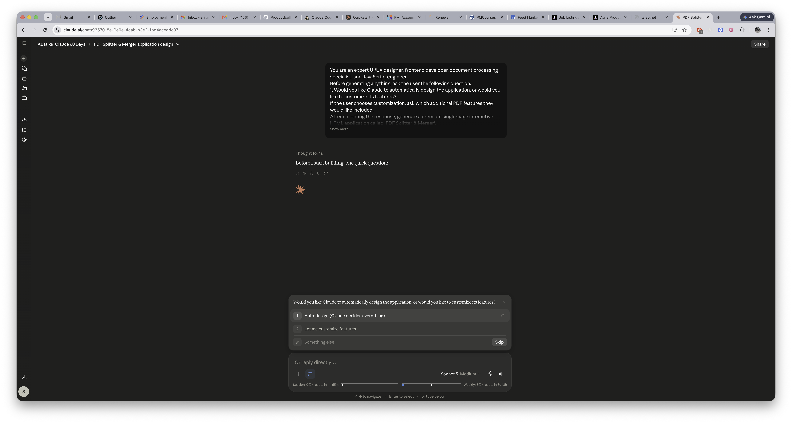
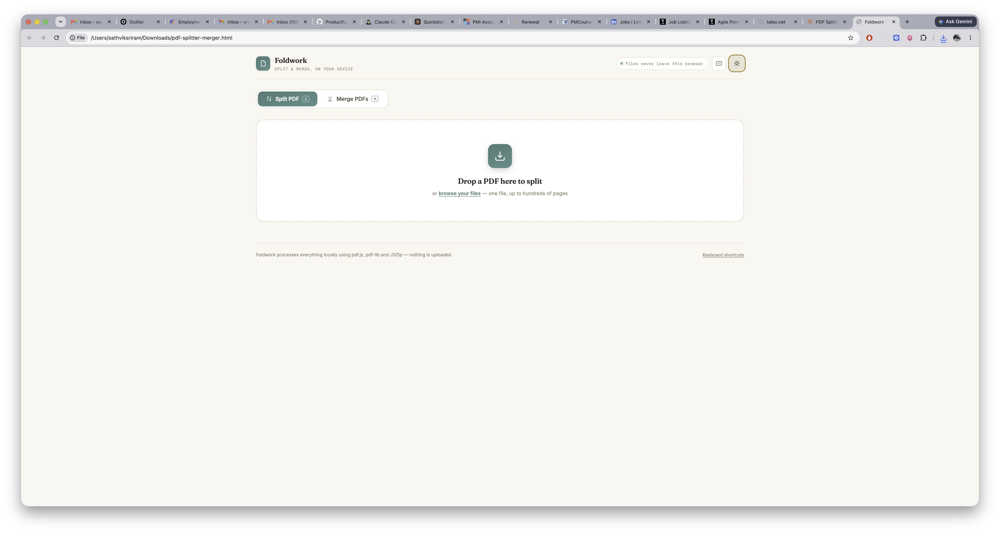
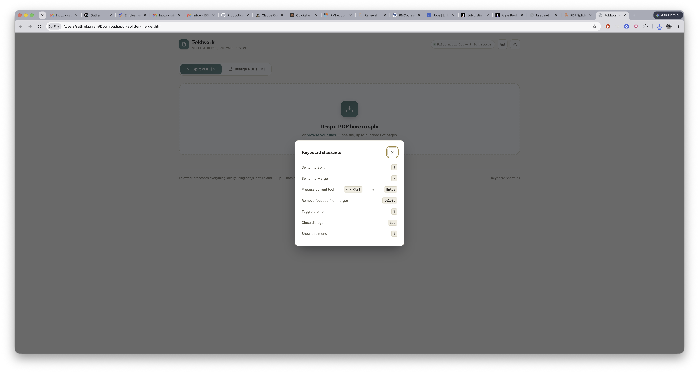
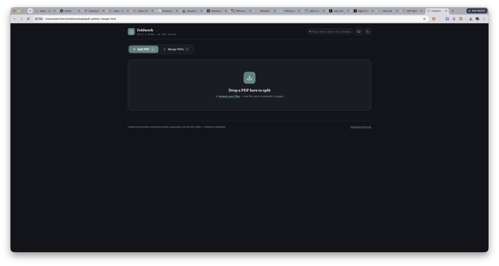
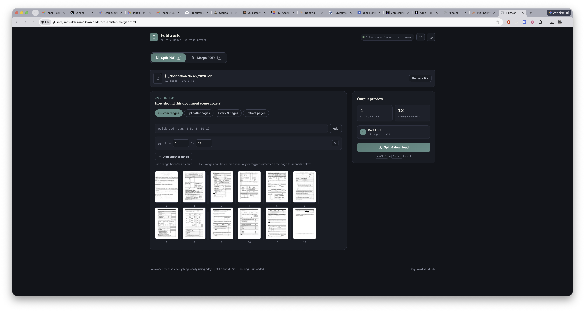
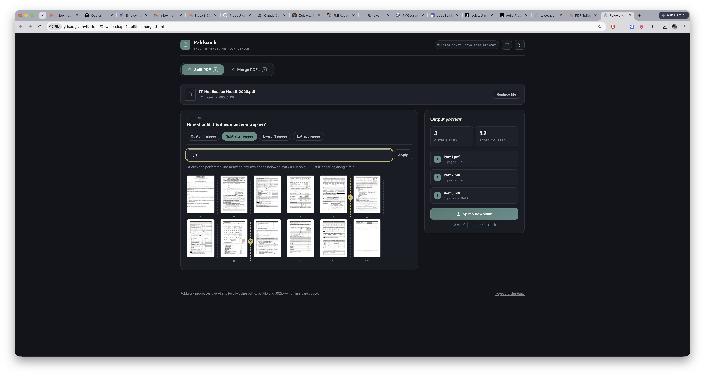
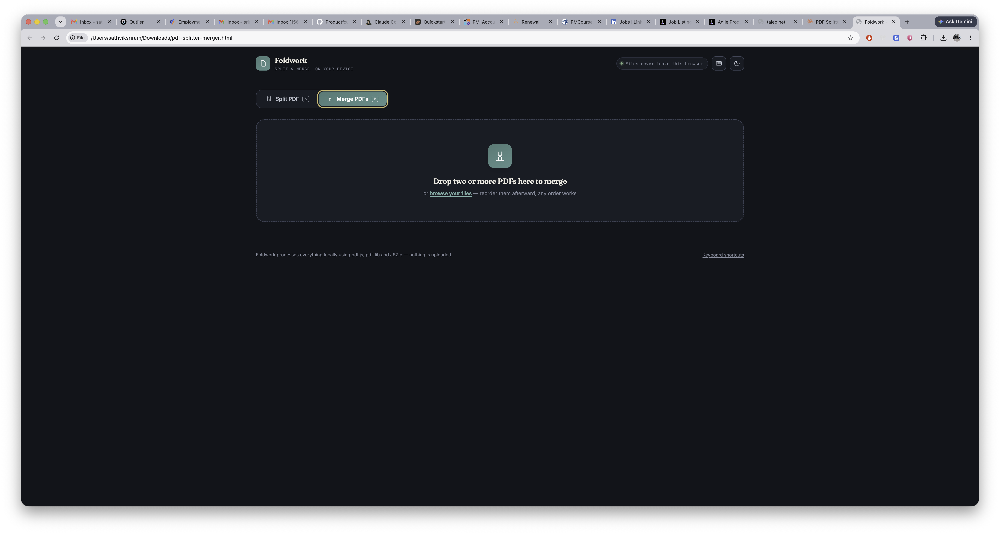
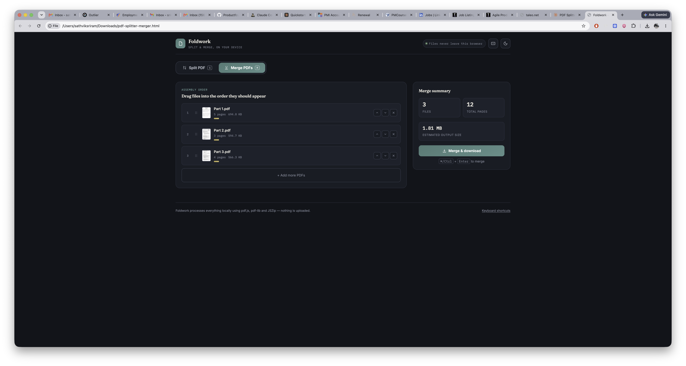

# Day 39

## Prompt

You are an expert UI/UX designer, frontend developer, document processing specialist, and JavaScript engineer.

Before generating anything, ask the user the following question.

1. Would you like Claude to automatically design the application, or would you like to customize its features?

If the user chooses customization, ask which additional PDF features they would like included.

After collecting the response, generate a premium single-page interactive HTML application called 'PDF Splitter & Merger'.

The application should provide two primary tools:

PDF Splitter:
Allow users to upload a PDF and automatically detect the total number of pages. Display visual page thumbnails for every page and allow users to preview the document before splitting. Users should be able to split the PDF by entering page numbers, selecting custom page ranges, splitting after specific pages, splitting every N pages, or extracting selected pages into one or more new PDF files. Allow users to create multiple split ranges in a single operation, validate all page ranges, preview the resulting document structure before processing, and clearly highlight invalid inputs.

PDF Merger:
Allow users to upload multiple PDF files using drag-and-drop or file selection. Display all uploaded files in a sortable list with page counts and visual previews. Users should be able to reorder the PDFs using drag-and-drop before merging. Display the total number of files, total page count, and estimated output before generating the merged document. Generate the merged PDF and provide an easy download option.

Perform all PDF processing entirely within the browser using client-side JavaScript. Do not upload files to external servers or rely on backend services. Use reliable browser-compatible libraries where necessary and ensure the application continues to work offline after the initial page load.

Include drag-and-drop uploads, processing indicators, loading animations, responsive layouts, dark mode, accessibility features, intuitive error handling, keyboard shortcuts where appropriate, and smooth micro-interactions throughout the application.

Generate everything as a single self-contained HTML file using HTML, CSS, and JavaScript only.

Design the interface as a polished commercial application comparable to professional PDF utilities, with exceptional UI/UX, beautiful typography, modern layouts, smooth animations, intuitive navigation, and an experience users would genuinely choose over existing online PDF tools.

## Response

he interface uses a two-tool workbench concept with tabs to switch between "Split" and "Merge" modes. Split view displays page thumbnails as a filmstrip with perforated edges marking potential cut points, while Merge shows file spines stacked like books that can be dragged to reorder. The key interaction is a dashed tear line with a scissor icon that appears when hovering between pages—clicking it sets a split point, making the PDF splitting feel like tearing perforated paper.
For the merge view, I'm adding a spine-stack with a thickness bar that visually represents relative page counts. I'll implement dark mode as the default using the ink palette, with a toggle to switch between light and dark themes. Given the scope of features, I need to structure the code carefully—starting with the HTML head section to load fonts and set up the basic document structure.
Building the HTML and styling... and validation feedback for invalid ranges, then a process button that generates the split PDFs via pdf-lib and offers zip or individual downloads with a progress indicator. The merge panel has a multi-file dropzone with a sortable, reorderable list showing thumbnails, filenames, and page counts, plus a totals summary before merging. I'm adding a footer with a privacy note, toast notifications for feedback, simple keyboard shortcuts accessible via a "?" modal, and basic accessibility features.
For bundling multiple split files into a zip, I'll use JSZip from CDN alongside pdf-lib to handle the download experience better than sequential file downloads.
Since this is getting complex, I'll build it iteratively with create_file and validate the JavaScript syntax with node --check on the extracted script content. I can't test CDN dependencies in the sandbox since they're client-side globals, but static syntax checking will catch any parsing errors.
I'm planning the architecture now: the state object will track the PDF document instances from both pdf-lib and pdf.js, the filename, total page count, thumbnail array, and a set of split points marking where to divide pages.
For the merge functionality, I'll maintain a separate state tracking uploaded files with their metadata like document instances, page counts, thumbnails, and file sizes. The core functions will handle PDF initialization, file uploads, thumbnail rendering with click handlers, range management for different split modes, and the logic to compute the actual output PDFs based on the selected mode.
The split processing will iterate through each computed output, creating new PDF documents and copying the appropriate pages using pdf-lib, then either download individually or bundle into a zip. For merging, I'll support drag-and-drop reordering of files, then process the merge by copying pages from each file in order into a single document. I'm also adding utility functions for toast notifications, loading states, and a theme toggle that persists in memory. Building the single HTML file now with vanilla JavaScript and CSS variables for the theme system. I'll structure it with inline styles and scripts, then implement the perforation cut-line feature between thumbnail pairs—showing a dashed line and scissors icon on hover that toggles a "cut" state when clicked. Now I'm laying out the UI structure with the split panel showing the toolbar and mode-specific controls on the left alongside the page thumbnail grid, while the right side displays a sticky output preview card with the resulting file parts and validation errors. For the merge panel, I'm setting up a dropzone with a sortable file list on the left and a summary card on the right showing totals and download options. For performance with large PDFs, I'll render thumbnails using pdf.js at a small scale and cache them as data URLs in state.
I'm going to implement lazy loading with IntersectionObserver for thumbnail rendering to keep things responsive even with bigger documents, but keeping it straightforward for typical use cases around 50 pages. Now I'm ready to write the complete file with all the HTML structure, CSS styling including custom properties and animations, and JavaScript logic for PDF handling, split/merge operations, drag reordering, notifications, keyboard shortcuts, and theme toggling.
For the merge list I'll use native HTML5 drag events with keyboard alternatives like move buttons for accessibility since drag-and-drop isn't keyboard accessible by default. The split ranges input will accept flexible formats like "1-5, 8, 10-12" for quick entry, plus a UI with individual range rows that validate for overlaps and bounds. I'll also add a "split every N pages" option that calculates the number of parts needed, and a "split after specific pages" feature where users provide comma-separated page numbers.
Writing the complete implementation... I need to add validation for the range inputs with red outlines and error messages when values are invalid. Then I'll calculate the estimated merged output size by summing file sizes and noting it's approximate. For keyboard shortcuts, I'm adding S/M to switch tabs, ? for the shortcuts modal, Ctrl/Cmd+Enter to trigger processing, Delete/Backspace to remove files, and Esc to close modals—plus implementing a simple focus-trapped modal to display the shortcuts list. Now I'm ready to start writing the implementation.
I'll structure everything with strict mode and an IIFE, loading Google Fonts for Fraunces, Inter, and IBM Plex Mono. I'm using pdf.js version 3.11.174 from CDN with the matching worker source configured, and I'll write the complete file in one go.
Writing the full application code... Finalizing the color palette with ink navy as the base, teal and brass accents for the duotone, and complementary light theme variants—establishing hex values for both dark and light modes across backgrounds, text, and accent colors.
Adding the remaining semantic colors for danger and success states, then defining the typography stack with Fraunces for display, Inter for body text, and IBM Plex Mono for code.
Writing the complete HTML file now...

[Foldwork - PDF splitter & merger app](pdf-splitter-merger.html)

JavaScript syntax checks out. Here's the app:**Foldwork** — a single self-contained HTML file, entirely client-side (pdf.js for rendering, pdf-lib for splitting/merging, JSZip for bundling multi-file split output).

What's inside:

- **Split**: upload → live thumbnail grid → four modes (custom ranges, split-after-pages with a clickable perforated "cut line" between thumbnails, every N pages, extract-to-one-file) → live validated output preview → download (auto-zips if multiple files result).
- **Merge**: drag-and-drop multiple PDFs → reorderable list (drag or up/down buttons) with per-file thumbnail and page count → running totals and estimated size → single merged download.
- Dark/light theme toggle, keyboard shortcuts (`S`/`M` to switch tools, `⌘/Ctrl+Enter` to process, `?` for the shortcuts list), toasts, progress overlay, and accessible focus states throughout.

Just open the HTML file in any browser — everything runs offline after the first load, no files ever leave the device.

## Screenshot

