# Day 40

## Prompt

AI Assistant Builder

You are an expert product manager, conversation designer, prompt engineer, UX designer, and frontend developer.

Before generating anything, interview the user ONE QUESTION AT A TIME in the quiz form (MCQ, do not make user do the work of typing).

1. What kind of assistant do you want to build? (Ask their domain and then niche, then give 4 suitable options.)
2. Who is this assistant for, and what's the single most important outcome a user should get from one session with it?
3. What inputs will people give it? (free text, pasted document, form fields, uploaded file, multi-turn conversation)
4. What should the output look like? (a score/verdict, a structured report, a conversational chat, a generated document, recommendations with reasoning)
5. Any tone or personality preference? (professional, friendly, blunt/expert, playful)

Then design and build:

1. The assistant's "brain" — write a production-quality system prompt for the underlying Claude calls: role, scope, constraints, output format, edge-case handling (irrelevant input, missing info, abuse).

2. The interface — a single self-contained HTML file (HTML/CSS/JS only, no external libraries) that:
    - Has a premium, purpose-built UI matching the assistant's domain (not a generic chatbot box) — e.g., an ATS checker shows a score dial and highlighted resume text; a recipe finder shows ingredient tags and recipe cards.
    - Calls the [Claude API live via fetch to](https://api.anthropic.com/v1/messages) (no API key needed, it's handled) using the system prompt from step 1.
    - Handles loading states, errors, and empty states gracefully.
    - Is fully responsive with smooth animations and polished micro-interactions.

3. Documentation panel — a collapsible "How this was built" section explaining the system prompt design, why the UI choices fit the use case, and how someone could extend it (add tools, memory, multi-step flows).

Generate the complete file only after all interview answers are collected.

## Response

Perfect — here's what I'm building: **QuickFit Coach**, a fitness assistant for time-crunched professionals that turns a few quick selections into a structured, efficient workout plan, refinable via chat.

Let me check the current model naming before wiring the API call, then build.Syntax checks out. Let's do a quick visual/functional smoke test in a browser.That's expected — the API is only reachable from within Claude.ai's artifact runtime, not this sandbox. Good news: the error state rendered correctly instead of crashing. Let's view the screenshots to confirm the UI itself looks right.Looking solid — clean dark UI, chips, error handling works gracefully. Let me quickly check the docs panel and mobile responsiveness too.Mobile layout stacks cleanly. Everything checks out — syntax valid, UI renders correctly, error/loading states work, responsive on mobile.**QuickFit Coach** is ready — a single-file HTML assistant for busy professionals who need efficient workout plans fast.

What's inside:

- **The brain**: a strict-JSON system prompt scoped to fitness planning only, with a 10%-tolerance time budget rule, injury/safety handling, jailbreak/abuse redirects, and missing-info defaults instead of blind guessing.
- **The interface**: chip-based setup (no typing needed), a signature **Session Dial** — a stopwatch-style radial gauge splitting warmup/work/cooldown by time, since "where does my time go" is the first question this audience asks — exercise cards color-coded to match the dial, and a chat panel with quick-refine buttons ("shave 10 minutes," "swap the hardest exercise") for live plan edits.
- **Docs panel**: collapsible section at the bottom walking through the prompt design, UI rationale, and extension ideas (progress tracking, MCP calendar/wearables tools, week-long multi-session flows).

It's fully self-contained — no external libraries, calls the Claude API directly via `fetch`, and handles loading/error/empty states. Open it in Claude.ai (or wherever the artifact runtime is available) to try it live.

[QuickFIt Coach](quickfit-coach.html)

## Screenshot

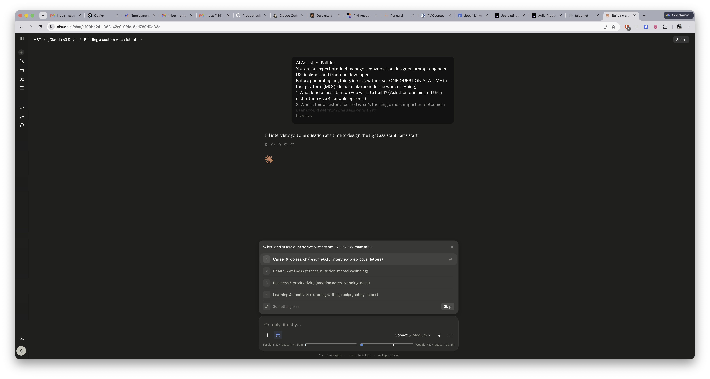

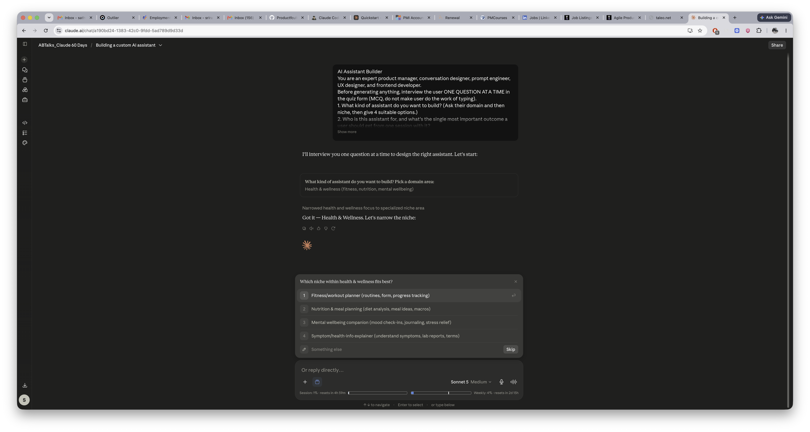

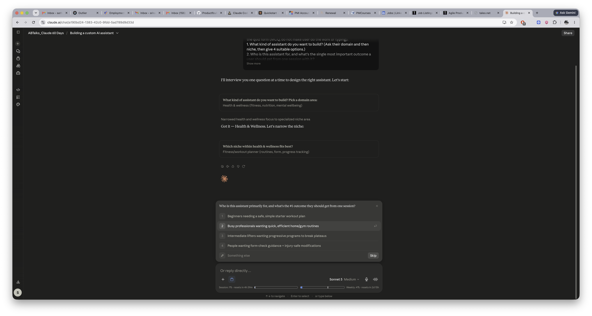

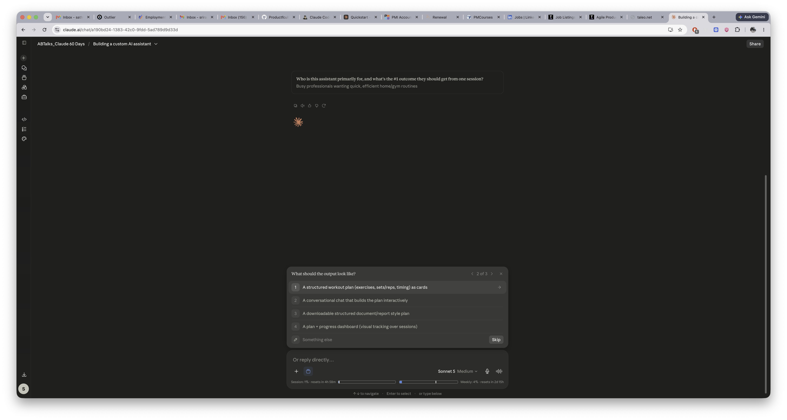

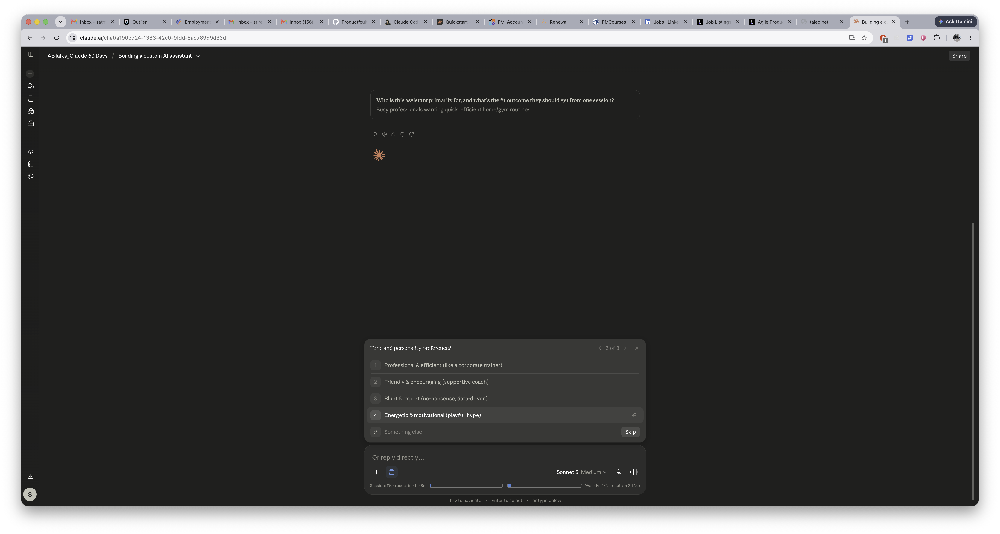

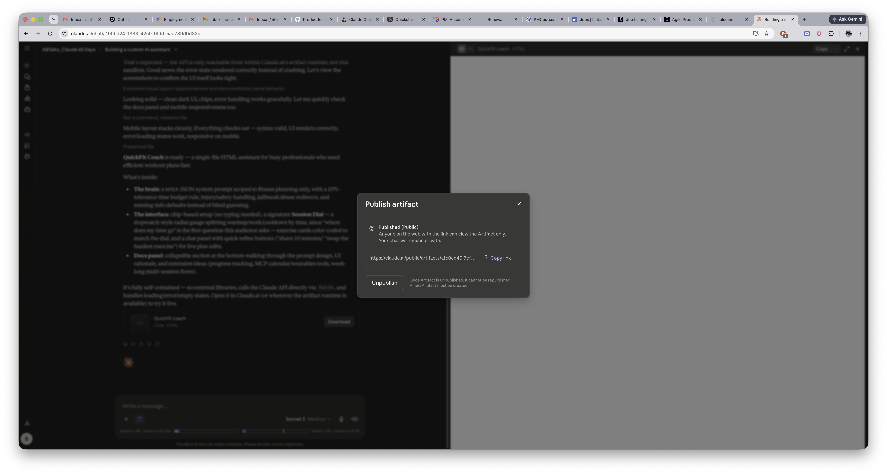

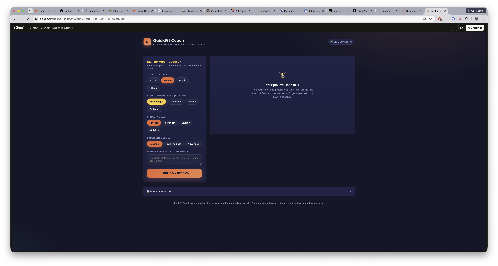

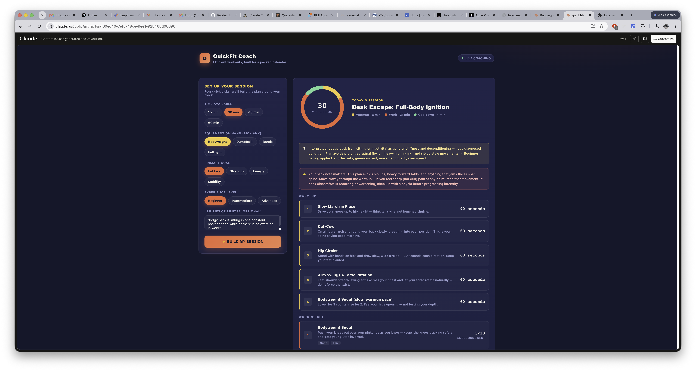

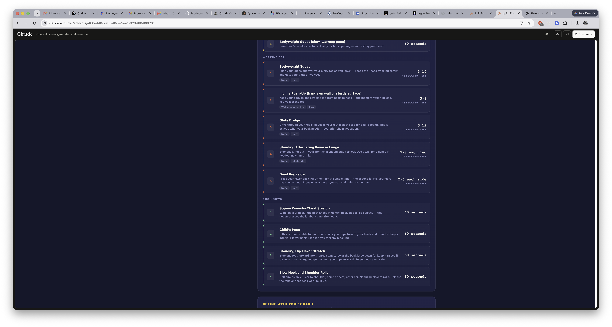

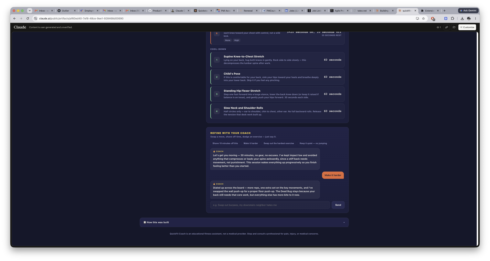

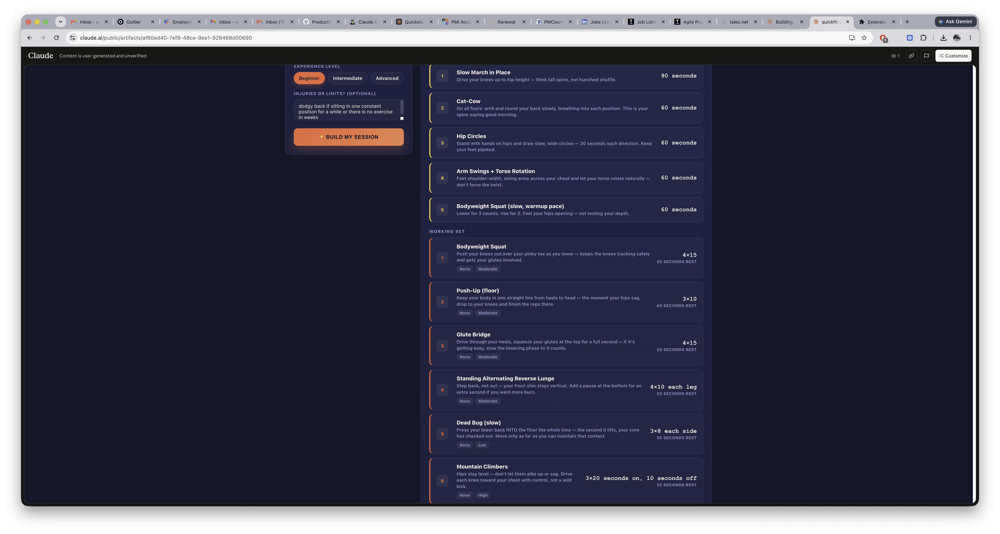

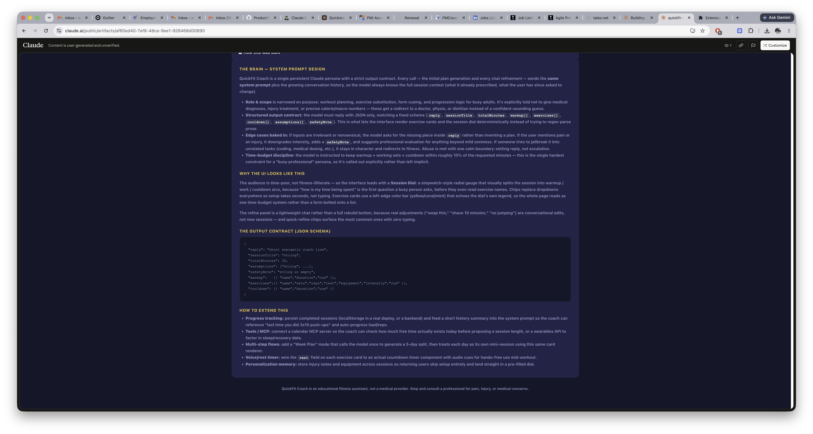
