# Day 41

## Prompt

### Interactive Learning Studio

You are an expert educator, curriculum designer, instructional designer, subject matter expert, UI/UX designer, and senior frontend developer.

Before generating anything, ask the user the following questions ONE AT A TIME, in MCQ format only, no user typed input (keep that as last option).

1. What kind of Interactive Learning Studio would you like to build?
(Offer domains and subjects.)

2. Continue asking follow-up questions until the requested subject has been narrowed to a topic that can realistically be taught in a single comprehensive interactive tutorial.
    Do not stop after identifying only a domain or subject. Use your own judgment to determine when the scope is appropriate.
    Example:
    Programming → Python → Object-Oriented Programming.

    The topic should be broad enough to include multiple related concepts but focused enough to be completely taught within one tutorial.

3. Would you like Claude to automatically structure the tutorial, or would you like to customize its sections?
    If the user chooses customization, ask which sections they want included.

After collecting all responses, generate a premium single-page interactive HTML application called 'Interactive Learning Studio'.

The application should teach the selected topic completely rather than creating a learning roadmap or summary. The chosen topic should already be known and must not be requested again inside the HTML.

Begin with an introduction containing learning objectives, estimated completion time, prerequisites (if any), expected outcomes, and a reward system.

Divide the tutorial into four progressively difficult modules, moving from foundational understanding to practical application and mastery.

Each module should include:
    - Detailed explanations
    - Topic-specific examples
    - Analogies
    - HTML/CSS/SVG diagrams where appropriate
    - Comparisons
    - Practical exercises
    - Common misconceptions
    - Key takeaways
    - Interactive elements

After each module, include a 4-question interactive quiz with automatic scoring, instant feedback, explanations for every answer, and a short performance summary before unlocking the next module.

Conclude with:
    - Final practical challenge
    - Cheat sheet
    - Summary notes
    - Continue Learning section
    - Books
    - Documentation
    - Research papers (where appropriate)
    - Communities
    - Practice platforms
    - Search keywords
    - Additional AI prompts for further learning.

Every lesson, example, analogy, diagram, exercise, quiz, and challenge must be generated specifically for the selected topic.

Generate everything as a single self-contained HTML file using only HTML, CSS, and JavaScript only, without external libraries or frameworks.

Design the interface as a polished commercial learning platform with responsive design, dark mode, smooth animations, progress tracking, quiz scoring, completion tracking, printable notes, and an intuitive user experience.

## Response

I'm structuring a comprehensive statistics course with four progressive modules: starting with central tendency measures like mean, median, and mode alongside data type fundamentals, then moving into dispersion concepts like range, variance, and standard deviation, followed by distribution shape analysis including skewness, kurtosis, and outlier detection.

Now I need to build this as a single HTML file with a polished frontend design, so I'm checking what approach would work best for creating an interactive, visually appealing learning toolkit.

Given the scope of four modules with quizzes, intro and conclusion sections, dark mode support, progress tracking, and printable notes, I'm going to build this as one comprehensive HTML file using templated functions to generate the quiz and module content efficiently, keeping the code organized and manageable within reasonable size constraints.

Let me outline the content structure in detail before I start coding: the first module covers foundational concepts like measures of central tendency and data types, then I'll move through dispersion, distributions, and correlation with concrete examples throughout.

For consistency across all modules, I'll use a recurring dataset—Ms. Rivera's Statistics Class with quiz scores from 15 students—and introduce a second skewed dataset like household income to show how different distributions behave.

In the first module on central tendency, I'm covering mean, median, and mode with their definitions and formulas, then explaining when each measure works best depending on outliers and data type. I'll use intuitive analogies—the mean as a seesaw's balance point, the median as the middle person in a line, the mode as the most popular menu item—and create a visual number line showing the balance point. I'm also building an interactive comparison table showing how each measure handles different data types and outlier sensitivity, plus an exercise where users can edit data points and see the mean, median, and mode update in real time, and I'll address common misconceptions about when each measure is appropriate.

For Module 2 on spread and dispersion, I'm introducing range, variance, standard deviation, IQR, and quartiles, with special attention to the population versus sample variance formula difference. I'll use the analogy of spread as how far people stand from home base, create visualizations like a dot plot with deviation arrows and a box plot diagram, then build an interactive calculator where adjusting the dataset shows how variance, standard deviation, and IQR change with a visual representation of the spread, and I'll clarify misconceptions about standard deviation.

Now moving into Module 3 on distribution shape, covering skewness, kurtosis, the normal distribution, the empirical rule with its 68-95-99.7 bands, z-scores, and outlier detection methods using both IQR and z-score approaches. I'm using the analogy that skew is like a tail pulled by extreme values and z-scores represent how many steps away from the crowd, creating SVG visualizations of normal curves and comparing symmetric versus skewed distributions to show how the mean-median relationship shifts with skewness. I'll build an interactive tool with a slider that changes the skewness of a histogram and shows the mean-median shift, plus a z-score calculator, while addressing misconceptions about skewed data always having outliers.

For Module 4, I'm bringing everything together with practical application—teaching how to choose the right chart type, building box plots from the five-number summary, and creating a decision framework for selecting appropriate measures based on data shape and type. I'm including a real-world case study that combines all the concepts learned, with SVG diagrams showing labeled histograms, box plots, and a decision flowchart, then wrapping up with an interactive mini case-study where users analyze a dataset, select appropriate measures, identify the distribution shape, and receive feedback on their choices.

The final section includes a comprehensive practical challenge where users work through a complete dataset analysis—computing all the key statistics, identifying skewness and outliers, and selecting the best visualization—followed by a quick-reference cheat sheet with all formulas, summary notes, and resources for continued learning.

I'm also planning a rewards system with badges and points for quiz completion and learning streaks to keep engagement high.

For the implementation, I'll use localStorage to persist user progress, quiz scores, and unlocked modules since this will be a standalone HTML file that users download and open directly in their browser.

[Learning studio: Descriptive statistics](interactive-learning-studio-descriptive-statistics.html)

What's inside:

- **Live "instrument dial" hero** — add/remove data points and watch mean, median, and mode update in real time on an SVG gauge
- **4 progressive modules**: Central Tendency → Spread → Distribution Shape → Visualization & Mastery, each with worked examples (a running "quiz scores" dataset), analogies, SVG diagrams, comparison tables, editable interactive exercises, common misconceptions, and key takeaways
- **4-question auto-scored quizzes** after each module with instant per-question feedback and explanations, gating the next module
- **Final Practical Challenge** — a guided 6-step real dataset investigation with a completion certificate
- **Cheat sheet, summary notes, and a Continue Learning section** with books, docs, communities, practice platforms, search keywords, and AI prompt ideas
- **Dark mode, progress ring, badges, confetti celebrations, and print-friendly notes**

## Screenshot

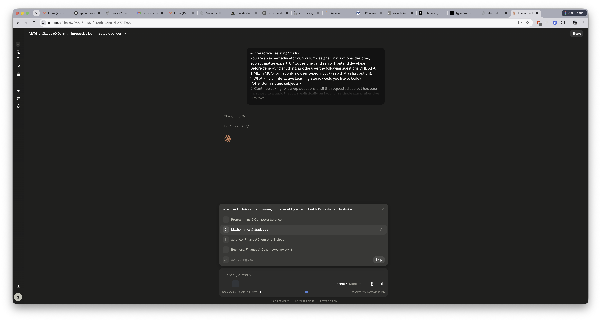

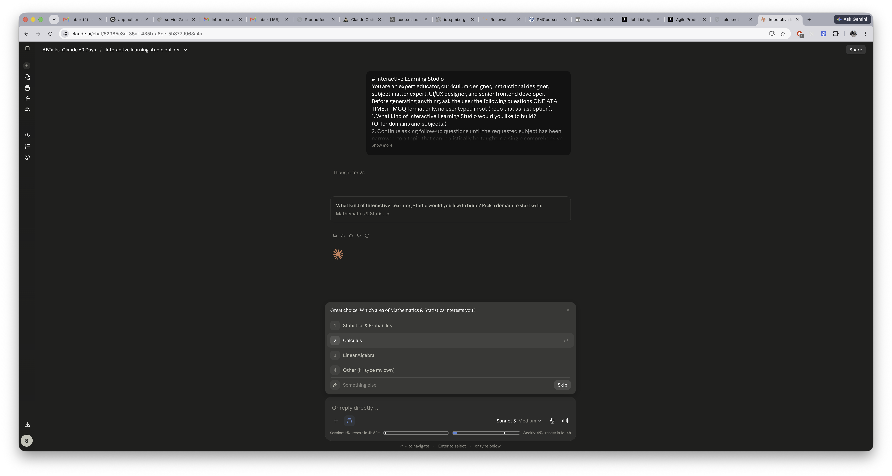

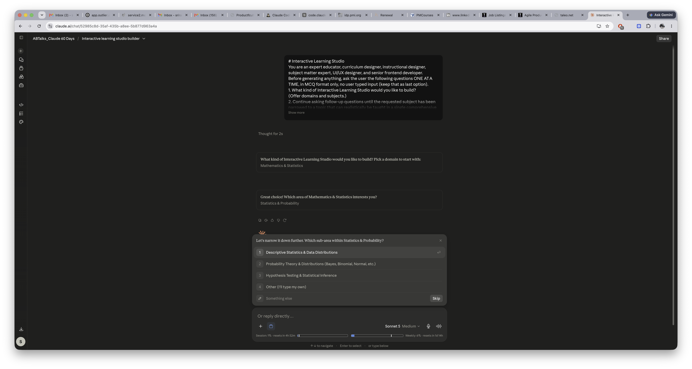

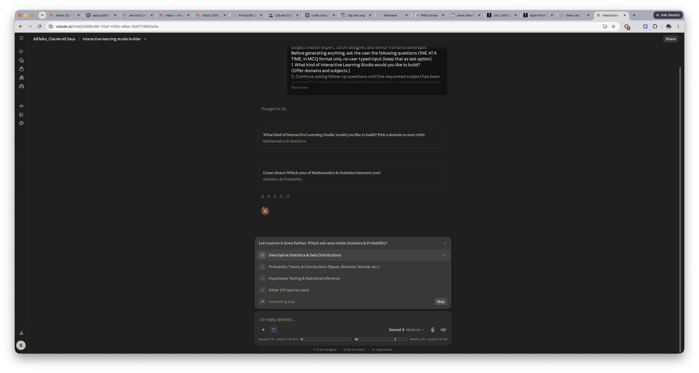

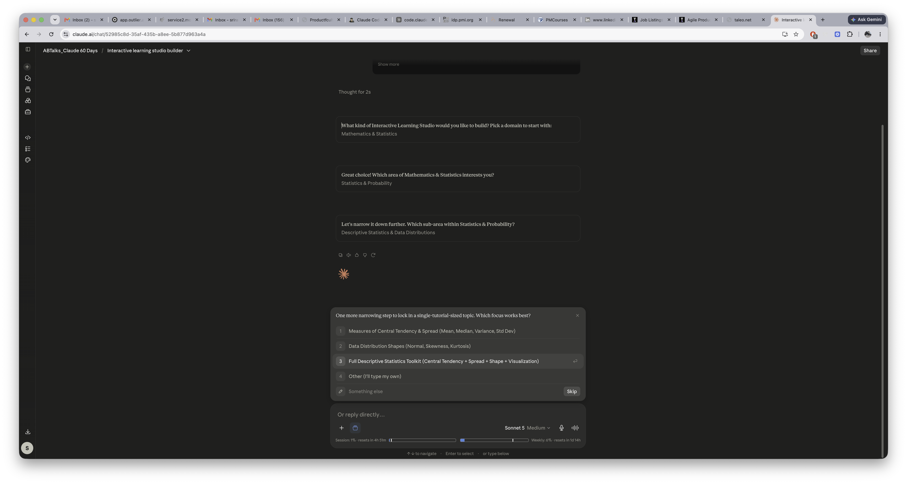

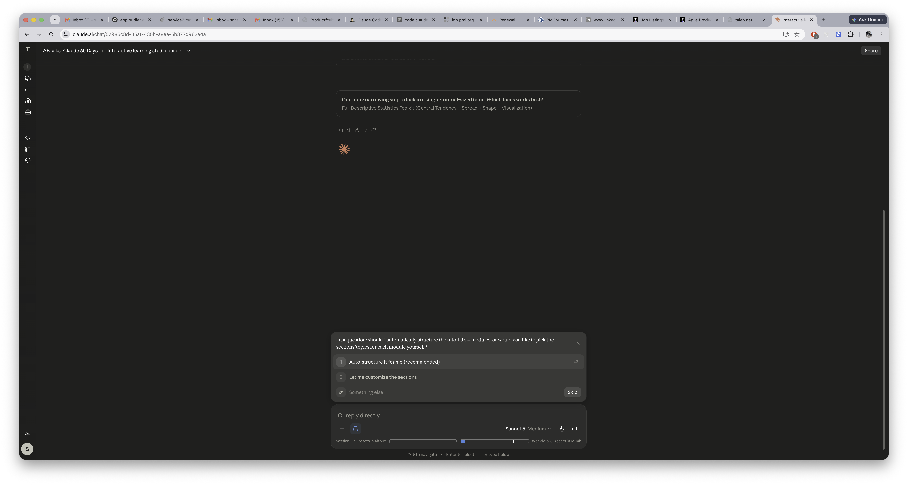

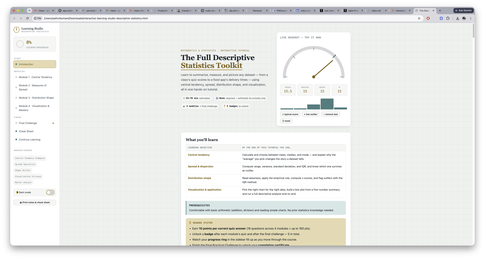

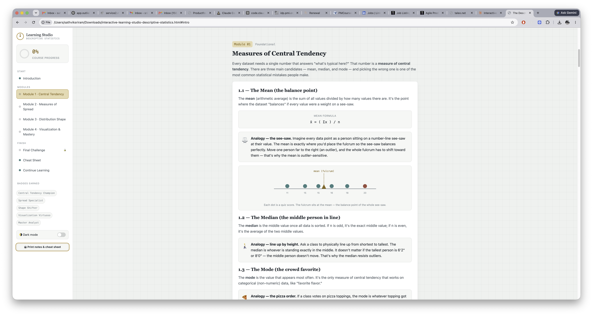

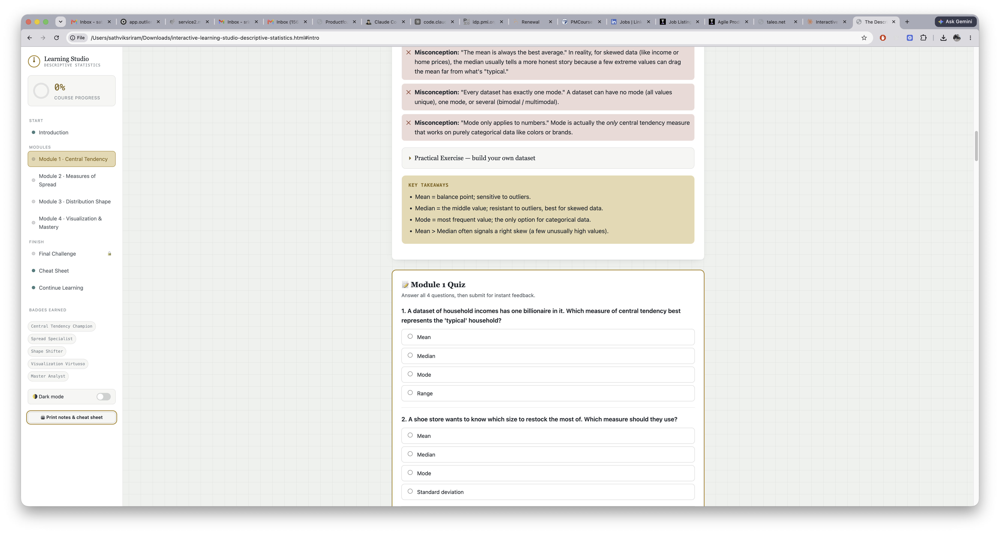

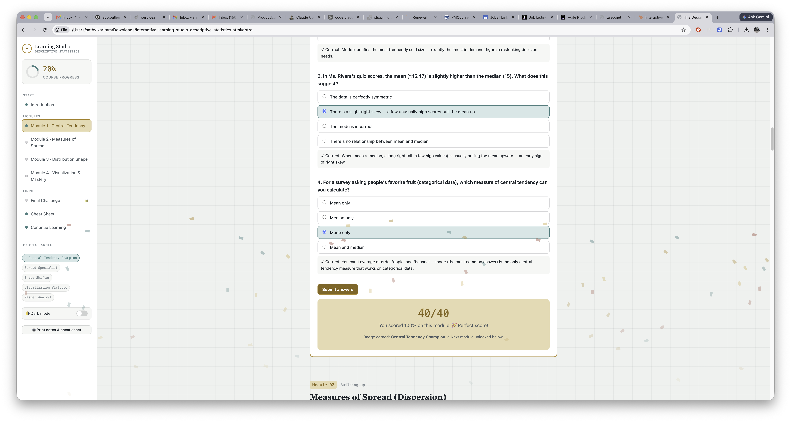

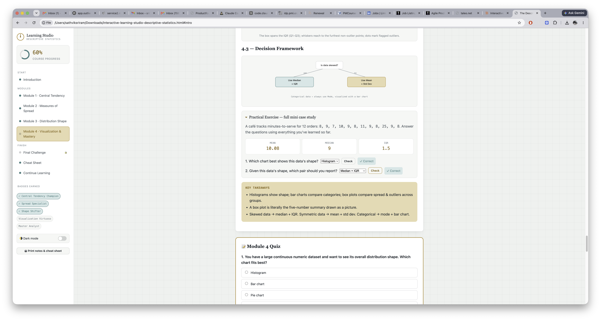

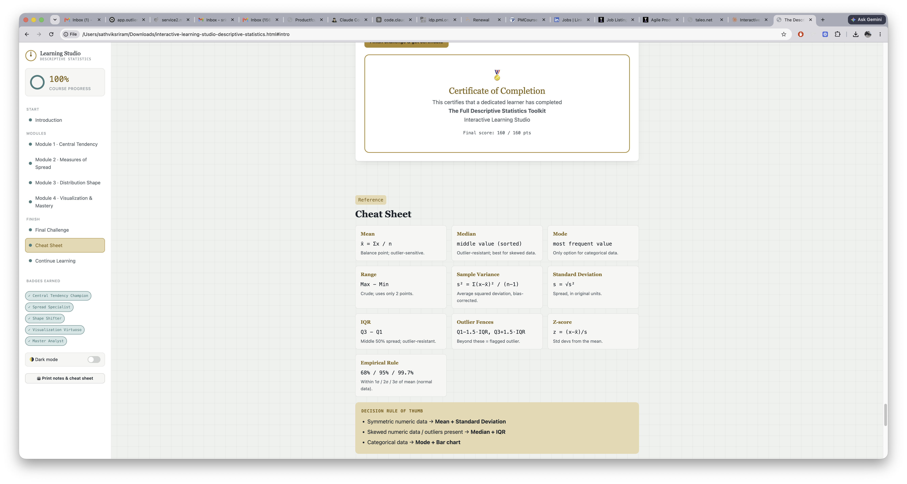
