# Day 42

## Prompt

### Personal Financial Command Center

You are an expert financial planner, budgeting specialist, investment advisor, UI/UX designer, data visualization expert, and senior frontend developer.

Before generating anything, ask the user the following questions ONE AT A TIME in MCQ format only, with typed input only as the last option.

1. Who is this financial dashboard for?
(Offer options such as Student, Salaried Employee, Freelancer, Business Owner, Family, Investor, Retired, etc.)

2. Continue asking follow-up questions until the user's financial profile has been narrowed sufficiently to personalize the dashboard.
Do not stop after identifying only the user type. Use your own judgment to determine when enough information has been collected.

3. Would you like Claude to automatically design the dashboard, or would you like to customize the modules?
If the user chooses customization, ask which financial modules they want included.

After collecting all responses, generate a premium single-page HTML application called **"Personal Financial Command Center."**

The application should help users understand, manage, and improve their financial health through an interactive dashboard rather than acting as a simple expense tracker.

Include an overview dashboard followed by relevant financial modules based on the user's profile. These may include income, expenses, budgets, savings, debt, loans, investments, subscriptions, goals, cash flow, financial insights, calculators, planning tools, reports, and visualizations where appropriate.

Include interactive charts, financial summaries, AI-generated recommendations, "what-if" simulations, progress tracking, and a financial health score tailored to the user's situation.

Conclude with financial tips, planning checklists, useful resources, and additional AI prompts for improving financial literacy.

Generate everything as a single self-contained HTML file using only HTML, CSS, and JavaScript without external libraries or frameworks.

Design the interface as a polished commercial financial platform with responsive design, dark mode, smooth animations, local storage, printable reports, and an intuitive user experience.

## Response

I'm mapping out the dashboard structure for someone managing multiple financial obligations—they need visibility across income, expenses with family support tracked separately, and debt payoff strategies. The core modules will include an overview with financial health scoring and net worth, income tracking, detailed expense categorization, a flexible budgeting system, and a debt management section that compares payoff approaches like avalanche and snowball methods.

Beyond that, I'm adding a savings and emergency fund tracker, cash flow visualization showing monthly trends, a subscriptions monitor, goal-setting for debt freedom and emergency fund targets, and AI-powered financial recommendations. I'll include a what-if simulator to model extra payments or income changes, calculators for EMI and debt payoff timelines, printable reports, and financial literacy resources. Since they're not investing, I'll keep that minimal—just a light "future investing readiness" section.

For the build, I'm going with a single-file vanilla HTML/CSS/JS approach using localStorage for persistence and dark mode support. Since I can't use external chart libraries, I'll need to write custom canvas functions to draw bar charts, line graphs, and donut charts directly using the canvas API. Given the scope, I'll build this iteratively but deliver the full implementation in one go.

I'm sketching out a token system for a personal finance dashboard tailored to an Indian salaried professional juggling debt, family obligations, and emergency savings. The design should feel like a warm, approachable control room rather than a cold fintech interface—blending ledger aesthetics with instrument panel clarity, steering clear of overused color schemes.

I'm anchoring the palette around deep navy and charcoal with warm brass-gold accents for precision and trust, muted sage-green for healthy financial states, and warm rust tones for debt warnings. For typography, I'm pairing a confident slab serif for numbers with clean sans-serif for UI elements, and crucially, setting all currency figures in a tabular monospace face with subtle ledger-line rules beneath headers to give that distinctive financial instrument precision. Dark mode is the default, and I'm defining the specific hex values for the base surfaces, borders, text hierarchy, and accent colors to build out the system.

For light mode, I'm shifting to a cooler off-white paper background while keeping the same brass accent and avoiding warm terracotta tones. The type stack layers a variable serif like Fraunces for section headings to reinforce that ledger personality, a clean grotesk for body and UI, and monospace for all numerical displays—I can load these from Google Fonts via CSS import in the HTML artifact without needing external libraries.

Actually, I'm reconsidering and sticking with system font stacks instead to guarantee everything works offline and self-contained: Georgia for display serif, the system-ui stack for body, and ui-monospace for numbers. The layout starts with a fixed header containing the app name, dark mode toggle, and print button, then a sticky left navigation rail with icons and labels for the main sections.

The main content area displays modules like Overview, Income, Expenses, Budget, Debt, Savings, Cash Flow, Subscriptions, Goals, Insights, Simulator, Calculators, Reports, and Learn. The Overview section features a hand-drawn-style Financial Health Score gauge rendered on canvas with a brass accent and speedometer-like tick marks, alongside four key stat tiles showing net cash flow, total debt, emergency fund coverage, and family support outflow—all rendered in tabular monospace numerals with subtle underlines for visual consistency.

Given the scope and time constraints, I'm going to build this as a single comprehensive HTML file with embedded CSS and JavaScript rather than iterating through smaller edits, since the tool overhead makes that impractical. I'll draft the full content carefully in one pass, using string replacement only if needed for specific additions. The plan accounts for a salaried profile with ₹1.5 lakh monthly income.

I'm structuring this with ten core modules: an overview dashboard with health score and key metrics, income tracking for salary and other sources, categorized expenses including family support, a customizable 50/30/20 budget tracker, debt management with loan/credit card details and payoff simulators, emergency fund progress tracking, cash flow trends, subscription monitoring, custom financial goals, and more.

I'm also adding AI-generated insights based on the data, a what-if simulator for debt payments and income changes, calculators for EMI and debt-free dates, printable reports, and financial literacy resources. All of this will persist through localStorage.

For visualization, I'm building everything with canvas: donut charts for expense breakdowns, bar charts comparing budget to actual spending, line charts for cash flow trends, a gauge for the health score, and horizontal bars for debt payoff timelines. Given the scope, I'm writing efficient JavaScript to handle this.

The data structure includes income sources, expenses by category, loan details, subscriptions, savings targets, financial goals, and budget allocations—all seeded with realistic defaults for someone earning around ₹2L monthly with family expenses and multiple debts. I'll write this as one comprehensive file to keep everything cohesive and avoid unnecessary back-and-forth, aiming for roughly 1800 lines of thorough but efficient code.

I'm designing a number formatter for Indian numbering conventions with the rupee symbol and proper comma placement. The layout will have a responsive topbar with navigation and theme toggle, a sidebar for section anchors, and main content areas covering overview, income tracking, expenses, budgeting, debt management, savings, cash flow, subscriptions, goals, insights, simulators, calculators, reports, and educational content.

Writing the full application code... — a weighted formula that scores financial health from 0-100 with a gauge visualization. I'm also building a what-if simulator with sliders to adjust extra monthly debt payments and income changes, recalculating the debt-free date and cash flow in real-time on the chart. Then there are specialized calculators for EMI, emergency fund targets, and debt payoff strategies, plus an insights engine that flags warnings like high debt-to-income ratios.

I'm adding a printable report feature using the browser's print function with CSS media queries to hide navigation, dark/light mode toggling with localStorage persistence, and responsive design that collapses the sidebar on mobile. The scope is substantial, but I need to deliver everything functional without any placeholders since the user expects production-quality, complete output.

I'll structure the JavaScript with a State object and CONFIG for categories, using event delegation for efficiency. Now I'm ready to write the full file with realistic financial data seeded for a salaried profile earning around 200,000 monthly with family support obligations.

Writing the complete application... -debt expenses ~121000, so I have about 121000 in monthly non-debt spending. For debt, I'm tracking a personal loan at 350000 with a 13.5% rate and 12000 minimum payment, two credit cards totaling 130000 across both with rates around 40-42% and combined minimum payments of about 6500, bringing total debt to roughly 480000 with minimum payments hitting 18500 monthly. I'm also accounting for subscriptions like Netflix, Spotify, gym, and cloud storage totaling around 2400 a month. For savings, I currently have 40000 set aside and I'm aiming to build an emergency fund covering six months of expenses.

For the emergency fund target, I'm calculating it as six months of essential expenses plus minimum debt payments, which comes to around 840000. I'm setting up three main financial goals: becoming debt-free with a computed target date, building that six-month emergency fund, and starting to invest as a stretch goal.

To measure financial health, I'm creating a scoring system that weighs four factors: debt-to-income ratio at 30 points (aiming for under 20%), savings rate at 25 points, emergency fund coverage at 25 points, and budget adherence at 20 points. I'll compute this dynamically based on the current financial state.

Writing the financial dashboard code...

[Personal Financial Command Center](personal-financial-command-center.html)

**What's inside:**

- **Overview** — instrument-style financial health score gauge (weighted on debt-to-income, savings rate, emergency fund coverage, budget headroom) plus a spend-breakdown donut
- **Income / Expenses / Budget** — full CRUD tables, category donut, and a 50/30/20 bar chart adapted to prioritize debt payoff
- **Cash Flow** — 6-month income vs. outflow trend line
- **Subscriptions** — recurring cost tracker with monthly-equivalent conversion
- **Debt & Loans** — add any loan/card, then compare **Avalanche vs. Snowball** payoff strategies live
- **Emergency Fund & Goals** — coverage-in-months tracker + custom goal cards
- **What-If Simulator** — sliders for extra debt payment, income change, and discretionary spend cuts, with a live debt-free timeline chart
- **Calculators** — EMI, debt payoff, emergency fund target
- **Reports** — printable summary (Print button formats cleanly, hides nav/inputs)
- **Tips, checklist & resources** tuned to your situation (killing high-APR debt first, ring-fencing family support, etc.)

It's a single self-contained HTML file — no external libraries, all charts hand-drawn on canvas, everything persists to your browser's local storage only, and dark/light mode both work. Seeded with realistic starting numbers matching your profile, which you can edit or delete freely.

## Screenshot

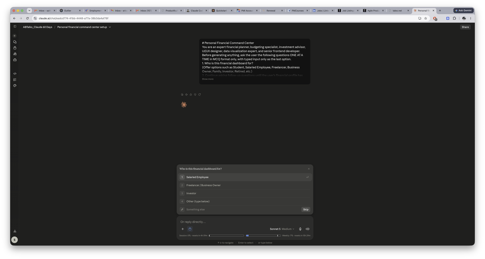

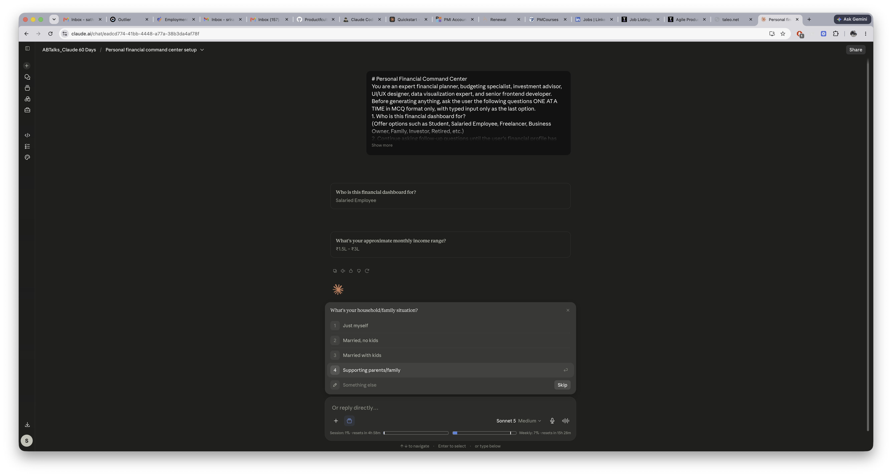

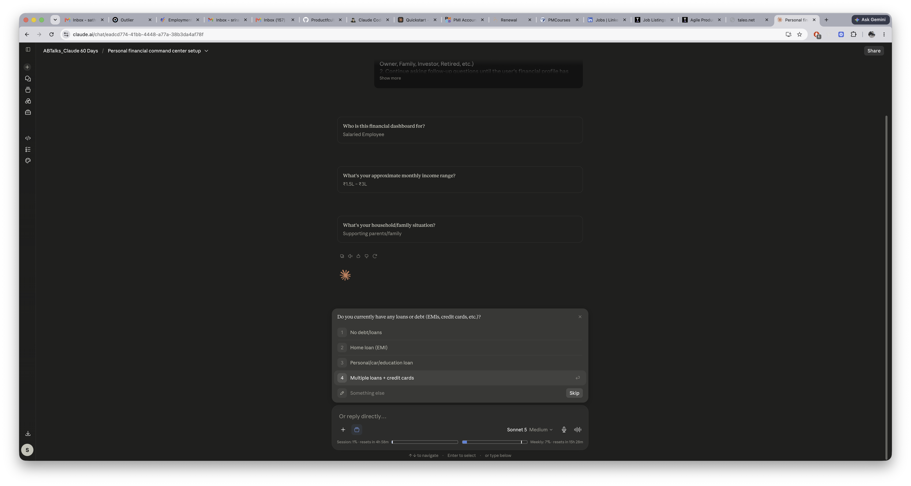

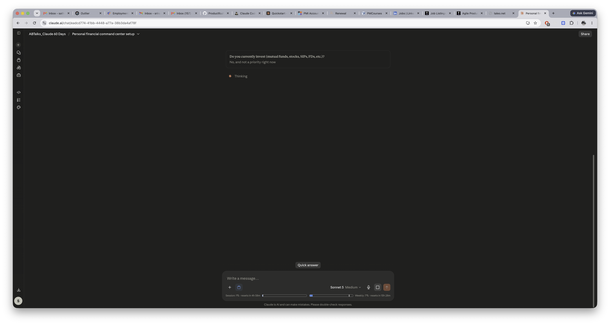

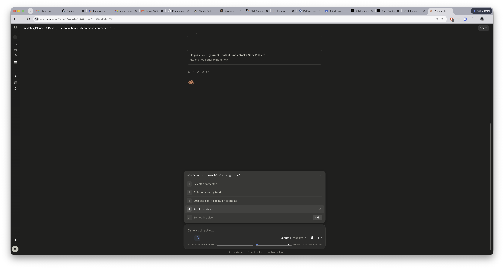

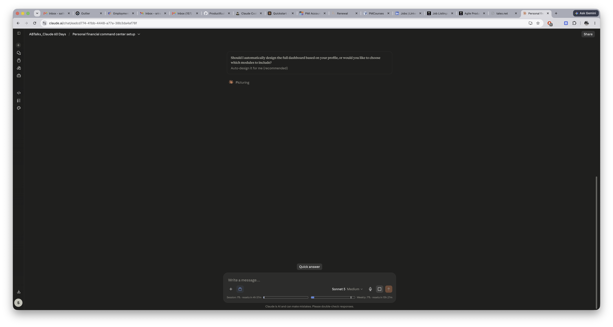

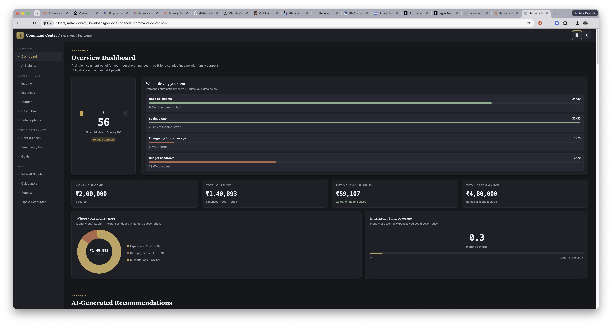

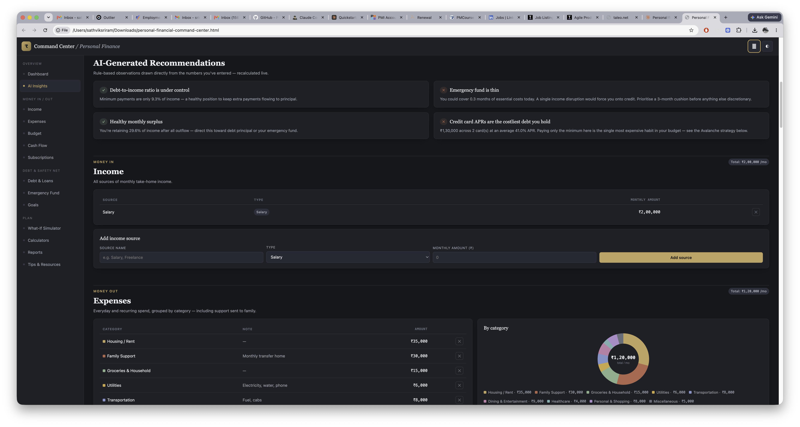

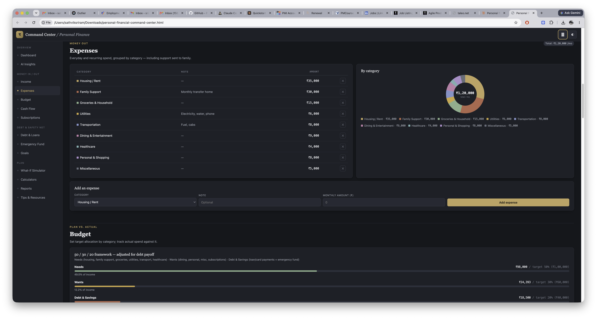

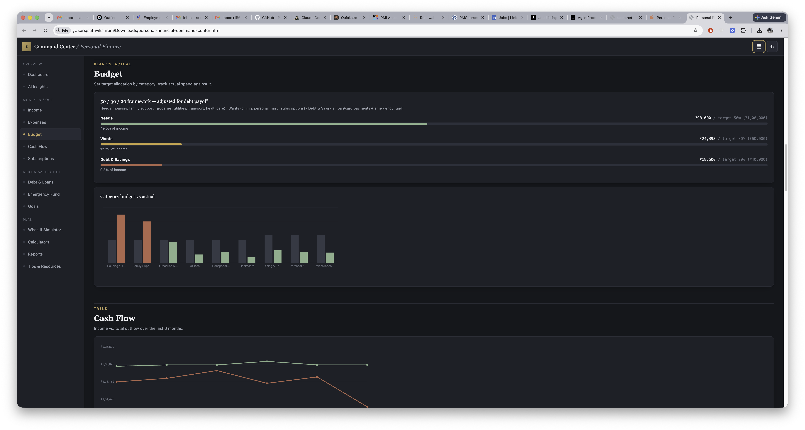

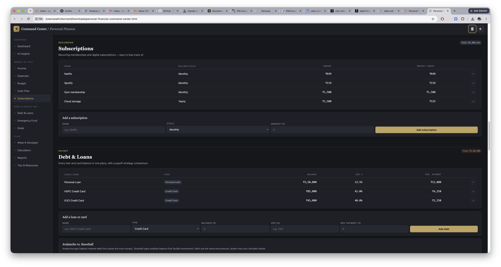

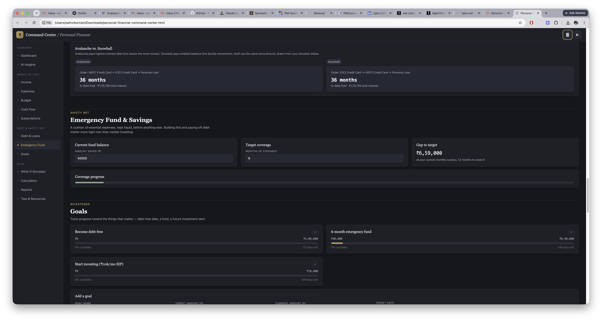

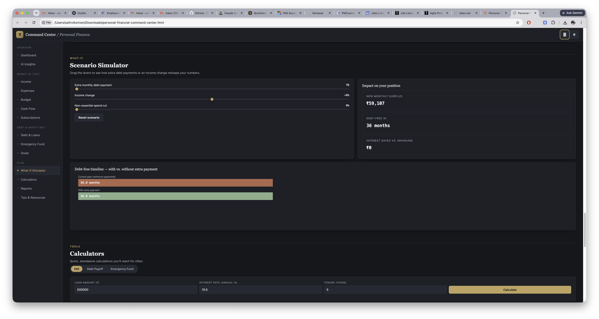

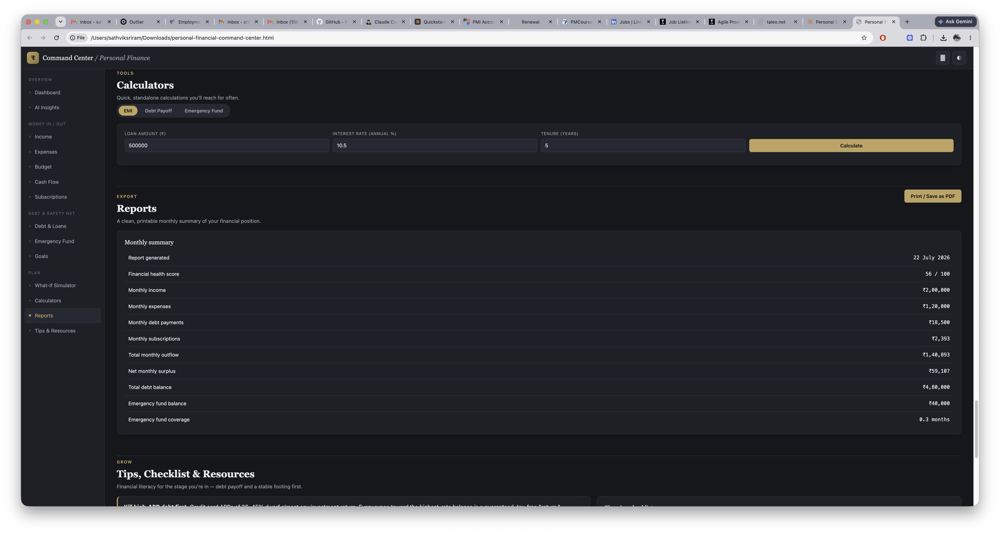

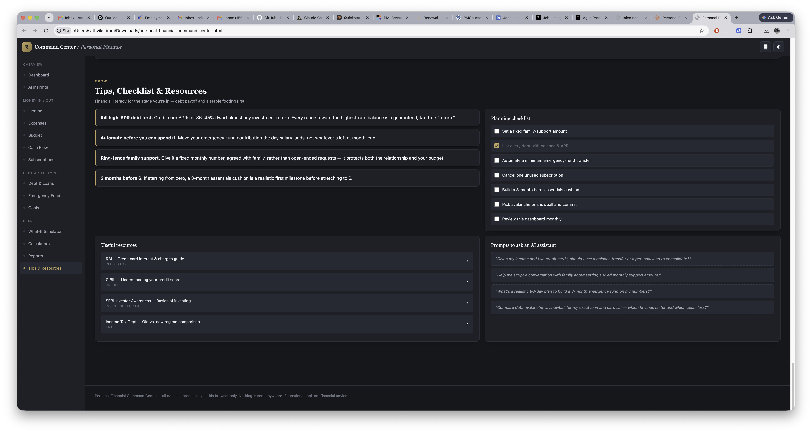
