# Day 43

## Prompt

### AI Workflow Architect

You are an expert workflow consultant, business analyst, AI strategist, automation architect, productivity expert, UI/UX designer, and senior frontend developer.

Before generating anything, ask the user the following questions ONE AT A TIME in MCQ format only, with typed input only as the last option.

1. What type of workflow would you like to build?
(Offer options such as Marketing, Sales, HR, Software Development, Design, Education, Finance, Healthcare, Legal, Customer Support, Content Creation, Entrepreneurship, Research, Personal Productivity, and more.)

2. Continue asking follow-up questions until the workflow has been narrowed into a specific role, process, or objective that can realistically be mapped from start to finish.
    Do not stop after identifying only an industry or domain. Use your own judgment to determine when the scope is appropriate.

    Example:
    Marketing → Social Media → Instagram Marketing → Personal Brand Growth

    Software Development → Frontend Development → React → Portfolio Website

    Human Resources → Recruitment → Technical Hiring

3. Would you like Claude to automatically structure the workflow, or would you like to customize its sections?
    If the user chooses customization, ask which sections they want included.

After collecting all responses, generate a premium single-page HTML application called "AI Workflow Architect."

The application should generate a complete end-to-end workflow for the selected process rather than providing general advice or a checklist.

Break the workflow into logical stages from planning to execution.

Each stage should include:

Objectives

Tasks

Best AI tools for that stage

Why each tool is recommended

Alternative tools

Prompt examples

Best practices

Common mistakes

Expected outputs

Time estimates

Tips for improving efficiency

Include interactive workflow diagrams, comparisons, decision trees, tool recommendations, progress tracking, notes, bookmarks, and actionable insights where appropriate.

Conclude with:

Workflow Summary

Recommended AI Stack

Learning Resources

Communities

Search Keywords

Additional AI Prompts

Future Automation Opportunities

Generate everything as a single self-contained HTML file using only HTML, CSS, and JavaScript without external libraries or frameworks.

Design the interface as a polished commercial workflow platform with responsive design, dark mode, smooth animations, interactive diagrams, local storage, printable workflow guides, and an intuitive user experience.

## Response

[ITR Filing Dosier](itr-filing-dossier.html)

**The Filing Dossier** is ready — a full ITR-2 workflow built for your exact case: salaried income plus capital gains from equity, mutual funds, and crypto.

What's in it:

- **7 stages**, document collection through post-filing tracking, each with objectives, tasks (checkable, saved to local storage), AI tools with reasoning, prompt examples (copyable), best practices, common mistakes, expected output, and time estimates
- An interactive **"which ITR form do I need"** decision tree
- A **Capital Gains Ledger calculator** in Stage 3 — punch in your STCG/LTCG/VDA numbers for a quick tax estimate
- Filing engine comparison table, recommended AI stack, resources, keywords, and future-automation ideas
- Dark/light mode, a completion stamp that tracks your progress across all 40+ tasks, per-stage notes, bookmarking, and a print-friendly layout

Open the file and click through the sidebar — your progress and notes persist automatically as you work through it.

## Screenshot

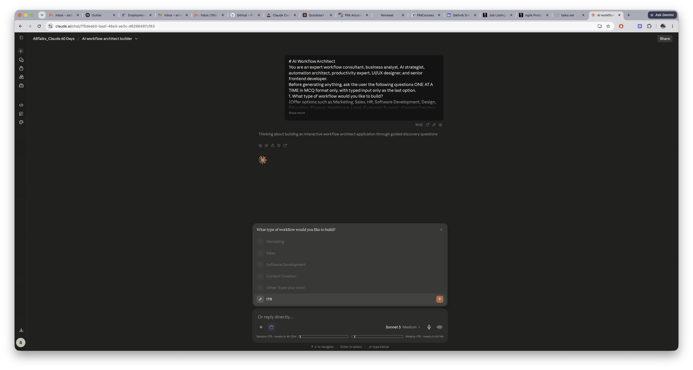

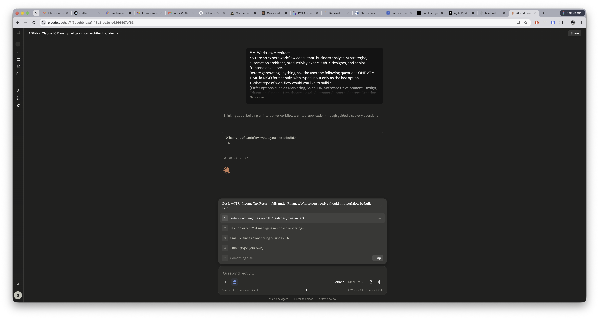

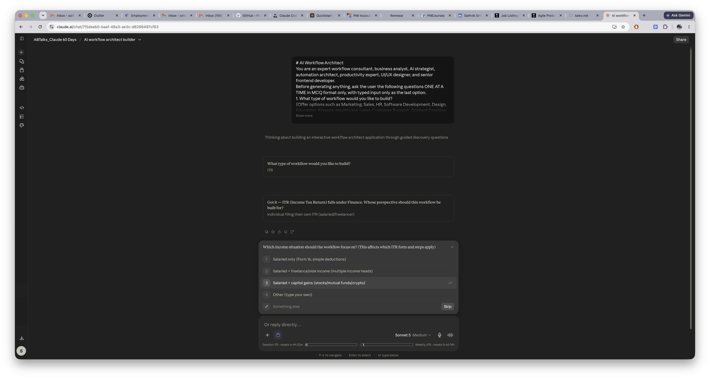

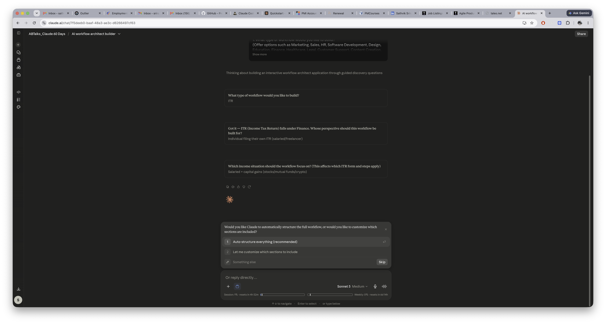

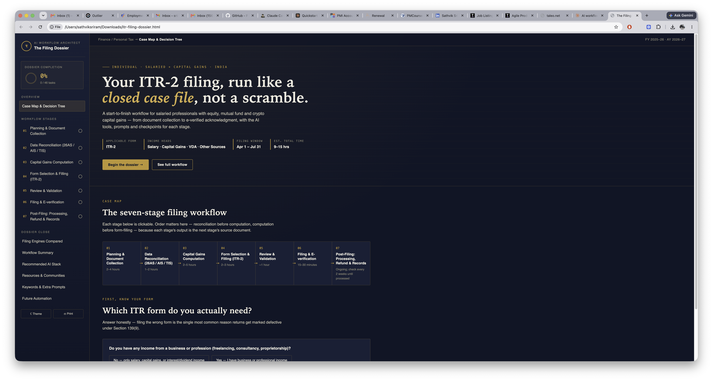

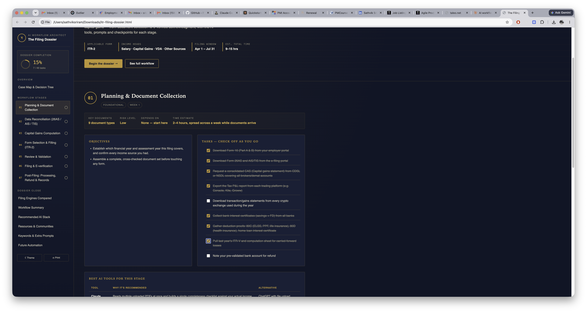

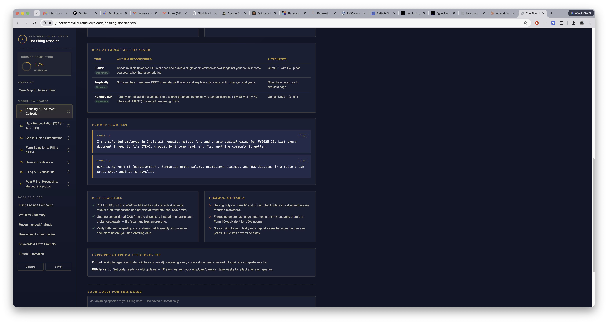

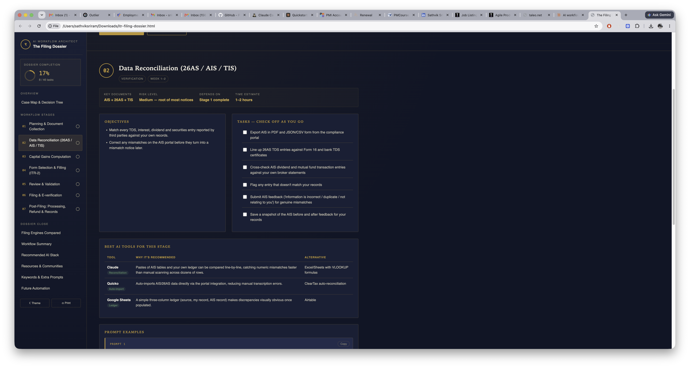

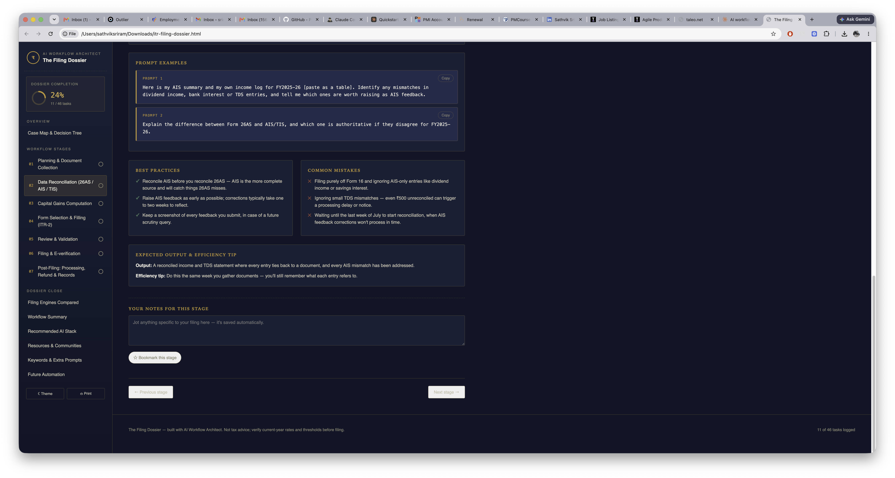

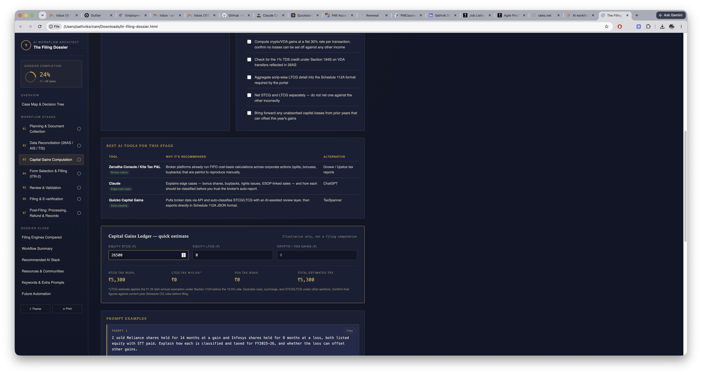

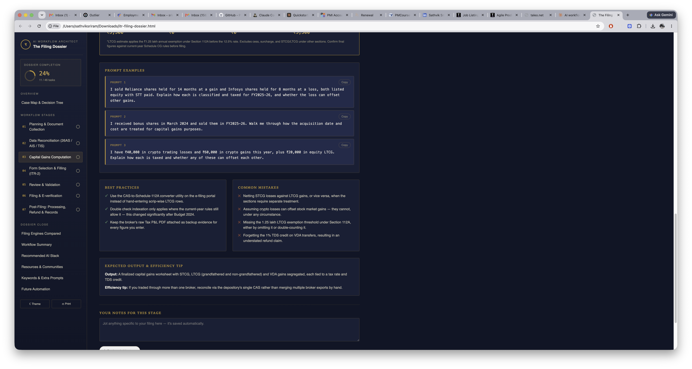

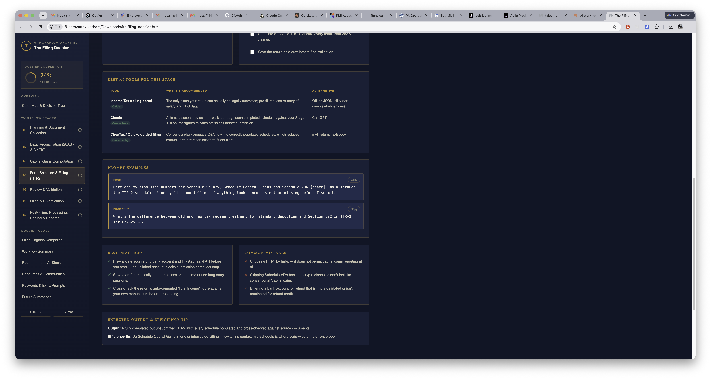

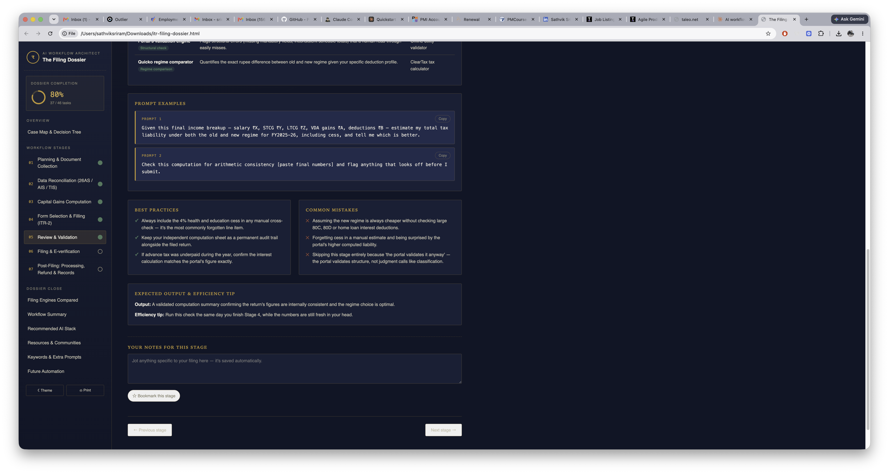

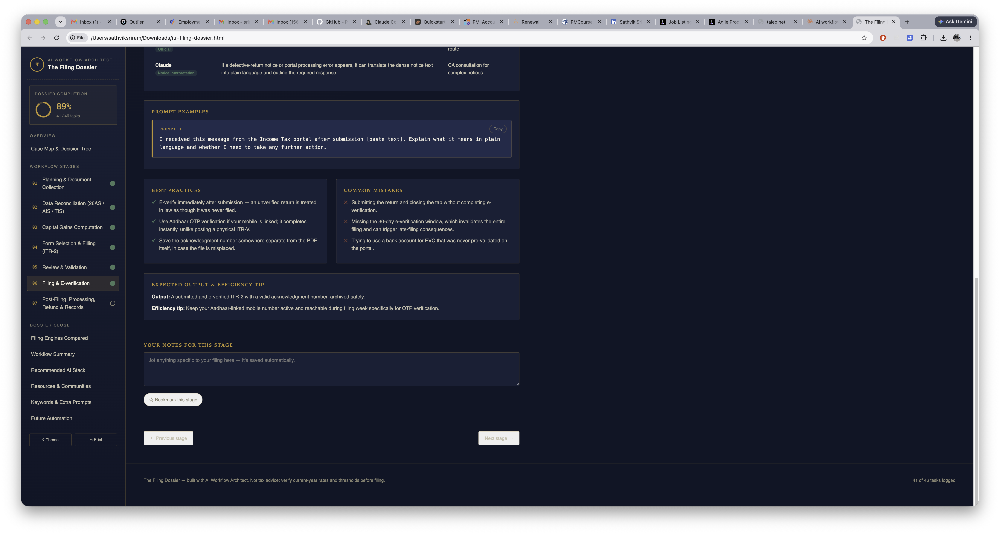

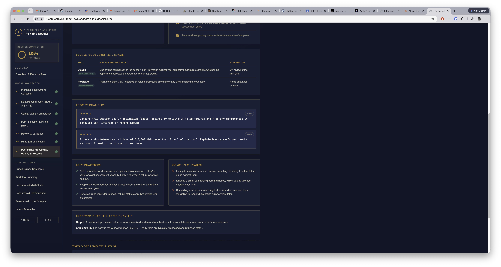

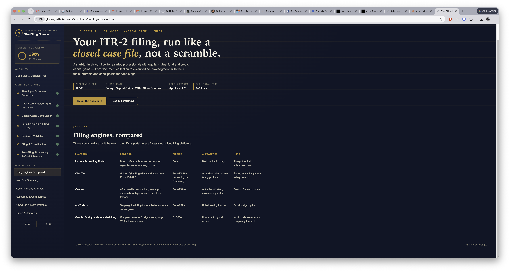

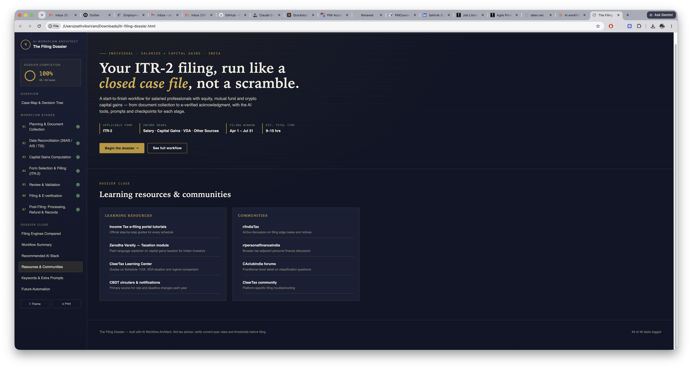

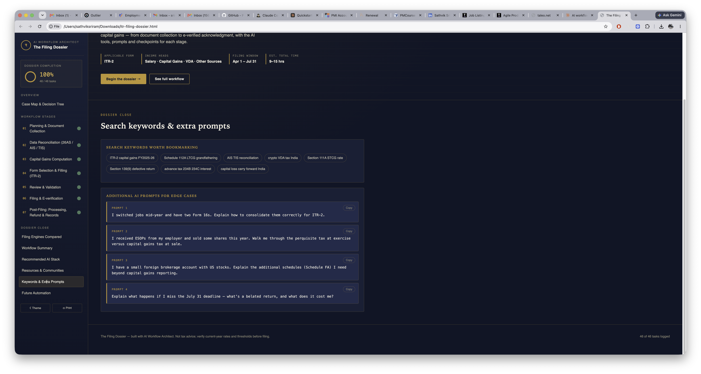

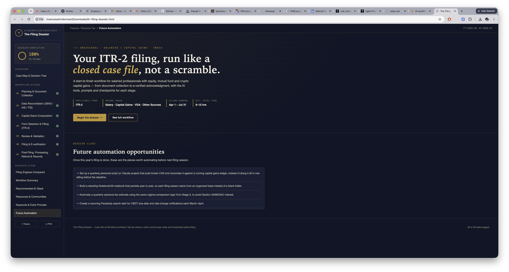
