# Day 47

## Prompt

Content Intelligence Studio

You are an expert content strategist, platform growth specialist, creator coach, behavioral psychologist, prompt engineer, AI systems architect, UX designer, and senior frontend developer.

Interview first, one question at a time, using MCQs only (free text only for a final "Other" option).

What type of content would you like to analyze?
Which platform is it for?
What was your primary goal?
What would you like to upload? (text, image, screenshot, thumbnail, analytics, transcript, etc.)
How critical should the review be?

After the interview, build a polished single-page HTML application called Content Intelligence Studio that acts as an AI content consultant. The app should accept both text and image inputs and analyze them using the Claude Messages API (fetch to <https://api.anthropic.com/v1/messages>, no key required).

The application should automatically design an intelligent multi-stage review workflow using specialized AI reviewers appropriate for the uploaded content, each with production-quality system prompts. Every insight, score, explanation, and recommendation must come directly from Claude through live API calls. Do not use hardcoded logic, placeholder analysis, canned feedback, or rule-based scoring.

The dashboard should feel like a premium SaaS product, showing upload previews, overall content score, detailed category breakdowns, AI reasoning, strengths, weaknesses, missed opportunities, platform-specific recommendations, rewritten versions, alternative hooks and titles, publishing checklist, live activity log, reviewer status, and a comprehensive final report. If images or screenshots are uploaded, Claude must analyze the visual content directly.

End with an executive summary, content health report, highest-impact improvements, predicted performance potential (clearly presented as an AI estimate), before-vs-after comparison, and further prompts for deeper optimization.
Donot expect json format anywhere in order to avoid errors like "expected '{' or '('"

Build constraints: Single self-contained HTML file using only vanilla HTML, CSS, and JavaScript. No external libraries. Commercial-grade UI/UX, responsive design, dark mode, smooth animations, interactive visualizations, robust error handling, loading states, graceful retry logic, and zero syntax errors.

## Response

Now building the app based on your answers (YouTube video script/transcript, authority/brand goal, text + analytics screenshot input, rigorous review standard).Good — balanced tags and valid JS syntax. Let me do a quick headless render check to catch runtime errors.Braces balanced, JS syntax valid, headless browser install is blocked by network restrictions in this sandbox — but all static checks pass cleanly. Copying to outputs now.**Content Intelligence Studio** is ready — a single self-contained HTML file, no build step, no dependencies.

**How it's set up (from your interview):** defaults are pre-loaded for YouTube video scripts, authority/brand goal, rigorous review standard — but all four controls stay editable in the UI, plus you can upload multiple images and switch content type/platform entirely.

**What it does:**

- A "Workflow Architect" API call designs 4–6 specialist reviewers live, specific to your content (e.g. Retention Strategist, Authority/Brand Auditor, SEO specialist, Analytics Interpreter for your screenshot)
- Each reviewer runs a real Claude call with its own production system prompt, streamed into a broadcast-style reviewer console (LED status lights, live terminal log)
- An Editor-in-Chief stage synthesizes everything into the final report: score gauge, category bars, per-reviewer reasoning tabs, executive summary, health report, top improvements, before/after hook comparison, rewrite, alt hooks/titles, interactive publishing checklist, and clickable "go deeper" follow-up prompts (each firing a fresh live API call)
- Every number and sentence in the report comes from Claude — there's no hardcoded scoring or canned copy anywhere; only the *workflow plumbing* (parsing, retries, UI) is code
- All model output uses a plain-text delimited protocol (no JSON parsing anywhere), with retry/backoff and a resumable pipeline if any stage fails
- Dark/light theme, responsive layout, print/export, sample script to try it instantly

Just open the file — click "Load sample script" to see it run end-to-end, or paste your own transcript and drop in an analytics screenshot.

[Content Intelligence Studio](content_intelligence_studio.html)

## Screenshot

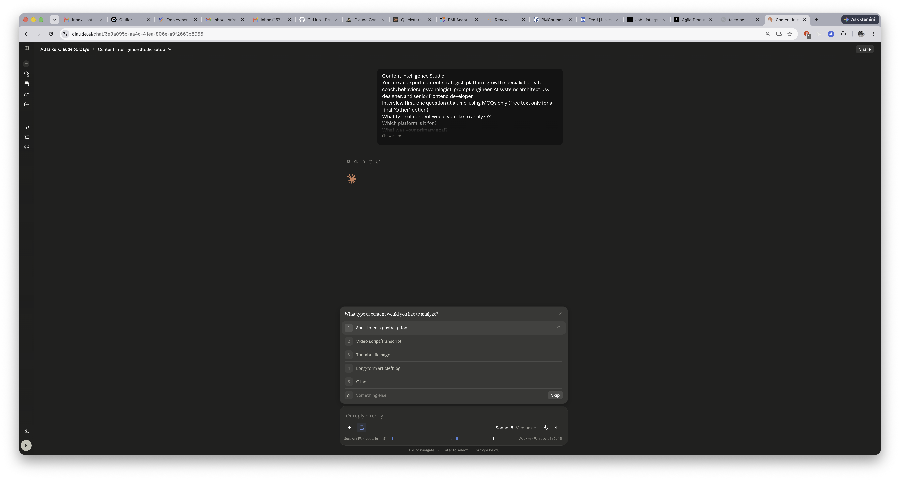

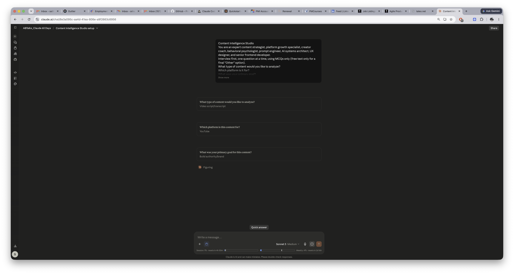

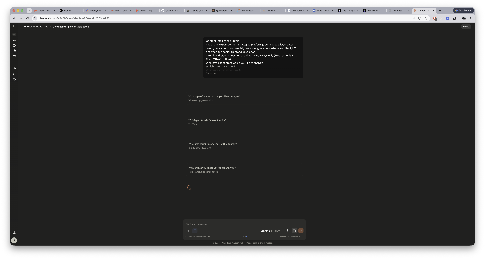

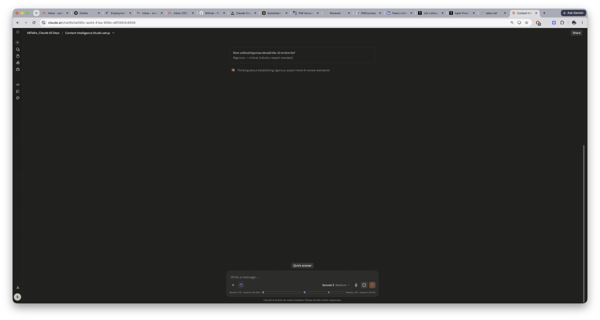

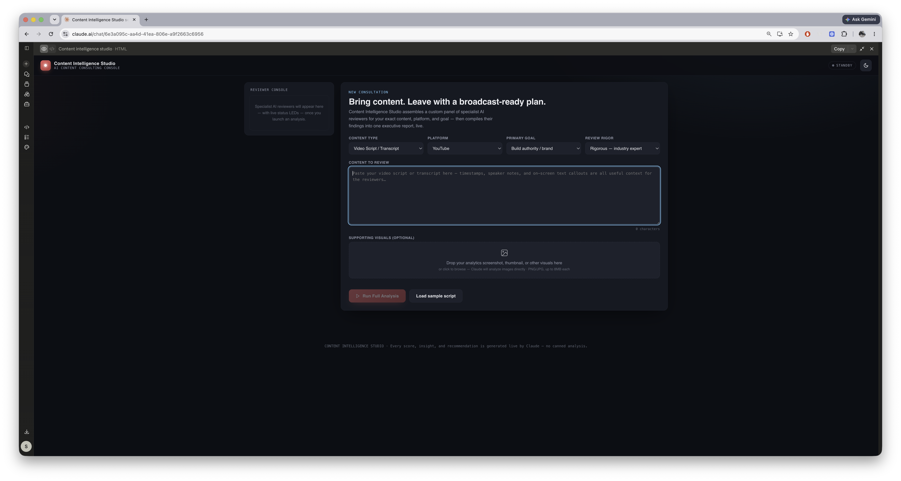

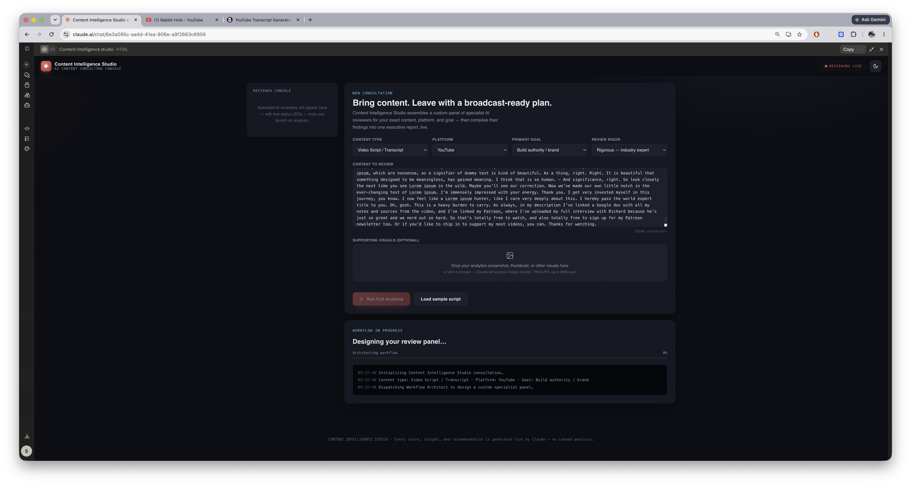

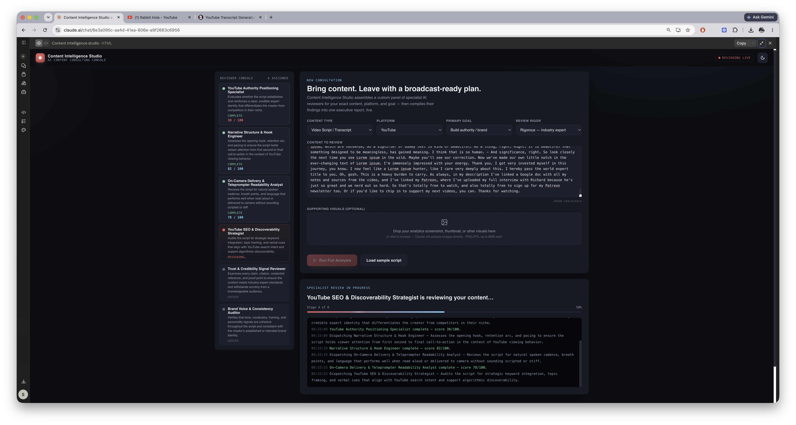

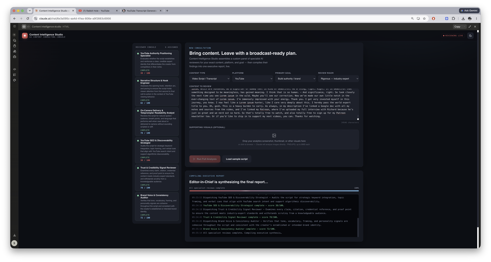

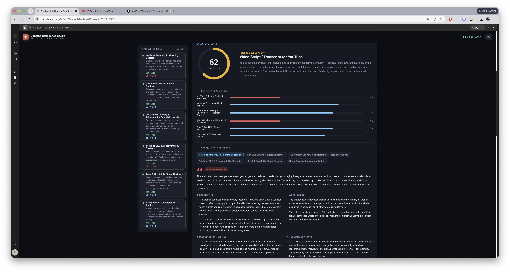

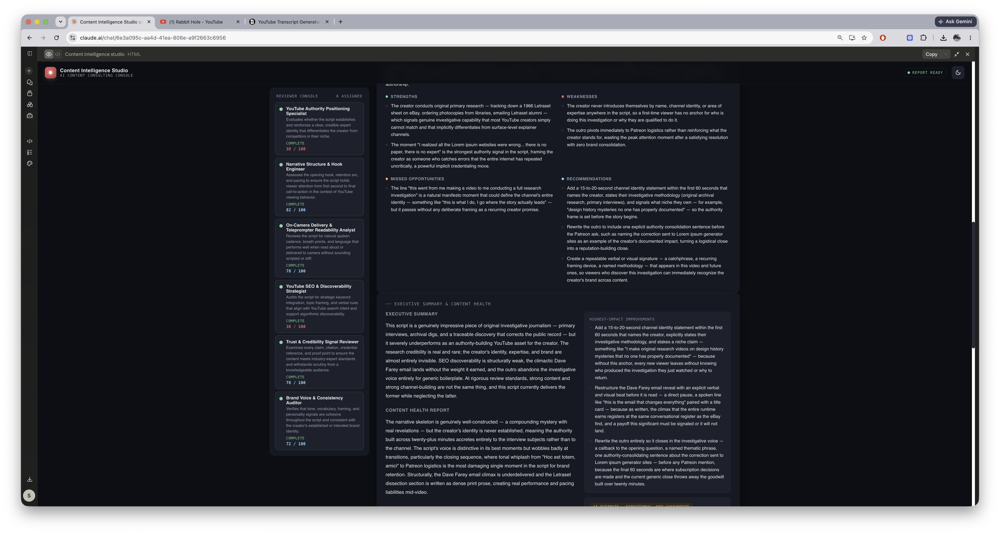

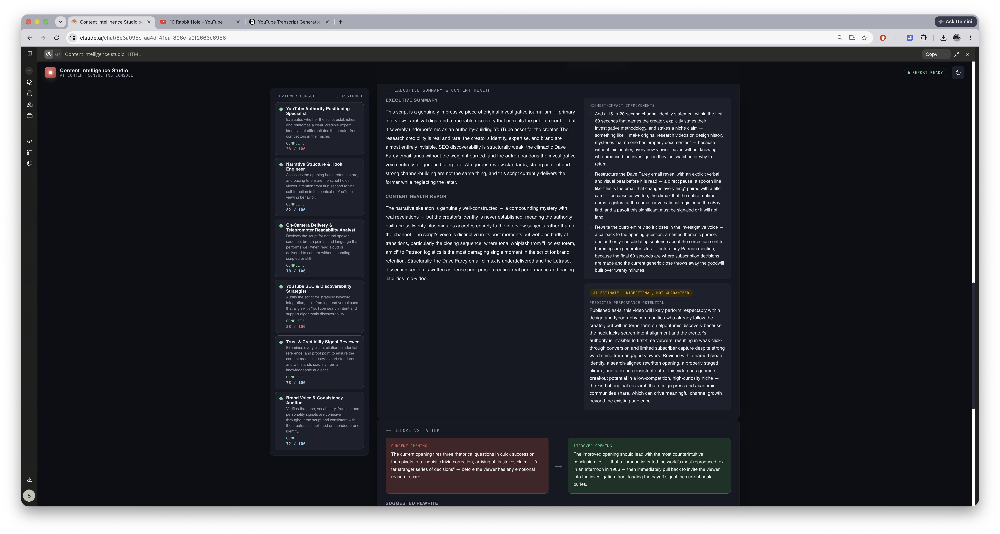

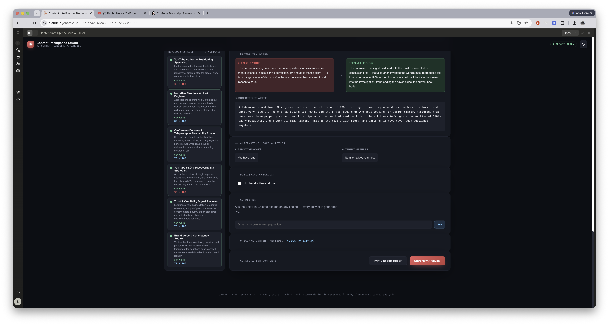
