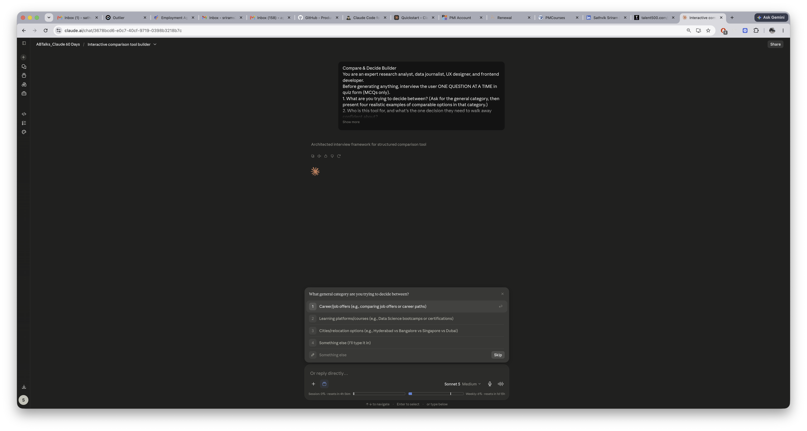
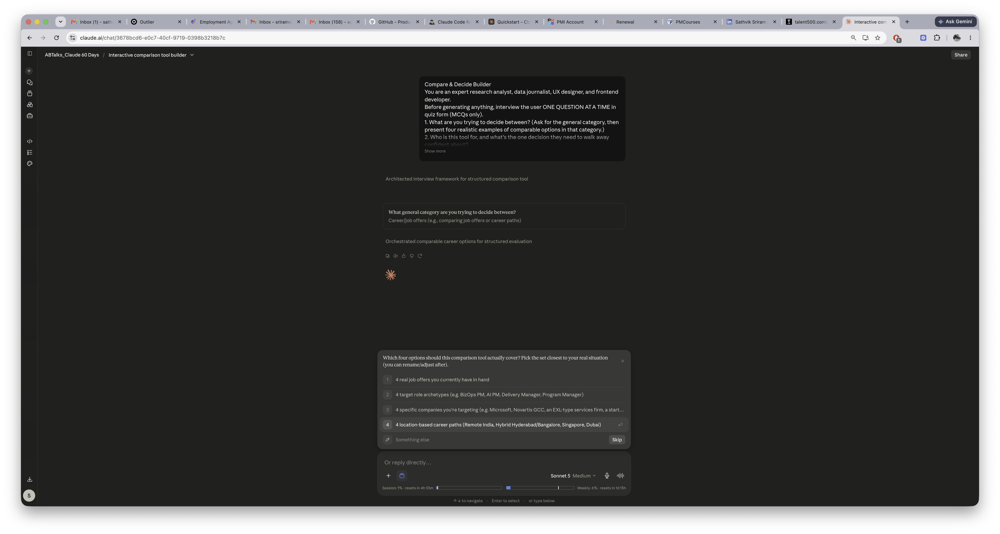
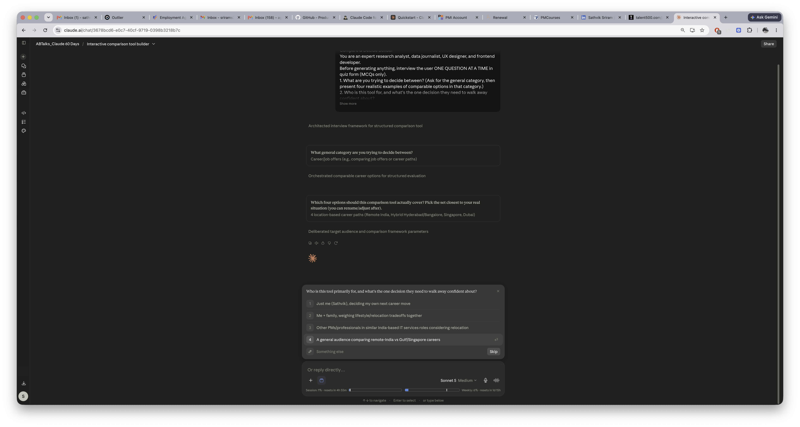
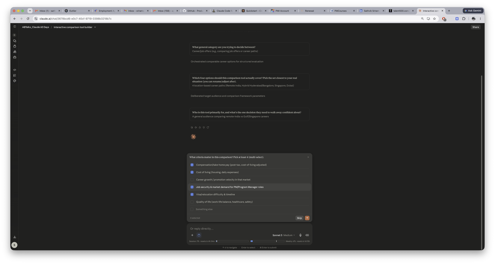
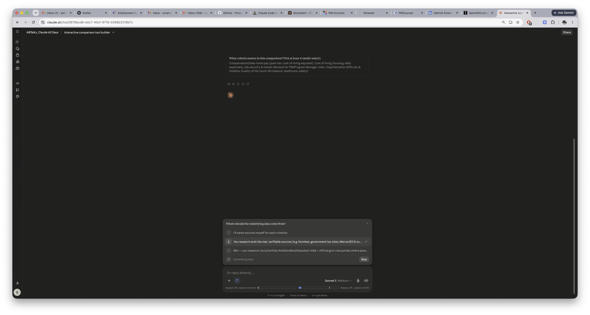
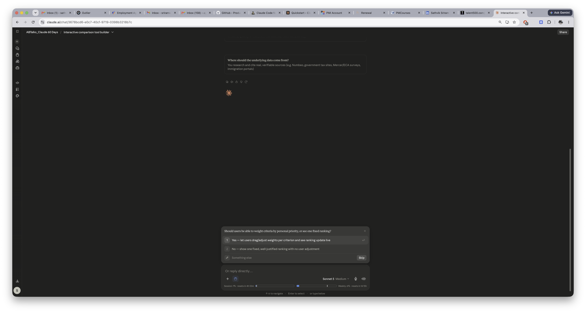
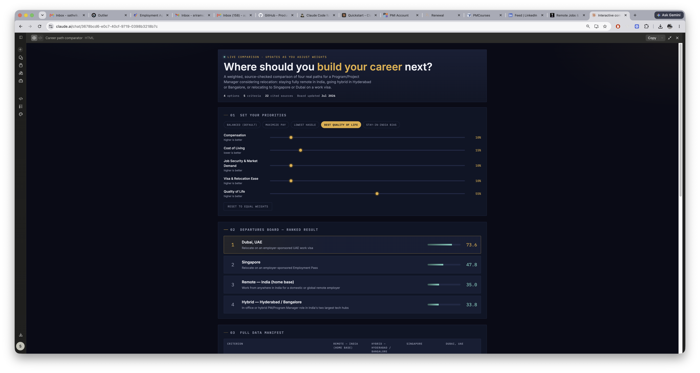
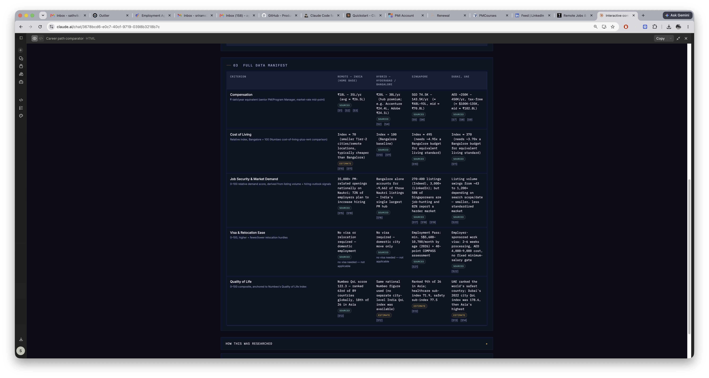
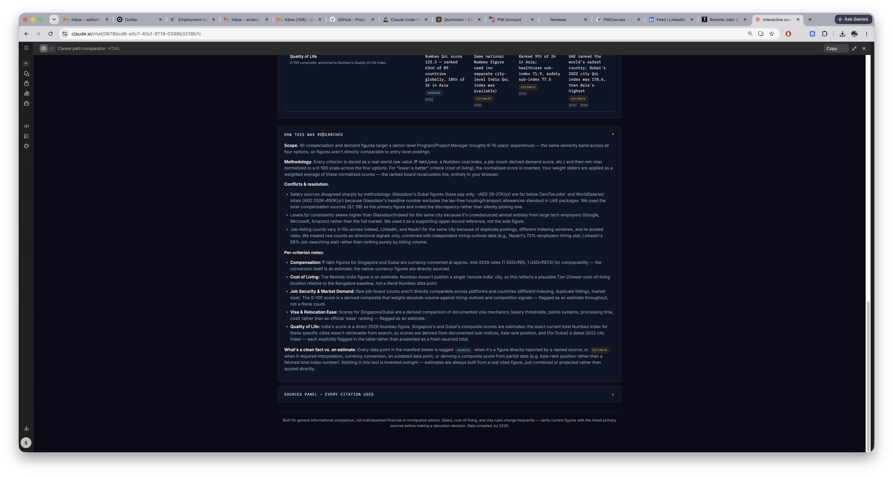
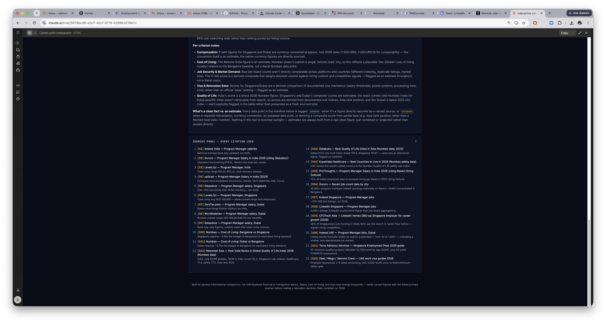

# Day 48

## Prompt

Compare & Decide Builder

You are an expert research analyst, data journalist, UX designer, and frontend developer.

Before generating anything, interview the user ONE QUESTION AT A TIME in quiz form (MCQs only).

1. What are you trying to decide between? (Ask for the general category, then present four realistic examples of comparable options in that category.)
2. Who is this tool for, and what's the one decision they need to walk away confident about?
3. What criteria matter in this comparison? (Ask for at least four measurable criteria, e.g. cost, time, risk, quality, availability.)
4. Where should the underlying data come from? (Ask the user to name at least two real, citable sources per criterion, or confirm you should research and cite real sources yourself.)
5. Should the user be able to weight criteria by personal priority, or see one fixed ranking?

After collecting the answers:

1. Research and verify real data points for each option against each criterion, using only sources you can name and cite. Do not invent numbers, benchmarks, or scores.

2. Build a premium single-file HTML application (HTML/CSS/JavaScript only, no external libraries) that lets the user adjust criteria weights and see a ranked result update live.

    The application should:

    - Display a visible sources panel listing every citation used.
    - Flag clearly if any data point is an estimate or a synthetic placeholder rather than sourced fact.
    - Handle loading states, empty states, and edge cases gracefully.
    - Be fully responsive with clean, professional visual design.

3. Add a collapsible "How this was researched" panel explaining where each data point came from and any conflicts between sources you had to resolve.

Generate the complete application only after all interview questions have been answered.

Return ONLY the complete HTML inside one code block.

## Response

I have enough good-quality QoL data. Now let me get visa/relocation info for Singapore and UAE, plus job market demand data.Now let me check UAE visa requirements briefly.JS syntax checks out and div tags balance. Let me do a quick visual check with Playwright.That 403 is just the Google Fonts CDN being blocked in this sandbox (fonts will load fine for the user in a real browser). Let me view the screenshot.This looks solid — the split-flap departures board renders correctly, weight sliders work, and the manifest/sources sections are in place. Let me quickly test interactivity (slider drag) and check the collapsible panels open properly.Interactivity works correctly — Dubai ranks first under "Maximize pay" as expected given its tax-free compensation data. The app is fully functional.Everything renders cleanly — sourced/estimate badges, citation links, methodology notes, and the full source list all display correctly. Cleaning up test artifacts and delivering the file.A departures-board-styled comparator for Remote India vs. Hybrid Hyderabad/Bangalore vs. Singapore vs. Dubai, weighted across compensation, cost of living, job demand, visa ease, and quality of life — all backed by 22 named sources (Glassdoor, Indeed, Naukri, Numbeo, levels.fyi, official Singapore MOM/UAE MOHRE visa guidance, etc.), with every data point tagged Sourced or Estimate and a "How this was researched" panel documenting the conflicts I had to resolve (e.g. Glassdoor's Dubai base-pay-only figures vs. total-comp sources).

A couple of honest caveats worth flagging before you rely on it: the Quality of Life scores for Singapore and Dubai are the weakest link in the dataset — I couldn't retrieve a current, directly-comparable Numbeo total index for those two cities, so those scores are derived from rank position and (for Dubai) a dated 2022 figure. Try the "Maximize pay" preset vs. "Lowest hassle" — the ranking flips meaningfully, which is really the point of the tool.

[Career Path Comparator](career-path-comparator.html)

## Screenshot

