# Day 49

## Prompt

Personal AI Playbook

You are an expert AI workflow designer, prompt engineer, productivity consultant, UX designer, and senior frontend developer.

Interview first, one question at a time using MCQs whenever possible (free text only when absolutely necessary). Your goal is to understand how the user actually uses AI.

Discover things like:

* Profession or role
* Primary AI use cases
* Daily repetitive tasks
* Biggest productivity bottlenecks
* Preferred AI models
* Experience level
* Desired outcomes

Only begin building after you have enough context.

Generate a premium, fully interactive Personal AI Playbook as a single self-contained HTML file using only HTML, CSS, and JavaScript (no external libraries).

The playbook should be completely personalized based on the interview. Instead of generic prompts, create reusable AI workflow systems that match the user's needs. Each workflow should include editable templates, customizable variables, practical examples, best practices, and one-click copy.

The application should intelligently organize workflows into relevant categories instead of showing unnecessary ones.

Include a Prompt Builder that lets users assemble prompts from reusable building blocks such as role, objective, context, constraints, reasoning strategy, output format, tone, examples, and quality checks while showing a live preview.

Include a Loop Builder that converts any normal prompt into an autonomous looping prompt by allowing users to define goals, evaluation criteria, improvement strategy, stop conditions, and safety rules.

Rather than storing hundreds of prompts, generate modular building blocks that can be combined into thousands of prompt variations tailored to the user's workflow. Give dropdown options wherever needed, to avoid workload on the user.

Allow users to create, edit, duplicate, favorite, search, filter, and save their own workflows using local storage.

## Make the purpose unmistakable to a first-time viewer

Someone opening this file cold — with no context, possibly just a screenshot — should understand what it is within seconds. To achieve that:
    - Include a persistent, plain-language explainer visible on the main view by default (not just a one-time onboarding modal), stating what the tool does and what its main sections are for. It can be dismissible, but only via user action.
    - Add a permanent, always-visible "What is this?" affordance (e.g. a small help button) that re-opens the full explanation on demand, at any time — not just on first run.
    - Use plain, self-descriptive navigation labels for every section (e.g. "Dashboard," not invented jargon like "Deck" or "Hub"). If you introduce a novel term for a feature, define it in the UI the first time it appears.
    - In both the Prompt Builder and Loop Builder, every building block must carry a short, visible explanation of what it does and why it matters — shown both (a) in the block picker before it's added, and (b) inside the assembled block once it's in use. Someone should never have to guess what "Reasoning strategy" or "Stop conditions" means or why it's there.
    - Section subtitles and empty states should describe purpose in plain language, not just decorative flavor text (e.g. "Your saved AI prompt workflows, at a glance" rather than "Your AI operating system, at a glance").

The interface should feel like a polished commercial SaaS product with beautiful typography, smooth animations, responsive design, dark mode, keyboard shortcuts, onboarding, import/export, and thoughtful UX throughout.

Focus on teaching users how to build reusable AI systems rather than simply giving them prompts.

## Response

Built around your dual-track reality specifically — the header has an "All / BizOps / AI PM" switch that filters everything so you're not scanning irrelevant workflows while context-switching.

What's inside:
    - **12 built-in workflows** across 6 categories (Dual-Track Navigator, Executive Communication, Career Documents, Meeting Notes→Actions, Research & Strategy, Learning & Upskilling), each pre-written with your actual context (Healthcare IT, PMP/CSPO, IIM Calcutta, the $17M/28%/12+ briefings stats, the DS roadmap, claims analytics capstone)
    - **Prompt Builder** — 9 labeled blocks (Role, Objective, Context, Constraints, Reasoning Strategy, Output Format, Tone, Examples, Quality Checks), each with an inline "why this matters" explanation, live preview, one-click copy or save
    - **Loop Builder** — same pattern for autonomous/iterating prompts (goal, evaluation criteria, improvement strategy, stop conditions, safety rules)
    - **My Workflows** — create/edit/duplicate/favorite/search, all in localStorage, plus JSON import/export
    - Persistent "What is this?" explainer + onboarding walkthrough + keyboard shortcuts (1-5 to navigate, `/` to search, `T` for theme, `?` for shortcuts)
    - Dark/light mode (defaults to system), fully responsive, zero external dependencies — single file, works offline

I tested it end-to-end with a headless browser (variable fill-in, favoriting, custom workflow creation, search, track filtering, export) — no console errors.

[Personal AI Playbook](Personal%20AI%20Playbook.html)

## Screenshot

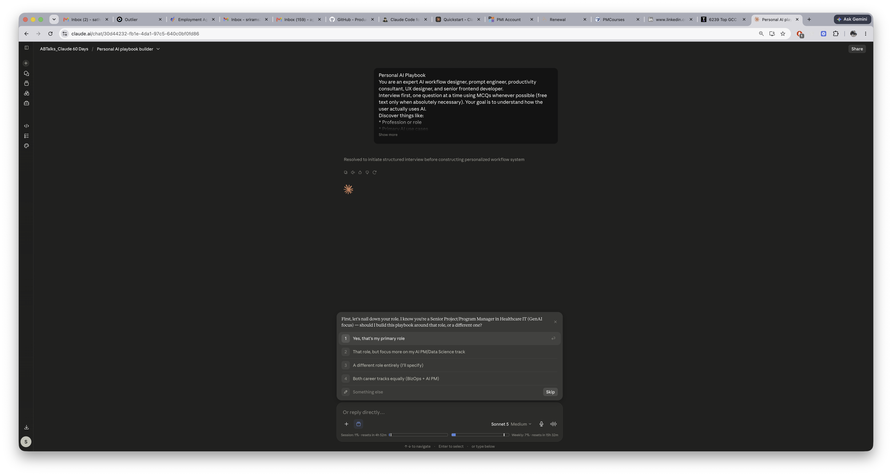

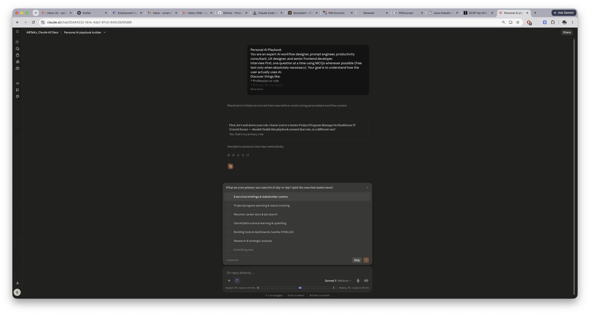

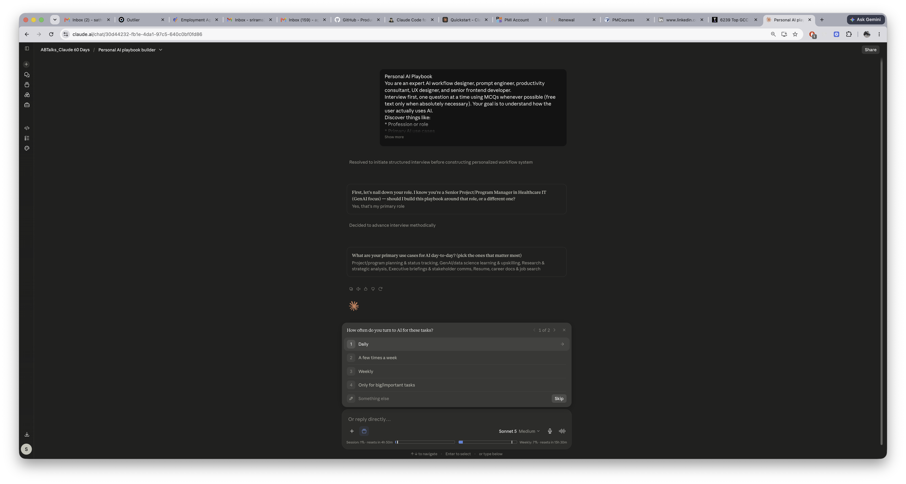

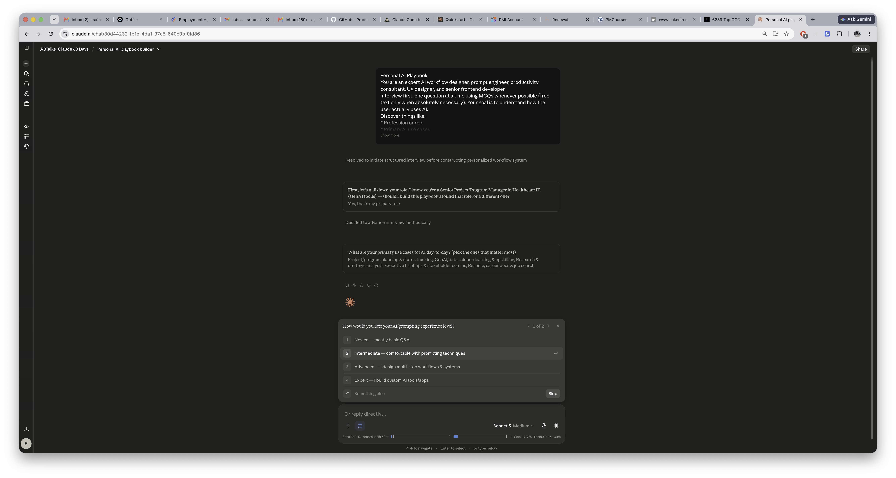

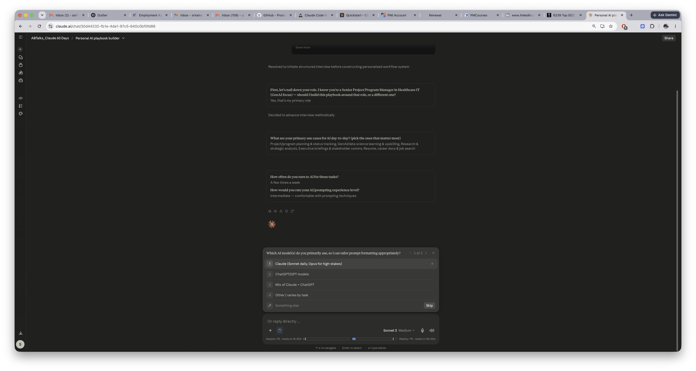

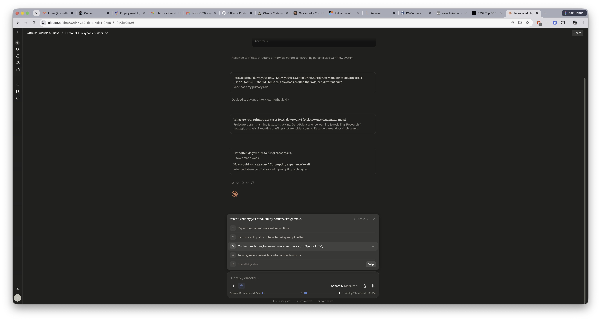

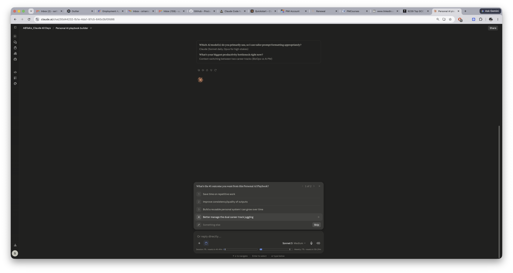

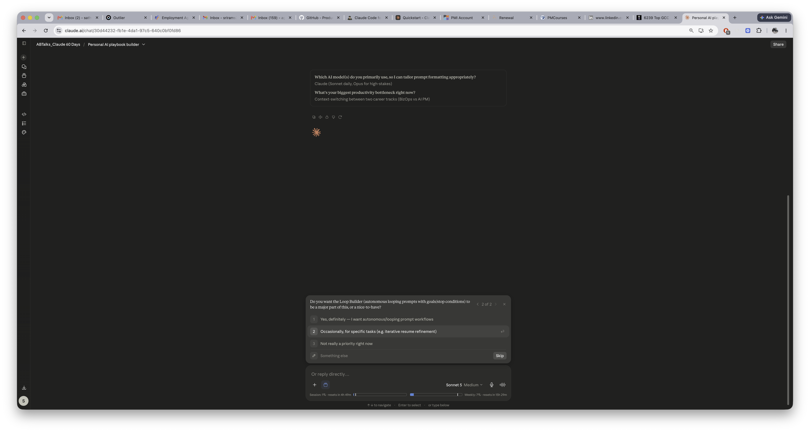

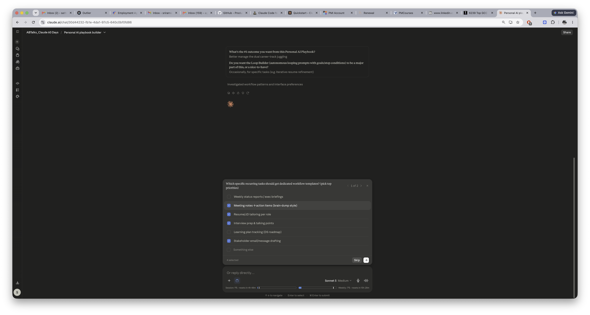

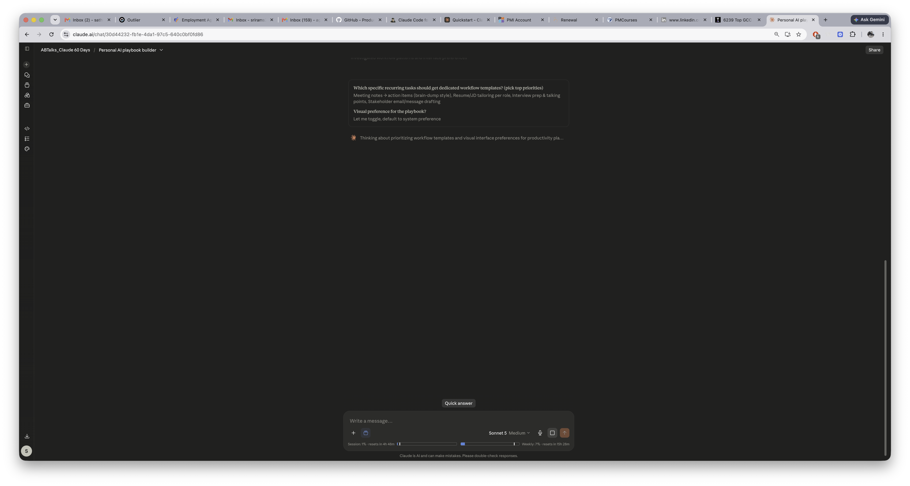

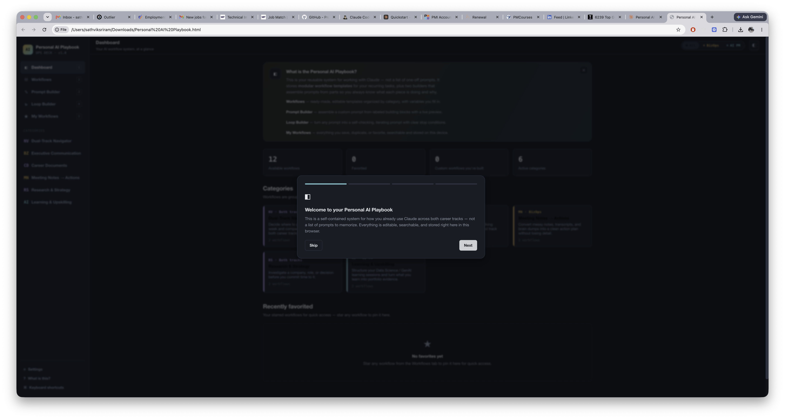

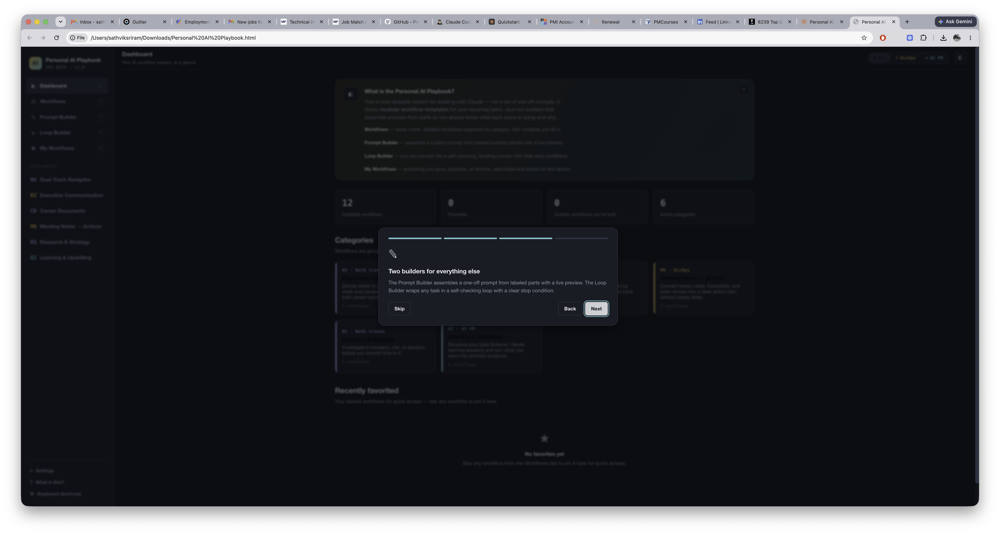

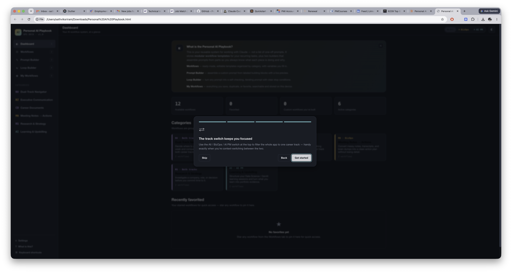

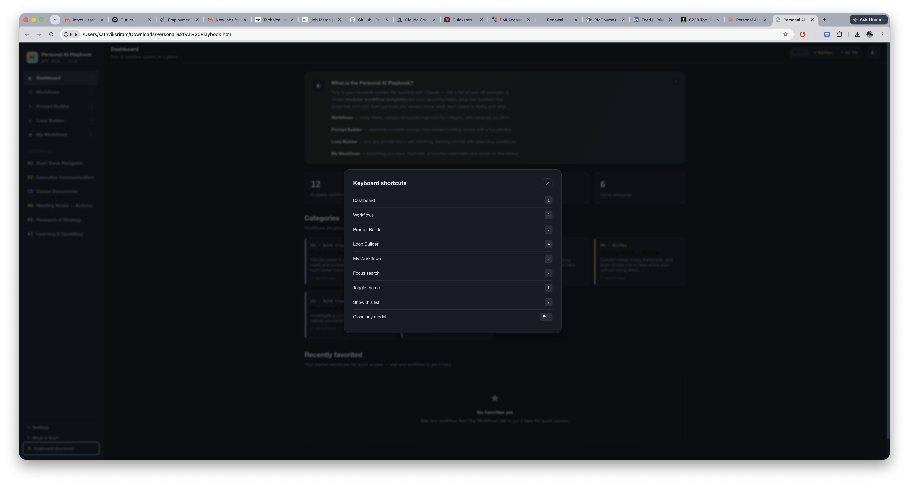

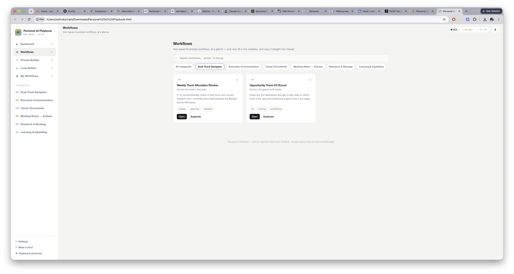

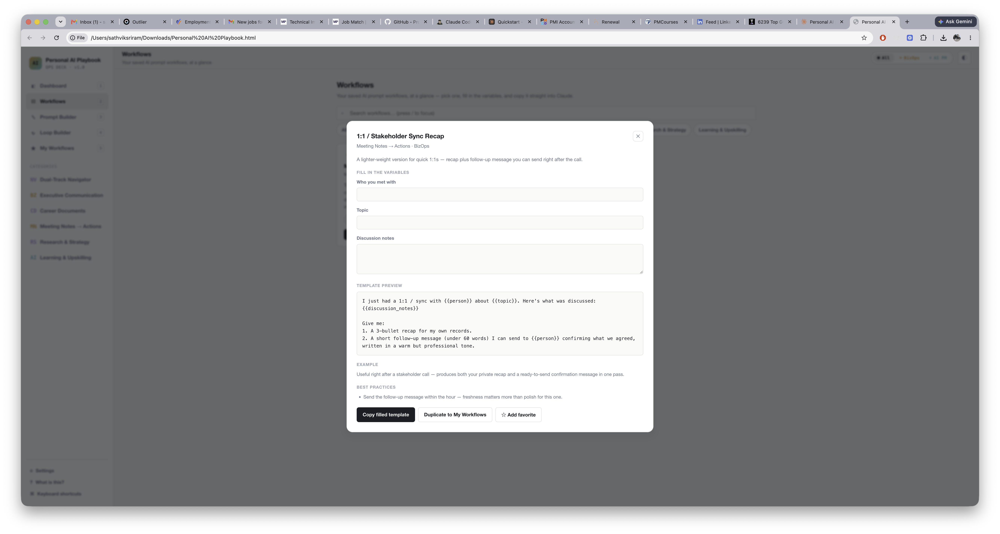

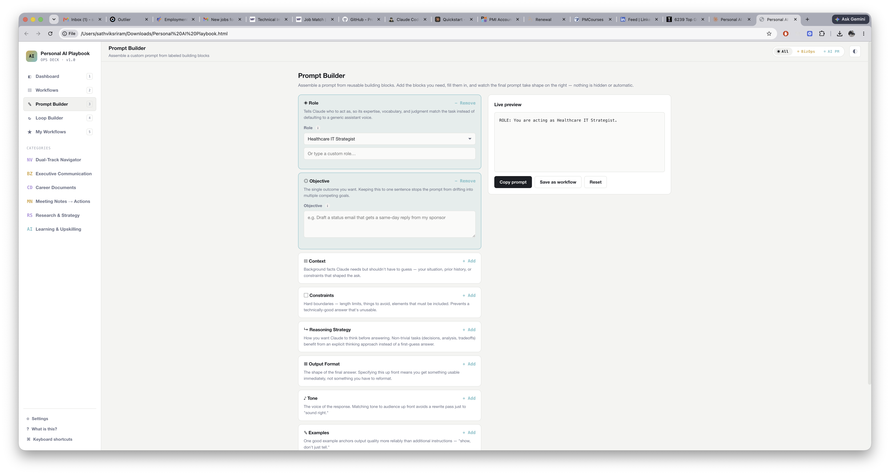

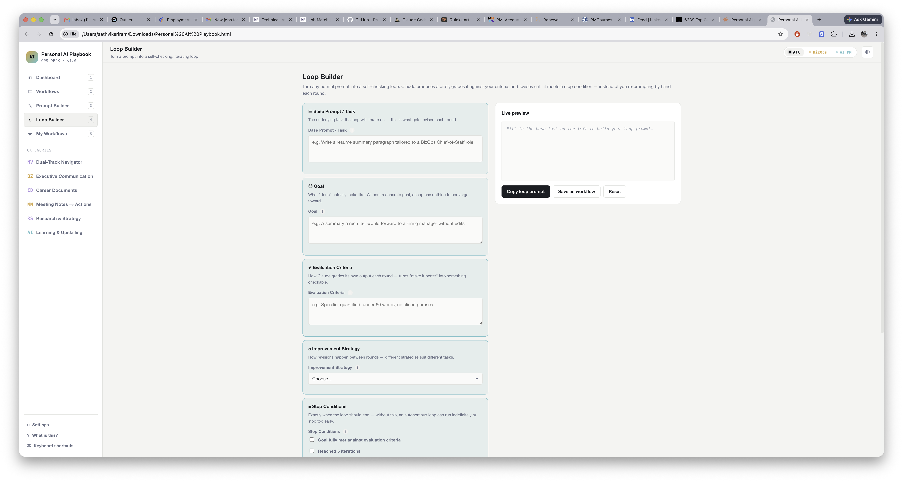

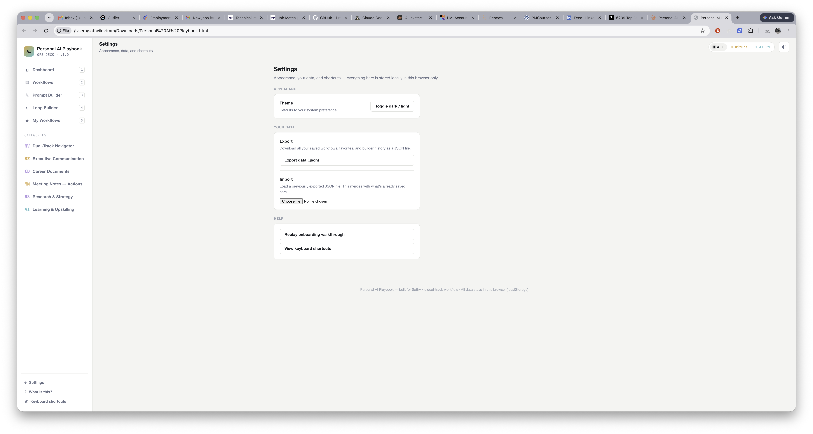
