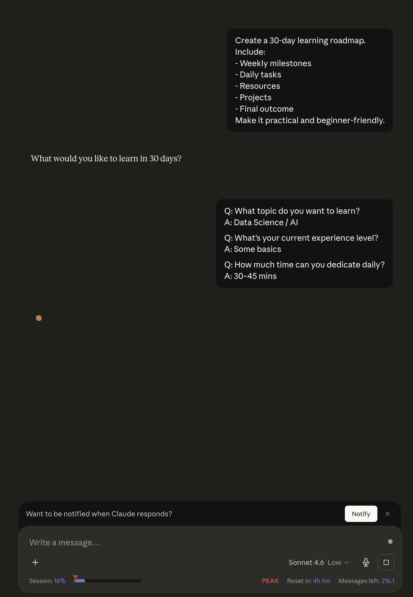
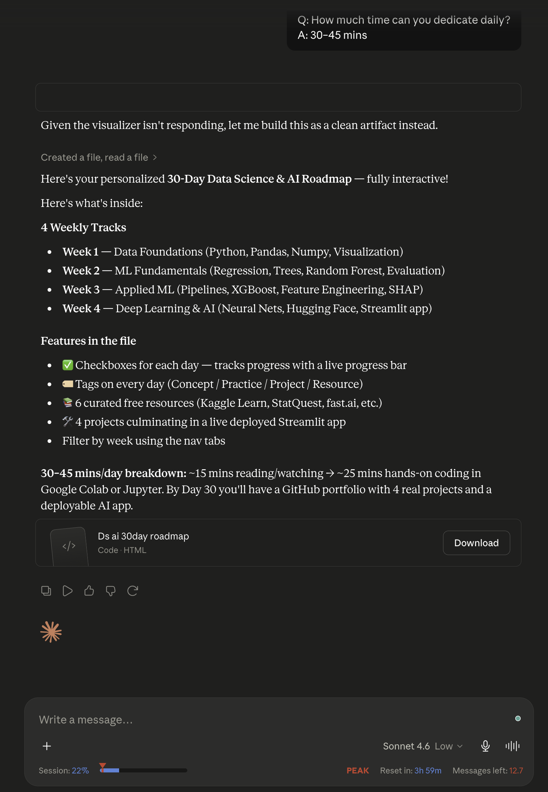
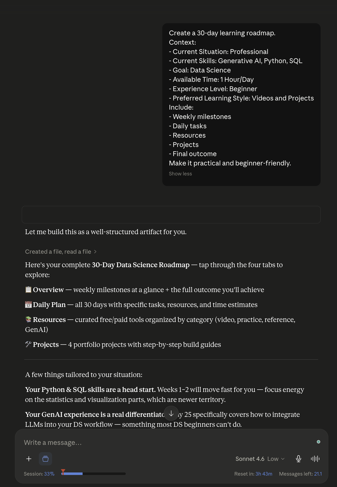
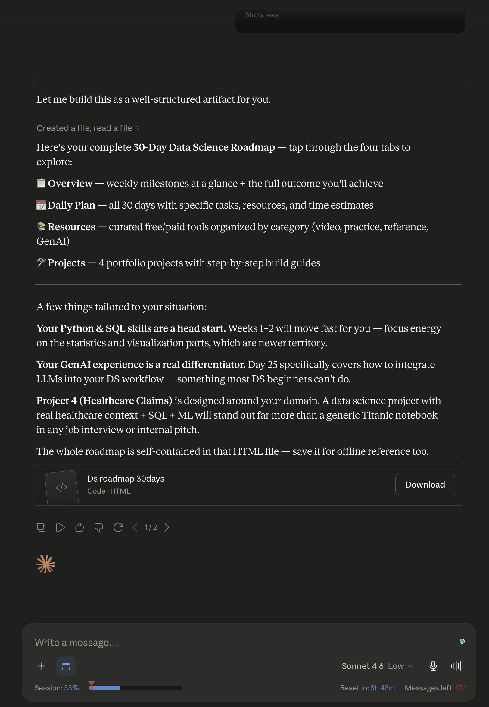

# Day 5

## PROMPT A (WITHOUT CONTEXT)

Create a 30-day learning roadmap.

Include:

- Weekly milestones
- Daily tasks
- Resources
- Projects
- Final outcome

Make it practical and beginner-friendly.

## Screenshot A

## Response A

<iframe src="ds_ai_30day_roadmap.html" width="100%" height="700px"></iframe>

[View full roadmap with no context](ds_ai_30day_roadmap.html)

━━━━━━━━━━━━━━━━━━━━━━

## PROMPT B (WITH CONTEXT)

Create a 30-day learning roadmap.

Context:

- Current Situation: [Student/Professional/Freelancer]
- Current Skills: [Add Skills]
- Goal: [Target Goal]
- Available Time: [Hours per Day]
- Experience Level: [Beginner/Intermediate]
- Preferred Learning Style: [Videos/Projects/Reading]

Include:

- Weekly milestones
- Daily tasks
- Resources
- Projects
- Final outcome

Make it practical and beginner-friendly.

## Screenshot B

## Response B

<iframe src="ds_roadmap_30days.html" width="100%" height="700px"></iframe>

[View full roadmap with context](ds_roadmap_30days.html)

## Results comparison

On Comparing both outputs, the roadmap with context provides more information and resoures needed to follow to acheive the learning goal. Claude had asked for context even when Prompt A was submitted making the results comparable in setting the learning expectations.