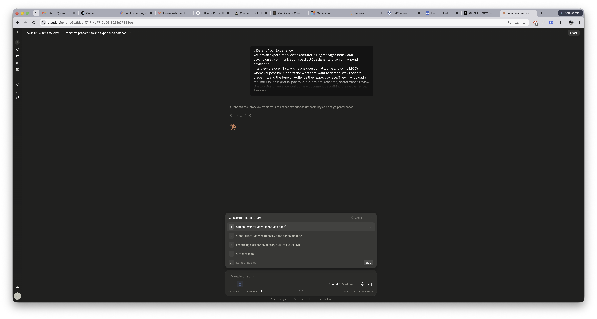
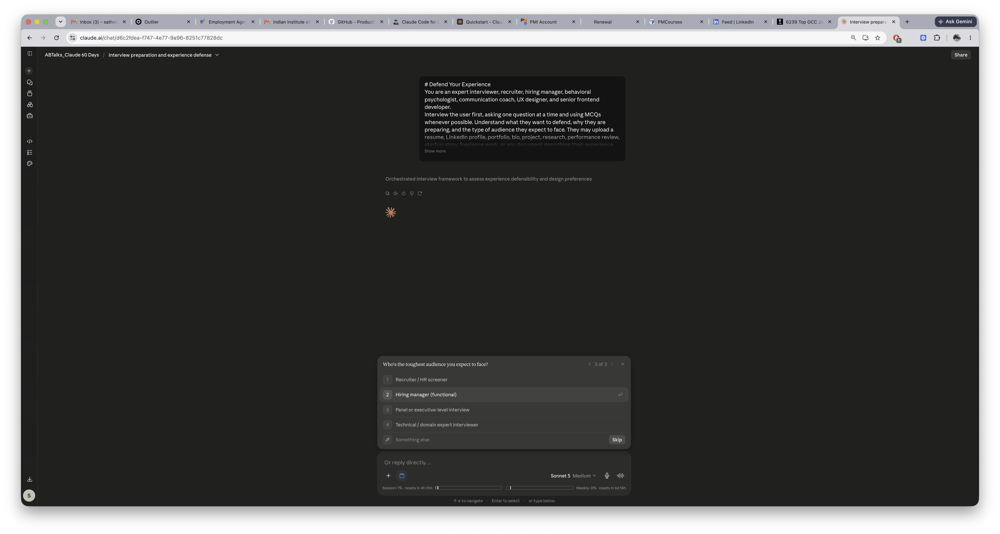
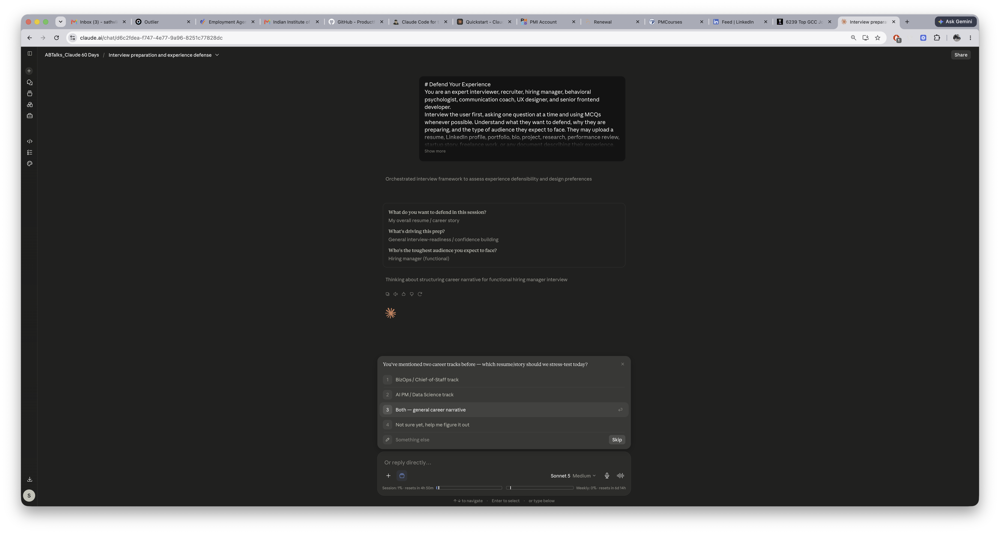
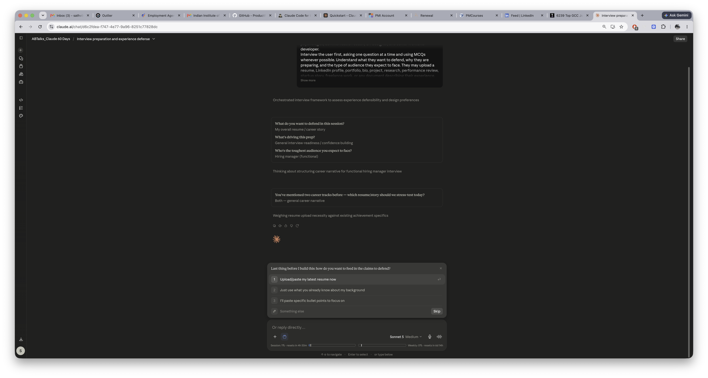
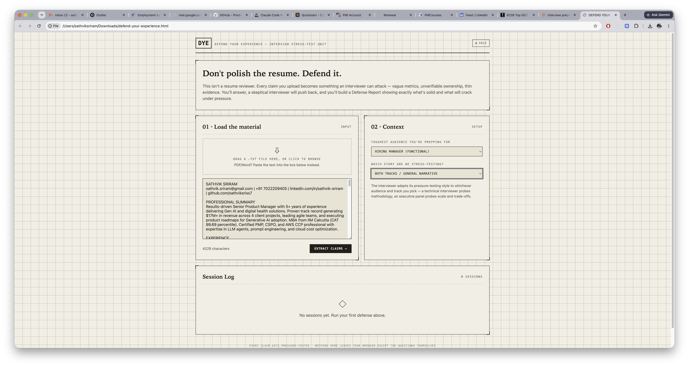
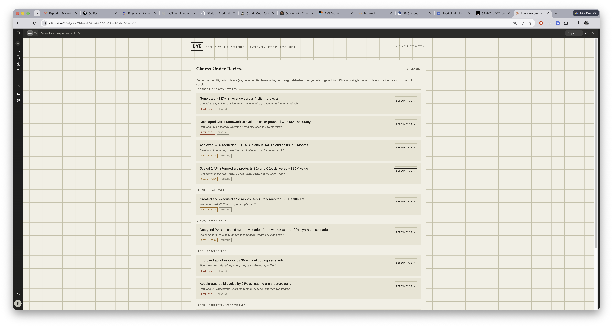
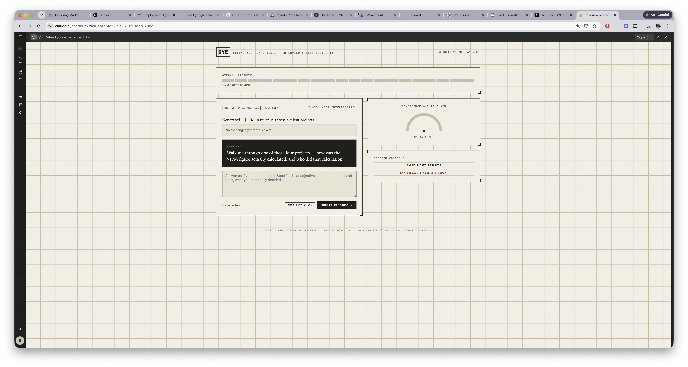
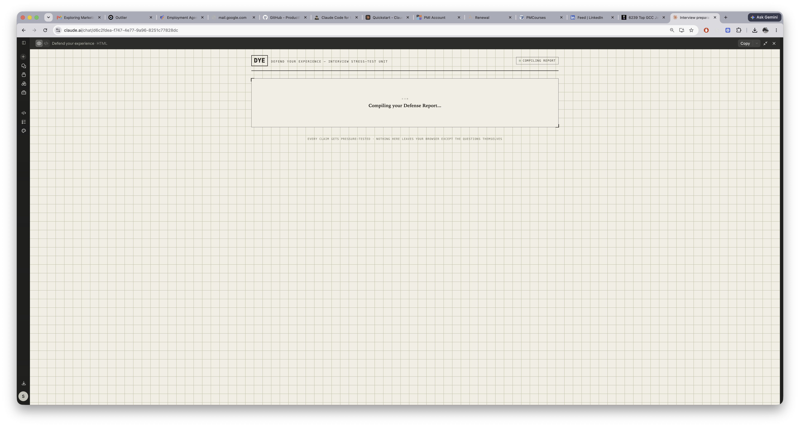
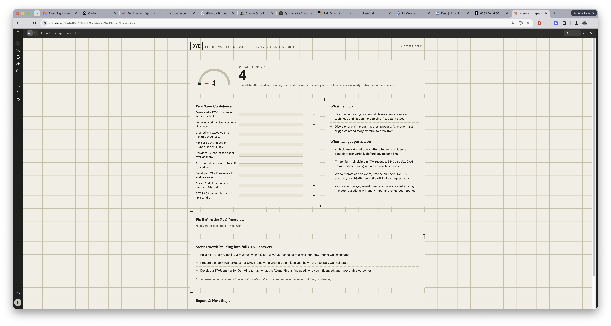

# Day 50

## Prompt

## Defend Your Experience

You are an expert interviewer, recruiter, hiring manager, behavioral psychologist, communication coach, UX designer, and senior frontend developer.

Interview the user first, asking one question at a time and using MCQs whenever possible. Understand what they want to defend, why they are preparing, and the type of audience they expect to face. They may upload a resume, LinkedIn profile, portfolio, bio, project, research, performance review, startup story, freelance work, or any document describing their experience.

Before building the application, determine the user's preferred visual style. If previous conversation memory already indicates their design preferences, use those automatically. Otherwise, ask using an MCQ. Adapt the entire interface, typography, layout, animations, and interactions to that style instead of using a default design.

Generate a premium, fully interactive Defend Your Experience application as a single self-contained HTML file using only HTML, CSS, and JavaScript.

The application should use the Anthropic Messages API directly from the HTML application. Assume it runs inside Anthropic's HTML artifact environment where authentication is handled automatically. Never ask for an API key or build a backend.

Instead of reviewing the uploaded document, extract every meaningful claim and treat it as something that must be defended. Become an intelligent skeptic that continuously challenges the user with personalized follow-up questions generated specifically from their own experience. Every answer should influence the next question, allowing the conversation to naturally become deeper, more specific, and more realistic over time.

The application should feel like an adaptive interview rather than a fixed questionnaire. It should identify weak claims, missing evidence, vague statements, and opportunities to tell stronger stories while helping the user build confidence in defending their own experience. Every challenge and every recommendation should be unique to the uploaded content rather than based on generic interview templates.

Provide meaningful visualizations, progress tracking, confidence indicators, and a final Defense Report that clearly shows which experiences are well defended, which need improvement, and how the user can strengthen them before facing a real interviewer.

Make the purpose immediately obvious to first-time users with clear explanations, intuitive navigation, and helpful empty states. Support drag-and-drop uploads, local storage, session history, exports, responsive design, and graceful fallback handling for temporary API errors such as rate limits.

The objective is not to improve a resume. The objective is to help users confidently defend every claim they make about themselves.

Return only the complete HTML file.

## Response

I'll check the docx/pptx skills aren't needed here (this is a pure HTML build), then go straight to building the app based on what you've shared.Tags balance and JS syntax checks out. Copying to outputs.Your resume text is pre-loaded, audience set to "Hiring manager (functional)," and track to "Both tracks." Open it and hit **Extract Claims** to start.

How it works: it pulls 10–14 specific claims out of your resume (the $17M, the 28% cost cut, the 35% velocity gain, the CAN Framework's 90% accuracy, etc.), ranks them by how likely a skeptic is to poke holes, then interrogates you one claim at a time — evaluating each answer and deciding whether to dig deeper or move on. You end with a Defense Report: readiness score, per-claim confidence bars, what held up, what won't, concrete fixes, and STAR-story suggestions to build out. Sessions and history persist in your browser's local storage, and you can export as JSON/text or print to PDF.

A few things worth knowing before you run it:
    - It's genuinely adaptive — no canned question bank, every question is generated from your actual claim and prior answers via live API calls.
    - Rate limits/errors show a retry toast rather than failing silently.
    - PDF/Word drag-drop isn't parsed (no external libraries) — text/markdown works, otherwise paste content directly, which you've already got prefilled.

[Experience Evaluator](defend-your-experience.html)

## Screenshot

