# Day 51

## Prompt

Product Discovery & Sprint Planning

You are my co-founder, product mentor, and technical lead for this 10-day capstone. Your goal is to help me go from no idea to a deployed v1.0 product. Help me discover the right problem, shape the best solution, and guide me through the entire journey over the next 10 days (including today).

I'm participating in the AB Talks 60-Day Claude AI Challenge. This capstone follows a real software development lifecycle:

Requirements → Design → Setup → Implementation → Testing → Deployment → Maintenance

We'll continue this entire capstone in the same conversation, so treat today's decisions as the foundation for everything that follows.

Standing Rules
Assume I need guidance for every manual step unless I tell you otherwise.
Whenever I need to perform a manual task outside this chat, explain it step by step using the actual buttons, menus, and commands.
Wait for my confirmation and a screenshot before continuing.
Never assume I've completed a step.
Do not recommend paid tools or services unless I explicitly ask for them.

Today's Goal

Interview me one question at a time.

Keep every question simple, and briefly explain why you're asking it.

If I don't already have a project idea, interview me to discover one. Understand my interests, goals, skills, strengths, and constraints, then suggest, compare, refine, combine, and challenge ideas until we've chosen the strongest project I can realistically build in 10 days.

Don't optimize for the most ambitious project. Optimize for the most impressive project that can be fully completed within the available time. Continuously protect me from scope creep.

Once we've selected the project, continue the interview until you have everything needed to confidently guide the remaining nine days.

Clearly define:

What the v1.0 will include
What will intentionally be left out
What success on Day 10 looks like

Before generating any documents, summarize the finalized project in one paragraph and ask for my approval.

Only generate the deliverables after I confirm.

Deliverables

Generate downloadable versions of:

1. Product Requirements Document (PRD)

    A complete, professional PRD for the finalized project.

2. Implementation Blueprint (Days 2-10)

    Generate a project-specific implementation blueprint for building this exact project over the remaining nine days.

    This must not be a generic template.

    Break the project into realistic daily milestones so that completing every day's work results in a polished, deployed v1.0 by Day 10.

    For each day, include:

    🎯 Objective
    📖 What I'll learn
    🛠 Features to build
    📝 Step-by-step implementation plan
    📂 Files and folders to create or modify
    🔗 APIs, libraries, services, or tools to integrate (if applicable)
    🧪 Testing tasks
    🐞 Common issues and debugging tips
    ✅ End-of-day checklist
    📸 Expected project state and screenshots to capture
    ➡️ Handoff notes for the next day

    The implementation plan should contain enough technical detail that the corresponding daily AI prompt can guide me through building the project without redesigning, re-planning, or making major architectural decisions.

    Assume each remaining day begins with a fresh AI conversation. Therefore, each day's section must contain enough context that another AI assistant could immediately continue building from where the previous day ended.

    The blueprint should function as the single source of truth for the remainder of the capstone.

3. Project Pitch Deck

    Create a presentation-ready pitch deck covering:

    Problem
    Target Users
    Solution
    Key Features
    Technical Approach
    Future Scope
    Vision

Important

Do not choose the tech stack or write code today.

Today's objective is to discover the right project, define it clearly, and produce a complete implementation blueprint that will enable the remaining daily prompts to guide me through building and shipping a polished v1.0 product by Day 10.

## Response

Here's where we've landed. Let me propose a name and lock the scope before we go further.

**Suggested name: PriorIQ** (Priority + IQ — an AI copilot that makes your roadmap scoring intelligent and defensible). Alternates if you'd rather: **ClarityRank** or **RoadmapRationale**.

**One-paragraph summary — please review:**

PriorIQ is a web tool for Product Managers that turns subjective roadmap prioritization into a defensible, AI-assisted process. A PM adds roadmap items — manually or via CSV import — and PriorIQ scores each one using the RICE framework (Reach, Impact, Confidence, Effort), with AI suggesting initial estimates from the item description, flagging inconsistent or overly optimistic scoring (bias/stress-testing), and generating a plain-English rationale for why an item ranks where it does. The core screen is a ranked roadmap board; from any item, the PM can generate a polished, shareable one-pager report — score breakdown plus AI-written rationale — that's ready to send to execs or teammates to defend a priority call, without needing a shared login or multi-user account system. v1.0 is a **single-owner tool with shareable exported output**, not a multi-user SaaS — this keeps scope realistic for ~9-18 build hours while still delivering the "team + exec visibility" value you wanted. Deliberately **out of scope for v1.0**: multi-user accounts/logins, real-time collaboration, dynamic multi-framework selection (we anchor on RICE, not an AI framework-picker across RICE/WSJF/ICE), third-party integrations (Jira/Linear), and historical trend analytics. **Success on Day 10** looks like: a live, deployed URL where you can add 5-10 realistic roadmap items, see them auto-scored and ranked with AI-flagged risk/bias notes, and generate a clean, downloadable/shareable one-pager rationale report for any item — polished enough to walk a hiring panel through in under 5 minutes without anything breaking.

A few callouts on where I've deliberately cut scope from what you originally asked for, since you should sign off on these trade-offs explicitly:
    - **"AI recommends best framework per situation"** → simplified to **RICE, applied rigorously with AI assistance**. Dynamic framework-switching is a much harder, fuzzier problem and risks a shallow, unconvincing demo. RICE is the most recognizable framework to any PM interviewer — it reads as "solid," not "cut corner."
    - **"Team + execs shared view"** → simplified to **single-owner + shareable export**. Gets you 90% of the value (others *can* see and be convinced by the output) without the multi-day tax of auth/roles/real-time sync.

Let's build these. I'll create the PRD first, then the Blueprint, then the Pitch Deck. This will take a few steps — I'll work through them one at a time.Good, PRD looks clean and professional. Now let's build the Implementation Blueprint — the biggest document.21 pages. Let me spot-check a few for rendering quality.Looks clean. Let me check one more mid-document page and the last page.Good — clean and consistent throughout. Now let's build the pitch deck.Nice. Let's check the rest.All 8 slides look clean, on-brand, and consistent — no overflow, good contrast, varied layouts. Let's run the content QA check and then package everything for delivery.No placeholder leftovers. Now let's move the three final deliverables into outputs and present them.Day 1 is done. Here's what's in these three files:

[**PriorIQ_PRD.docx**](PriorIQ_PRD.docx)— full requirements doc: problem, goals, personas, in/out-of-scope table, 10 functional requirements, risks, and Day-10 success criteria. It also flags the open architecture decision for Day 2, as promised — nothing was locked in today.

[**PriorIQ_Implementation_Blueprint.docx**](PriorIQ_Implementation_Blueprint.docx) — the source of truth for Days 2–10. Each day is self-contained (objective → learning → features → step-by-step plan → files → integrations → testing → debugging → checklist → screenshots → handoff), so you can paste any single day into a fresh chat and it'll have everything it needs. It also includes a "Project Reference Pack" up top (data schema, RICE formula, draft AI prompts, recommended architecture) to carry forward.

One thing worth flagging: I recommended a default architecture (single-file HTML/CSS/JS built as a Claude Artifact, using its built-in storage and Anthropic API access) specifically because it needs **zero paid tools or API keys** — but it's marked "to confirm on Day 2," not decided today, per your rules.

[**PriorIQ_Pitch_Deck.pptx**](PriorIQ_Pitch_Deck.pptx)— 8 slides covering problem, users, solution, features, technical approach, future scope, and vision.

A couple of quick notes before Day 2:
    - We're deliberately deferring multi-framework AI selection and true multi-user collaboration — flagged clearly as trade-offs in the PRD.
    - Day 2 will open by actually confirming the architecture recommendation with you (or picking an alternative) before any code gets written.

Let me know when you're ready to start Day 2, or if you'd like any changes to today's docs first.

## Screenshot

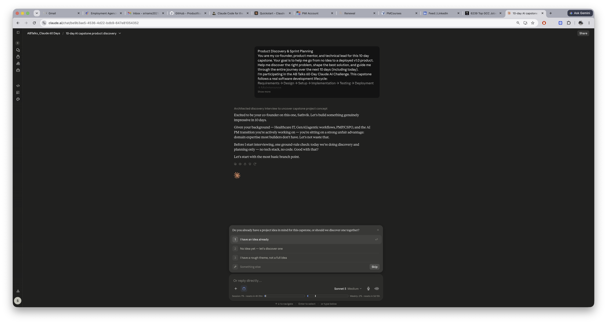

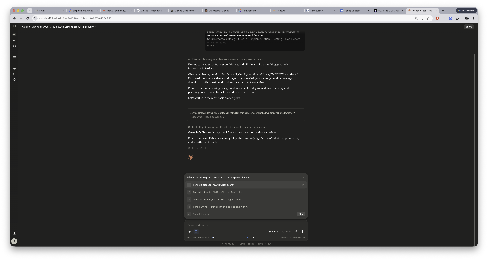

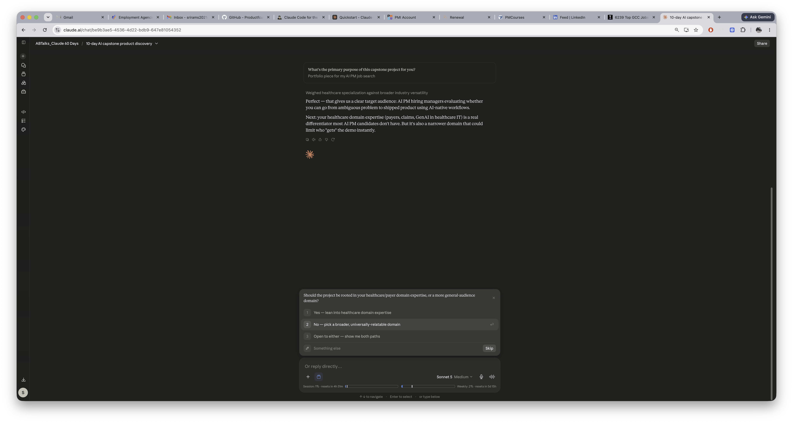

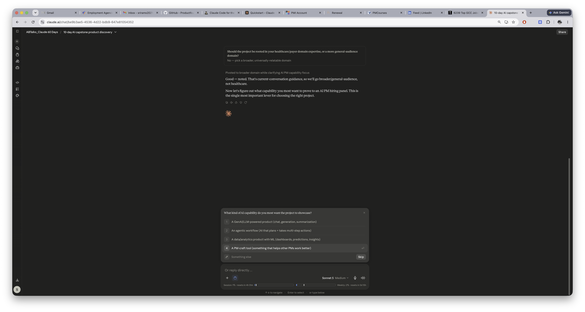

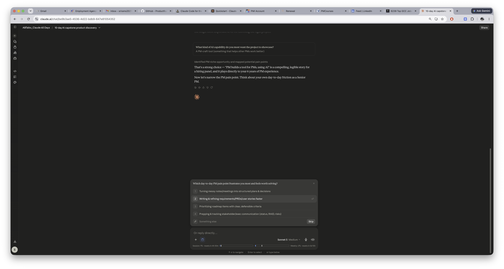

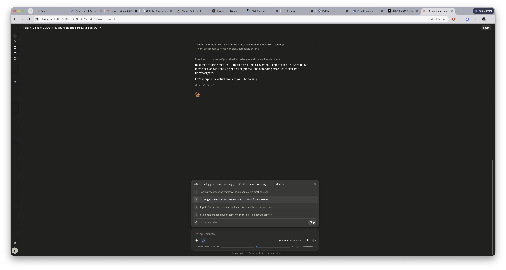

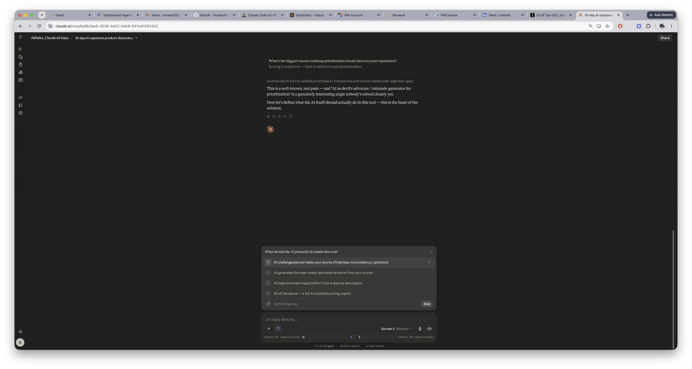

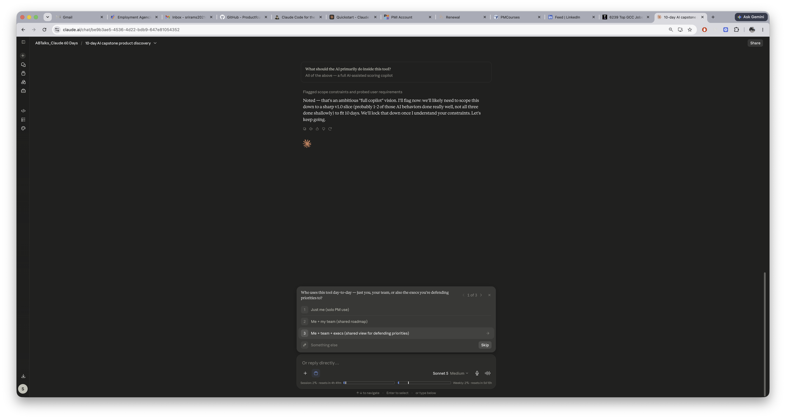

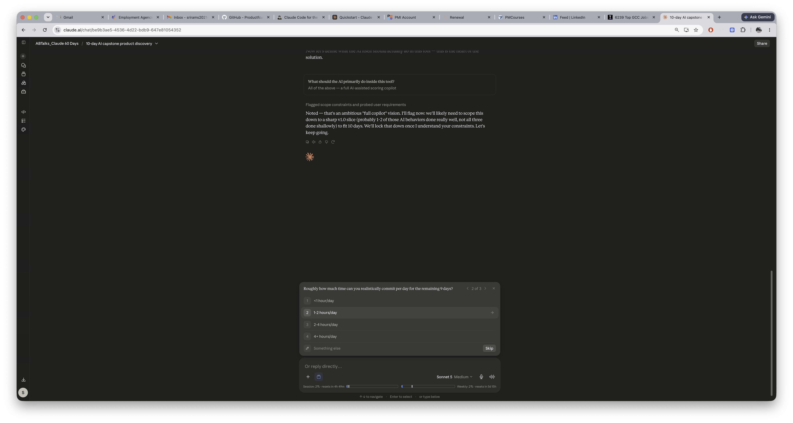

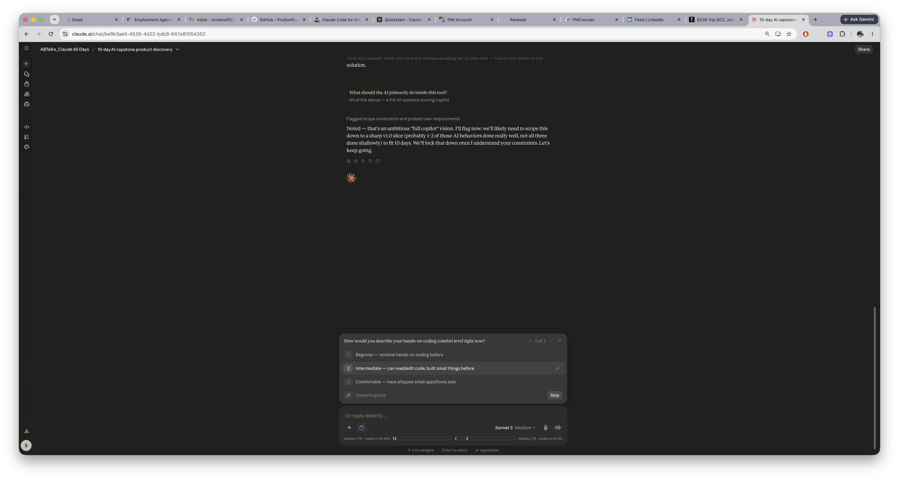

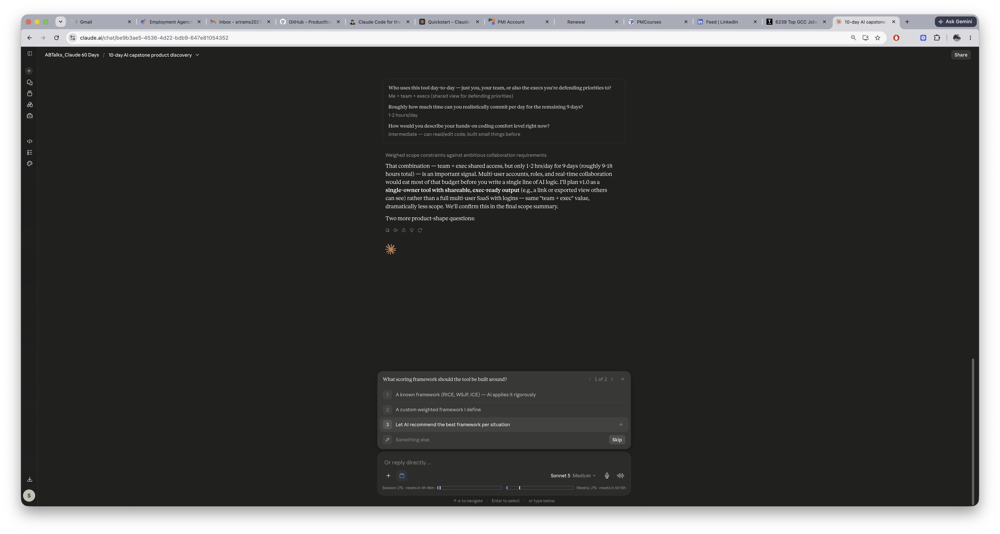

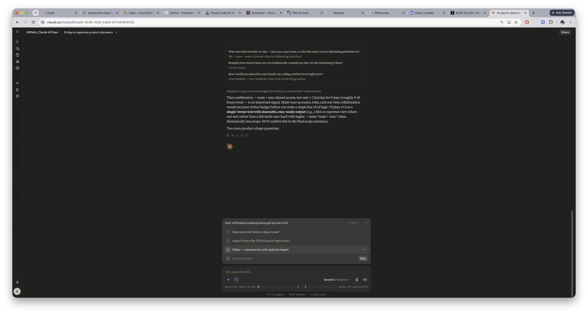

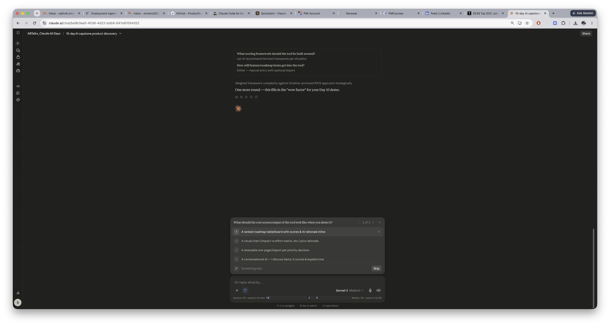

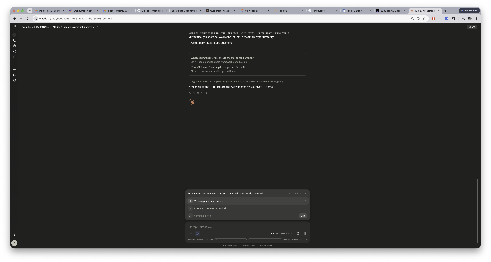
