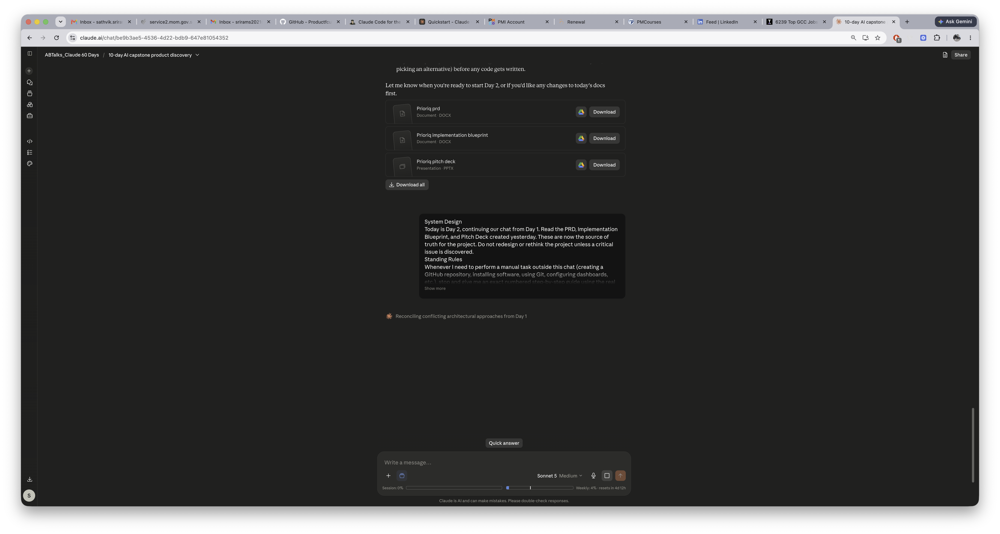
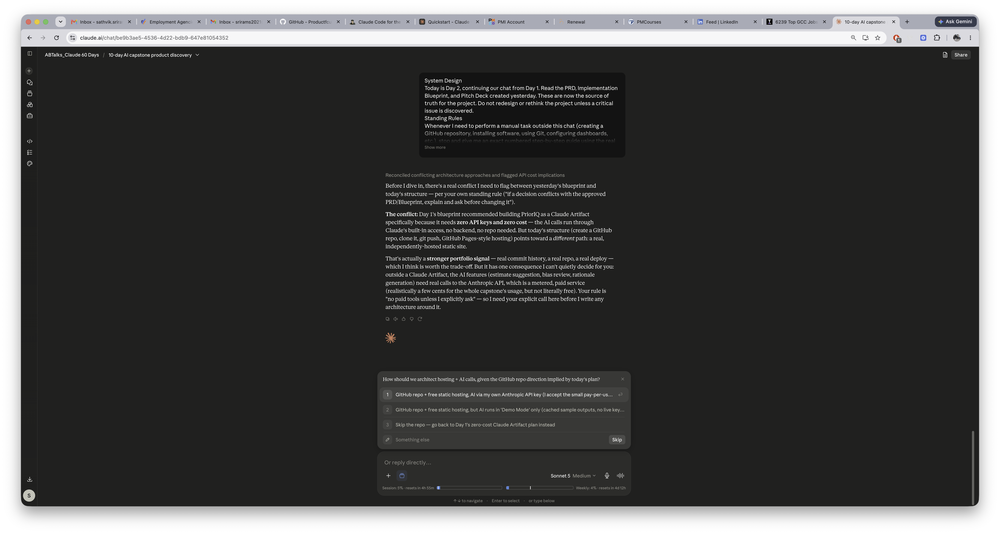
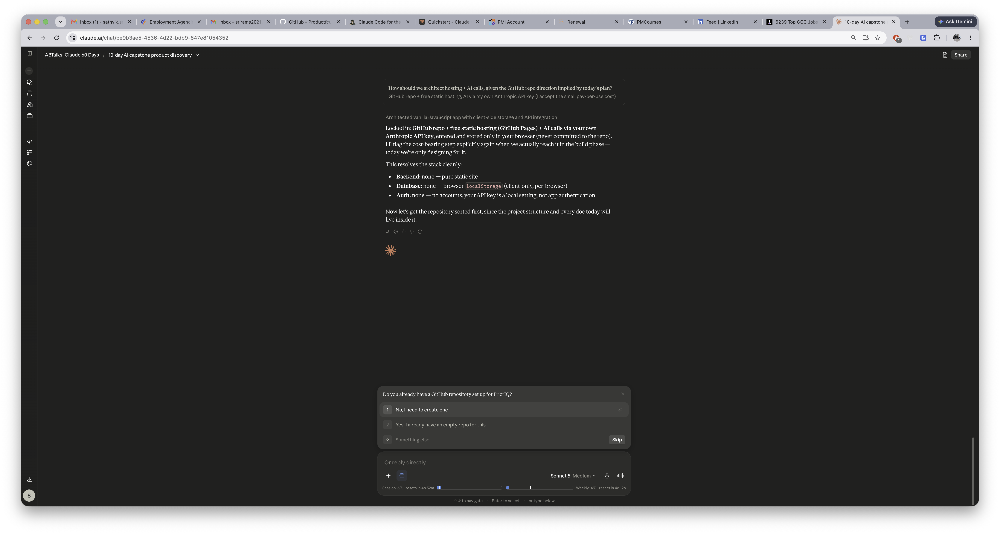
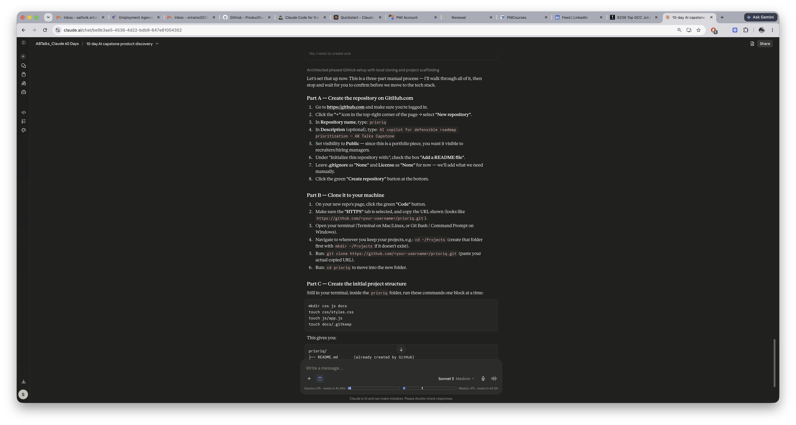
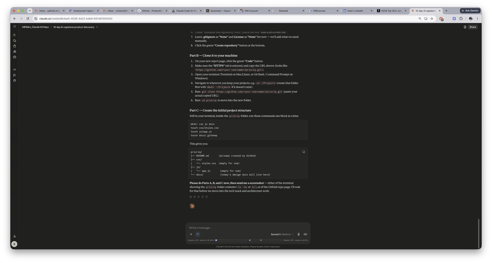
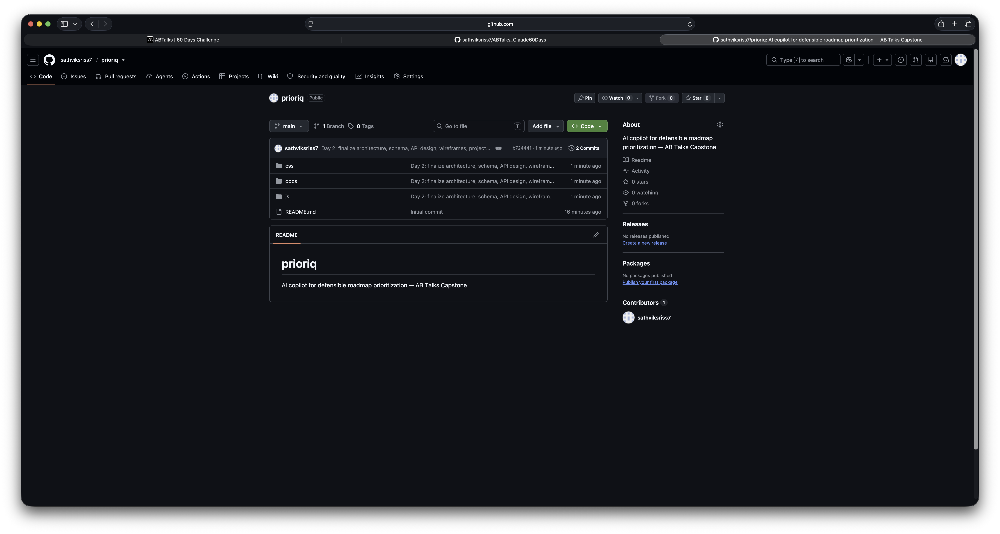

# Day 52

## Prompt

System Design

Today is Day 2, continuing our chat from Day 1. Read the PRD, Implementation Blueprint, and Pitch Deck created yesterday. These are now the source of truth for the project. Do not redesign or rethink the project unless a critical issue is discovered.

Standing Rules

Whenever I need to perform a manual task outside this chat (creating a GitHub repository, installing software, using Git, configuring dashboards, etc.), stop and give me an exact numbered step-by-step guide using the real names of buttons, menus, fields, and commands.
Wait for my confirmation and a screenshot before moving on.
Do not assume I've completed any manual step.

Today's Goal

Today's objective is to transform the project plan into a complete technical blueprint that makes implementation straightforward.

Do not write production code today.

Follow the Day 2 section of the Implementation Blueprint, but improve it wherever necessary.

If any design decision conflicts with the approved PRD or Implementation Blueprint, explain why and ask for my approval before changing it.

Complete the following

0. Repository Setup

    If I don't already have a GitHub repository for this project:

    Walk me through creating one.
    Clone it locally.
    Create the initial project structure.
    Explain every step before we continue.

1. Finalize the Tech Stack

    Based on the project requirements:

    Frontend
    Backend
    Database
    Authentication
    AI Model/API (if needed)
    Hosting
    Other tools or libraries

    Explain why each choice is the best fit. Prefer free tools whenever possible.

2. System Architecture

    Design the complete architecture. Include:

    Component diagram
    Data flow
    Request lifecycle
    AI interaction (if applicable)
    External services

    Show the architecture using diagrams (Mermaid preferred).

3. Database Design

    If the project requires data storage: Design:

    Tables / Collections
    Fields
    Relationships
    Constraints

    Validate the schema against every user story from the PRD.

4. API Design

    List every endpoint required for the v1.0 product. For each endpoint include:

    Purpose
    Request
    Response
    Validation
    Authentication
    Error cases

    No implementation yet.

5. UI & User Flow

    Design the complete user journey. Include:

    User Flow Diagram
    Screen Flow
    Wireframes (low fidelity is enough)
    Navigation

    Every screen should exist for a reason.

6. Project Structure

    Design the complete folder structure. Explain:

    What every major folder is responsible for.
    Where future code will live.
    Why the structure was chosen.

7. Day 3 Readiness Check

    Review the remaining Implementation Blueprint. Confirm that:

    The project can realistically be completed within the remaining days.
    No unnecessary scope has crept in.
    Tomorrow can begin implementation immediately.

    If anything should be simplified, recommend it now.

Deliverables

Generate downloadable versions of:

ARCHITECTURE.md
SCHEMA.md
API.md
UI-WIREFRAMES.md
PROJECT-STRUCTURE.md

Also update the Implementation Blueprint if today's design decisions require any changes.

End of Day

Help me:

Commit today's work.
Push it to GitHub.
Update the project log.
Write a LinkedIn post summarizing today's progress.

Tomorrow should begin building immediately, with no additional planning required.

## Response

The repo structure looks exactly right — `css/`, `js/`, `docs/`, `README.md`, and `main` branch initialized. Confirmed. Let's move into the technical blueprint.Now let's update the Implementation Blueprint to reflect the confirmed architecture — Days 3, 5, and 9 assumed the Day 1 default (Claude Artifact), which is now superseded.Now let's update Day 5 (AI integration) to reflect BYOK + the CORS header requirement, and Day 9 (deployment) to reflect confirmed GitHub Pages.Now Day 9 (Deployment) — replace the Path A/B ambiguity with the confirmed GitHub Pages flow.Now let's regenerate the blueprint and verify it renders cleanly.Content renders correctly. Now let's finalize everything — copy files into outputs and generate the deliverables.## Day 3 Readiness Check

Quick gut-check on the remaining 8 days, now that the architecture is locked:

- **Realistic?** Yes — the confirmed stack (vanilla JS, no build step, localStorage, one API integration pattern reused 3 times) is *simpler* to actually build than a framework-based app would be, so the 1–2 hr/day budget still holds.
- **Scope creep?** None found. The only real addition since Day 1 is the Settings screen — but that's a direct, unavoidable consequence of the BYOK decision, not scope drift, and it's small (one input field).
- **Can Day 3 start immediately?** Yes. Every open question — architecture, schema, prompts, screens, file layout — is now resolved and documented in `docs/`. Tomorrow's chat can paste those files and start writing `index.html` with zero planning left to do.

No simplification needed — the plan holds.

---

## End of Day — Commit & Push

**First:** download the 7 files above and place them in your local repo before running any commands:

- `ARCHITECTURE.md`, `SCHEMA.md`, `API.md`, `UI-WIREFRAMES.md`, `PROJECT-STRUCTURE.md`, `PROJECT-LOG.md` → into `prioriq/docs/`
- `PriorIQ_Implementation_Blueprint.docx` → also into `prioriq/docs/` (keep the original PRD/Pitch Deck from Day 1 there too, if you haven't already)

Then, in your terminal, inside the `prioriq` folder:

1. `git add .`
2. `git commit -m "Day 2: finalize architecture, schema, API design, wireframes, project structure"`
3. `git push`
4. Refresh your repo page on GitHub.com and confirm the `docs/` folder now shows all the new files.

**Please run these and send a screenshot of the GitHub repo page showing the pushed files** — I'll wait for that before we call Day 2 closed.

## Screenshot

