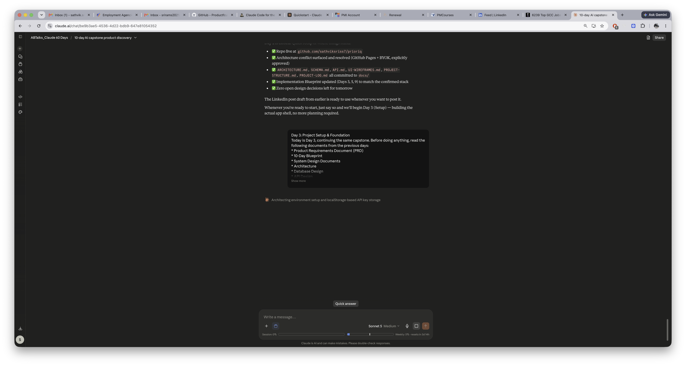

# Day 53

## Prompt

Day 3: Project Setup & Foundation

Today is Day 3, continuing the same capstone. Before doing anything, read the following documents from the previous days:

* Product Requirements Document (PRD)
* 10-Day Blueprint
* System Design Documents
* Architecture
* Database Design
* API Design
* Project Structure

These documents are now the source of truth. Do not redesign the project unless a critical issue is discovered. If any document is unavailable, ask me to upload it.

Standing Rules

* Assume I need guidance for every manual step unless I tell you otherwise.
* Whenever I need to perform a task outside this chat, explain it using the exact buttons, menus, commands, and terminal instructions.
* Wait for my confirmation and a screenshot before continuing.
* Never assume I've completed a manual step.
* Explain every technical concept in beginner-friendly language before using it.

Today's Goal

Today's objective is to build the project's foundation. By the end of today I should have:

* Development environment fully configured
* Project running locally
* Complete folder structure
* Git repository initialized and connected
* Dependencies installed
* Configuration files completed
* Database connected (if required)
* Authentication scaffolded (if required)
* Basic navigation/routing working
* A working "Hello World" version of the application running successfully

Do not begin implementing the core features yet unless the Day 2 blueprint specifically schedules a small foundation feature. Follow the Day 3 section of the 10-Day Blueprint while adapting to any issues that arise.

Complete the Following

1. Environment Setup
    Guide me through installing and configuring everything required for this project. Examples include:

    * Runtime
    * IDE extensions
    * Package managers
    * Framework CLI
    * SDKs
    * Environment variables

    Explain why each tool is needed.

2. Project Initialization
    Walk me through:

    * Creating the project
    * Installing dependencies
    * Initializing configuration
    * Running the project
    * Verifying everything works

3. Repository Setup
    If not already completed:

    * Connect local project to GitHub
    * Create appropriate branches
    * Explain the branching strategy
    * Make the initial commit

4. Build the Foundation
    Implement only the foundational pieces required before feature development. Examples:

    * Routing
    * Layout
    * Navigation
    * Authentication scaffold
    * Database connection
    * API client setup
    * Shared components
    * State management
    * Configuration

    Explain every major file that is created.

5. Verify the Project
    Confirm that:

    * The application builds successfully.
    * There are no errors.
    * The project structure matches the System Design.
    * Everything is ready for feature development tomorrow.

    If problems occur, help me debug them before moving on.

Deliverables

Generate downloadable versions of:

* SETUP.md (installation and setup guide)
* PROJECT-STRUCTURE.md (updated if necessary)
* ENVIRONMENT.md (all environment variables, tools, and configuration)
* DAY3-SUMMARY.md

Update the 10-Day Blueprint if today's implementation required any changes.

End of Day

Help me:

* Commit today's work using a meaningful commit message.
* Push it to GitHub.
* Update the project log.
* Write a LinkedIn post summarizing today's progress.

Finally, summarize:

* ✅ What was completed today
* 🚧 What's ready to build tomorrow
* 🎯 What tomorrow's objective will be

Tomorrow should begin implementing the first major user-facing feature, with no additional setup or planning required.

## Response

Let's build the foundation. Given yesterday's architecture decision (vanilla JS, no framework, no backend), today's environment setup is refreshingly light — I'll explain why as we go.

## 1. Environment Setup

**Beginner-friendly context first:** most tutorials assume you need Node.js, npm, and a framework CLI (like `create-react-app`). PriorIQ deliberately skips all of that — it's plain HTML/CSS/JavaScript that runs directly in a browser, with no "build" or "compile" step. That was the whole point of yesterday's tech stack decision: fewer moving parts, faster to build in 1–2 hrs/day, nothing to debug in a toolchain.

Here's what's actually needed, checked against your request list:

| Tool | Needed? | Why |
| --- | --- | --- |
| **Code editor (VS Code)** | ✅ Already have it | Seen in your Day 1 screenshot |
| **Live Server extension** | ✅ Already have it | Your Day 1 screenshot shows "Go Live" in the status bar — this serves your files over `http://localhost` instead of opening them directly. That matters because browsers block ES module imports (`import`/`export`, which we use to split code into files) when a page is opened as a plain file. |
| **Runtime (Node.js)** | ❌ Not needed | Nothing runs on a server — the browser *is* the runtime |
| **Package manager (npm)** | ❌ Not needed | No `package.json`, no dependencies to install — zero external libraries |
| **Framework CLI** | ❌ Not needed | No framework (no React/Vue/etc.) |
| **SDKs** | ❌ Not needed | We'll call the Anthropic API with the browser's built-in `fetch()` on Day 5 — no SDK required for this pattern |
| **Environment variables** | ⚠️ Handled differently | A static site with no build step has no `.env` mechanism. Your Anthropic API key isn't an environment variable — it's a runtime setting the user types into the app, stored in `localStorage` (this is exactly what yesterday's Settings screen design was for). Details in `ENVIRONMENT.md` below. |
| **Browser (Chrome recommended)** | Your choice | Best developer tools for the console/debugging we'll use starting today |

**Please confirm:** open VS Code, and at the bottom-right status bar, do you see **"Go Live"**? That confirms Live Server is ready. (If not, I'll walk you through installing it from the Extensions panel — just the `ritwickdey.LiveServer` extension.)

Good — foundation's in place. Now let's build the actual files. I'll build and test these in my sandbox first (to make sure they actually work), then hand you the exact content and file locations to create locally.Playwright + Chromium are available, so I can actually test this before handing it to you. Let's build the files.Now let's verify everything actually works — syntax check, then a real browser test with Playwright.Server's up. Now let's actually test the app end-to-end with a real browser.Found one real bug via testing — the "Saved ✓" message was getting wiped out immediately because I re-render the whole form right after showing it. Let me fix that.All 12/12 pass. Let's visually confirm the key screenshots look right before handing this to you.Both screenshots confirm the app renders cleanly — empty state with the accent-colored button, populated board with sample items, and the Settings screen showing the "Saved ✓" confirmation with the key properly masked. Let's clean up and package this for you.Good, bash is responsive again — the server process was just holding the shell. Let's package the files now.Now let's update the Implementation Blueprint to mark Day 3 complete with what actually happened.Confirmed. Now let's finalize everything for download.## Now let's get this running on your machine

I already tested this exact code end-to-end (automated 12-check test, caught and fixed a real bug), so this should just work — but let's verify it on your machine too, not assume.

1. Download **`prioriq-day3-files.zip`** above and unzip it.
2. In your `prioriq` folder (the one you cloned on Day 2), you already have empty placeholder files (`css/styles.css`, `js/app.js`) — **replace them** with the versions from the zip.
3. Also copy in the new files from the zip: `index.html` (goes at the root of `prioriq/`), `js/storage.js`, `js/settings.js`.
4. Your `prioriq` folder should now look like:

    ```markdown
   prioriq/
   ├── index.html
   ├── css/styles.css
   ├── js/app.js
   ├── js/storage.js
   ├── js/settings.js
   └── docs/ (unchanged)
   ```

5. Also drop the 4 new docs (`SETUP.md`, `ENVIRONMENT.md`, `DAY3-SUMMARY.md`, updated `PROJECT-STRUCTURE.md`) into `prioriq/docs/`.
6. In VS Code, right-click `index.html` → **"Open with Live Server"**.
7. Your browser should open showing PriorIQ's header, Board/Settings tabs, and an empty state with "+ Add Sample Item."

**Please try this and send a screenshot of it running in your browser** — I'll wait for that before we do the end-of-day commit/push.

Confirmed — the app is live at `127.0.0.1:5500`, showing the header, tabs, and a persisted sample item, and your VS Code Explorer shows all the right files in place (`index.html`, `storage.js`, `settings.js`, updated `app.js`/`styles.css`, plus the new docs). Day 3 foundation is verified working on your machine.

## End of Day — Commit & Push

In your terminal, inside the `prioriq` folder:

1. `git add .`
2. `git commit -m "Day 3: build app foundation — shell, nav, localStorage, Settings screen, verified with automated tests"`
3. `git push`
4. Refresh your GitHub repo page and confirm the new commit and files appear.

**Please run this and send a screenshot of the GitHub repo page** showing the pushed commit — then I'll close out the day.

---

## LinkedIn Post Draft (ready once you've confirmed the push)

> **Day 3 of my AI PM capstone: from blueprint to working code 💻**
>
> Today I built PriorIQ's foundation — app shell, navigation, local persistence, and a settings screen — using a "no framework, no build step" architecture I locked in on Day 2.
>
> The most useful part of today wasn't writing the code — it was testing it properly before calling it done. I wrote an automated 12-point browser test (Playwright) instead of just eyeballing the screen, and it caught a real bug: a "Saved ✓" confirmation message that was getting silently wiped out by a re-render. Fixed before it ever became a Day 8 surprise.
>
> 12/12 checks passing, zero console errors, fully verified locally.
>
> Tomorrow: the first real user-facing feature — full item scoring and a ranked roadmap board.
>
> #ProductManagement #AIPM #BuildInPublic #60DayClaudeChallenge

---

## Summary

**✅ What was completed today**
    - Verified dev environment (VS Code + Live Server, zero other dependencies needed)
    - Built `index.html`, `css/styles.css`, `js/app.js`, `js/storage.js`, `js/settings.js`
    - Tab navigation (Board/Settings), empty-state Board, localStorage persistence, Settings screen with masked API key
    - Automated 12-check Playwright test suite — 12/12 passing, one real bug found and fixed
    - 4 new docs (`SETUP.md`, `ENVIRONMENT.md`, `PROJECT-STRUCTURE.md` updated, `DAY3-SUMMARY.md`) + Blueprint's Day 3 section marked complete

**🚧 What's ready to build tomorrow**
    - A fully tested, working shell with no known bugs
    - `docs/SCHEMA.md`, `docs/API.md` already define exactly what `rice.js`, `board.js`, `form.js` need to do
    - Zero open questions — Day 4 can start writing feature code immediately

**🎯 Tomorrow's objective (Day 4)**
Build the first real user-facing feature: full item CRUD, the RICE scoring engine, and the ranked roadmap board — replacing today's temporary placeholder logic with the real thing.

Send the push confirmation screenshot whenever you're ready, and we'll close Day 3.

## Screenshot


