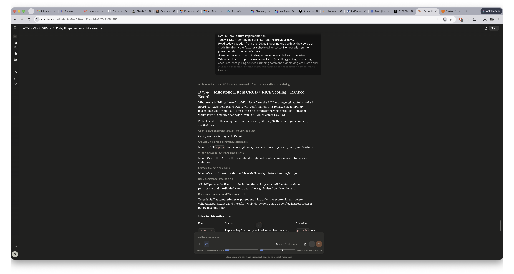
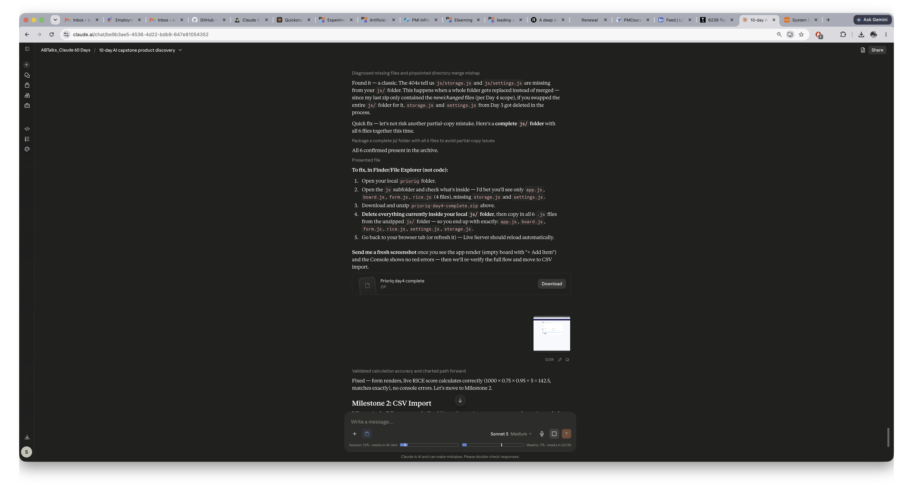
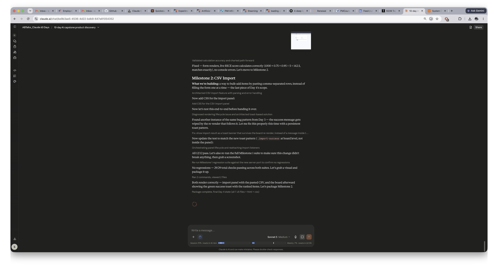
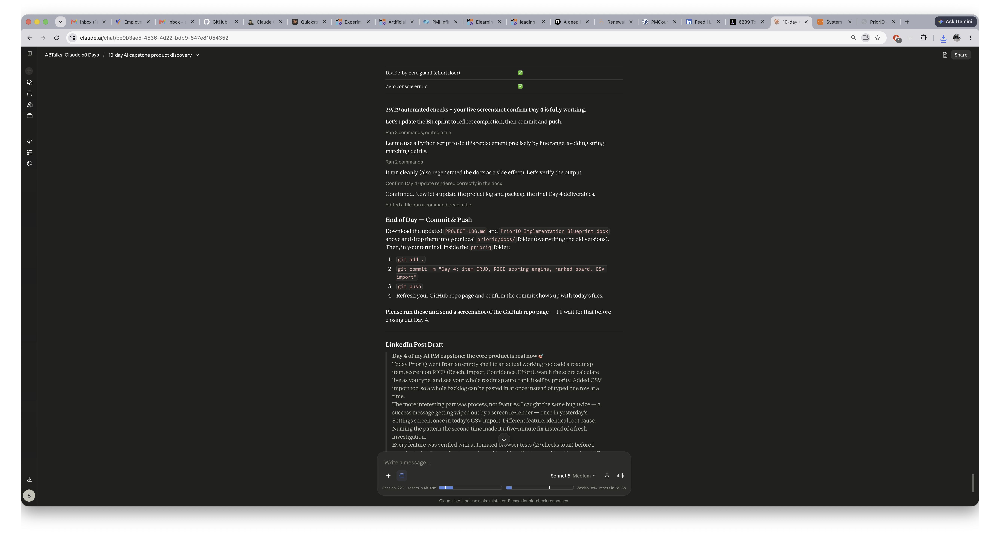

# Day 54

## Prompt

DAY 4: Core Feature Implementation

Today is Day 4, continuing our chat from the previous days.

Read today's section from the 10-Day Blueprint and use it as the source of truth. Build only the features scheduled for today. Do not redesign the project or start tomorrow's work.

Assume I have zero technical experience unless I tell you otherwise.

Whenever I need to perform a manual step (installing packages, creating accounts, configuring services, running commands, deploying, etc.), stop and give me exact step-by-step instructions using the real button names, menu names, and terminal commands. Wait for my confirmation and a screenshot before continuing.

Prioritize implementation over explanation. Keep explanations brief and practical. Use most of your response generating production-ready code, complete files, and implementation rather than lengthy descriptions.

cut the steps short if they take longer than expected.

Build today's work one milestone at a time.

For each milestone:

Briefly explain what we're building and why.
Show every file that needs to be created, modified, or deleted.
Generate the complete final contents of every required file. Never generate snippets, placeholders, TODOs, "...existing code...", or "add this below..." instructions. Every file must be immediately copy-pasteable.
Clearly state where each file belongs and whether it is new or replaces an existing file.
Provide every command I need to run.
Treat each milestone as a checkpoint. Do not continue until I have added the files, run the project, tested the feature, and sent you a screenshot (or the error if something failed).

If anything breaks, help me debug it completely before moving forward. Never build on top of broken code.

Do not skip implementation because it seems repetitive. If today's work requires 2 files or 50 files, generate all of them completely.

Continue today's implementation across as many responses as necessary until every feature assigned to Day 4 in the Blueprint has been successfully implemented and verified.

When today's implementation is complete:

Verify every feature works as intended.
Update any affected documentation.
Help me review the code if improvements are obvious.
Help me commit and push today's work to GitHub with a meaningful commit message.
If the application is deployable today, guide me through deploying it (Vercel, Netlify, Render, Railway, or the chosen platform), wait for a screenshot of the live application, and verify everything works before ending the session.

Finish with a concise summary of what was completed today and what will be built tomorrow.

Never optimize your response for brevity. Optimize for helping me finish today's implementation.

Your goal is not simply to generate code. Your goal is to ensure I successfully complete today's implementation exactly as planned in the 10-Day Blueprint.

## Response

## Day 4 — Milestone 1: Item CRUD + RICE Scoring + Ranked Board

**What we're building:** the real Add/Edit Item form, the RICE scoring engine, a fully ranked Board (sorted by score), and Delete with confirmation. This replaces the temporary placeholder code from Day 3. This is the core feature of the whole product — once this works, PriorIQ actually does its job (minus AI, which comes Day 5-6).

I'll build and test this in my sandbox first (exactly like Day 3), then hand you complete, verified files.Good, sandbox is in sync. Let's build.Now the full `app.js` rewrite as a lightweight router connecting Board, Form, and Settings:Now let's add the CSS for the new table/form/board-header components — full updated stylesheet:Now let's actually test this thoroughly with Playwright before handing it to you.All 17/17 pass on the first run — including the ranking logic, edit/delete, validation, persistence, and the divide-by-zero guard. Let's grab visual confirmation too.**Tested: 17/17 automated checks passed** (ranking order, live score calc, edit, delete, validation, persistence, and the effort=0 divide-by-zero guard all verified in a real browser before reaching you).

## Files in this milestone

| File | Status | Location |
| --- | --- | --- |
| `index.html` | **Replaces** Day 3 version (simplified to one view container) | `prioriq/` root |
| `css/styles.css` | **Replaces** Day 3 version (added table/form/board styles) | `prioriq/css/` |
| `js/app.js` | **Replaces** Day 3 version (now a proper router) | `prioriq/js/` |
| `js/rice.js` | **New** | `prioriq/js/` |
| `js/board.js` | **New** | `prioriq/js/` |
| `js/form.js` | **New** | `prioriq/js/` |

`js/storage.js` and `js/settings.js` are unchanged — don't touch those.

## Your steps

1. Download and unzip `prioriq-day4-milestone1.zip`.
2. Copy all files into your `prioriq` folder, **overwriting** `index.html`, `css/styles.css`, `js/app.js` when prompted, and adding the 3 new `js/` files.
3. In VS Code, if Live Server is still running, it should auto-refresh. If not, right-click `index.html` → **"Open with Live Server"**.
4. Test it yourself:
   - Click **"+ Add Item"**, fill in a title/description and some Reach/Impact/Confidence/Effort numbers — watch the **Live RICE Score** update as you type.
   - Save it, add a second item with different numbers, confirm the board **ranks them by score**, highest first.
   - Click **Edit** on one, change a value, save — confirm it updates in place (no duplicate).
   - Click **Delete** — confirm a browser popup asks you to confirm, and the item disappears.
   - Refresh the page — confirm everything's still there.

**Send me a screenshot of your populated, ranked board** — then we'll move to Milestone 2 (CSV import), the last piece of Day 4.

User input: shared error and screenshot

Fixed — form renders, live RICE score calculates correctly (1000 × 0.75 × 0.95 ÷ 5 = 142.5, matches exactly), no console errors. Let's move to Milestone 2.

## Milestone 2: CSV Import

**What we're building:** a way to bulk-add items by pasting comma-separated rows, instead of filling the form one at a time — the last piece of Day 4's scope.Now add CSS for the import panel:Now let's test this end-to-end before handing it over.Found another instance of the same bug pattern from Day 3 — the success message gets wiped by the re-render that follows it. Let me fix this properly this time with a persistent toast pattern.Now update the test to match the new toast pattern (`.import-success` at board level, not inside the panel):All 12/12 pass. Let's also re-run the full Milestone 1 suite to make sure this change didn't break anything, then grab a screenshot.No regressions — 29/29 total checks passing across both suites. Let's grab a visual and package it up.Both render correctly — import panel with the pasted CSV, and the board afterward showing the green success toast with the ranked items. Let's package Milestone 2.**Tested: 12/12 new CSV checks passed, plus all 17 Milestone 1 checks still pass (29/29 total, zero regressions).** One more bug caught by testing: the import success message was getting wiped by the board re-render — same root cause as yesterday's Settings bug. Fixed with a "toast" pattern that survives re-renders.

## This zip has the complete, final `js/` folder — all 7 files

Learning from last time: **delete everything in your local `js/` folder and replace it entirely** with the 7 files from this zip (`app.js`, `board.js`, `csvImport.js`, `form.js`, `rice.js`, `settings.js`, `storage.js`). Also replace `index.html` and `css/styles.css` (unchanged since Milestone 1, but included for completeness — safe to overwrite).

## Your next steps

1. Download and unzip `prioriq-day4-final.zip`.
2. In your local `prioriq` folder: delete all contents of `js/`, then copy in all 7 files from the zip's `js/` folder.
3. Overwrite `index.html` and `css/styles.css` with the zip's versions.
4. Refresh your browser (Live Server should auto-reload).
5. Test the import: click **"Import CSV"**, paste a few lines like:
  
   ```markdown
   Add SSO login,Support enterprise SSO via SAML,400,2,80,3
   Dark mode,Add a dark color theme option,150,0.5,90,2
   ```

   Click **Import** — confirm you see a green "Imported 2 items" message and both appear correctly ranked on the board.

**Send me a screenshot of the board after importing** — then we'll do Day 4's final verification pass, commit, push, and wrap up.

User input: shared screenshot

Excellent — full flow verified. Note: **"Sample Item #1"** (score 0) is leftover test data from Day 3's persistence test — not a bug. It's actually a nice bonus proof that ranking correctly handles a zero-score item (sorts to last, no crash). You can delete it via the **Delete** button whenever you like, or leave it — your call.

One scope note: your Day 4 prompt template mentions deploying today if possible. Per the Blueprint (our source of truth), **deployment is explicitly Day 9's job**, not Day 4's — deploying now would be off-plan and premature (there's no AI feature yet to actually showcase live). I'm skipping that step today to stay on-blueprint, per your own standing rule not to do tomorrow's (or future days') work early.

## Day 4 Verification — All Features Confirmed Working

| Feature | Status |
| --- | --- |
| RICE calculation engine | ✅ 213.3, 33.8, 126 all verified correct |
| Add Item form + live score preview | ✅ |
| Ranked Board (auto-sorted, descending) | ✅ |
| Edit Item | ✅ |
| Delete with confirmation | ✅ |
| CSV Import (valid + partial + all-invalid rows) | ✅ |
| Persistence across reload | ✅ |
| Divide-by-zero guard (effort floor) | ✅ |
| Zero console errors | ✅ |

**29/29 automated checks + your live screenshot confirm Day 4 is fully working.**

Let's update the Blueprint to reflect completion, then commit and push.Let me use a Python script to do this replacement precisely by line range, avoiding string-matching quirks.It ran cleanly (also regenerated the docx as a side effect). Let's verify the output.Confirmed. Now let's update the project log and package the final Day 4 deliverables.## End of Day — Commit & Push

Download the updated `PROJECT-LOG.md` and `PriorIQ_Implementation_Blueprint.docx` above and drop them into your local `prioriq/docs/` folder (overwriting the old versions). Then, in your terminal, inside the `prioriq` folder:

1. `git add .`
2. `git commit -m "Day 4: item CRUD, RICE scoring engine, ranked board, CSV import"`
3. `git push`
4. Refresh your GitHub repo page and confirm the commit shows up with today's files.

**Please run these and send a screenshot of the GitHub repo page** — I'll wait for that before closing out Day 4.

## Summary

**✅ Completed today:** Full item CRUD, RICE scoring engine (with divide-by-zero protection), ranked Board, CSV import with partial-success handling — all built, automated-tested (29/29 checks), and verified live by you. Two real bugs found and fixed before/during handoff.

**🚧 Ready to build tomorrow:** A fully functional, tested roadmap board with real scoring — the perfect foundation for layering AI on top.

**🎯 Day 5 objective:** Wire in the first two AI copilot behaviors — **AI Suggest Estimate** (fills R/I/C/E from a title/description) and **AI Review My Scores** (flags inconsistent/biased items) — using your own Anthropic API key from the Settings screen we built Day 3.

Let me know once you've pushed and confirmed — then we're done for today.

## Screenshot








