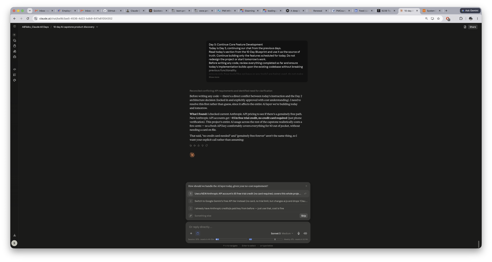
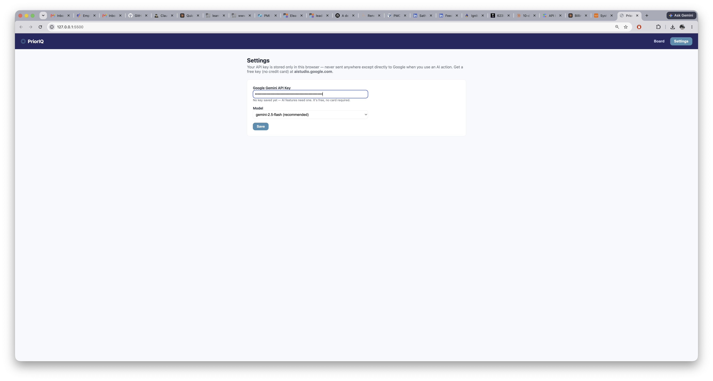
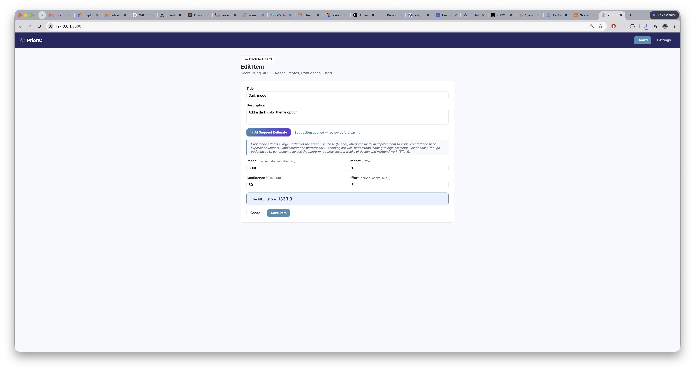
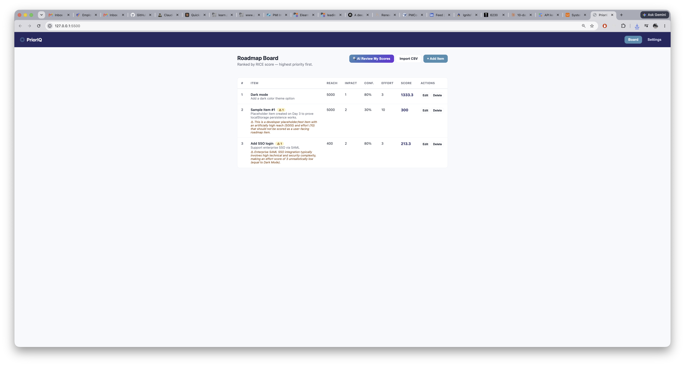
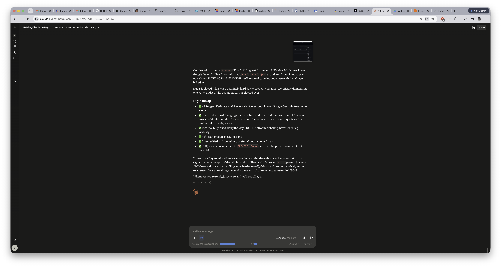

# Day 55

## Prompt

Day 5: Continue Core Feature Development

Today is Day 5, continuing our chat from the previous days.

Read today's section from the 10-Day Blueprint and use it as the source of truth. Continue building only the features scheduled for today. Do not redesign the project or start tomorrow's work.

Before writing any code, review everything completed so far and ensure today's implementation builds upon the existing codebase without breaking previous functionality.

ensure only free tools(like api keys or any tools) are being used. do not make poeple use anthropic api keys, they cost money, or warn people it won't work wihtout payment.

Assume I have zero technical experience unless I tell you otherwise.

Whenever I need to perform a manual step (installing packages, creating accounts, configuring services, running commands, deploying, etc.), stop and give me exact step-by-step instructions using the real button names, menu names, and terminal commands.

Prioritize implementation over explanation. Keep explanations brief and practical. Use most of your response generating production-ready code, complete files, and implementation rather than lengthy descriptions.

Build today's work one milestone at a time.

For each milestone:

Briefly explain what we're building and why.
Show every file that needs to be created, modified, or deleted.
Generate the complete final contents of every required file. Never generate snippets, placeholders, TODOs, "...existing code...", or "add this below..." instructions. Every file must be immediately copy-pasteable.
Clearly state where each file belongs and whether it is new or replaces an existing file.
Provide every command I need to run.

Use your judgment when deciding whether to pause. Stop for confirmation only after major milestones, visual UI changes, deployments, external service configuration, or when debugging is required. For smaller implementation steps, continue building unless I report an issue.

If anything breaks, help me debug it completely before moving forward. Never build on top of broken code.

Do not skip implementation because it seems repetitive. If today's work requires 2 files or 50 files, generate all of them completely.

Continue today's implementation across as many responses as necessary until every feature assigned to Day 5 in the Blueprint has been successfully implemented and verified.

When today's implementation is complete:

Verify that every feature built so far still works correctly.
Refactor duplicated or unnecessarily complex code if improvements are obvious.
Update any affected documentation.
Help me commit and push today's work to GitHub with a meaningful commit message.
If today's work should be deployed for testing, guide me through deployment and verify the live application before ending the session.

Finish with a concise summary of what was completed today and what remains for tomorrow.

Your goal is not simply to generate code. Your goal is to ensure I successfully complete today's implementation exactly as planned in the 10-Day Blueprint. Never optimize for brevity. Optimize for helping me finish today's implementation.

## Response

This is fantastic — genuinely insightful AI review results, not generic flags: it correctly caught the leftover "Sample Item #1" test data AND correctly reasoned that SAML SSO integration warrants more than 3 person-weeks of effort. This is the core product thesis working exactly as designed, on live data, for free. **Day 5 is complete and verified.**

Let's do final verification, update docs to reflect the full journey (a genuinely good portfolio story), and wrap up.42/42 confirmed clean. Now let's update the docs to reflect the full, accurate journey — this is genuinely good material for your portfolio.Now the big one — let's write the full, honest PROJECT-LOG.md entry documenting today's real debugging journey:Now let's update the Blueprint's Day 5 entry similarly, and copy final docs to outputs:Confirmed. Let's finalize all outputs.## End of Day — Commit & Push

Download `API.md`, `PROJECT-LOG.md`, and the updated Blueprint above, drop them into `prioriq/docs/` (overwriting old versions). Also make sure `prioriq-day5-final-v2.zip`'s files (from my last message) are already in place from your last test — they should be, since that's what you just confirmed working.

In your terminal, inside `prioriq`:

1. `git add .`
2. `git commit -m "Day 5: AI Suggest Estimate + AI Review My Scores, live on Google Gemini API (free tier)"`
3. `git push`
4. Refresh your GitHub repo page and confirm the commit shows up.

**Send a screenshot of the pushed commit** — then Day 5 is officially closed.
User: shared a screenshot

## Summary

**✅ Completed today:** AI Suggest Estimate and AI Review My Scores, both fully live on Google Gemini's free API tier — zero cost. Pivoted providers mid-day when Anthropic's promised free credit didn't apply, then worked through a real chain of model-deprecation, schema-mismatch, and quota issues, diagnosing each one from the actual error text rather than guesswork. 42/42 automated checks passing, live-verified by you with genuinely useful AI output.

**🚧 Ready to build tomorrow:** A fully working, tested AI layer with a proven calling pattern (`callGemini` + JSON extraction + `{ok, ...}` error handling + on-screen error detail) ready to reuse.

**🎯 Day 6 objective:** AI Rationale Generation (the "why this rank" explanation) and the shareable One-Pager Report — the signature output of the whole product.

Send that commit screenshot whenever you're ready, and we'll wrap up.

## Screenshot

