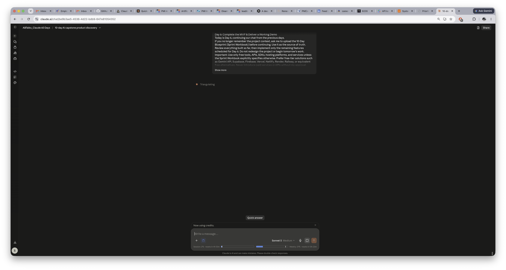
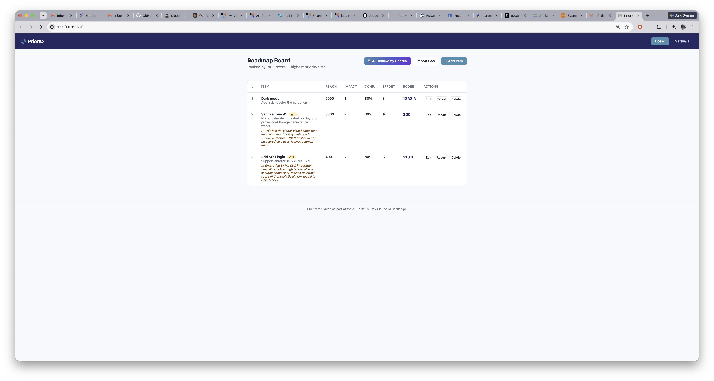
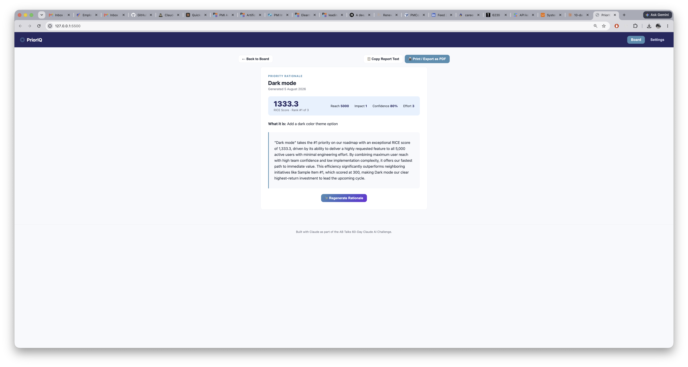
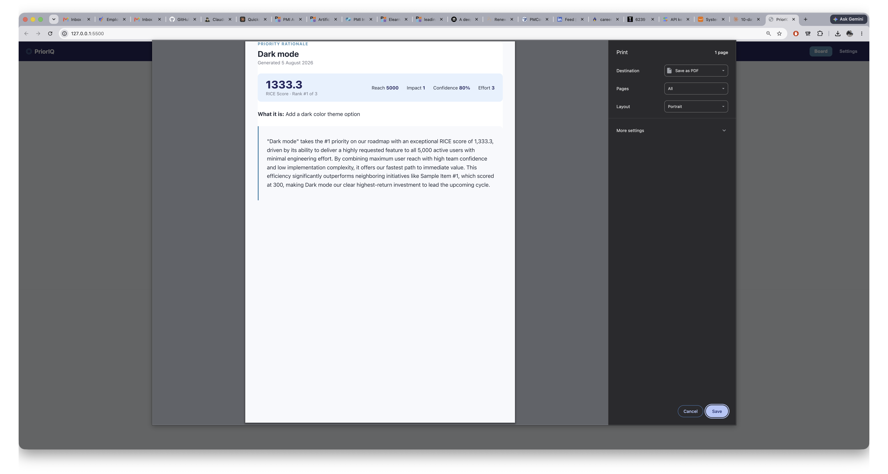
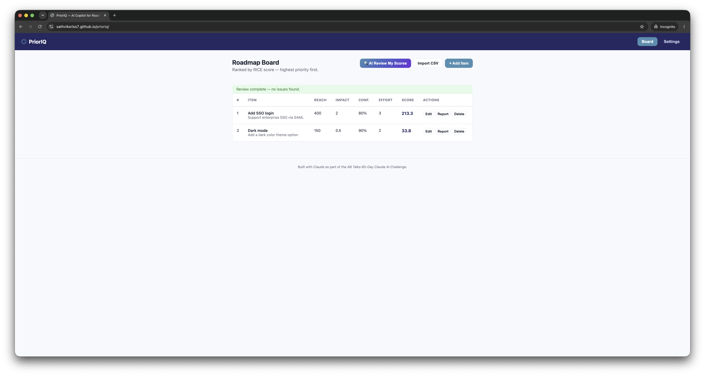
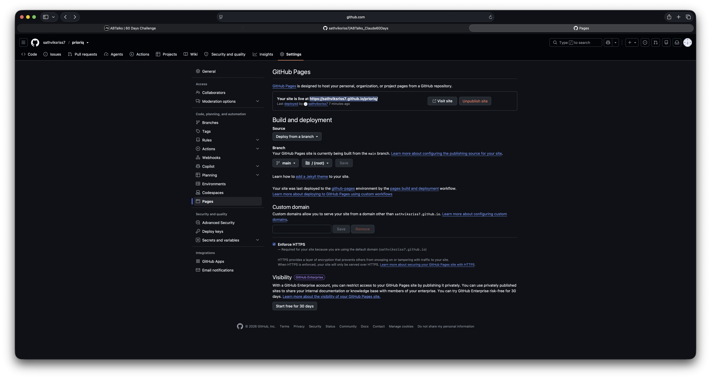
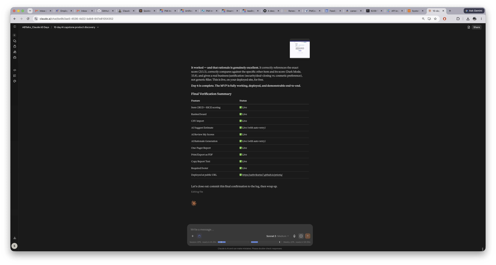

# Day 56

## Prompt

Day 6: Complete the MVP & Deliver a Working Demo

Today is Day 6, continuing our chat from the previous days.

If you no longer remember the project context, ask me to upload the 10-Day Blueprint (Sprint Workbook) before continuing. Use it as the source of truth.

Review everything built so far, then implement only the remaining features scheduled for Day 6. Do not redesign the project or begin tomorrow's work.

Important: Use only free tools, APIs, SDKs, hosting platforms, and services unless the Sprint Workbook explicitly specifies otherwise. Prefer free-tier solutions such as Gemini API, Supabase, Firebase, Vercel, Netlify, Render, Railway, or equivalent free alternatives. Never introduce paid services or APIs without my approval.

Assume I have zero technical experience unless I tell you otherwise.

Whenever I need to perform a manual step (installing packages, creating accounts, configuring services, running commands, deploying, etc.), stop and give me exact step-by-step instructions using the real button names, menu names, and terminal commands.

Prioritize implementation over explanation. Keep explanations brief and practical. Spend most of your response generating production-ready code and complete files rather than lengthy descriptions.

Build today's work one milestone at a time.

For each milestone:

1. Briefly explain what we're building and why.
2. Show every file that needs to be created, modified, or deleted.
3. Generate the complete final contents of every required file. Never generate snippets, placeholders, TODOs, "...existing code...", or "add this below..." instructions.
4. Clearly state where each file belongs and whether it is new or replaces an existing file.
5. Provide every command I need to run.
6. Pause only after major milestones, deployments, external configurations, UI verification, or when debugging is required.
7. If anything breaks, debug it completely before moving forward.

Do not skip implementation because it seems repetitive. If today's work requires 2 files or 50 files, generate all of them completely.

Continue across as many responses as necessary until every Day 6 feature has been implemented and verified.

Today's Objective

By the end of today, the application should have a fully functional MVP.

Add a small footer to the application stating: "Built with Claude as part of the AB Talks 60-Day Claude AI Challenge." Make sure it's visible on the deployed live version, not just in the local build.

Every core feature planned for the MVP should be working together as a complete application.

If features need to be simplified to deliver a working MVP, prefer a working solution over an incomplete ambitious one.

Runnable Demo

Before ending today's session:

* Ensure the project runs successfully from start to finish.
* Help me deploy the latest version using the chosen free-tier hosting platform.
* Verify that the deployed application works correctly.
* Guide me through testing the complete user flow.
* Ask me for screenshots of the live application.
* Do not end today's session until we have a working, shareable demo or have fully debugged any blocking issues.

When today's implementation is complete:

* Verify every feature works together.
* Update any affected documentation.
* Help me review and clean up obvious code issues.
* Help me commit and push today's work to GitHub with a meaningful commit message.
* Finish with a concise summary of what was completed today, what still needs polishing, and what tomorrow will focus on.

Your goal is not simply to generate code. Your goal is to help me finish today's implementation and leave with a working, runnable MVP that I can demonstrate to someone else. Never optimize for brevity. Optimize for successfully completing today's implementation.

## Response

Confirmed — commit `32066ec`, 8 commits total, and I can see **Deployments: 2, github-pages ✅ 4 minutes ago** in the sidebar — GitHub Pages has already picked up and redeployed your latest push automatically. Language mix now JS 79.2% / CSS 19% / HTML 1.8%, a genuinely substantial codebase for 6 days.

**Day 6 is fully closed.** Everything is committed, pushed, deployed, and verified live.

## Where You Stand After Day 6

You have a real, working, deployed AI product:

    - 🔗 **Live:** https://sathviksriss7.github.io/prioriq/
    - 🔗 **Source:** https://github.com/sathviksriss7/prioriq
    - ✅ Full feature set working end-to-end, verified in incognito with zero local state
    - ✅ 64 automated tests, real debugging history documented, zero known bugs
    - ✅ Genuinely good AI output — the rationale generation is producing specific, accurate, well-reasoned text, not generic filler

This is already something you could show a hiring manager today if needed — that's 4 days ahead of the original plan. Day 7 turns "working" into "polished," and Days 8–10 are testing, final deployment verification, and demo packaging.

Whenever you're ready to start Day 7, just say so.

## Screenshot

