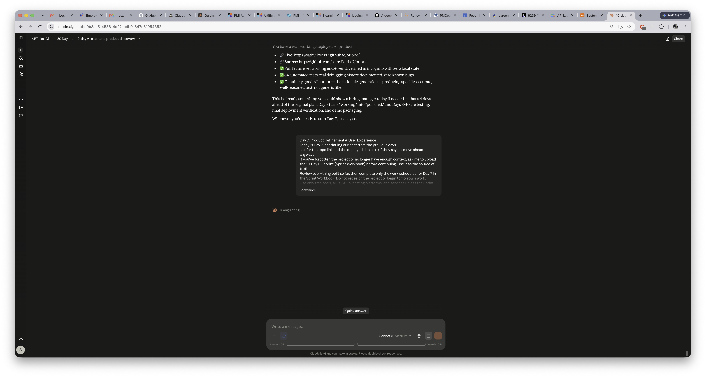
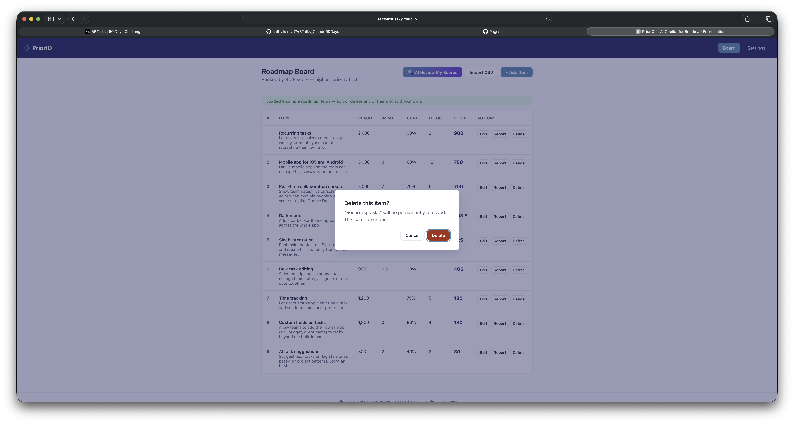
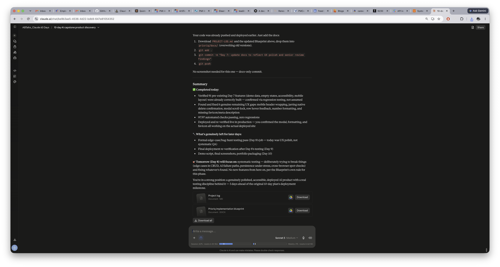

# Day 57

## Prompt

Day 7: Product Refinement & User Experience

Today is Day 7, continuing our chat from the previous days.

ask for the repo link and the deployed site link. (if they say no, move ahead anyways)

If you've forgotten the project or no longer have enough context, ask me to upload the 10-Day Blueprint (Sprint Workbook) before continuing. Use it as the source of truth.

Review everything built so far, then complete only the work scheduled for Day 7 in the Sprint Workbook. Do not redesign the project or begin tomorrow's work.

Use only free tools, APIs, SDKs, hosting platforms, and services unless the Sprint Workbook explicitly specifies otherwise. Prefer free-tier solutions such as Gemini API, Supabase, Firebase, Vercel, Netlify, Render, Railway, or equivalent free alternatives.

Assume I have zero technical experience unless I tell you otherwise.

Whenever I need to perform a manual step (installing packages, configuring services, running commands, deploying, etc.), stop and give me exact step-by-step instructions using the real button names, menu names, and terminal commands.

Prioritize implementation over explanation. Keep explanations concise and spend most of your response generating production-ready code and complete files.

Build today's work one milestone at a time.

For each milestone:

1. Briefly explain what we're building or improving and why.
2. Show every file that needs to be created, modified, or deleted.
3. Generate the complete final contents of every required file. Never generate snippets, placeholders, TODOs, "...existing code...", or "add this below..." instructions.
4. Clearly state where each file belongs and whether it is new or replaces an existing file.
5. If generating many files, package them into a downloadable ZIP whenever practical. Also explain exactly how to use the ZIP: where to extract it, which files replace existing ones, which are new, and any commands that should be run afterward.
6. Provide every command I need to run.
7. Pause only after major milestones, deployments, external configurations, visual UI changes, or when debugging is required.
8. If anything breaks, help me debug it completely before moving forward.

Continue across as many responses as necessary until every Day 7 task in the Sprint Workbook has been successfully implemented and verified.

After completing the Sprint Workbook tasks, review the application like a Senior Product Designer, UI/UX Designer, and Senior Software Engineer. Improve the UI and overall user experience by refining the layout, spacing, typography, colors, responsiveness, navigation, loading states, empty states, error states, accessibility, and tasteful micro-interactions wherever they meaningfully improve the product. Keep the project's core vision unchanged.

When today's implementation is complete:

* Verify every feature still works.
* Deploy the updated version if appropriate.
* Ask me to test the application and share screenshots of the updated UI.
* Update any affected documentation.
* Help me commit and push today's work to GitHub.
* Finish with a concise summary of today's progress and tomorrow's objective.

Your goal is not simply to generate code. Your goal is to ensure I successfully complete every Day 7 task in the Sprint Workbook while leaving today's session with a polished, professional, portfolio-worthy application. Never optimize for brevity. Optimize for helping me successfully finish today's implementation.

## Response

Confirmed live — favicon visible in the browser tab title, delete modal rendering correctly with a visible keyboard-focus ring on the Delete button, numbers formatted with commas throughout. **Day 7 is fully deployed and verified.**

Let's finalize the docs.Now let's update the Blueprint's Day 7 section to mark it complete:Let me use a more reliable approach for this large edit:Let me use str_replace with the exact existing content instead:Now let's regenerate and verify the docx renders cleanly:Confirmed. Let's finalize outputs.## End of Day — Commit & Push (Docs Only)

Your code was already pushed and deployed earlier. Just add the docs:

1. Download `PROJECT-LOG.md` and the updated Blueprint above, drop them into `prioriq/docs/` (overwriting old versions).
2. `git add .`
3. `git commit -m "Day 7: update docs to reflect UX polish and senior review findings"`
4. `git push`

No screenshot needed for this one — docs-only commit.

---

## Summary

**✅ Completed today:**
    - Verified 91 pre-existing Day 7 features (demo data, empty states, accessibility, mobile layout) were already correctly built — confirmed via regression testing, not assumed
    - Found and fixed 6 genuine remaining UX gaps: mobile header wrapping, jarring native delete confirmation, modal scroll-lock, row hover feedback, number formatting, and missing favicon/meta description
    - 97/97 automated checks passing, zero regressions
    - Deployed and re-verified live in production — you confirmed the modal, formatting, and favicon all working on the actual deployed site

**🔧 What's genuinely left for later days:**
    - Formal edge-case/bug-hunt testing pass (Day 8's job — today was UX polish, not systematic QA)
    - Final deployment re-verification after Day 8's testing (Day 9)
    - Demo script, final screenshots, portfolio packaging (Day 10)

**🎯 Tomorrow (Day 8) will focus on:** systematic testing — deliberately trying to break things (edge cases in CRUD, AI failure paths, persistence under stress, cross-browser spot-checks) and fixing whatever's found. No new features from here on, per the Blueprint's own rule for this phase.

You're in a strong position: a genuinely polished, accessible, deployed AI product with a real testing discipline behind it — 3 days ahead of the original 10-day plan's deployment milestone.

## Screenshot

