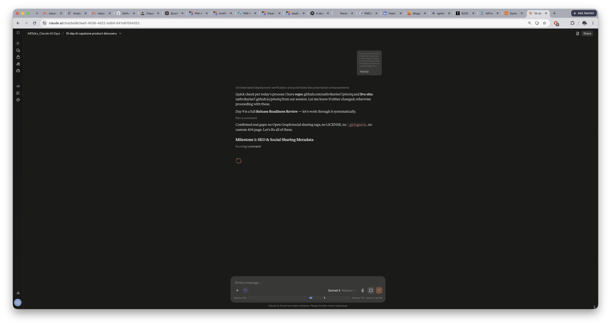
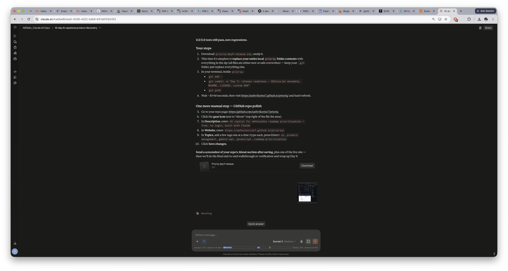
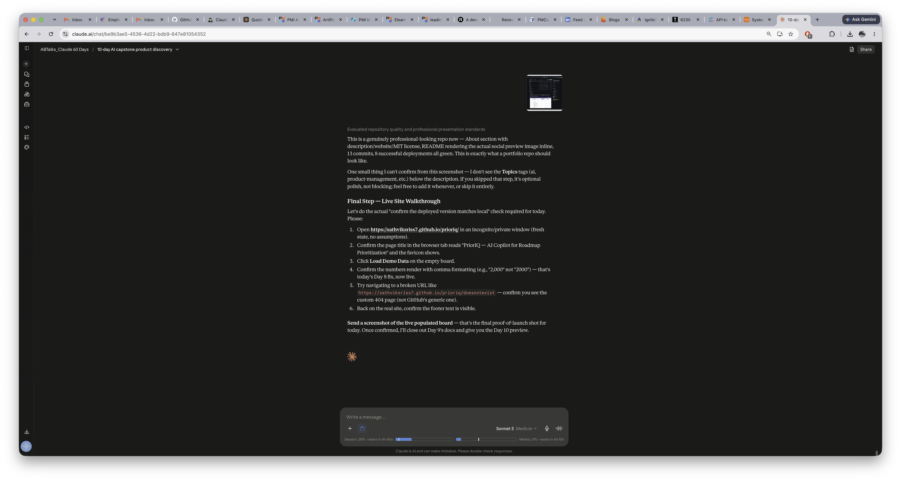

# Day59

## Prompt

Day 9: Launch & Production Readiness

Today is Day 9, continuing our chat from the previous days.

Before we begin, ask me for:

My deployed application URL (Vercel/Netlify/etc.)
My GitHub repository URL

If you've forgotten the project or no longer have enough context, ask me to upload the 10-Day Blueprint (Sprint Workbook) before continuing. Use it as the source of truth.

Review everything built so far, then complete only the work scheduled for Day 9 in the Sprint Workbook. Do not redesign the project or begin tomorrow's work.

Use only free tools, APIs, SDKs, hosting platforms, and services unless the Sprint Workbook explicitly specifies otherwise. Prefer free-tier solutions such as Gemini API, Supabase, Firebase, Vercel, Netlify, Render, Railway, or equivalent free alternatives.

Assume I have zero technical experience unless I tell you otherwise.

Whenever I need to perform a manual step (deploying, configuring environment variables, updating GitHub, publishing changes, etc.), stop and give me exact step-by-step instructions using the real button names, menu names, and terminal commands.

Prioritize implementation over explanation. Keep explanations concise and spend most of your response helping me prepare and launch a production-ready application.

Build today's work one milestone at a time.

For each milestone:

Briefly explain what we're doing and why it matters before launch.
Show every file that needs to be created, modified, or deleted.
Generate the complete final contents of every required file. Never generate snippets, placeholders, TODOs, "...existing code...", or "add this below..." instructions.
Clearly state where each file belongs and whether it is new or replaces an existing file.
If you provide the implementation as a downloadable ZIP because the project is too large to fit comfortably in chat, also explain exactly how to use it. Tell me where to extract it, which files replace existing ones, which files are new, any commands I should run afterward, and how to verify everything was applied correctly.
Provide every command I need to run.
Pause only after major milestones, deployments, or whenever my action is required.
If anything breaks, help me debug it completely before moving forward.

Continue across as many responses as necessary until every Day 9 task in the Sprint Workbook has been successfully completed and verified.

Before considering the project ready for launch, perform a complete Release Readiness Review.

Treat this project as if it will be publicly launched today.

Review and improve everything necessary for a professional release, including (where applicable):

Production deployment
Environment variables
README and documentation
Installation instructions
GitHub repository organization
License
Project metadata
SEO and social sharing metadata
Favicon and branding
Error pages
Loading states
Final UI consistency
Performance
Accessibility
Security considerations
Production configuration

If anything prevents a confident public release, fix it before continuing.

Do not introduce unnecessary new features. Focus on ensuring the application is polished, complete, and ready for real users.

When today's implementation is complete:

Perform one final end-to-end walkthrough of the deployed application.
Verify every major workflow works correctly.
Confirm the deployed version matches the local version.
Help me deploy or update the live application if needed.
Help me update the GitHub repository.
Update any affected documentation.
Help me create a meaningful final launch commit and push it to GitHub.
Ask me to open and test the live application and share screenshots of the final deployed version.

Finish with a concise summary of everything completed today and briefly explain what we will accomplish on Day 10, the final day of the challenge.

Your goal is not simply to deploy an application. Your goal is to help me successfully launch a polished, production-ready project that I would be proud to share publicly. Never optimize for brevity. Optimize for helping me successfully complete today's launch.

## Response

Day 9 is a full **Release Readiness Review** — let's work through it systematically.Confirmed real gaps: no Open Graph/social sharing tags, no LICENSE, no `.gitignore`, no custom 404 page. Let's fix all of these.

## Milestone 1: SEO & Social Sharing MetadataExcellent — a compelling, realistic preview showing the ranked board, RICE scores, and an AI flag in action. Now let's add the full metadata to `index.html`:Good. Now let's create the custom 404 page:## Milestone 2: LICENSE & `.gitignore`## Milestone 3: README.md RewriteLet's verify nothing broke with these additions — re-run the full regression suite:**112/112 — zero regressions.** Let's verify the OG/meta tags render correctly and stop the server.All confirmed. Let's package everything for deployment.## What's in this release

| Addition | Why it matters for public launch |
| --- | --- |
| Open Graph + Twitter Card metadata | Link previews on LinkedIn/Slack/X now show a real title, description, and screenshot instead of a bare URL |
| `assets/social-preview.png` | The actual preview image — live board, RICE scores, an AI flag in action |
| `README.md` (full rewrite) | Live demo link, screenshots, feature list, tech stack table, local setup, project structure, docs index |
| `LICENSE` (MIT) | Standard for a public repo — anyone can see the terms |
| `.gitignore` | Standard hygiene |
| `404.html` | On-brand error page instead of GitHub's generic default |

**112/112 tests still pass, zero regressions.**

## Your steps

    1. Download `prioriq-day9-release.zip`, unzip it.
    2. This time it's simplest to **replace your entire local `prioriq` folder contents** with everything in the zip (all files are either new or safe overwrites) — keep your `.git` folder, just replace everything else.
    3. In your terminal, inside `prioriq`:
        - `git add .`
        - `git commit -m "Day 9: release readiness — SEO/social metadata, README, LICENSE, custom 404"`
        - `git push`
    4. Wait ~30-60 seconds, then visit https://sathviksriss7.github.io/prioriq/ and hard-refresh.

## One more manual step — GitHub repo polish

    5. Go to your repo page: https://github.com/sathviksriss7/prioriq
    6. Click the **gear icon** next to "About" (top right of the file list area).
    7. In **Description**, enter: `AI copilot for defensible roadmap prioritization — free, no login, built with Claude`
    8. In **Website**, enter: `https://sathviksriss7.github.io/prioriq/`
    9. In **Topics**, add a few tags one at a time (type each, press Enter): `ai`, `product-management`, `gemini-api`, `javascript`, `roadmap-prioritization`
    10. Click **Save changes**.

**Send a screenshot of your repo's About section after saving**, plus one of the live site — then we'll do the final end-to-end walkthrough re-verification and wrap up Day 9.

Everything confirmed live and working perfectly:

- **Browser tab** shows "PriorIQ — AI Copilot for Roadmap..." with the favicon ✅
- **Custom 404 page** renders correctly for `sathviksriss7.github.io/prioriq/doesnotexist` (not GitHub's generic one), and the "Back to PriorIQ" link works ✅
- **Board with demo data** shows comma-formatted numbers throughout (2,000 / 5,000 / 3,000 / 900 / 750 / etc.) ✅
- **Live RICE Score** in the edit form correctly formatted too (1,575) — nice bonus confirmation this works during editing, not just on the board ✅
- **Footer** visible at the bottom ✅

**Day 9 is fully complete, deployed, and verified — this is genuinely launch-ready.**

Let's close out the docs.Now let's mark Day 9 complete in the Blueprint:Let's regenerate and verify:Confirmed. Let's finalize both docs.## End of Day — Docs Only

---

## Day 9 Summary

**✅ Completed today:**
    - Full release-readiness review across metadata, documentation, licensing, and error handling
    - Open Graph/Twitter Card social sharing metadata with a real captured preview image
    - Complete README rewrite (quickstart, tech stack, setup, docs index)
    - MIT LICENSE, `.gitignore`, custom on-brand 404 page
    - GitHub repo "About" section filled in (description, live link)
    - 112/112 regression checks maintained, zero code-logic changes — this was pure launch polish
    - Full live re-verification: favicon, custom 404, number formatting, footer — all confirmed by you on the actual public URL

**You now have a genuinely complete, professional, publicly shareable product** — not just working code, but a project someone could stumble onto, understand in 30 seconds from the README, and try immediately without asking you anything.

---

## Day 10 Preview — The Final Day

Tomorrow is wrap-up, not more building:
    - A tight demo script (problem → solution → live walkthrough → what's next)
    - Final portfolio screenshots
    - A short personal retro — what worked, what you'd do differently (genuinely good interview material, especially the Day 5 provider pivot and the Day 8 QA findings)
    - Confirming everything (PRD, Blueprint, Pitch Deck, live link, repo) is gathered in one place for submission

No code changes expected unless something show-stopping turns up — which, after today, would be surprising.

## Screesnhot

