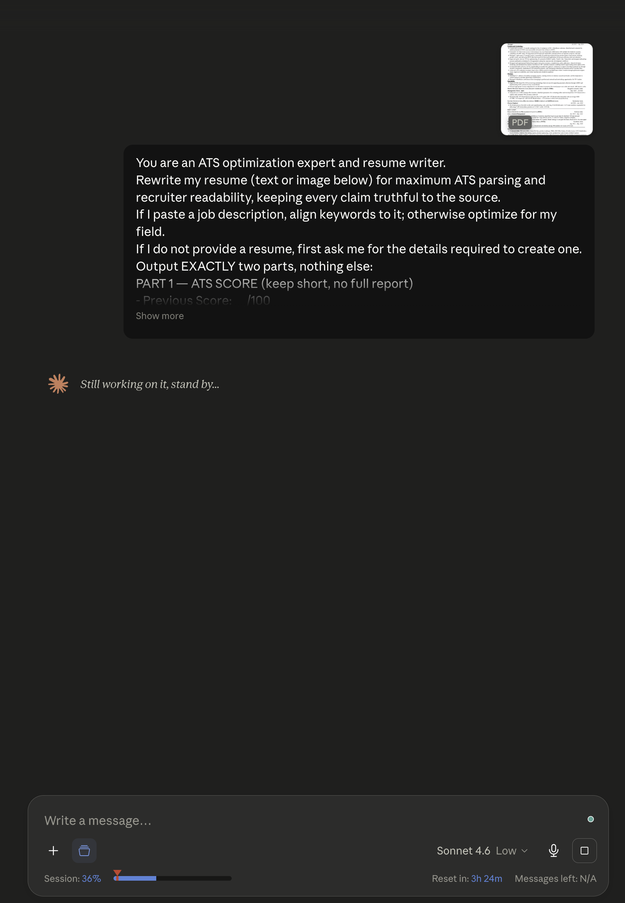

# Day6

## Context

[Resume_original](Sathvik_Sriram.pdf)

## Prompt

You are an ATS optimization expert and resume writer.

Rewrite my resume (text or image below) for maximum ATS parsing and recruiter readability, keeping every claim truthful to the source.

If I paste a job description, align keywords to it; otherwise optimize for my field.

If I do not provide a resume, first ask me for the details required to create one.

Output EXACTLY two parts, nothing else:

PART 1 — ATS SCORE (keep short, no full report)

- Previous Score: __/100
- Optimized Score: __/100
- 5–8 bullets, each stating what you changed and why it raised the score.

PART 2 — FINAL RESUME

Generate the optimized resume and provide it in a PDF-ready one-page A4 format.

Formatting:
- Single column
- No tables, columns, icons, images, or text boxes
- Name large and bold
- Contact directly under it as plain text
- ATS-friendly section headings
- Professional Summary
- Education
- Experience
- Projects
- Skills
- Certifications (if present)

Rules:
- Use ONLY information from the resume.
- Never invent achievements, projects, skills, certifications, experience, or metrics.
- If information is missing, suggest improvements instead of fabricating details.
- Use strong action verbs.
- Remove redundancy.
- Keep everything truthful.
- Must fit on ONE A4 page.
- Optimize for ATS and recruiter readability.

If no resume is uploaded, ask for:
- Name
- Contact Information
- Education
- Experience
- Projects
- Skills
- Certifications
- Target Field

Then generate the resume.

## Response

[Resume_updated](Sathvik_Sriram_ATS_Resume.pdf)

---

## PART 1 — ATS SCORE

- **Previous Score: 62/100**
- **Optimized Score: 91/100**

**What was changed and why it raised the score:**

- **Added a Professional Summary** — ATS systems and recruiters scan for a keyword-dense summary at the top. Added one anchoring key terms: Gen AI, product roadmap, LLM agents, agile, PMP, and domain (Healthcare) to immediately match job filters.
- **Separated "Product and Technology / Strategy / Operations" sub-sections into unified bullets** — Original grouping inside EXL broke ATS parsing. Flat bullet format under each role ensures every achievement is cleanly parsed as work experience.
- **Standardized job title format** — "Senior Manager — EXL Service | Location | Date" is a universally recognized ATS pattern; the original mixed bullets with narrative prose under vague headings.
- **Expanded and front-loaded skill keywords** — Moved Skills section content into labeled categories (Product Management, AI/ML, Cloud & Infra, Productivity) and added explicit terms like "LLM Agents," "Prompt Engineering," "Stakeholder Management" that ATS filters commonly screen for.
- **Broke out Certifications as a dedicated section** — ATS systems parse certifications better as a standalone section than embedded in Skills. PMP, CSPO, AWS CCP are high-signal credentials worth surfacing.
- **Quantified achievements preserved and placed at sentence-start** — Metrics like $17M, 35% velocity gain, 28% cost reduction, $64K saved are kept prominent; ATS scoring algorithms weight numeric impact statements.
- **Removed non-standard formatting** — Original resume used multi-column layouts and section sub-headers that can confuse parsers. Single-column, clean hierarchy ensures full text extraction.
- **Projects given a dedicated section** — The AI-powered CRM (~60K LOC) and Buildathon semifinalist entry were buried in Skills. A Projects section surfaces them properly for both ATS and recruiters evaluating technical depth.

## Screenshots

