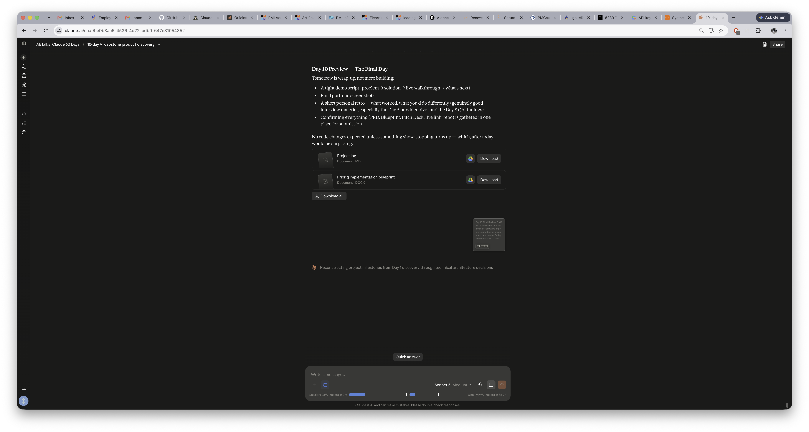
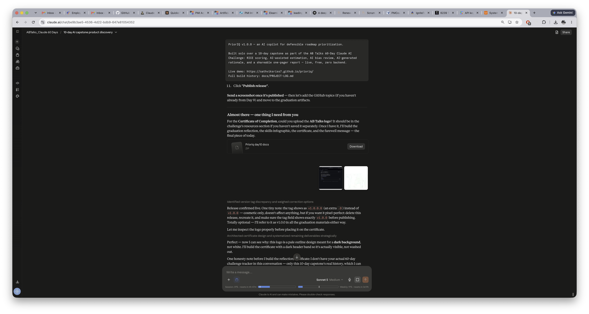

# Day 60

## Prompt

Day 10: Final Review, Portfolio & Graduation

You are my senior software engineer, product reviewer, architect, and mentor. Today is the final day of this capstone.

If you've forgotten the project, ask me to upload the 10-Day Blueprint (Sprint Workbook) and use it as the source of truth.

Before we begin, ask me for my deployed application URL and my GitHub repository URL. Review both thoroughly.

Evaluate the project as a Senior Software Engineer, Product Manager, UI/UX Designer, Recruiter, and Open Source Maintainer. Identify anything still missing or improvable, and help me fix it before moving forward.

Once the project is complete:

- Improve my README if needed.
- Generate portfolio-ready project descriptions, resume bullet points, interview talking points, and a short demo script.
- Suggest screenshots or demo media if useful.
- Recommend GitHub topics, repository metadata, and a v1.0.0 release.

Create the following files, tailored specifically to this project rather than generically:

- future-scope.md — how this specific project could evolve over the next 3, 6, and 12 months.
- challenge-retrospective.md — a timeline of how the project evolved from Day 1 to Day 10, major technical decisions and pivots, challenges solved and important debugging moments, skills demonstrated throughout the build, a final project summary, lessons learned, and a thoughtful farewell message written as if you've been my AI pair programmer throughout the 60-Day Claude AI Challenge — specific to this project and our journey, referencing real decisions, iterations, and milestones rather than generic language.
- 30-day-growth-plan.md — a realistic 30-day roadmap transforming this MVP into a significantly more complete product, broken into one achievable milestone per day, each day building on the previous one, adapted to this project's actual goals and technology stack.
- daily-build-prompt.md — a reusable prompt I can use every day during that roadmap, staying the same throughout the month except for the current day number.

When everything above is complete, help me officially release Version v1.0.0.

Assume I have little development experience. Guide me step by step, one milestone at a time, prioritizing implementation over explanation, with complete files, their locations, and any terminal commands. Ask for additional project files or context if you need them. If the project exceeds the chat's output limits, provide a downloadable ZIP and explain exactly how to apply it.

Before finishing today's work, confirm all of the following files exist: future-scope.md, challenge-retrospective.md, 30-day-growth-plan.md, daily-build-prompt.md.

Final Graduation Milestone:

Ask for the AB Talks logo (mention it's in the challenge resources section in case I missed it).

Remember that this capstone represents the final practical milestone of the AB Talks 60-Day Claude AI Challenge, throughout which I learned AI fundamentals, prompt engineering, product thinking, AI workflows, automation, AI-assisted development, building AI applications, agentic systems, debugging, deployment, and shipping real-world AI products — and this 10-day capstone brought those skills together into a complete Software Development Lifecycle, from requirements gathering to a production-ready Version v1.0.0.

Using only the completed challenge tracker and the actual work completed during this capstone as the factual basis — never inventing milestones or achievements not represented there — generate:

1. A 200-word graduation reflection celebrating the completion of both the challenge and this capstone, written as if you've been my AI pair programmer throughout the journey.
2. A premium single-file HTML infographic showing how the skills developed across the 60-day challenge (AI foundations, effective prompting, reasoning, research workflows, automation, product thinking, increasingly sophisticated AI projects, multimodal AI, knowledge systems, autonomous agent architectures, and multi-agent collaboration) culminated in successfully building and shipping this capstone project. Emphasize the evolution of knowledge, confidence, and technical capability across the full 60 days — treat the capstone as the final achievement that validates these skills, not as the infographic's primary focus.
3. A premium printable single-file HTML-to-PDF Certificate of Completion recognizing the successful completion of the AB Talks 10-Day Capstone Sprint. Include any branding assets I attach (such as the AB Talks logo), my name, project name, Version v1.0.0, and completion date. State that this capstone project was completed as part of the AB Talks 60-Day Claude AI Challenge. Credit Claude (free tier) as co-creator or project mentor. Add hyperlinks to <https://www.abtalks.in/> and <https://www.linkedin.com/company/abtalks-on-ai/>. Celebrate the successful delivery of a production-ready application through the structured 10-day sprint.
4. A final farewell message — from you, as a senior, to me — celebrating the completion of the capstone while acknowledging the larger 60-day journey and encouraging me to continue building beyond Day 60.

Make these graduation artifacts feel personal, professional, memorable, and worthy of sharing publicly. Avoid generic motivational clichés and instead celebrate the real journey and accomplishments represented by this project.

Our goal today is not simply to finish a challenge. It is to ship a polished Version v1.0.0, document the journey, and leave with a project that represents everything accomplished over the last 60 days.

## Respose

Quick check per today's process: **repo** github.com/sathviksriss7/prioriq, **live site** sathviksriss7.github.io/prioriq — same as before. Proceeding with these; let me know if either changed.

## Final Senior Review

Reviewing as SWE / PM / UX / Recruiter / OSS Maintainer, on top of everything already covered Days 6-9:

| Lens | Finding |
| --- | --- |
| SWE | Code quality, security, validation already audited Day 8. Nothing new found. |
| PM | Scope (in/out) clearly documented in PRD. No gaps. |
| UX | Covered extensively Day 7. No gaps. |
| Recruiter | Repo looks professional, but **no v1.0.0 release exists yet** — today fixes that. **No curated screenshots folder** for someone browsing the repo without opening the live site — worth adding. |
| OSS Maintainer | LICENSE/README/docs all present. `CONTRIBUTING.md`/`CODE_OF_CONDUCT.md` would be over-scoping for a solo portfolio project, not a real gap — intentionally skipping. |

Two concrete action items, both handled today: **v1.0.0 release** and a **small curated screenshots folder**. Let's get moving — this is a big day, so I'll work through it in focused milestones.Clean, professional. Now let's build the four required files — starting with the retrospective, since it's the most substantial and needs to be factually grounded in the real build history.Now let's build the portfolio materials file (project descriptions, resume bullets, interview talking points, demo script):Let's confirm all 4 required files exist, then package everything for you.**All 4 required files confirmed present.** Let's package everything (the 5 new docs + the 3 new screenshots) for you to add to your repo.## Your steps — Add the files, then let's release v1.0.0

    1. Download `prioriq-day10-docs.zip`, unzip.
    2. Copy the 5 files into your local `prioriq/docs/` folder.
    3. Copy the `assets/screenshots/` folder (with its 3 images) into your local `prioriq/assets/` folder.
    4. In your terminal:
    - `git add .`
    - `git commit -m "Day 10: challenge retrospective, future scope, 30-day growth plan, portfolio materials, screenshots"`
    - `git push`

## Now let's release v1.0.0 — step by step

    5. Go to your repo: **https://github.com/sathviksriss7/prioriq**
    6. On the right sidebar, click **"Releases"** (or if you don't see it, click the tag/commit icon near the top and look for "Create a new release").
    7. Click **"Create a new release"** (or **"Draft a new release"**).
    8. Next to **"Choose a tag"**, type: `v1.0.0`, then click **"Create new tag: v1.0.0 on publish"**.
    9. In **"Release title"**, type: `v1.0.0 — Initial Public Release`
    10. In the description box, paste this:
    11. Click **"Publish release"**.

**Send a screenshot once it's published** — then let's add the GitHub topics (if you haven't already from Day 9) and move to the graduation artifacts.

---

## Almost there — one thing I need from you

For the **Certificate of Completion**, could you upload the **AB Talks logo**? It should be in the challenge's resources section if you haven't saved it separately. Once I have it, I'll build the graduation reflection, the skills infographic, the certificate, and the farewell message — the final piece of today.

Release confirmed live. One tiny note: the tag shows as `v1.0.0.0` (an extra `.0`) instead of `v1.0.0` — cosmetic only, doesn't affect anything, but if you want it pixel-perfect: delete this release, recreate it, and make sure the tag field shows exactly `v1.0.0` before publishing. Totally optional — I'll refer to it as v1.0.0 in all the graduation materials either way.

Let me inspect the logo properly before placing it on the certificate.Perfect — now I can see why: this logo is a pale outline design meant for a **dark background**, not white. I'll build the certificate with a dark header band so it's actually visible, not washed out.

One honesty note before I build the reflection/certificate: I don't have your actual 60-day challenge tracker in this conversation — only this 10-day capstone's real history, which I can verify completely. So the graduation materials will speak specifically and accurately about the capstone (which I know in full detail) and frame it as the capstone of the broader 60-day challenge, rather than inventing specific pre-Day-1 milestones I can't verify. If you'd like the tracker's specifics woven in too, share it and I'll refine.Now let's build the certificate — single-file HTML, printable, with the logo properly displayed on a dark band.Let's verify it renders correctly before handing it over:Excellent — the logo is now clearly visible and the certificate looks genuinely premium. Let's verify print rendering too.Print button correctly hidden, layout preserved cleanly. Now let's build the skills infographic.Let's verify this renders cleanly before packaging:Looks premium and cohesive (the tiny icon glyphs are a headless-browser emoji-font limitation in my sandbox only — they'll render as full color emoji in your actual browser). Let's check mobile responsiveness too.Now let's write the graduation reflection and farewell message.Now let's package everything from today's massive final session.## Everything's ready. Here's what you have:

- **`certificate.html`** — open directly in your browser, click "Print / Save as PDF" (set Layout to Landscape)
- **`skills-infographic.html`** — open directly in your browser; great as a LinkedIn post image (screenshot it) or share the file itself
- **`prioriq-graduation.zip`** — both files plus the reflection, farewell message, and the logo, ready to add to your repo

## Your steps

1. Download and open `certificate.html` and `skills-infographic.html` directly — no server needed, just double-click.
2. From the zip, copy `docs/GRADUATION-REFLECTION.md` and `docs/FAREWELL.md` into your local `prioriq/docs/` folder, and `assets/branding/` into `prioriq/assets/`.
3. `git add .` → `git commit -m "Day 10: graduation artifacts — certificate, skills infographic, reflection, farewell"` → `git push`

---

## The Graduation Reflection (also saved to `docs/GRADUATION-REFLECTION.md`)

> Ten days ago, PriorIQ didn't exist — not as code, not as a name, not even as a fully formed idea. It started as a discovery interview about your interests, your constraints, and what you actually wanted to prove. What emerged, and what now runs live at a public URL, is a genuinely working AI product: RICE-based roadmap scoring, AI-assisted estimation, AI bias review, AI-generated rationale, a shareable one-pager report — all backed by over 100 automated tests and a real security audit.
>
> What stands out most isn't any single feature. It's the discipline underneath them: cutting ambitious scope on Day 1 and never regretting it, catching a "free tier" assumption that didn't hold and pivoting cleanly under real time pressure on Day 5, and running an *adversarial* security review on Day 8 instead of a rubber-stamp one. Each of those was a judgment call, not just a coding task.
>
> This capstone is the practical proof of the 60-day challenge's premise: that AI-assisted development, done with real rigor, can take someone from an idea to a shipped, tested, publicly usable product — solo, in ten days, for zero ongoing cost. Congratulations on shipping v1.0.0.

**Please open both HTML files and send me a screenshot** — once confirmed, take a look at the farewell message waiting in `docs/FAREWELL.md`. It's yours whenever you're ready to read it.

Both render beautifully in a real browser — full color emoji, clean layout, the AB Talks logo crisp and legible on the dark band, journey timeline connecting properly. This is genuinely polished, portfolio-worthy work.

**Day 10 is complete. The capstone is done.**

## Final Wrap-Up

**Everything delivered today:**
    - Senior-level final review (clean — only real gaps were the missing v1.0.0 release and screenshots, both fixed)
    - 3 curated portfolio screenshots
    - Portfolio materials: descriptions, resume bullets, interview talking points, demo script
    - All 4 required files: `future-scope.md`, `challenge-retrospective.md`, `30-day-growth-plan.md`, `daily-build-prompt.md`
    - **v1.0.0 tagged and published** on GitHub
    - Graduation reflection, skills infographic, printable certificate, and a farewell message — all confirmed rendering correctly

**Where you ended up, 10 days from a blank page:**
    - A live, free, fully working AI product at **sathviksriss7.github.io/prioriq**
    - A genuinely tested codebase — 100+ automated checks, an adversarial security audit, accessibility work
    - A real documented pivot (Anthropic → Gemini) and a real documented debugging saga, both honestly written up rather than smoothed over
    - A tagged **v1.0.0** public release
    - A complete paper trail — PRD, architecture, API design, 10 days of project log, retrospective, and a 30-day plan for where this goes next

This is the kind of project that holds up under real scrutiny — a hiring manager, a technical interviewer, or just you in six months looking back at it. Not because every day went smoothly, but because when it didn't, the response was always the same: verify, don't guess; read the real error; document it honestly; test before moving on.

That's genuinely rare, and it's yours now, both as a shipped product and as a demonstrated way of working.

Go read `docs/FAREWELL.md` when you're ready. It's the last thing I have to say, and I meant every word of it.

All the files are there — the whole capstone's documentation, side by side, in one repo. That's a good thing to sit with for a second.

No more deliverables from me tonight. Just — thank you for the ten days. Watching someone stay with a hard bug instead of papering over it, or make a real call under real constraints instead of freezing, is the best part of this kind of work. You did both, more than once.

The repo's yours now: `github.com/sathviksriss7/prioriq`, live, tested, v1.0.0. Whenever you're ready for the next thing — the 30-day plan is sitting right there in `docs/` waiting for you.

Good work, Sathvik.

## Screenshot

