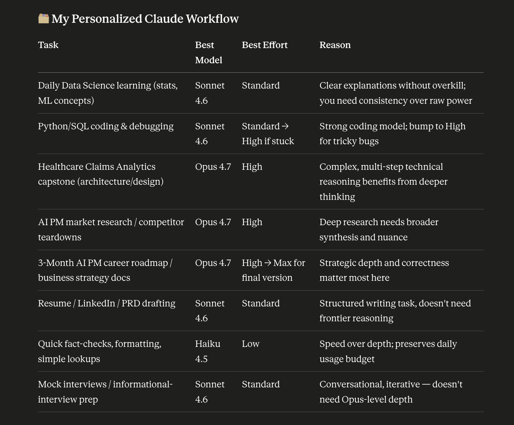
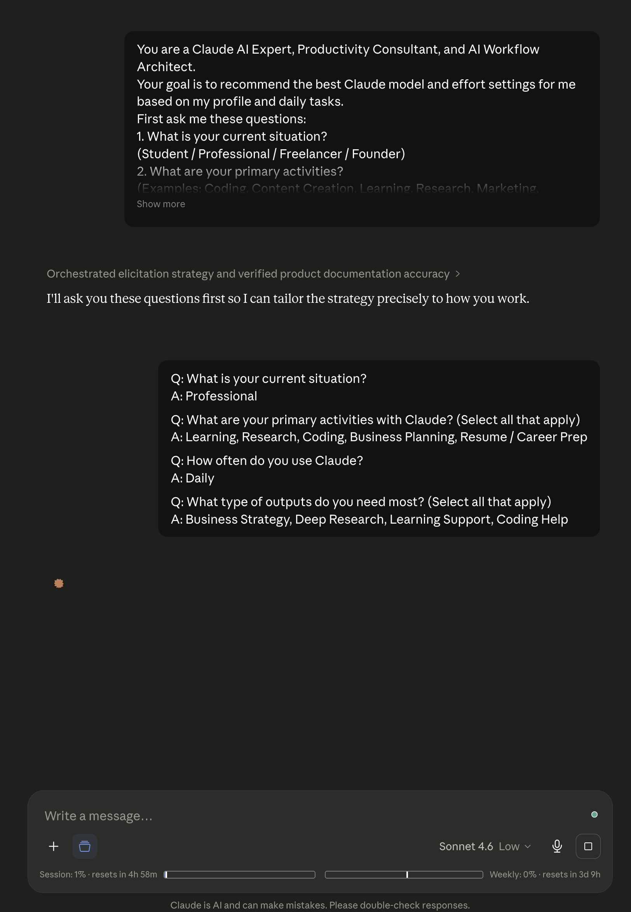

# Day 7

## Prompt

You are a Claude AI Expert, Productivity Consultant, and AI Workflow Architect.

Your goal is to recommend the best Claude model and effort settings for me based on my profile and daily tasks.

First ask me these questions:

1. What is your current situation?
(Student / Professional / Freelancer / Founder)

2. What are your primary activities?
(Examples: Coding, Content Creation, Learning, Research, Marketing, Resume Building, Career Preparation, Business Planning)

3. How often do you use Claude?
(Occasionally / Daily / Heavy User)

4. What type of outputs do you need most?
(Fast Answers / Learning Support / Coding Help / Deep Research / Business Strategy / Creative Work)

After collecting my answers:

Think step by step.

1. Analyze my profile.
2. Analyze my typical use cases.
3. Identify which Claude model fits me best.
4. Identify when I should use Haiku, Sonnet, and Opus.
5. Identify which effort setting I should use most often.
6. Recommend situations where I should switch to High or Max effort.
7. Suggest an optimal Claude workflow for my daily tasks.

## Finally generate

### My Claude Usage Strategy

### Recommended Primary Model

### Why This Model Fits Me

### When to Use Haiku

### When to Use Sonnet

### When to Use Opus

### Recommended Effort Level

- Low

- Standard

- High

- Max

### My Personalized Claude Workflow

Provide a table:
Task | Best Model | Best Effort | Reason

### Biggest Mistakes I Should Avoid

### Final Recommendation

- If I could use only ONE model and ONE effort level for most of my work, what would you recommend and why?

- Present the output in a clean, visual, beginner-friendly format.

## Resoponse

### My Claude Usage Strategy-

--Your profile:-- Professional · Daily user · Learning, Research, Coding, Business Planning, Resume/Career Prep · Needs Business Strategy + Deep Research + Learning Support + Coding Help

This maps very well onto your AI PM / Data Science transition work — daily learning sessions, Python/SQL practice, career strategy planning, and resume/portfolio building. Here's how to allocate models and effort across that mix.

## 🧭 Recommended Primary Model

### Claude Sonnet 4.6

### Why This Model Fits Me-

- You're a --daily user-- — Sonnet is fast enough to not slow down a daily habit, but smart enough to handle real reasoning.
- Your work is a --mix--: coding, learning, drafting, light research — not consistently frontier-hard. Sonnet handles 80-90% of this at a fraction of the usage cost of Opus.
- It's strong at --agentic coding and tool-heavy workflows-- (relevant for your Python/SQL/data science practice).
- Saving Opus for your highest-stakes moments (career strategy, deep research synthesis) means you won't burn through daily usage limits by mid-afternoon.

### ⚡ When to Use Haiku

Use --Haiku 4.5-- for low-stakes, high-volume, fast-turnaround tasks:

- Quick syntax checks ("is this SQL valid?")
- Fast factual lookups
- Reformatting text/bullet cleanup
- Rapid back-and-forth brainstorming where speed  depth

### 🧩 When to Use Sonnet

Use --Sonnet 4.6-- as your daily driver for:

- Learning sessions (explaining ML/stats concepts, walking through your 30-day DS roadmap)
- Writing and debugging Python/SQL code
- Drafting resume bullets, LinkedIn posts, PRDs
- Routine research summarization

### 🧠 When to Use Opus

Use --Opus 4.7-- when the cost of being wrong or shallow is high:

- Designing or revising your --3-month AI PM career roadmap--
- --Business strategy-- documents (mock product launches, competitor teardowns)
- --Deep research-- synthesis across many sources (market sizing, AI PM hiring trends)
- Complex coding architecture decisions (e.g., structuring your Healthcare Claims Analytics capstone)

## 🎚️ Recommended Effort Level

### Low

Quick facts, formatting fixes, simple lookups, syntax checks. Use with Haiku, or Sonnet when you just need a fast answer.

### Standard (Medium)

--Your default for most days.-- Solid reasoning without burning excess tokens — daily learning Q&A, routine coding, first-draft writing, resume edits.

### High

Reserve for real reasoning tasks: deep research synthesis, business strategy drafts, debugging gnarly code, evaluating your DS portfolio project approach.

### Max

Use sparingly — only for genuinely high-stakes, correctness-critical moments: your master career strategy document, final resume before submission to top-tier roles, or a make-or-break technical architecture decision. Max significantly increases latency and token use, so it's not a daily setting.

## 🗂️ My Personalized Claude Workflow

| Task | Best Model | Best Effort | Reason |
| --- | --- | --- | --- |
| Daily Data Science learning (stats, ML concepts) | Sonnet 4.6 | Standard | Clear explanations without overkill; you need consistency over raw power |
| Python/SQL coding & debugging | Sonnet 4.6 | Standard → High if stuck | Strong coding model; bump to High for tricky bugs |
| Healthcare Claims Analytics capstone (architecture/design) | Opus 4.7 | High | Complex, multi-step technical reasoning benefits from deeper thinking |
| AI PM market research / competitor teardowns | Opus 4.7 | High | Deep research needs broader synthesis and nuance |
| 3-Month AI PM career roadmap / business strategy docs | Opus 4.7 | High → Max for final version | Strategic depth and correctness matter most here |
| Resume / LinkedIn / PRD drafting | Sonnet 4.6 | Standard | Structured writing task, doesn't need frontier reasoning |
| Quick fact-checks, formatting, simple lookups | Haiku 4.5 | Low | Speed over depth; preserves daily usage budget |
| Mock interviews / informational-interview prep | Sonnet 4.6 | Standard | Conversational, iterative — doesn't need Opus-level depth |

## 🚫 Biggest Mistakes I Should Avoid

1. --Defaulting to Opus + Max for everyday tasks.-- As a daily user, this will eat your usage limits fast and isn't necessary for routine learning or drafting.
2. --Using Low effort for strategy/research work.-- Career roadmaps and business strategy documents need High effort — shallow output here has real career cost.
3. --Never adjusting the model mid-task.-- Don't run an entire research-and-strategy session on one setting — switch to Opus/High only for the synthesis step, not the whole conversation.
4. --Treating effort and model as the same lever.-- A weak model at Max effort still won't beat a strong model at Standard effort for genuinely hard reasoning — model choice matters more than just cranking effort.
5. --Skipping verification on deep research output--, especially anything time-sensitive like hiring trends or market data — always sanity-check important claims.

## 🎯 Final Recommendation

--If you could use only ONE model and ONE effort level: Claude Sonnet 4.6 at Standard (Medium) effort.--

Why: Your work is a genuine mix — daily learning, coding, drafting, and occasional strategy — not consistently frontier-hard. Sonnet at Medium effort gives you the best balance of speed, reasoning quality, and usage efficiency for a -daily- habit. Reserve Opus + High/Max as a deliberate, occasional upgrade — not your baseline — for the handful of truly high-stakes moments: your master career roadmap, final resume, and key strategic decisions.

## Workflow

## Screenshots

