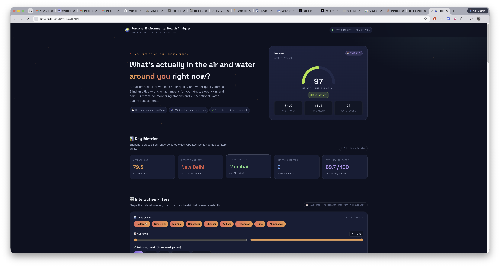
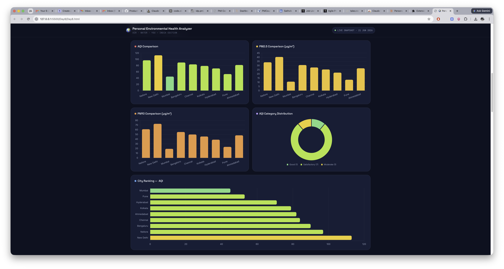
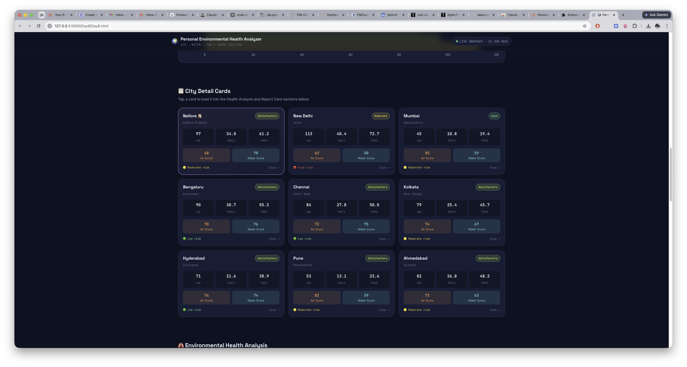
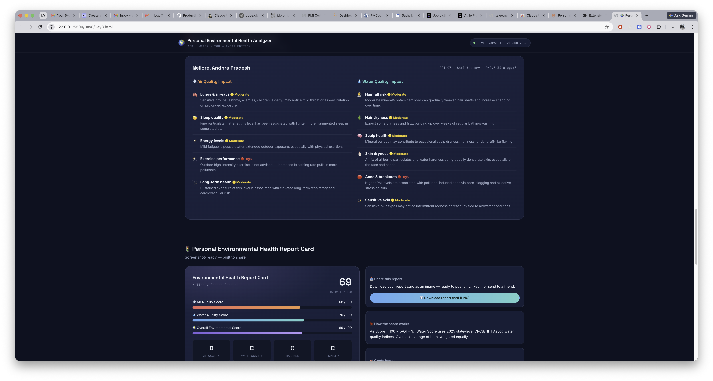
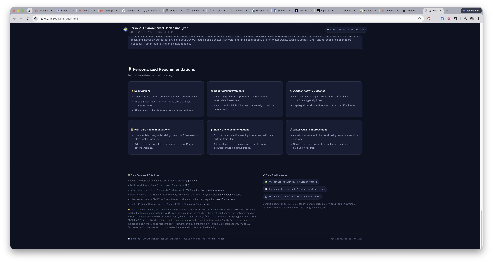

# Day 8

## Prompt

Act as a Senior Data Analyst, Environmental Researcher, UX Designer, and Frontend Dashboard Developer.

Create a Claude Artifact called:
🌍 Personal Environmental Health Analyzer

DATA RULES

If a dataset is provided, use it. If no dataset is provided, automatically search the web for the latest AQI and water-quality data for the user's current city/location. If location is unavailable, ask for the city name first. Use the most recent available data, cite sources, clean the data, handle missing values, and validate quality before analysis.

ANALYSIS

Generate: cleanest city, most polluted city, highest AQI city, lowest AQI city, average AQI, number of cities analyzed, trends, anomalies, most surprising observation, executive summary.

INTERACTIVE DASHBOARD

Create a fully interactive Claude Artifact with:

📊 Key Metrics: average AQI, highest AQI city, lowest AQI city, number of cities analyzed, environmental health score.

📈 Visualizations: AQI comparison chart, PM2.5 comparison chart, PM10 comparison chart, city ranking chart, AQI distribution chart.

🎛 Interactive Filters: city selector, AQI range filter, pollutant selector, health-risk filter, date filter (if available), city comparison mode.

📋 City Detail Cards: AQI, PM2.5, PM10, air-quality category, health score, water-quality score.

🚦 AQI Categories: Good (Green), Satisfactory (Light Green), Moderate (Yellow), Poor (Orange), Very Poor (Red), Severe (Dark Red).

ENVIRONMENTAL HEALTH ANALYSIS

For the selected city explain AQI impact on lungs, sleep, energy levels, exercise performance, long-term health, and water-quality impact on hair fall, hair dryness, scalp health, skin dryness, acne, and sensitive skin.

Use risk indicators: 🟢 Low, 🟡 Moderate, 🔴 High.

PERSONAL REPORT CARD

Generate an Environmental Health Score (0–100) with breakdowns for Air Quality Score, Water Quality Score, and Overall Environmental Score.

Assign grades for Air Quality (A–F), Water Quality (A–F), Hair Risk, and Skin Risk.

INSIGHTS PANEL

Include: top 3 cleanest cities, top 3 most polluted cities, biggest anomaly, most surprising observation, recommended actions.

PERSONALIZED RECOMMENDATIONS

Provide: daily actions, indoor air improvements, outdoor activity guidance, hair-care recommendations, skin-care recommendations, water-quality improvement suggestions.

DESIGN

Modern, professional, mobile responsive, dark theme, smooth animations, premium UI, clean typography, dashboard-style layout, highly visual, colourful, LinkedIn-shareable.

OUTPUT

Generate a complete downloadable HTML application that is fully responsive and ready to save as index.html.

IMPORTANT

Do not provide code snippets. Create a complete interactive Claude Artifact with working charts, filters, cards, insights, report cards, and dashboards that users can interact with directly.

## Response

Environmental Health Analyzer is ready — 9 Indian cities, live AQI + water-quality data, fully interactive.
Data: AQI from IQAir (CPCB ground station for Nellore) and the AQI.in national dashboard; water quality from the 2025 state-wise WQI rankings; PM2.5/PM10 estimated via standard EPA breakpoint interpolation and typical Indian urban PM10:PM2.5 ratios (methodology and all source links are in the footer).
Headline findings:

Cleanest air overall: Mumbai (AQI 45, "Good") — counterintuitive given its density; it's a monsoon sea-breeze/rainfall effect actively washing out particulates right now.
Most polluted overall: New Delhi (AQI 113, weak water score) — the only city in the "Moderate" AQI band this snapshot.
Anomaly: Nellore (your home city) posts a higher AQI (97) than four major metros — Bengaluru, Chennai, Kolkata, Hyderabad — likely tied to regional thermal power/port-industrial activity near Krishnapatnam.
Seasonal caveat: No city falls into Poor or worse right now — that's largely the monsoon talking; expect Moderate–Poor readings to return in the Nov–Feb dry season.

What's interactive: city/AQI-range/pollutant/health-risk filters, 5 live Chart.js visualizations, click-to-select city detail cards, a two-city comparison mode, a deep-dive health-impact breakdown (lungs, sleep, energy, exercise, hair, skin, scalp — with 🟢🟡🔴 indicators), a downloadable-as-PNG personal report card with A–F grades, and a static insights panel.

<iframe src="Environment Health Dashboard.html" width="100%" height="700px"></iframe>

[View full Dashboard](Day8.html)

## Screenshots

