# Day 9

## Prompt

## PROMPT 1 — Build MVP

Build a complete single-file HTML application called NutriScope.

Requirements:

Profile Inputs:
Age, gender, Height, Weight, Activity Level, Dietary Preference (Vegetarian, Non-Vegetarian, Eggetarian).

Food Logging:
Add Food, Quantity, Unit, Editable Table, Remove Entry.

Food Database:
Include 20 common foods only:
Rice, Roti, Dal, Paneer, Curd, Chana, Rajma, Banana, Apple, Milk, Oats, Bread, Egg, Chicken, Fish, Potato, Poha, Idli, Dosa, Spinach.

Track:
Calories, Protein, Carbs, Fat, Fiber, Iron, Calcium, Vitamin C, Vitamin D, Vitamin B12.

Calculations:
Energy, Macro Targets, Micronutrient Targets, Percentage Completion.

Dashboard:
Energy Progress, Macro Chart, Top Deficiencies, Top Excesses, Nutrient Table.

Recommendations:
Food additions, food swaps, portion adjustments based on dietary preference.

Design:
Premium SaaS UI, Mobile Responsive, Chart.js, Dark Theme, Modern Cards, No Backend, Single HTML File.

Return only the complete HTML code.

## Screenshot - MVP

<iframe src="NutriScope.html" width="100%" height="700px"></iframe>

[View full Dashboard](NutriScope.html)

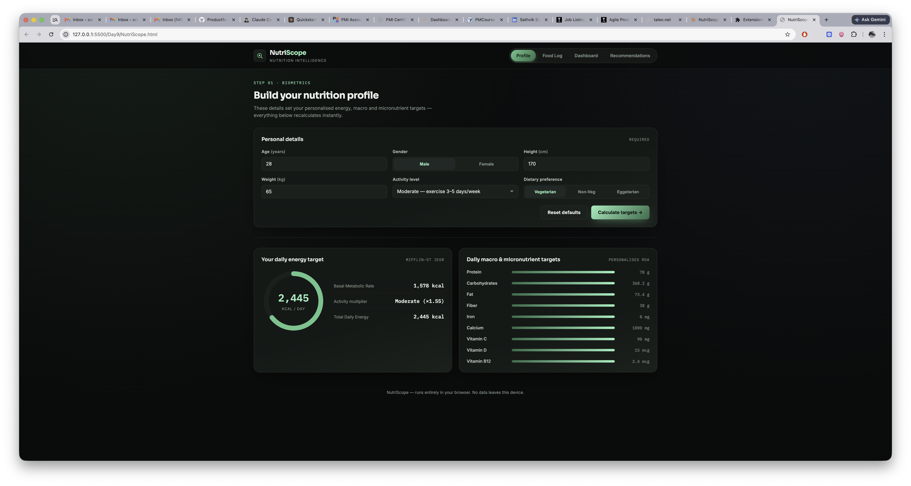

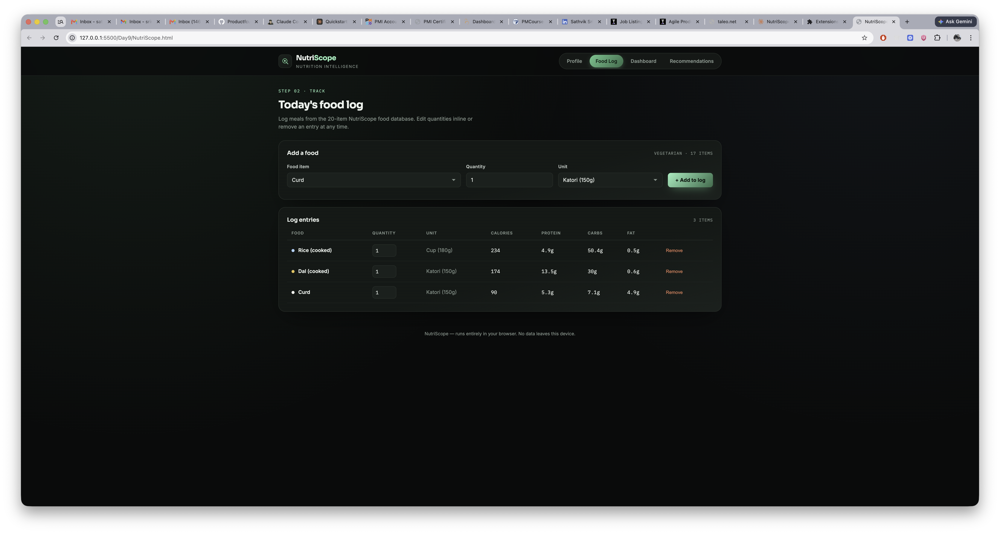

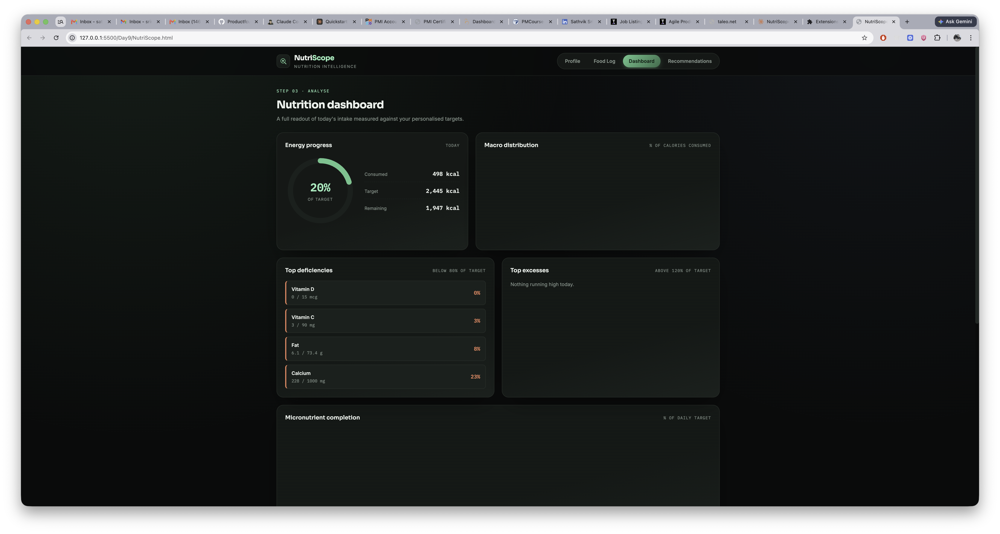

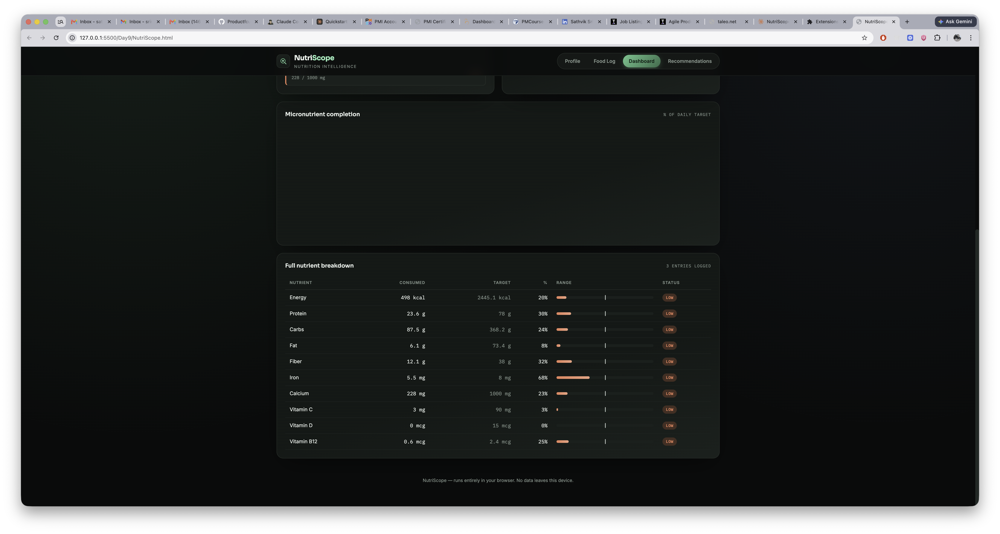

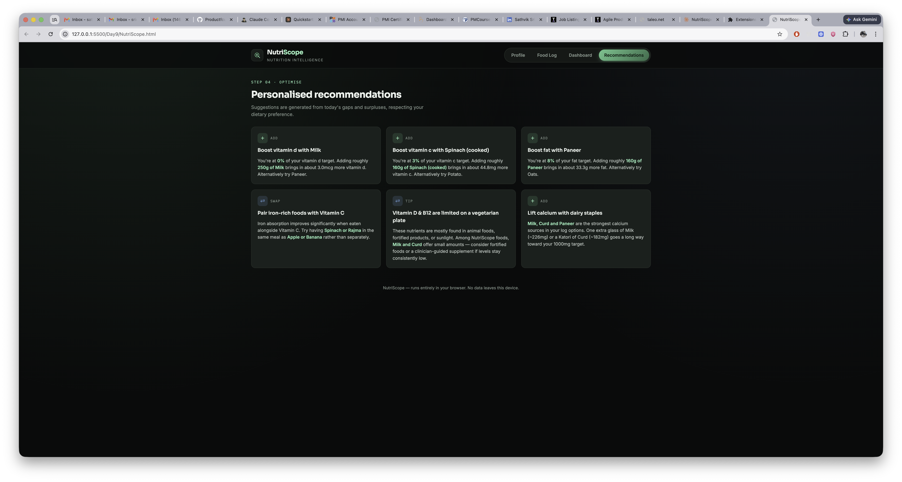

## PROMPT 2 — Enhance Application

Enhance the existing NutriScope application.

Add:
CSV Upload, 40 more foods, Additional micronutrients, 2-day meal planner, Risk Analysis, Educational Disclaimer, Nutrition Sources, Better Charts, Advanced Recommendations.

Return the updated HTML only.

## Screenshot - Enhanced Application

<iframe src="NutriScope_enhanced.html" width="100%" height="700px"></iframe>

[View full Dashboard](NutriScope_enhanced.html)

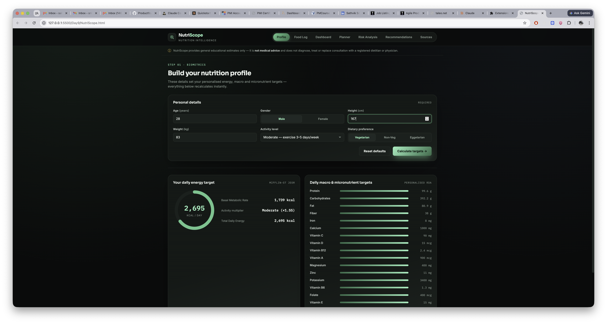

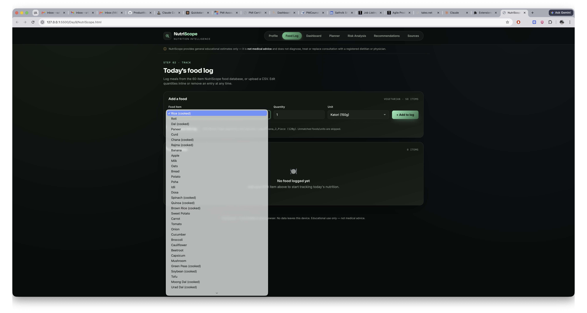

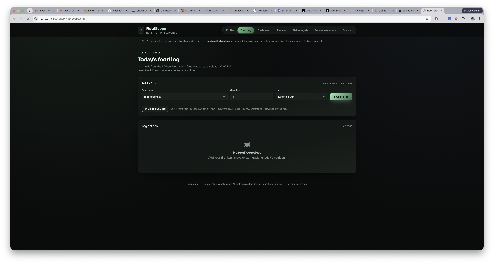

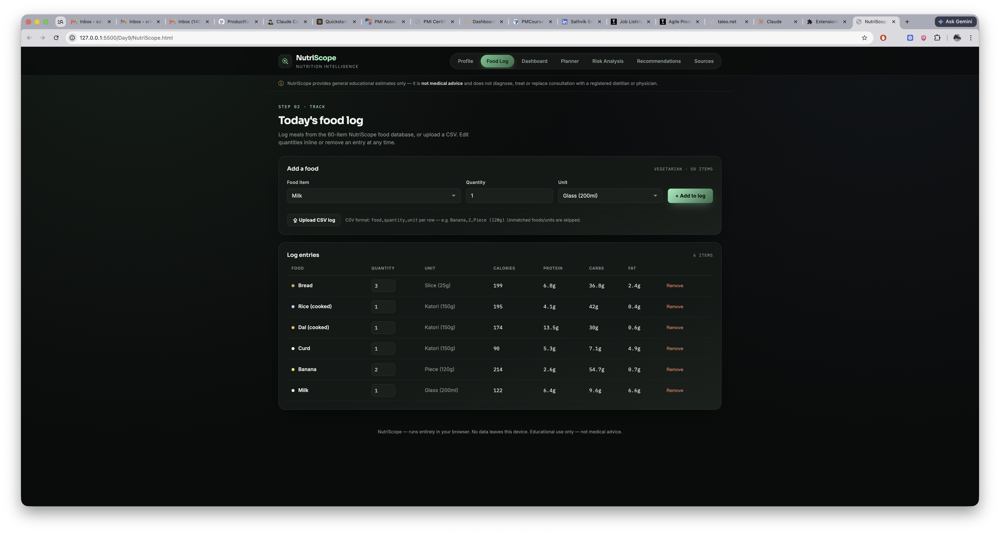

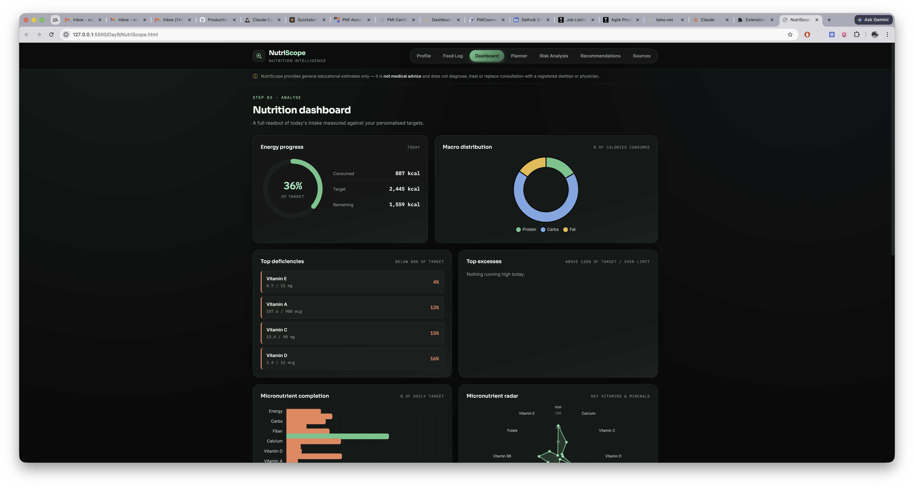

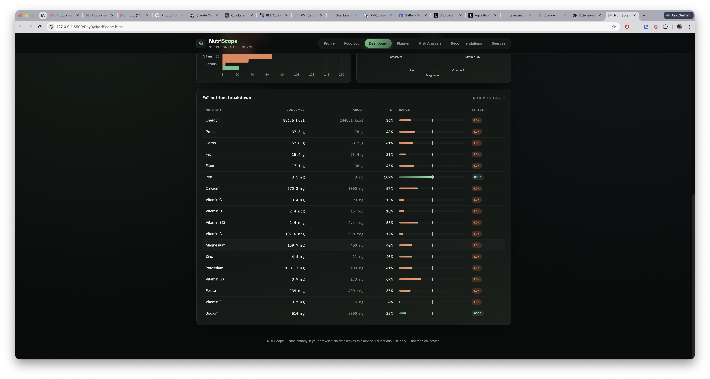

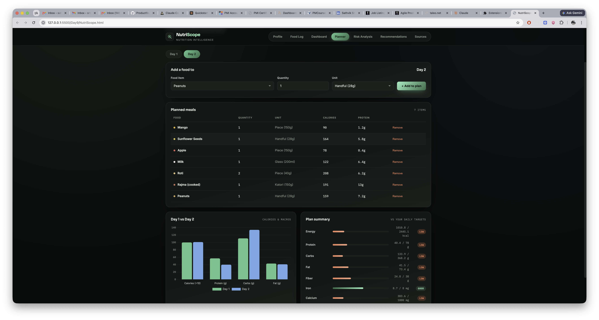

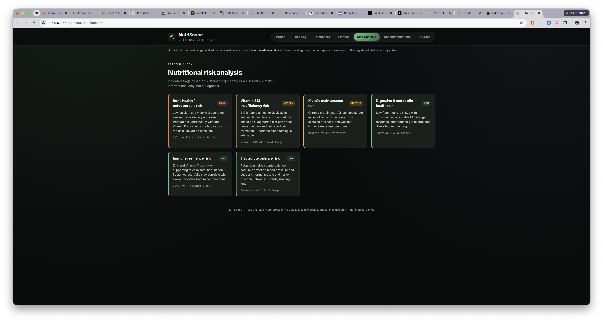

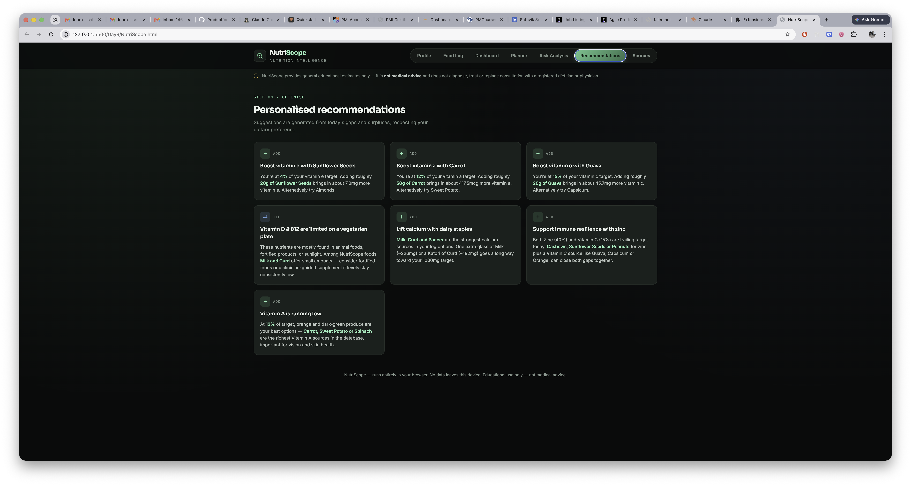

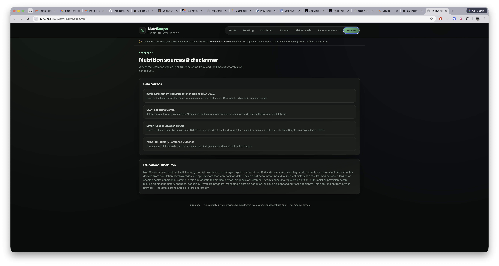

## Comparison Notes & Learnings
